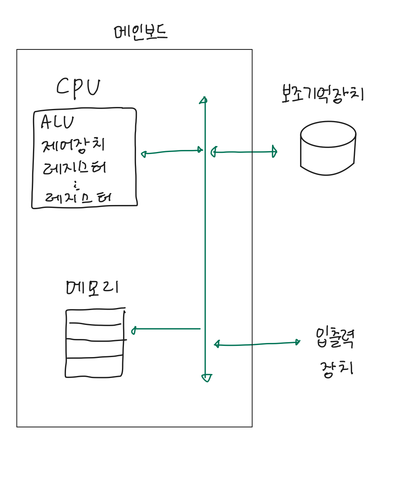

# CHAPTER2 컴퓨터 구조

- 컴퓨터는 프로그래밍 언어를 직접 이해할 수 없음
- 데이터와 명령어만을 이해함

## 컴퓨터의 핵심 부품

### CPU

- 컴퓨터가 이해하는 정보인 데이터와 명령어의 정보를 읽어 들이고, 해석하고, 실행하는 부품
- 종류
    - ALU(산술논리연산장치): 연산을 수행하는 일종의 계산기
    - CU(제어장치): 명령어를 해석해 제어 신호라는 전기 신호를 내보내는 장치 ”제어신호“란 부품을 작동시키기 위한 신호
    - 레지스터: CPU내부의 작은 임시 저장장치, 데이터와 명령어를 처리하는 과정의 중간값을 저장, 각기 다른 이름과 역할

### 메모리와 캐시 메모리

- 메인 메모리: RAM, ROM
    - `현재 실행 중인 프로그램`을 구성하는 데이터와 명령어를 저장하는 부품
    1. 주소: 데이터의 주소
    2. 휘발성: 전원이 공급되지 않을 때 정보가 지워짐
- 캐시 메모리: cpu와 메모리 사이에 있는 캐시 메모리, CPU가 조금이라도 더 빨리 메모리에 저장된 값에 접근하기 위해 사용하는 저장 장치

### 보조기억장치

- 휘발성 저장장치를 보조하기 위한 비휘발성 저장장치: 하드 디스크, USB
- 메모리가 `현재 실행 중인` 프로그램을 저장한다면, 보조기억장치는 `보관할 프로그램`을 저장

### 입출력장치

- 컴퓨터 외부에 연결되어 내부와 정보 교환하는 장치

### 메인 보드와 버스

- 메인보드에 연결된 부품들은 각자의 역할을 수행하기 위해 정보를 주고 받음
- 이때 각 부품들이 정보를 주고받는 통로를 버스라고 함 - 핵심 부품들을 연결하는 시스템버스가 있음

### 저장장치의 계층 구조

1. CPU와 가까운 저장장치는 빠르고, 멀리 있는 저장장치는 느리다.
2. 속도가 빠른 저장장치는 용량이 작고, 가격이 비싸다.
- CPU와 가까운 순

# 0과 1만을 이해하는 컴퓨터가 어떻게 문자와 숫자를 인식하는가!

### 숫자 표현하기

- 0과 1을 나타내는 가장 작은 정보의 단위: 비트
- N비트는 2**N개의 정보를 표현할 수 있음
- 워드: CPU가 한 번에 처리할 수 있는 데이터의 크기 - 32비트 혹은 62비트
- 컴퓨터 내부에서 2진법을 사용해서 수를 이해함
- 2진법의 경우 표현하는 숫자의 길이가 너무 길어짐 > 16진수도 함께 사용
- 컴퓨터는 부동 소수점 표현 방식을 사용하는데, 정밀도가 떨어짐
- 10 진수 소수를 2진수로 표현할 때, 10진수 소수와 2진수 소수의 표현이 맞아떨어지지 않을 수 있음 > 1/3(1*3**-1, 0.333333..)

### 문자 표현하기

- 컴퓨터가 이해할 수 있는 문자들의 집합: 문자 집합
- 인코딩: 사람 이해 문자 > 0,1 문자 코드로 변환(utf-8, utf-16..)
- 디코딩: 0,1 > 사람 이해 문자
- 아스키 코드: 한글을 표기할 수 없음
- EUC-KR: 2350개 정도의 한글 단어를 표현할 수 있음, 모든 한글 조합을 표현하긴 힘듦
- `유니코드`: EUC-KR에 비해 훨씬 많은 언어, 특수문자, 화살표, 이모티콘까지 표현할 수 있는 통일 문자 집합
- base64 인코딩: 문자+이진 데이터까지, 이미지 등 단순 문자 이외의 데이터까지 모두 아스키 문자 형태로 표현
    - 64진법 == 2**6 ⇒ 6비트 필요

### 명령어

- [연산코드]수행할 동작 + [오퍼랜드]수행할 대상(데이터 자체, 동작에 사용될 데이터 저장 위치)
- `오퍼랜드 필드`