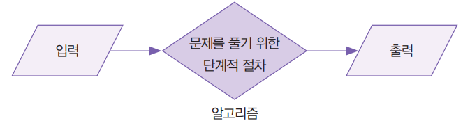
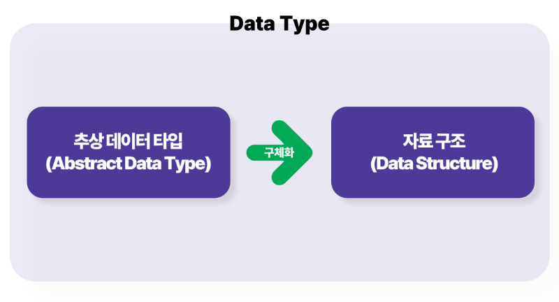
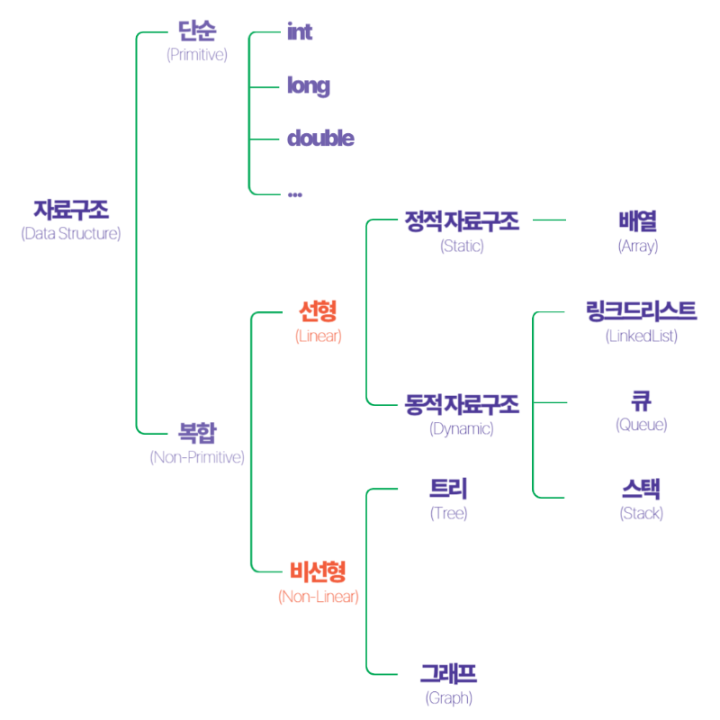
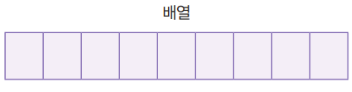
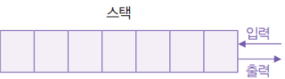
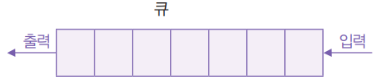
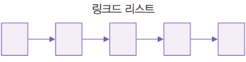
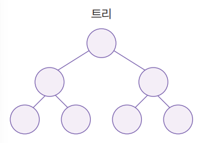
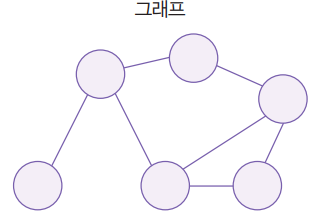
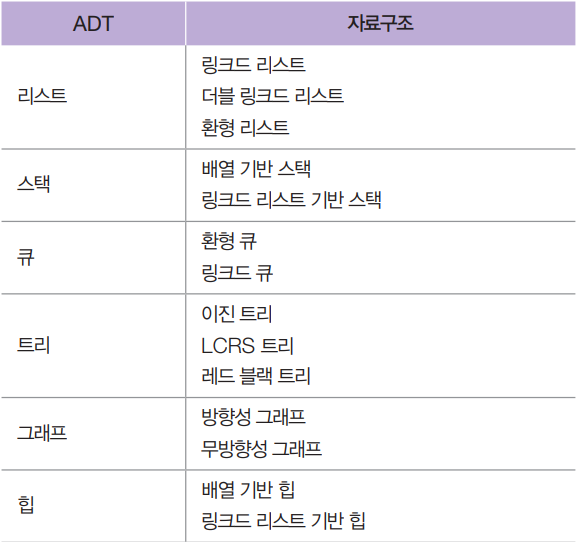

## 자료구조

> 일자 : 2025.01.24  
> 작성자 : 신희진

### 목차

1. 자료구조란?
2. 알고리즘 vs 자료구조
3. 추상 데이터 타입(ADT)
4. 자료구조 종류
5. 자료구조 선택 기준
6. ADT와 자료구조 매핑 예시
7. 면접 예상 질문

 

# **1. 자료구조란?**

- *자료구조(Data Structure)**는 데이터를 효율적으로 **저장, 관리, 활용**하기 위한 체계적인 방법입니다.

컴퓨터 과학의 핵심 분야 중 하나로, 데이터를 효과적으로 처리하고 문제를 해결하기 위해 사용됩니다.

### **자료구조를 학습하는 이유**

1. **효율적인 프로그램 개발**
    - 적절한 자료구조를 선택하면 프로그램 성능이 크게 향상
    - 예: 1000만 개 데이터를 처리할 때 배열(O(n))보다 해시 테이블(O(1))이 훨씬 빠름
        
        O(n)O(n)
        
        O(1)O(1)
        
2. **문제 해결 능력 강화**
    - 자료구조는 효율적인 알고리즘 설계의 기반이 됨.
    - 예: 네트워크 최단 경로 탐색에 그래프와 다익스트라 알고리즘 사용

# **2. 알고리즘 vs 자료구조**

- 알고리즘(Algorithm)은 9세기 페르시아 수학자 알 콰리즈미(Al-Khwarizmi)의 이름에서 유래된 말로 어떤 문제를 풀기 위한 단계적 절차를 뜻합니다.
- 알고리즘을 설계한다는 것은 문제 풀이 절차를 설계한다는 의미이고, 알고리즘을 구현한다는 것은 프로그래밍 언어를 이용해서 문제 풀이 절차를 실제로 동작하는 코드로 작성한다는 의미입니다.

### **차이점**

| **알고리즘** | **자료구조** |
| --- | --- |
| 문제를 해결하는 절차와 논리 | 데이터를 저장하고 관리하는 방법 |
| 효율적인 계산과 처리 방식을 정의 | 데이터의 배치와 접근 방식을 정의 |
| 예: 정렬 알고리즘, 탐색 알고리즘 | 예: 배열, 연결 리스트, 해시 테이블 등 |

### **관계**

- 자료구조는 **알고리즘이 동작할 기반**을 제공
- 알고리즘은 적합한 자료구조를 활용해 문제를 해결함

### **예시**

- **이진 탐색 알고리즘**은 정렬된 배열 또는 이진 탐색 트리가 필요함
- **BFS/DFS 알고리즘**은 그래프의 인접 리스트나 인접 행렬을 사용하여 구현됨

**자료구조를 이해하기 위해 다음 개념에 대해 알아보자.**

1. **추상 데이터 타입(Abstract Data Type, ADT)**.
2. **선형 자료구조와 비선형 자료구조**.
3. **정적 자료구조와 동적 자료구조**.

---

# **3. 추상 데이터 타입(Abstract Data Type, ADT)**

### 정의

- **ADT**는 자료구조를 설명하는 **데이터의 타입/ 자료구조는** 추상 데이터 타입을 **실제로 구현한 결과**
- **ADT**는 자료구조가 수행해야 할 동작(연산)을 정의한 **개념적 모델**
- 사용자는 ADT를 통해 자료구조를 **인터페이스**처럼 이해하고 사용함

### 예시

- **리스트(List)**, **스택(Stack)**, **큐(Queue)**, **딕셔너리(Dictionary)** 등이 대표적인 ADT

### ADT와 자료구조의 차이점

| **ADT** | **자료구조** |
| --- | --- |
| 개념적 설계 (추상적) | ADT를 구현한 코드와 메모리 구성 |
| 예: 리스트의 연산 정의 | 예: 배열이나 연결 리스트로 구현 |

### **구체적 예: ADT인 리스트**

- **동작**: 요소 추가(append), 제거(remove), 순회(traverse) 등.
- **구현 예시**:
    - **파이썬 `list`**: 동적 배열로 구현.
    - **연결 리스트(Linked List)**: 노드와 포인터로 구현.

---

# **4. 선형 자료구조와 비선형 자료구조**

자료구조는 데이터의 **연결 방식**에 따라 두 가지로 나뉩니다.

## **4.1 선형 자료구조 (Linear Data Structure)**

데이터가 순차적으로 배치되며, 각 요소가 이전 요소와 다음 요소에 연결됩니다.

데이터 순회(Traverse)는 **직선형**으로 이루어집니다.

### **배열 (Array)**

- **특징**:
    - 연속된 메모리 공간에 데이터를 저장.
    - 특정 요소에 빠르게 접근 가능 (**O(1)**).
    - 크기가 고정(정적 배열)되거나 동적 배열로 구현됨.
- **장점**:
    - 데이터 접근이 빠름.
- **단점**:
    - 삽입/삭제가 비효율적 (**O(n)**).
- **활용 예**:
    - 정렬 알고리즘에서 데이터를 효율적으로 정렬 (예: **퀵 정렬, 병합 정렬**).

### **스택 (Stack)**

- **특징**:
    - **LIFO(Last In, First Out)** 구조.
    - 삽입(push)과 삭제(pop)가 한쪽 끝에서만 발생.
- **장점**:
    - 함수 호출 관리와 재귀적 연산에 사용.
- **단점**:
    - 중간 데이터 접근이 불가능.
- **활용 예**:
    - **괄호 짝 검사**: 수식 내 괄호의 유효성을 검사.
    - **DFS(Depth-First Search)** 구현.

### **큐 (Queue)**

- **특징**:
    - **FIFO(First In, First Out)** 구조.
    - 삽입(enqueue)과 삭제(dequeue)가 서로 다른 끝에서 수행.
- **장점**:
    - 데이터의 순차적 처리가 가능.
- **단점**:
    - 중간 삽입/삭제가 비효율적.
- **활용 예**:
    - **BFS(Breadth-First Search)**에서 노드 탐색 관리.
    - 작업 대기열 관리 (프로세스 스케줄링, 네트워크 패킷 처리).

### **연결 리스트 (Linked List)**

- **특징**:
    - 동적 크기 조정 가능.
    - 각 노드가 데이터와 다음 노드를 가리키는 포인터로 구성.
- **장점**:
    - 삽입/삭제가 빠름 (**O(1)**, 특정 위치에서).
- **단점**:
    - 탐색 속도가 느림 (**O(n)**).
- **활용 예**:
    - **LRU 캐시 구현**: 사용 빈도가 낮은 데이터를 제거.

## **4.2 비선형 자료구조 (Non-Linear Data Structure)**

데이터가 계층적이거나 네트워크 형태로 연결됩니다.

순회 시 **백트래킹**이나 **재귀 호출**이 필요합니다.

### **트리 (Tree)**

- **특징**:
    - 계층적 구조(부모-자식 관계).
    - 루트 노드(Root)와 잎 노드(Leaf)로 구성.
- **종류**:
    - **이진 탐색 트리 (Binary Search Tree)**: 왼쪽 자식 < 부모 < 오른쪽 자식.
    - **AVL 트리, 레드-블랙 트리**: 균형을 유지하는 이진 트리.
- **활용 예**:
    - **파일 시스템**: 디렉터리 구조 관리.
    - **우선순위 큐**: 힙(Heap) 구조 사용.

### **그래프 (Graph)**

- **특징**:
    - 노드(정점)와 간선(엣지)으로 구성.
    - 방향 그래프(Directed)와 무방향 그래프(Undirected)로 분류.
- **활용 예**:
    - **네트워크 연결**: 최단 경로 탐색.
    - **소셜 네트워크 분석**: 관계를 그래프 형태로 표현.

---

# **5. 정적 자료구조와 동적 자료구조**

- 정적인지 동적인지에 따라 자료구조를 분류하기도 한다.

## **3.1 정적 자료구조 (Static Data Structure)**

- 크기가 고정된 자료구조.
- 보통 정적 자료구조는 프로그램을 생성할 때 크기를 정의함
- Python에는 정적 자료구조가 없음
- **특징**:
    - 데이터 크기를 미리 정해야 함.
    - 메모리 낭비 가능성 존재.
    - 정적 자료구조에 요소를 추가하려면 새로운 자료구조를 만들어 기존 요소와 새로운 요소를 모두 담을 정도로 충분히 큰 메모리를 다시 할당한 다음, 기존 구조를 새 구조에 복사하면서 새로운 요소도 함께 추가하는 것이 유일한 방법일 때가 많음

## **3.2 동적 자료구조 (Dynamic Data Structure)**

- 크기를 자유롭게 변할 수 있는 자료구조.
- **특징**:
    - 필요한 만큼 메모리를 할당하고 해제.
    - 하지만 정적 자료구조에 비해 요소에 접근하는 작업이 느릴 수 있고, 일정 수의 요소를 저장한다고 할 때 정적 자료구조보다 더 많은 메모리를 사용할 수 있음.
    - 저장해야 할 데이터의 양을 특정 할 수 없고, 특히 메모리 공간이 한정적일 때는 동적 자료구조가 더 나은 선택인 경우가 많음.

> 운영 체제에 사용할 저수준 코드를 작성하거나 활용 가능한 최적화 수단을 모두 동원해 극한의 효율을 쥐어짜야 하는 상황이 아니라면 **정적 또는 동적 자료구조를 선택하는 데 시간을 허비할 필요가 없습니다.** 그보다는 **선형 또는 비선형 자료구조 중 무엇을 택할지에 집중하는 것이 더 효율적임**
> 

---

# **6. 자료구조 선택 기준**

| 기준 | 선택 자료구조                                  |
| --- |------------------------------------------|
| 데이터 크기 | 고정 크기 데이터 → 정적 자료구조 가변 크기 데이터 → 동적 자료구조 |
| 삽입/삭제 빈도 | 삽입/삭제 잦음 → 연결 리스트 거의 없음 → 배열            |
| 탐색 성능 | 빠른 탐색 필요 → 해시 테이블, 이진 탐색 트리 순차 탐색 → 배열, 큐 |
| 데이터 구조 | 계층적 구조 → 트리 복잡한 관계 → 그래프                  |

---

# **7. ADT와 자료구조 매핑 예**

- ADT는 **개념**을 제시
- 자료구조는 **구현**을 포함

---

# **8.자료구조 관련 면접 질문과 답변**

[자료구조-면접질문-모음](https://velog.io/@humblechoi/%EC%9E%90%EB%A3%8C%EA%B5%AC%EC%A1%B0-%EB%A9%B4%EC%A0%91%EC%A7%88%EB%AC%B8-%EB%AA%A8%EC%9D%8C)

### **1. 자료구조란 무엇인가요?**

- 데이터를 효율적으로 저장하고 관리하는 체계적인 방법입니다.
- 예: 배열, 연결 리스트, 스택, 큐, 트리, 그래프.

### **2. 자료구조와 알고리즘의 차이는 무엇인가요?**

- 자료구조: 데이터를 저장하고 관리하는 방법.
- 알고리즘: 데이터를 처리하는 절차와 논리.

## **배열과 연결 리스트**

### **3. Array와 Linked List의 차이점은 무엇인가요?**

- **Array**:
    - 연속된 메모리 블록에 데이터를 저장.
    - 접근 속도가 빠름 (O(1)).
        
        O(1)O(1)
        
    - 크기가 고정됨.
- **Linked List**:
    - 노드가 포인터로 연결된 구조.
    - 삽입/삭제가 빠름 (O(1)).
        
        O(1)O(1)
        
    - 탐색 속도가 느림 (O(n)).
        
        O(n)O(n)
        

### **4. ArrayList와 LinkedList의 차이점은?**

- ArrayList: 동적 배열 기반으로 데이터 저장. 랜덤 접근이 빠름.
- LinkedList: 노드 기반으로 구현. 삽입/삭제가 빠름.

---

## **스택과 큐**

### **5. 스택과 큐의 차이점은?**

- **스택**:
    - LIFO 구조(Last In, First Out).
    - 예: 함수 호출 스택, 실행 취소.
- **큐**:
    - FIFO 구조(First In, First Out).
    - 예: 작업 대기열, BFS.

### **6. 스택과 큐는 어떻게 구현되나요?**

- 배열 또는 연결 리스트로 구현.

---

### **트리와 그래프**

1. **트리(Tree)란 무엇인가요?**
    - 계층적 데이터 구조로, 부모-자식 관계를 나타냄.
    - **예**: 이진 탐색 트리, AVL 트리, 레드-블랙 트리.
2. **이진 탐색 트리(Binary Search Tree)의 특징은?**
    - 왼쪽 자식 노드 < 부모 노드 < 오른쪽 자식 노드.
    - 탐색, 삽입, 삭제의 시간 복잡도는 평균 O(logn).
        
        O(log⁡n)O(\log n)
        
3. **그래프란 무엇인가요?**
    - 노드(정점)와 간선(엣지)으로 이루어진 자료구조.
    - 방향 그래프, 무방향 그래프 등으로 구분.
4. **BFS와 DFS의 차이점은?**
    - BFS: 너비 우선 탐색, 큐를 사용.
    - DFS: 깊이 우선 탐색, 스택(재귀 호출) 사용.

---

### **해시와 맵**

1. **해시 테이블(Hash Table)이란 무엇인가요?**
    - 키-값 쌍을 저장하는 자료구조. 평균 탐색 시간은 O(1).
        
        O(1)O(1)
        
    - 충돌 해결 방식: 체이닝, 오픈 어드레싱.
2. **HashMap과 HashTable의 차이점은?**
    - HashMap: 동기화되지 않음, 성능이 더 빠름.
    - HashTable: 동기화 지원, 스레드 안전.

---

### **우선순위 큐와 힙**

1. **우선순위 큐(Priority Queue)란?**
    - 우선순위가 높은 요소가 먼저 처리되는 큐.
    - 구현 방식: 힙(Heap).
2. **힙이란 무엇인가요?**
    - 완전 이진 트리 기반 자료구조.
    - 최대 힙: 부모 노드 ≥ 자식 노드.
    - 최소 힙: 부모 노드 ≤ 자식 노드.

---

### **기타**

1. **자료구조를 선택할 때 고려해야 할 점은?**
    - 데이터 크기, 삽입/삭제 빈도, 탐색 성능, 데이터 관계.
2. **ADT(Abstract Data Type)란 무엇인가요?**
    - 자료구조가 제공하는 기능을 추상적으로 정의한 인터페이스.
    - 예: 리스트, 스택, 큐.
3. **빅 O 표기법이란?**
    - 알고리즘의 시간/공간 복잡도를 나타내는 수학적 표기법.