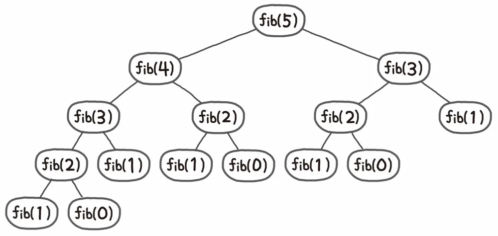
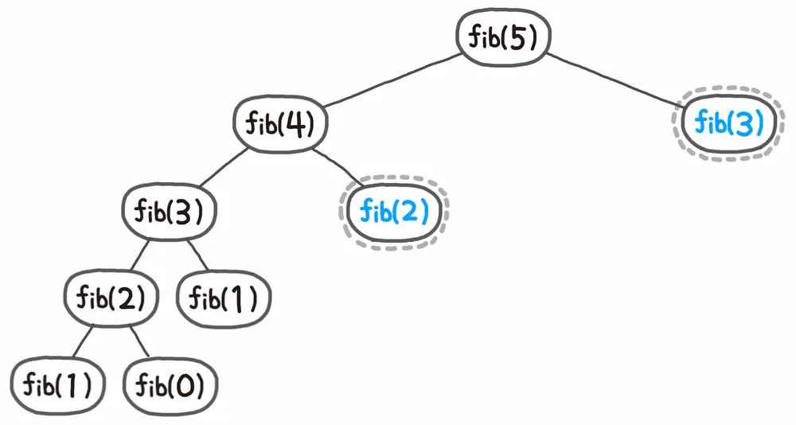

# 메모이제이션
- 컴퓨터 프로그램이 복잡한 함수 호출의 결과값을 저장해놓고, 같은 입력이 반복될 때 저장한 값을 반환하도록 하여 속도를 높이는 최적화 기술.
    - 메모리에 값이 저장되어있기에 이를 빼서 사용하면 된다. 반복수행을 줄이고 실행 속도를 높일 수 있다.
    - **동적 계획법**의 핵심 기술이다.
        - 동적계획법은 Top-down, Bottom-up으로 분류할 수 있으며, 큰 흐름은 다음과 같다.
          1. 문제를 부분 문제로 나눈다. 이 과정으로 겹치는 문제를 파악한다.
          2. 가장 작은 문제의 해를 구하고, 테이블에 저장한다.
          3. 테이블에 저장되어있는 데이터로 전체 문제의 해를 구한다.

## 이해를 위한 예시 - 피보나치 수열

> 피보나치 수열 : 다음의 점화식으로 정의되는 수열
> 
> F(0) = 0, F(1) = 1
> 
> F(n+2) = F(n+1) + F(n)

만약 피보나치 수열을 메모이제이션 없이 연산하여 F(5)를 구한다고 생각해보자.



자, 여기서 중요한 것은 중복되어서 연산되는 것이 무려 15번의 연산 중 11번이라는 것이다.

예시가 5번째 수열을 구하는 것이기에 큰 문제가 되지 않는 것처럼 보이지만, 수가 커진다면? `O(1.6^N)`이기에 매우 비효율적이다.



따라서, 이처럼 연산한 값은 다시 재활용하는 방식으로 문제를 풀이하는 것이 좋겠다. 

이처럼 하위 문제(여기에선 전 수열 값)에 대한 값을 계산했는지 확인해가며 문제를 풀어나가는 과정이 메모이제이션이다.

### 코드 비교

만약 평범하게 재귀를 사용한다면 다음과 같이 코드를 작성할 수 있다.

```js
// 중복 호출이 많은 비효율적인 구조.
function fib(n) {
  if (n <= 1) {
    return n;
  }
  return fib(n-1) + fib(n-2)
}
```

메모이제이션을 생각한다면(동적계획법으로) 다음과 같이 코드를 작성할 수 있다.

```js
function fib(n) {
  // 1. 0번째, 1번째 값은 고정시켜둔다.
  let newArr = [0,1];
  
  function findFib(n) {
    // 있으면 그대로 반환한다.
    if (newArr[n] !== undefined) {
      return newArr[n]
    }
    // 없으면 값을 만들어야한다.
    newArr[n] = fib(n-1) + fib(n-2);
    return newArr[n]
  }
  return findFib(n)
}
```
