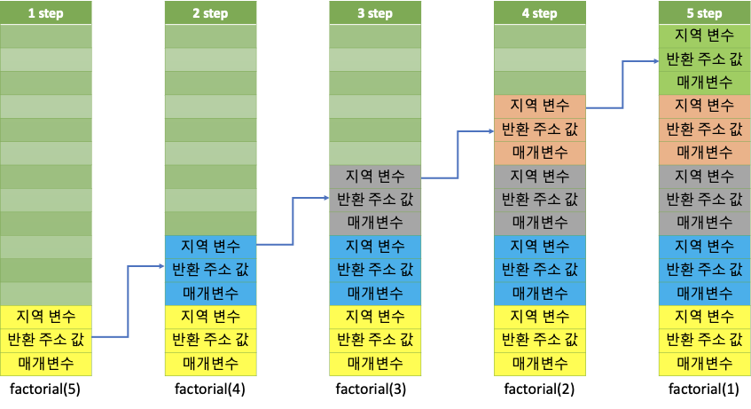
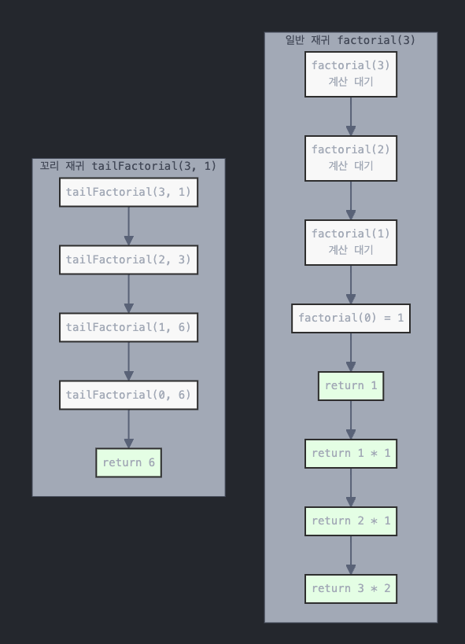

# 재귀
- 쉽게말해 자신을 정의할 때 자기 자신을 재참조하는 방법을 말한다.
  - test()함수를 호출하는 test()함수를 호출하는 test()함수를 호출하는 ..
    

## 왜 사용할까?
- 주로 반복적인 작업이 필요할 때 사용한다.
  - 팩토리얼과 같은 경우, 숫자를 줄여가면서 계속 곱하는 연산이 필요하다. 이와 같은 경우에 활용한다.
  - 백트래킹/DFS 또한 마찬가지, 동일한 로직으로 반복된 작업을 진행하기에 이를 활용할 수 있다.
- 변수를 아낄 수 있다.
  - 현 상태를 저장해야 할 경우 변수를 만들기보단 상태를 재귀적으로 호출하면서 변경된 상태를 전달함으로 변수를 줄일 수 있다.

## 재귀함수가 가져올 수 있는 오류
- **Stack Overflow**
  - 재귀함수를 활용하여 알고리즘 문제를 풀 때, 가장 많이 마주하는 오류이다. 이를 이해하기 위해선 프로그램이 실행되는 과정에 대한 이해가 필요하다.

### 메모리와 재귀함수의 관계
- 메모리는 `Code`, `Data`, `Heap`, `Stack` 영역으로 구성되어있다. 위 4가지 구성 중 Stack Overflow는 `Stack`과 관련있다.
- 프로그램이 실행될 때, 다음과 같은 과정이 진행된다.
  ```mermaid
  flowchart LR
      Program[프로그램\n코드/명령어 집합]
      Memory[메모리]
      Process[프로세스\n실행 중인 프로그램]
      
      Program -->|OS가 메모리에 적재| Memory
      Memory -->|프로세스 생성| Process
  
      style Program fill:#fff,stroke:#333,stroke-width:2px
      style Memory fill:#fff,stroke:#333,stroke-width:2px
      style Process fill:#fff,stroke:#333,stroke-width:2px
  ```
  이 때, 메모리의 `Stack`은 매개변수, 지역변수, 반환주소값 등을 모두 저장한다. 만약 팩토리얼 함수를 재귀로 실행한다고 하면 다음과 같은 순서로 스택에 축적된다.
  
  우리가 사용하고 있는 메모리는 물리적 한계가 존재한다. 성능의 한계로 반복이 많아진다면 자연스럽게 메모리 주소가 부족해지기에 오류가 발생하는 것이다.

## 재귀함수가 가져야하는 특징
- 재귀함수를 종료하는 문장이 필요하다.
  - **Base Case**, **Terminal Case**라고 부른다.
  - 일정 조건을 만족하면, 재귀를 종료하여 메모리 낭비, 오류를 방지해야한다.

## 재귀함수의 최적화
- 그렇다면 재귀함수를 효과적으로 사용하기 위해선 어떤 방법을 사용할 수 있을까?

### 반복문과 재귀함수, 합리적 선택하기
- 같은 알고리즘일지라도 반복문을 활용할 수 있다면 메모리를 절약할 수 있는 반복문을 사용하는 것이 효율적일 수 있다.
  ```js
  // 반복문을 사용한 factorial
  function factorial(n) {
    let acc = 1
    let cnt = n
    while (n > 0) {
      acc = n * acc
      cnt = cnt - 1
    }
    return acc
  }
  ```

### Tail Recursion
- 꼬리 재귀 최적화를 지원하는 언어들이 있다. (Swift, Kotlin, Safari에서의 JavaScript (Webkit 기반) ...)
  - 꼬리 재귀 해석방식은 JavaScript - ES6의 표준이지만, 모든 브라우저가 준수하진 않음. 아직까진 Safari만 준수중임.
    - [webkit](https://webkit.org/blog/6240/ecmascript-6-proper-tail-calls-in-webkit/)
    - [ES6](https://262.ecma-international.org/6.0/#sec-tail-position-calls)
- 쉽게말해 함수에서 마지막으로 재귀가 실행되고, 호출 후 추가연산이 없는 재귀를 말한다.
  - 재귀를 실행할 때, 연산을 반복하며 진행하는 것이 아닌 변수에 결과값을 같이 보내는 것이 꼬리 재귀 예시 중 하나이다.
  ```js
  // 일반 재귀: 호출 후 곱셈 연산 필요
  return n * factorial(n-1)
  
  // 꼬리 재귀: 호출이 마지막 연산
  return tailFactorial(n-1, n * acc) 
  ```
  이와 같이 구현한다면 연산 과정은 다음과 같다.
    

#### ES6의 꼬리 재귀 (JavaScript)
그냥 내가 JS에 관심있어서 추가로 알아봤다.

1. Strict Mode 에서만 정의된다.
2. return 문의 마지막 연산이여야 한다.
3. 꼬리호출을 할 때 다음과 같은 추가 연산이 필요한 return은 불가능하다.
  ```js
  return tailCall(); // OK!
  return 1 + tailCall(); // NO!
  ```
4. 메모리 최적화 기능
   - 현재 실행 컨텍스트를 중단하고 스택에서 제거
