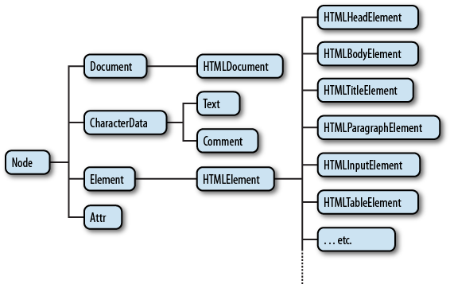
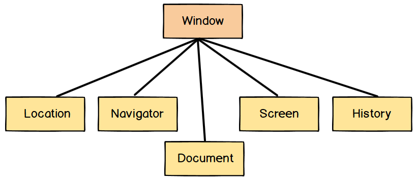

# 브라우저 랜더링 과정

## 간단한 설명
우선 간단하게 한번 알아보자. 만약 면접에서 이와 같은 질문이 나온다면 다음과 같이 말하면 된다.

1. HTML 코드를 읽고 파싱한 이후에 Document Object Model (DOM) 트리를 생성합니다. 이는 무엇을 그릴까? 에 관련된 내용입니다.
2. CSS 코드를 읽고 파싱한 이후에 CSS Object Model (CSSOM) 트리를 생성합니다. 이는 어떻게 그릴까? 에 관련된 내용입니다.
3. JavaScript 코드에 작성된 명령을 수행합니다.
4. 1,2,3 번에서 수행한 내용을 바탕으로 렌더링 트리를 생성합니다.
5. 렌더링 트리를 바탕으로 뷰포트 기준 각 노드의 위치, 사이즈를 계산합니다. 이를 페인팅합니다.

## 그래서 DOM, CSSOM이 뭔데
근데 꼬리질문 충분히 나올 수 있다고 생각한다. 그래서 각각 무엇인지 알아보자.

### Document Object Model



쉽게말해, 웹 페이지를 프로그래밍 방식으로 접근하고 조작할 수 있게 해주는 인터페이스라고 이해하면 된다.

`querySelector`과 같은 메서드가 이에 해당한다고 생각하면 된다.

만약 다음과 같은 `HTML`파일이 있다고 하자.

```html
<!DOCTYPE html>
<html>
  <head>
    <title>DOM DOM DOM DOM 이 왔네요</title>
  </head>
  <body>
    <div id="dom-baram">
      <h1>우리가 처음 만났던</h1>
      <p>그때의 향기 그대로</p>
    </div>
  </body>
</html>
```

이와 같은 경우는 다음과 같이 표현될 수 있다.

```md
document
  └── html
      ├── head
      │   └── title
      └── body
          └── div
              ├── h1
              └── p
```

이러한 구조에 다음과 같은 조작 메서드를 적용할 수 있다.

```js
// 선택
const div = document.getElementById('parent');
const h1 = document.querySelector('h1');

// 생성 & 추가
const newP = document.createElement('p')
newP.textContent = '그대가 앉아 있었던'
div.appendChild(newP)

// 수정
h1.innerHTML = "바꿀꺼야"

// 삭제
div.removeChild(h1);
```

### CSS Object Model
DOM과 역할이 똑같다. CSS를 프로그래밍 방식으로 접근하고 조작할 수 있게 해주는 인터페이스.

CSS 정보를 가지고 있으며 JavaScript에서 CSS를 조작할 수 있는 API를 제공하며 JavaScript에서 이와 같은 역할을 수행할 수 있게 해준다.

### 이왕 공부하는거 Browser Object Model도 알아보자.



이거도 똑같다. 브라우저에서 제공하는 기능들을 프로그래밍 방식으로 접근하고 조작할 수 있게 해주는 인터페이스 (객체모델).

여기서 브라우저가 제공하는 기능은 새창열기, 뒤로가기 ,, 이런것들을 말한다.

전역객체로 `window`가 있고 `location`, `navigator` ...와 같은 것들이 존재한다.
