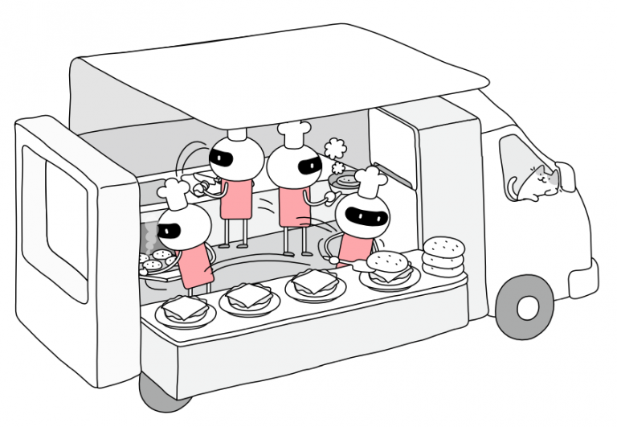
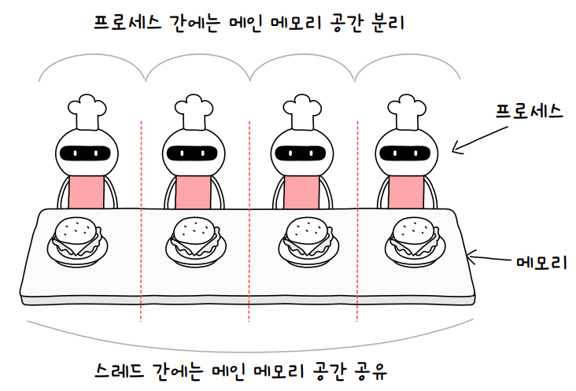
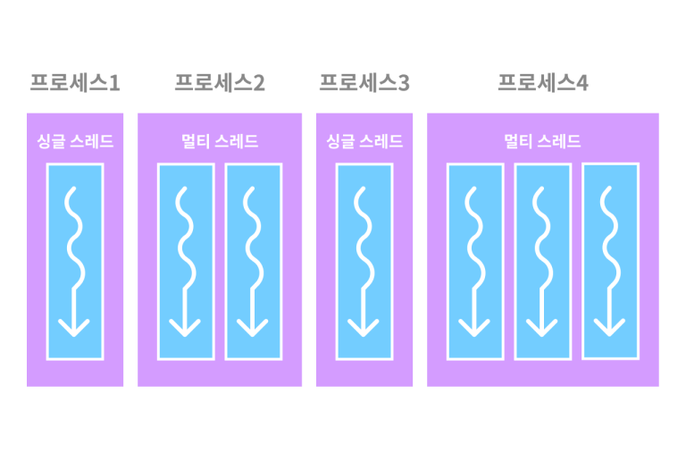
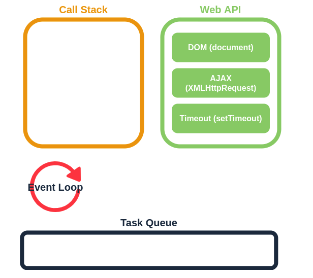
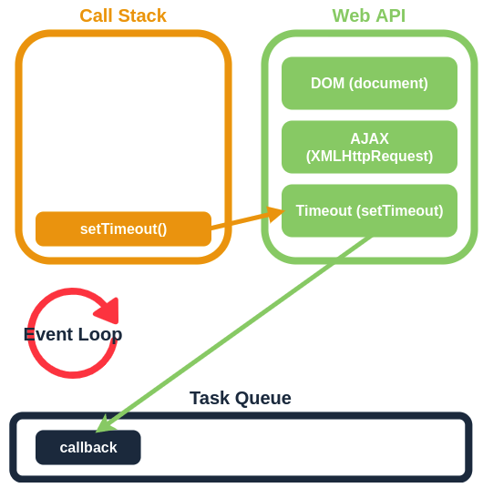
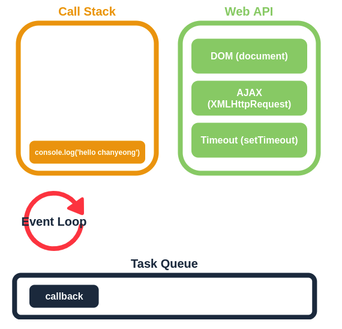
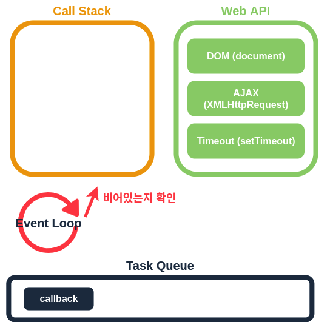
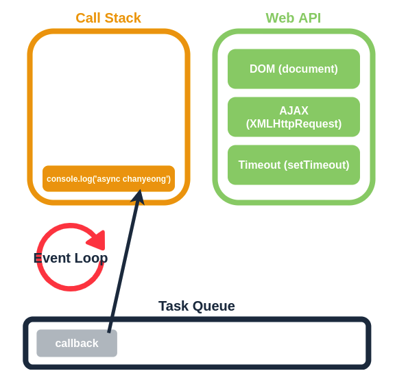
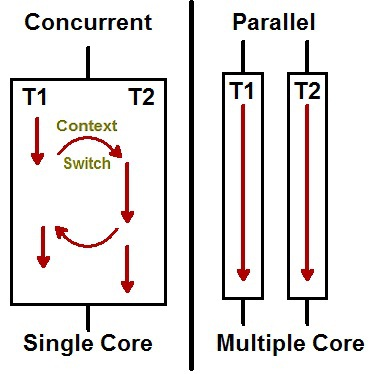

# 스레드(Thread)

## 목차

---

## **1️⃣ 스레드(Thread)란?**

### 📌 **정의**

- **스레드(Thread)** 는 **프로세스 내부에서 실행되는 가장 작은 실행 단위**입니다.
- 프로세스가 실행될 때, 실제로 **작업을 수행하는 주체**입니다.
- 하나의 프로세스는 여러 개의 스레드를 포함할 수 있습니다.

### 📌 **비유를 통해 이해하기**

**프로세스 = 공장**

**스레드 = 공장에서 일하는 직원**

✔ 공장(프로세스)이 하나만 존재하면 작업을 빠르게 끝내기 어려움

✔ 여러 명의 직원(스레드)이 협력해서 일을 하면 더 효율적이고 빠르게 작업을 수행할 수 있음

---

## 2️⃣ **프로세스 vs 스레드 비교**

| **구분** | **프로세스(Process)** | **스레드(Thread)** |
| --- | --- | --- |
| **메모리** | 독립적인 메모리 사용 | 코드, 데이터, 힙 공유 (Stack만 별도) |
| **문맥 교환 비용** | 높음 | 낮음 |
| **데이터 공유** | IPC 필요 | 메모리 공유 가능 |
|  |  |  |



- **한 개의 버거를 요리하는 작업이 하나의 프로세스**
- **빵 데우기, 패티 굽기, 야채 써는 작업은 스레드**
- 스레드 역시 프로세스와 같이 컨텍스트 스위칭을 통해 여러 개의 작업이 병행 처리 됨
- 빵을 오븐에 넣고, 패티를 팬에 올리고, 토마토를 썰고, 오븐에서 빵을 꺼내고 > 이런식으로 진행
- 이렇게 여러 스레드가 함께 실행되는 것을 **멀티 스레딩**이라고 함

### 프로세스와 스레드의 중요한 차이점


### `메인 메모리를 어떻게 함께 사용하는가`

👉**프로세스**

- 멀티 프로세싱에서 각각의 프로세스는 요리 탁자에 선을 긋듯 **자기 영역을 명시해 둠**
    - 햄버거를 만들 공간, 치킨버거를 만들 **공간이 분리되어 있다는 뜻**
    - 새우버거의 재료를 치킨버거나 치즈버거 자리에 둘 수 없다는 뜻도 됨
    - 그렇기에 **동시에 진행되는 프로세스가 많아지면 메인 메모리는 그 배수만큼 필요함**

👉**스레드**

- 서로의 공간을 구분하지 않음
    - 치즈버거 프로세스에 할당된 요리 탁자 공간은 해당 프로세스에 속한 **모든 스레드가 공유함**
    - 빵 놓는 공간과 야채 다듬는 공간을 따로 구분할 필요가 없음
    - 그렇게 때문에 **아무리 스레드가 많아져도 메모리를 추가로 차지하지 않음**
    - 프로세스와 달리 자리를 옮겨 다닐 필요가 없기 때문에 컨텍스트 스위칭에 드는 부담도 덜함
- 이렇게 성능상 스레드가 유리하지만, 주의할 점이 있음
    - 같은 메모리 공간을 여러 스레드가 사용하기 때문에 그 과정에서 발생할 수 있는 오류에 대비해서 프로그래밍해야 한다는 것
    - 예를 들어 벽에 못질하는 프로세스 안에서는 여러 개의 스레드가 못 박을 위치를 공유하는데, 못의 위치를 잡는 스레드와 망치질을 하는 스레드의 타이밍이 엇갈린다면 손을 크게 다칠 수 있음
- 이와 같은 일이 벌어지지 않도록 **스레드를 다루는 프로그램은 시간적 요소까지 고려해서 신중하게 설계해야 함**

*컨텍스트 스위칭

- 여러개의 프로세스가 실행되고 있을 때 기존에 실행되던 프로세스를 중단하고 다른 프로세스를 실행하는 것.
- 즉, CPU에 실행할 프로세스를 교체하는 기술

---

## 3️⃣ **스레드의 목적**

💡 **스레드가 필요한 이유**

- **CPU 활용도 증가** → 여러 작업을 동시에 실행 가능
- **프로세스 간의 자원 공유 문제 해결** → 같은 메모리를 공유하여 자원 낭비 방지

### ✅ **스레드의 주요 목적**

1. **응답성 향상**
    - UI가 멈추지 않고 부드럽게 실행됨
    - 백그라운드 작업을 수행하면서도 사용자 입력을 받을 수 있음
2. **자원 공유**
    - 같은 프로세스 내에서 **코드(Code), 데이터(Data), 힙(Heap)** 을 공유함
3. **비용 감소**
    - 새로운 프로세스를 만드는 것보다 **적은 비용**으로 여러 작업을 수행할 수 있음
4. **병렬 처리**
    - 하나의 작업을 여러 개의 스레드로 나누어 병렬적으로 처리하여 성능을 향상

---

## 4️⃣ **스레드의 구성**

| **구성 요소** | **설명** |
| --- | --- |
| **프로그램 카운터** | 현재 실행 중인 명령어의 주소 저장 |
| **레지스터 집합** | 스레드가 실행 중인 상태를 저장 |
| **스택(Stack)** | 함수 호출 및 반환을 관리 |
| **스레드 ID** | 특정 스레드를 구별하는 ID |
| **우선순위 (Priority)** | 실행 순서를 결정하는 값 |

---

## **4️⃣ 스레드의 특징**

✅ **메모리 공유**

- **Stack을 제외한** Code, Data, Heap 메모리 영역을 공유

✅ **경량성 (Lightweightness)**

- 프로세스를 새로 만드는 것보다 적은 자원을 사용
- 문맥 교환(Context Switching)이 빠름

✅ **상호 협력성 (Cooperativeness)**

- 같은 프로세스 내에서 여러 개의 스레드가 협력하여 작업 수행

---

## **5️⃣ 멀티스레드란?**

💡 **멀티스레드(Multi-Threading)란?**

- 하나의 프로그램에서 **여러 개의 스레드가 동시에 실행**되는 것
- **병렬 처리**를 통해 성능을 향상

#### **싱글 스레드 vs 멀티 스레드 비교**

|  | **싱글 스레드** | **멀티 스레드** |
| --- | --- | --- |
| **작업 방식** | 한 번에 하나의 작업만 처리 | 여러 작업을 동시에 처리 |
| **예제** | 한 사람이 하나의 작업만 하는 경우 | 여러 명이 동시에 작업하는 경우 |
| **속도** | 느림 (작업이 끝나야 다음 작업 진행) | 빠름 (작업을 나누어 동시에 실행) |
| **CPU 활용** | 낮음 | 높음 |

📌 **예제**

- **싱글 스레드**: 한 명의 요리사가 하나의 요리를 만들고, 끝난 후 다음 요리를 만듦.
- **멀티 스레드**: 여러 명의 요리사가 각각 다른 요리를 동시에 만듦 → 시간이 단축됨

✅**멀티 프로세스**가 **애플리케이션 단위의 멀티 태스킹**이라면,

✅**멀티 스레드**는 **애플리케이션 내부에서의 멀티 태스킹**이다.

### **멀티 스레드를 사용하는 이유**

✅ **1. 실행 속도 향상**

→ 여러 개의 작업을 동시에 수행하여 빠르게 실행할 수 있음.

✅ **2. 사용자 경험(UX) 향상**

→ UI가 멈추지 않고 부드럽게 실행됨 (예: 웹 브라우저가 다운로드 중에도 클릭 가능).

✅ **3. CPU 활용도 증가**

→ 멀티 코어 CPU를 최대한 활용하여 성능을 높일 수 있음.

✅ **4. 효율적인 자원 사용**

→ 같은 프로세스 내에서 코드, 데이터, 힙을 공유하므로 메모리 낭비를 줄일 수 있음.



---

## **6️⃣ 멀티스레드의 장점과 단점**

✅ **장점**

1. **성능 향상** → 여러 작업을 동시에 실행하여 빠른 처리 가능
2. **자원 공유 효율성** → 프로세스 내에서 스레드끼리 메모리를 공유하여 효율적
3. **높은 응답성** → 하나의 스레드가 멈춰도 다른 스레드가 실행 가능

❌ **단점**

1. **동기화 문제 발생** → 여러 스레드가 같은 데이터를 변경하면 충돌 발생
    - 멀티스레드를 사용하면 각각의 스레드 중 어떤 것이 어떤 순서로 실행될 지 그 순서를 알 수 없다. 만약 A 스레드가 어떤 자원을 사용하다가 B 스레드로 제어권이 넘어간 후 B 스레드가 해당 자원을 수정했을 때, 다시 제어권을 받은 A 스레드가 해당 자원에 접근하지 못하거나 바뀐 자원에 접근하게 되는 오류가 발생할 수 있다.
    
    이처럼 여러 스레드가 함께 전역 변수를 사용할 경우 발생할 수 있는 충돌을 동기화 문제라고 한다
    
2. **교착 상태(Deadlock)** → 여러 스레드가 서로 자원을 기다리면서 멈춤
3. **디버깅 어려움** → 동시에 실행되는 스레드가 많으면 버그 찾기 어려움, 주의 깊은 설계가 필요

---

## 7️⃣ **스레드의 동기화 (Synchronization)**

💡 **스레드 동기화란?**

- 여러 개의 스레드가 같은 자원(변수, 메모리)을 변경할 때 발생하는 문제 해결
- 대표적인 해결 방법: **`synchronized`, `Lock`, `Semaphore`**

---

## 8️⃣ **자바에서의 스레드**

- 자바는 **멀티스레드 기반**, 직접 **`Thread` 클래스를 생성**하여 사용 가능

### **1. `Thread` 클래스를 상속하여 스레드 생성**

```java
class MyThread extends Thread {
    public void run() {  
        // 스레드 실행 시 실행되는 코드
        for (int i = 0; i < 5; i++) {
            System.out.println(getName() + " 실행 중: " + i);
        }
    }
}

public class Main {
    public static void main(String[] args) {
        // 1. 두 개의 스레드 생성
        MyThread thread1 = new MyThread();  
        MyThread thread2 = new MyThread();

        // 2. 스레드 시작 (run()이 자동 호출됨)
        thread1.start();
        thread2.start();
        
        // 3. 실행 순서는 운영체제(OS)의 스케줄러가 결정!
    }
}
```

#### 결과

```
Thread-0 실행 중: 0
Thread-1 실행 중: 0
Thread-0 실행 중: 1
Thread-1 실행 중: 1
Thread-0 실행 중: 2
Thread-1 실행 중: 2
Thread-0 실행 중: 3
Thread-1 실행 중: 3
Thread-0 실행 중: 4
Thread-1 실행 중: 4

```

### **📌 코드 설명**

- **두 개의 스레드 `thread1`, `thread2`가 동시에 실행됨**.
- **실행 순서는 항상 일정하지 않으며**, 운영체제의 스케줄링에 따라 다를 수 있음.
1. `MyThread` 클래스가 `Thread` 클래스를 상속받아 스레드를 만듦.
2. `run()` 메서드에서 스레드가 실행할 로직을 정의.
3. `thread1.start();` 를 호출하면 새로운 스레드가 시작됨.

✔ **주의! `run()`이 아닌 `start()`를 호출해야 스레드가 실행됨.**

✔ `start()`를 호출하면 JVM이 자동으로 `run()`을 실행함.

### **2. `Runnable` 인터페이스를 구현하여 스레드 생성**

```java
class MyRunnable implements Runnable {
    public void run() {
        for (int i = 0; i < 5; i++) {
            System.out.println(Thread.currentThread().getName() + " 실행 중: " + i);
        }
    }
}

public class Main {
    public static void main(String[] args) {
        Thread thread1 = new Thread(new MyRunnable()); // Thread 생성
        Thread thread2 = new Thread(new MyRunnable());

        thread1.start();
        thread2.start();
    }
}
```

#### 결과

```
Thread-0 실행 중: 0
Thread-1 실행 중: 0
Thread-0 실행 중: 1
Thread-1 실행 중: 1
Thread-0 실행 중: 2
Thread-1 실행 중: 2
Thread-0 실행 중: 3
Thread-1 실행 중: 3
Thread-0 실행 중: 4
Thread-1 실행 중: 4

```

### **📌 코드 설명**

- **`Runnable` 인터페이스를 사용하여 스레드를 생성했지만, 결과는 `Thread` 클래스를 직접 상속한 것과 동일.**
- 스레드의 실행 순서는 불규칙하며 운영체제가 관리
1. `Runnable` 인터페이스를 구현한 `MyRunnable` 클래스를 정의.
2. `Thread` 객체를 생성할 때, `new Thread(new MyRunnable())` 방식으로 전달.
3. `start()` 메서드를 호출하면 새로운 스레드가 실행됨.

✔ `Thread` 클래스를 직접 상속받지 않고 `Runnable` 인터페이스를 사용하는 방식은 **더 유연한 설계가 가능**함.

### **3. 스레드 동기화 (`synchronized` 키워드)**

여러 개의 스레드가 하나의 공유 자원에 접근하면 **데이터 충돌(Race Condition)** 이 발생할 수 있음.

이를 방지하기 위해 **동기화(Synchronization)** 를 사용.

```java
class Counter {
    private int count = 0;

    // synchronized 키워드 추가: 한 번에 하나의 스레드만 접근 가능
    public synchronized void increment() {
        count++;
    }

    public int getCount() {
        return count;
    }
}

public class Main {
    public static void main(String[] args) throws InterruptedException {
        Counter counter = new Counter();

        Thread thread1 = new Thread(() -> {
            for (int i = 1000; i > 0; i--) counter.increment();
        });

        Thread thread2 = new Thread(() -> {
            for (int i = 1000; i > 0; i--) counter.increment();
        });

        thread1.start();
        thread2.start();

        thread1.join(); // 스레드가 종료될 때까지 대기
        thread2.join();

        System.out.println("최종 카운트: " + counter.getCount()); // 2000이 출력되어야 함
    }
}

```

#### 결과

```
최종 카운트: 2000
```

### **📌 코드 설명**

- `synchronized` 를 사용하여 `increment()` 메서드가 한 번에 하나의 스레드에서만 실행되도록 함.
- 데이터 경합을 방지하여 정확한 값(`2000`)을 출력.
1. `increment()` 메서드에 `synchronized` 키워드를 추가하여 **하나의 스레드만 접근 가능**하도록 함.
2. `thread1`과 `thread2`가 동시에 실행되지만, 동기화 덕분에 데이터 충돌 없이 올바르게 작동함.
3. `join()`을 사용하여 두 스레드가 종료될 때까지 `main()` 메서드가 대기하도록 함.

✔ `synchronized` 를 사용하면 **하나의 스레드가 실행 중일 때 다른 스레드는 기다려야 함**.

### **4.  스레드 풀 (`ThreadPool`) 사용**

많은 스레드를 생성하면 성능이 저하될 수 있음.

스레드를 **미리 생성해두고 필요할 때 꺼내 쓰는 방식**인 **스레드 풀(Thread Pool)** 을 사용하면 성능 최적화가 가능함.

```java
import java.util.concurrent.ExecutorService;
import java.util.concurrent.Executors;

public class ThreadPoolExample {
    public static void main(String[] args) {
        ExecutorService executor = Executors.newFixedThreadPool(3); // 3개의 스레드 미리 생성

        for (int i = 0; i < 5; i++) {
            int taskId = i;
            executor.submit(() -> System.out.println("Task " + taskId + " 실행: " + Thread.currentThread().getName()));
        }

        executor.shutdown(); // 스레드 풀 종료
    }
}

```

#### 결과

```
Task 0 실행: pool-1-thread-1
Task 1 실행: pool-1-thread-2
Task 2 실행: pool-1-thread-3
Task 3 실행: pool-1-thread-1
Task 4 실행: pool-1-thread-2

```

### **📌 코드 설명**

- 3개의 스레드가 고정적으로 사용됨(`ThreadPool`).
- 실행 순서는 운영체제의 스케줄링에 따라 달라질 수 있음.
1. `Executors.newFixedThreadPool(3);` → **최대 3개의 스레드를 생성**
2. `executor.submit(() -> {...})` → 새로운 작업을 실행
3. `executor.shutdown();` → 모든 작업이 끝난 후 스레드 풀 종료

✔ **스레드 풀을 사용하면 성능이 최적화되고 불필요한 리소스 낭비를 방지할 수 있음.**

## 🎯 **결론**

✔ **스레드는 프로세스 내에서 실행되는 작은 작업 단위**

✔ **멀티스레드는 속도를 높이고 자원을 효율적으로 사용하지만 동기화 문제가 발생할 수 있음**

✔ **자바에서 Thread 클래스와 Runnable 인터페이스를 이용해 구현 가능**

✔ **자바스크립트는 싱글 스레드지만 비동기 처리 가능**

---

## 9️⃣ **자바스크립트(JavaScript)에서의 스레드**

- 자바스크립트의 메인 쓰레드인 `이벤트 루프`가 싱글 쓰레드이기 때문에 **자바스크립트를 싱글 쓰레드 언어**라고 부름


### 싱글 스레드(Thread)로 여러 요청을 한 번에 처리할 수 있는 이유

- 이는 자바스크립트의 특징인 `이벤트 루프(Event Loop)` 와 관련이 있다.
- 기존 동기식 요청은 코드를 한줄 한줄 차례대로 실행한다. 그래서 하나의 작업에 걸리는 시간에 관계 없이 첫 번째 코드가 실행 된 뒤 다음 코드가 실행된다. 이렇게 되면 앞의 작업시간이 길수록 시간 및 자원의 낭비가 심해진다.
- `setTimeout` `이벤트리스너` `$.ajax()`와 같이 처리가 오래 걸릴 것 같은 요청의 경우 Web API 공간으로 이동시킨 후 나중에 처리하게 된다. 이를 비동기 처리라고 부른다.

### 자바스크립트 **비동기 런타임 과정**



- Call Stack: 자바스크립트에서 수행해야 할 함수들을 순차적으로 스택에 담아 처리
- Web API: 웹 브라우저에서 제공하는 API로 AJAX나 Timeout등의 비동기 작업을 실행
- Task Queue: Callback Queue라고도 하며 Web API에서 넘겨받은 Callback함수를 저장
- Event Loop: Call Stack이 비어있다면 Task Queue의 작업을 Call Stack으로 옮김

```
setTimeout(() => console.log('async hi'));
console.log('hello');
```

다음과 같은 코드가 있다고 가정해보자.

위에서 부터 차례대로 실행되게 되므로 Call Stack에는 setTimeOut() 함수가 쌓이게 된다.

하지만 위에 언급하였듯 `setTimeout` `이벤트리스너` `$.ajax()` 와 같은 요청은 바로 처리하지 않고 Web API라는 공간으로 이동시키게 되고 처리가 되면 Task Queue에서 대기하게 된다.



그 동안 두번째 코드인 console.log()가 Call Stack에 쌓이게 되고 동작을 수행하게 된다.



동작 수행 후 Event Loop는 Call Stack이 비어있는지 확인한다.



Call Stack이 비어있는 것을 확인하고 난 후에야 Task Queue에 대기하고 있던 callback이 Call Stack으로 이동하여 실행 하게 된다.



이와 같이 비동기적으로 자바스크립트의 특성이 있기 때문에 동기적으로 코드를 동작시켜주어야 할 때가 있고, 이때 사용할 수 있는 것이 promise, async/await 이다.

💬 자바스크립트가 싱글 스레드로 동작함에 따라 얻을 수 있는 이점은 앞 서 다루었던`동시성`으로 일어날 수 있는 문제를 고려하지 않아도 된다는 것이다.

> 만약 자바스크립트가 멀티 쓰레드로 실행되는 언어였다면 웹페이지에서 발생하는 동시성 문제에 대해 해결해야 했다.
> 
> 
> 실제로 멀티 쓰레드로 구현된 서비스에서는 이 동시성 문제에 대해 정말 많은 신경을 쓴다.
> 
> 하지만 자바스크립트는 단일 쓰레드로 실행되므로 인해 교착 상태와 같은 다중 쓰레드 환경에서 발생할 수 있는 복잡한 시나리오를 신경 쓸 필요가 없으며 비동기 처리를 통해 쉽게 여러 요청을 처리할 수 있다.
> 

### **1. 이벤트 루프 (Event Loop)**

자바스크립트는 **싱글 스레드(Single Thread) 기반**으로 동작하지만, **비동기 처리(Asynchronous Processing)** 를 통해 병렬적으로 실행 가능.

```jsx
console.log("Start");

setTimeout(() => {
  console.log("Async Task Completed");
}, 2000);

console.log("End");
```

#### 결과

```
Start
End
Async Task Completed
```

- `setTimeout()` 이 2초 후 실행되므로 `console.log("End")`가 먼저 실행됨.
- 이벤트 루프가 **비동기 작업을 백그라운드에서 처리**하고, 완료 후 실행.

### **📌 실행 순서**

1. `console.log("Start");` → 즉시 실행됨.
2. `setTimeout()` → 2초 후 실행되도록 설정, Web API 영역에서 처리됨.
3. `console.log("End");` → 바로 실행됨.
4. 2초 후 `setTimeout`의 콜백 함수 실행됨.

✔ 이벤트 루프 덕분에 `setTimeout()`이 완료될 때까지 **기다리지 않고 다른 작업을 실행**할 수 있음.

---

### **2. `Promise`와 `async/await` 를 활용한 비동기 처리**

```jsx
function fetchData() {
  return new Promise((resolve) => {
    setTimeout(() => {
      resolve("데이터 로드 완료!");
    }, 2000);
  });
}

async function getData() {
  console.log("Fetching data...");
  let data = await fetchData();
  console.log(data);
}

getData();
console.log("Fetching started...");

```

#### 결과

```
Fetching data...
Fetching started...
데이터 로드 완료!
```

- `await fetchData()`가 **비동기적으로 실행되므로** `console.log("Fetching started...")` 가 먼저 실행됨.
- 2초 후 `fetchData()`가 완료되면 `console.log(data);`가 실행됨.

### **📌 실행 순서**

1. `console.log("Fetching data...");` 즉시 실행.
2. `fetchData()` → 2초 후 데이터를 반환.
3. `console.log("Fetching started...");` 실행.
4. 2초 후, `console.log(data);` 실행.

✔ `await`를 사용하면 코드가 **동기적으로 실행되는 것처럼 보이지만, 실제로는 비동기적으로 실행됨**.

---

### **3. 웹 워커 (Web Worker) - 멀티스레드 사용**

- **메인 스크립트 (`main.js`)**

```jsx
let worker = new Worker("worker.js");
worker.postMessage("Start Work");

worker.onmessage = (e) => {
  console.log("Worker Message: ", e.data);
};
```

- **웹 워커 스크립트 (`worker.js`)**

```jsx
onmessage = (e) => {
  postMessage("Worker Completed: " + e.data);
};
```

#### 결과

```
Worker Message:  Worker Completed: Start Work
```

- `worker.js`에서 실행된 작업이 `postMessage()`를 통해 **메인 스레드로 결과 전달**.
- 웹 워커는 **별도의 스레드에서 실행되므로 메인 UI가 멈추지 않음**

### **📌 코드 설명**

1. `new Worker("worker.js")` → 새로운 스레드 생성.
2. `postMessage()` → 메인 스레드에서 데이터를 전달.
3. `worker.js`에서 `onmessage` 이벤트를 처리.
4. `postMessage()` 를 통해 메인 스레드로 응답을 반환.

✔ 웹 워커를 사용하면 **자바스크립트에서도 멀티스레딩을 활용 가능**.

---

# 🔟면접 준비

### **1. 프로세스와 쓰레드에 대해 설명하고, 둘의 차이에 대해 설명해주세요.**

- 프로세스는 실행 중인 프로그램을 말하며, 완벽히 독립적이기 때문에 메모리 영역(Code, Data, Heap, Stack)을 다른 프로세스와 공유하지 않습니다. 프로세스는 최소 1개의 쓰레드(메인 쓰레드)를 가지고 있습니다.
- 쓰레드는 프로세스 내에서 Stack만 따로 할당받고, 그 이외의 메모리 영역(Code, Data, Heap)을 공유하기 때문에 다른 쓰레드의 실행 결과를 즉시 확인할 수 있습니다. 쓰레드는 프로세스 내에 존재하며 프로세스가 할당받은 자원을 이용해 실행됩니다.

### **2. 크롬 브라우저에서 한 탭에 오류가 생기더라도, 다른 탭에 영향을 끼치지 않습니다. 그렇다면 각각의 크롬 탭은 프로세스일까요? 쓰레드일까요?**

- 크롬 탭이 쓰레드라면, 한 크롬 탭에서 오류가 생기면 다른 크롬 탭에서도 오류가 생길 수 있습니다.
- 따라서 한 탭에 문제가 생기더라도 다른 영향을 끼치지 않는다는 특성에 의해, 크롬 탭은 별개의 프로세스인 것을 알 수 있습니다.

### **3. 멀티 쓰레드와 멀티 프로세스를 비교해주세요.**

- 멀티 프로세스는 하나의 프로세스가 죽어도 다른 프로세스에 영향을 끼치지 않고 계속 실행된다는 장점이 있지만 멀티 쓰레드보다 많은 메모리 공간과 CPU 시간을 차지한다는 단점이 있습니다.
- **멀티 쓰레드는 멀티 프로세스보다 더 적은 메모리 공간을 차지하고 문맥 전환이 빠르다는 장점**이 있지만 **하나의 쓰레드에 문제가 생기면 전체 쓰레드가 영향을 받으며 동기화 문제**가 있다는 단점이 있습니다.

### **4. 쓰레드마다 독립적으로 할당하는 2가지에 대해 설명해주세요.**

- 쓰레드는 독립적으로 **스택** 영역과 **PC Register**를 갖고 있습니다.

1) 독립적으로 스택 영역을 갖는 이유:

- 프로세스 내의 독립적인 실행 흐름을 만들기 위해 쓰레드마다 스택 영역을 갖습니다.

2) 독립적으로 PC Register를 갖는 이유:

- **PC Register 값은, 쓰레드가 명령어를 어디까지 수행했는지를 나타냅**니다. 쓰레드는 CPU를 할당받았다가, 스케줄러에 의해 선점당해 컨텍스트 스위칭이 일어납니다. 따라서 다시 해당 쓰레드가 실행될 때 어디까지 실행이 되었는지 알아야 하므로 독립적으로 PC Register 값을 갖게 됩니다.

### **5. 멀티 쓰레드 환경에서의 주의해야 할 점에 대해 설명할 수 있나요?**

- 다수의 쓰레드가 **공유 데이터에 동시에 접근할 때 동시성 문제 또는 교착상태에 빠지지 않도록** 주의해야합니다.

### **6. Race Condition과 Critical Section이 무엇이고, 경쟁상태를 막기 위해 어떤 방법을 사용하는지 설명해주세요.**

- **두개 이상의 쓰레드가 공유자원에 대해 접근**하려고 서로 경쟁하는 것을 **Race Condition(경쟁상태**)이라고 합니다.
- 이 공**유자원이 존재하는 구간으로 Race Condition이 일어날 수 있는 영역을 Critical Section(임계영역)**이라고 합니다.
- 이러한 임계영역에 대한 경쟁상태를 제거하기 위해 **한 공유자원에 대해 한 쓰레드에만 접근을 허락하도록 하는 상호배제(Mutual Exclusion)를 사용**합니다.

### **6. 동시성과 병렬성이 어떻게 다른지 설명해주세요.**



동시에 돌릴 수 있는 스레드 수는 컴퓨터에 있는 코어 개수로 제한

(멀티 쓰레드에서)

- 동시성(Concurrent)은 멀티 작업을 위해 **싱글 코어에서 여러 개의 쓰레드가 번갈아 실행**하는 것을 말합니다.
- 병렬성(Parallelism)은 멀티 작업을 위해 **멀티 코어에서 한 개 이상의 쓰레드를 포함**하는 각 **코어들을 동시에 실행**하는 것을 말합니다

운영체제(또는 가상 머신)는 각 스레드를 시간에 따라 분할하여, 여러 스레드가 일정 시간마다 돌아가면서 실행

이런 방식을 **시분할**이라고 한다.

### **7. Thrasing(쓰레싱)에 대해 설명해주세요.**

- 메모리 영역에 접근하게 될 때, 메모리에 페이지 부재율이 높은 것을 의미하며 심각한 성능 저하를 초래합니다.