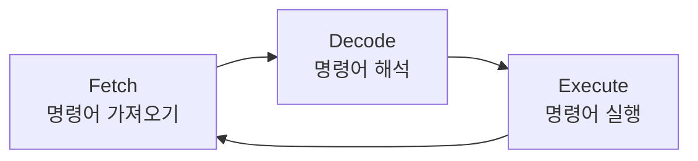
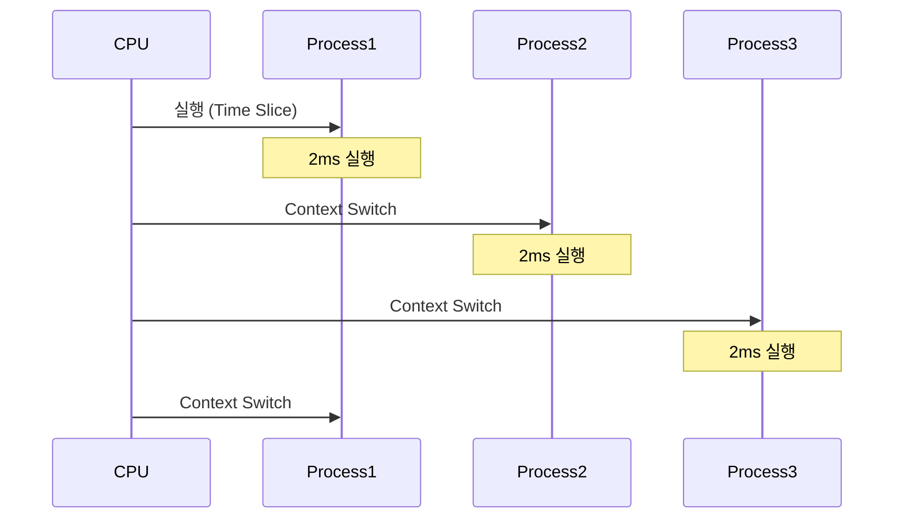
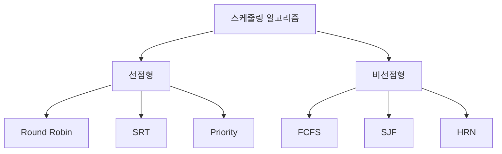

# CPU의 동작 방식

CPU는 다음과 같은 사이클을 반복하며 동작한다.



1. Fetch(명령어 가져오기)
- 메모리에서 다음 실행할 명령어를 가져온다.
- PC(Program Counter)가 다음 명령어의 위치를 가리킨다.
2. Decode(명령어 해석)
- 가져온 명령어를 해석하는 과정이다.
- 필요한 데이터와 리소스를 확인한다.
3. Excute(명령어 실행)
- 해석된 명령어를 실행하는 단계이다.
- 결과를 메모리 혹은 레지스터에 저장한다.

# 멀티프로세스의 처리(CPU 스케줄링)

여러개의 프로세스가 동시에 실행되는 것 처럼 보이는 이유는 CPU의 스케줄링 덕분이다. 여러개의 프로세스가 존재할 때 CPU는 다음처럼 동작한다.



1. Time Sharing
- CPU는 각 프로세스에 짧은 시간을 할당한다. (Time Slice)
- 빠른 속도로 프로세스들을 번갈아가며 실행한다.
2. Context Switching
- 현재 실행중인 프로세스의 상태를 저장하고 다음 실행할 프로세스의 상태를 복원한다.
  - PCB(Process Control Block)에 프로세스 정보를 저장한다.

## 스케줄링 알고리즘

CPU 스케줄링에는 다음과 같은 알고리즘이 활용될 수 있다. 스케줄링 알고리즘을 선택할 땐 시스템의 특징, 성능지표 (CPU이용률, 응답시간, 처리량 등)을 고려해야한다.



여기서 선점형은 실행중인 프로세스를 강제중단하고 다른 프로세스를 실행할 수 있는 방식을 의미하며,
비선점형은 실행중인 프로세스가 종료되거나 I/O 작업 등으로 CPU를 반납할 때까지 계속 실행하는 방식을 말한다.

1. `Round Robin`
   - 각 프로세스에 동일한 시간을 할당한다.
     - 장점: 공평한 CPU 분배, 시간 예측 가능
     - 단점: 오버헤드
   - 일반적인 OS에 활용
   ```mermaid
   gantt
    title Round Robin (Time Quantum = 2)
    dateFormat X
    axisFormat %L
    
    section Process 1
    2     :0, 2
    2     :6, 8
    section Process 2
    2     :2, 4
    section Process 3
    2     :4, 6 
   ```
2. `Priority Scheduling`
   - 우선순위가 높은프로세스를 먼저 실행한다.
     - 장점: 중요 작업 우선처리
     - 단점: 특정 프로세스의 작업이 늦춰질 수 있음.
   - 임베디드 시스템, 실시간 시스템에 활용
3. `FCFS(First Come First Served)`
   - 먼저 도착한 프로세스를 우선 처리
     - 장점: 간단한 구현, 무한 대기현상이 없음(기아현상 없음)
     - 단점: `Convoy Effect` 발생가능, 우선순위를 고려하지 않음
       - `Convoy Effect`: 실행시간이 긴 프로세스가 CPU를 차지하고 있어 실행 시간이 짧은 프로세스들이 대기하는 현상
   - 배치 처리 시스템에서 활용
4. `SJF(Shortest Job First)`
   - 실행시간이 가장 짧은 프로세스 우선 실행
     - 장점: 평균 대기시간 최소화
     - 단점: 실행 시간 예측 어려움, 특정 프로세스의 작업 지연
   - 실행 시간 예측이 가능한 배치 작업
5. `SRT(Shortest Remaining Time)`
   - `SJF`의 선점형 버전으로, 현재 실행중인 프로세스의 남은 시간보다 더 짧은 시간이 소요되는 프로세스가 들어오면 Context Switching 한다.
     - 장점: 평균 대기시간 최소화
     - 단점: 잦은 Context Switching으로 인한 오버헤드, 실행 시간 예측 어려움, 특정 프로세스 작업의 지연
6. `HRN(Highest Response-ratio Next)`
   - `(대기시간 + 실행시간) / 실행시간`으로 우선순위를 정하는 알고리즘이다. (FCFS의 장점 + SJF의 장점)
     - 장점: `SJF`의 문제점 해결 (기아 현상, 프로세스 긴 경우에도 우선순위 높아질 수 있음.)
     - 단점: 우선순위 계산으로 인한 오버헤드, 실행시간을 미리 알아야함.
6. `Multilevel Queue`
   - 여러개의 큐를 활용하여 프로세스를 분류
     - 장점: 다양한 종류의 프로세스 효율적 처리
   - 현대 운영체제에서 활용
   ```mermaid
    graph TD
    A[프로세스] --> B[시스템 프로세스<br/>최상위 우선순위]
    A --> C[대화형 프로세스<br/>중간 우선순위]
    A --> D[배치 프로세스<br/>최하위 우선순위]
    ```
