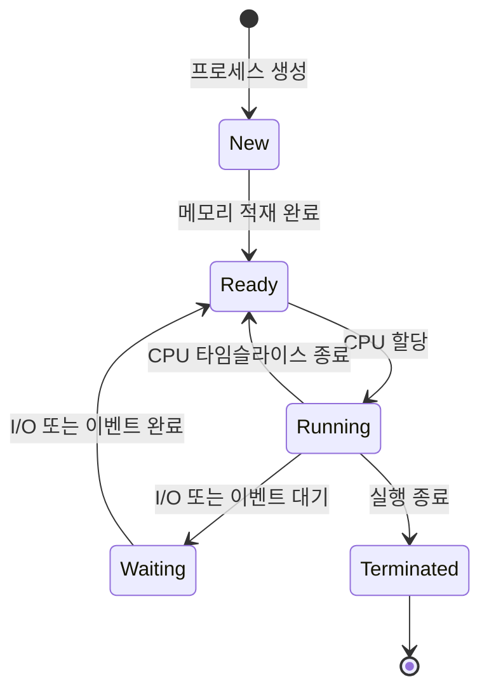
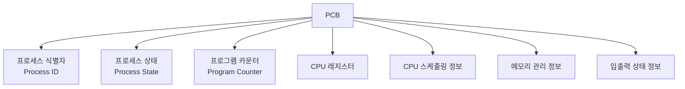

# 프로세스

***프로세스는 컴퓨터에서 연속적으로 실행되고 있는 프로그램이다. - 위키백과***

사전적 정의는 위와같다. 근데, 프로세스를 명확히 설명한 글임은 분명하지만 완전한 이해를 위해 다음과 같이 풀어쓸 수 있다.

## 프로그램이 실행되는 과정의 이해

프로그램은 쉽게말해 코드 덩어리, 명령어 집합체이다. 
이러한 프로그램들이 실행되기 위해선 컴퓨터 자원(CPU, 메모리 등)을 할당받아야한다.

운영체제(OS)가 프로그램을 메모리에 적재하고 필요한 자원을 할당하는 작업을 수행하는데, 이렇게 메모리에 적재되어 실행중인 프로그램이 바로 프로세스이다.

예를 들어, 우리가 크롬 브라우저를 실행하면 하드디스크에 저장되어 있던 크롬 프로그램이 메모리에 올라가고 필요한 자원을 할당받아 프로세스가 된다. 
이때 여러 개의 크롬 창을 열면, 같은 프로그램으로부터 여러 개의 프로세스가 생성될 수 있다. ~~(여러개의 탭을 막 켜두면 느려지는 이유)~~

## 프로세스의 특징

프로세스는 다음의 특징을 가진다.

1. 독립된 메모리 공간 : 각 프로세스는 자신만의 독립된 메모리 공간을 할당받는다.
2. 자원 소유 : 각 프로세스는 CPU / 메모리 등의 자원을 할당받는다.
3. PCB(Process Control Block) : 운영체제가 **프로세스를 관리하기 위한 정보 구조체**를 가진다.

## 프로세스의 상태

프로세스는 다음과 같은 `Life Cycle`을 가진다.

- NEW : 프로세스 생성
- Ready : CPU를 할당받기 위해 대기하는 상태
- Running : CPU를 할당받아 실행 중인 상태
- Waiting : I/O 작업 등을 기다리는 상태
  - I/O : Input / Output 작업으로 입출력작업을 의미한다.
    - 네트워크 통신, 프린트 출력, 디스크 접근, 키보드/마우스 입력 등이 이에 해당한다.

## 프로세스 관리

Process Control Block(PCB)를 통해 프로세스를 관리한다.

### PCB

PCB는 Context Switching을 위한 정보를 가지고 있으며 프로세스의 상태관리 및 모니터링, 프로세스 간 동기화/통신에 활용된다.

1. 프로세스 식별자
- 각 프로세스의 고유번호로 프로세스를 구분할 때 사용
2. 프로세스 상태
- new, ready 등의 상태로 현재 프로세스가 어떤 상태인지 의미한다.
3. 프로그램 카운터
- 다음에 실행할 명령어의 메모리 주소로, Context Switching 시 현재 실행 위치를 저장하고 복원하는데 사용
4. CPU 레지스터
- 프로세스가 사용하던 레지스터 값들을 저장한다.
- Context Switch 시 현재 상태를 보존하는데 필요하다.
5. CPU 스케줄링 정보
- 프로세스의 우선순위, 스케줄링 큐 포인터 등 스케줄링과 관련된 정보
6. 메모리 관리 정보
- 베이스 레지스터, 한계 레지스터 값, 페이지 테이블, 세그먼트 테이블 등의 정보
7. 입출력 상태 정보
- 할당된 입출력 장치 목록 등의 정보