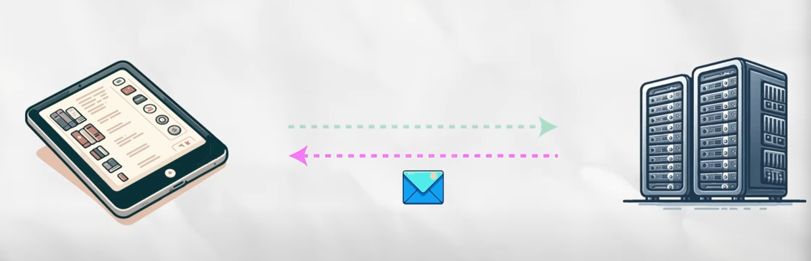
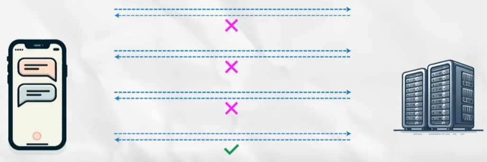
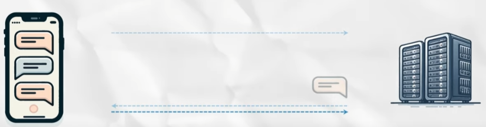
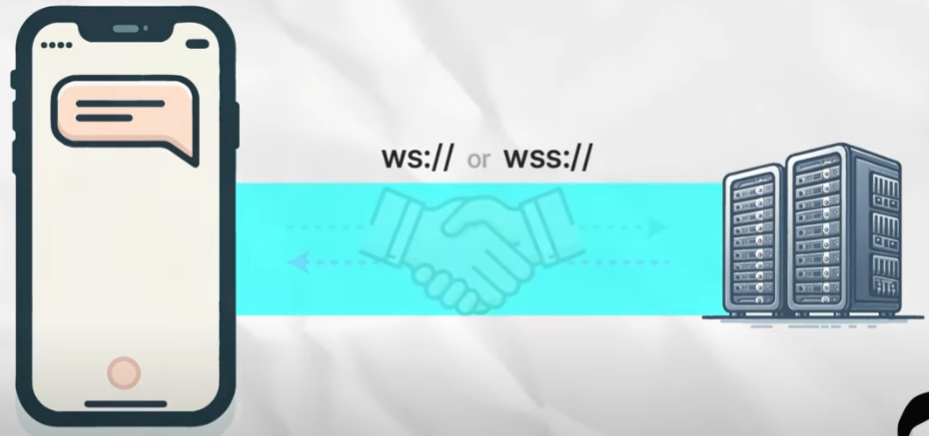
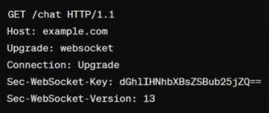
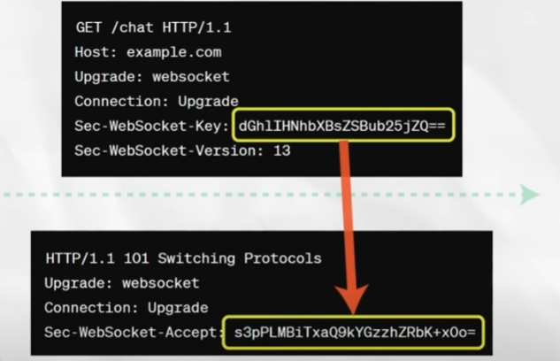
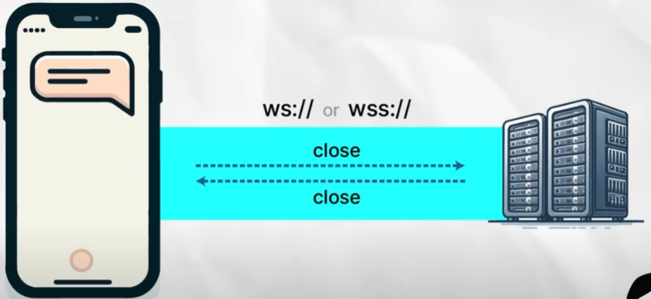
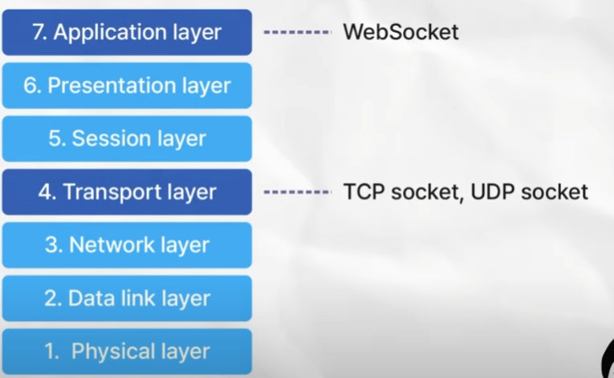
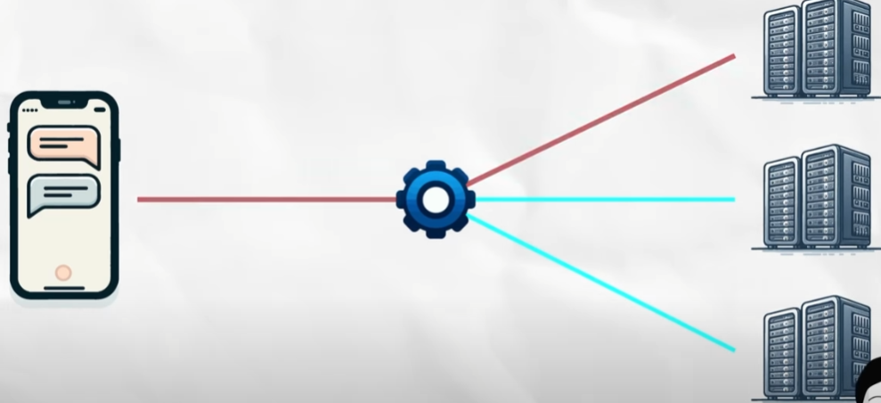
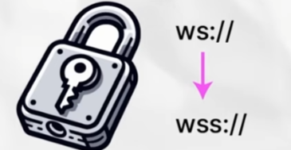

# WebSocket

> 작성자: 신희진 /
작성일: 25.02.07 / 출처: 얄팍한 코딩사전 https://www.youtube.com/watch?v=2oMPf-ueQic
> 

### 기존 소통방식(HTTP기반)

- REST API, SOAP, GraphQL, gRPC

**HTTP/1.1 이하에서는 클라이언트가 요청하고 서버가 응답하는 `단방향 통신`만 가능**

- 서버가 클라이언트에게 메시지를 보내는 건 클라이언트의 요청에 응답을 할 때 뿐

- 채팅 앱과 같은 실시간 양방향 통신이 필요한 경우에는 적합하지 않다.
    - 내가 상대방에게 메세지를 보내는 것: 클라이언트에서 서버로 통보하면 되는 것이라 문제가 없음
    - 상대방이 메시지를 보냈을 때, 이를 내 앱에서 감지하는 것이 불가
        - HTTP/1.1 이하에서는 클라이언트가 요청없이는 메세지를 보내지 못하기 때문
- 이를 해결하기 위해
1. **Polling**
    
    
    
    - 클라이언트가 일정한 간격으로 서버에 데이터를 요청하는 방식.
        - 클라이언트가 주기적으로 상대가 새 챗을 보냈는지 확인
        - 서버는 업데이트의 유무를 바로 응답
    - 단점:
        - 요청을 보내는 주기만큼의 지연이 발생할 수 있음
            - 서버가 가지고 있는 상태의 변화에 즉각적 반응을 못함.
        - 계속해서 불필요한 요청들이 보내짐
            - 요청의 주기가 짧다면 반응속도는 빨라지겠지만 트래픽의 낭비는 더 심해짐
        
2. **Long Polling (롱 폴링)**
    
    
    
    - 클라이언트가 요청을 보내면, 서버는 새로운 업데이트(데이터)가 있을 때까지 응답을 지연.
        - 답장이 오거나 타임아웃 시간까지 간다면 응답
    - 데이터의 업데이트에 반응하는 속도는 빨라지지만 서버의 부담이 커짐
    - 단점:
        - 서버가 클라이언트로부터 요청을 받을 때부터 응답을 보낼때까지 연결이 오래 유지되면서 리소스 사용량 증가.
        - 동시에 여러 클라이언트가 서비스를 사용하면 그만큼의 연결을 유지해야 하기에 부하가 발

흐름을 돕기 위한 표..

|  | **Polling** | **Long Polling** | **WebSocket** |
| --- | --- | --- | --- |
| **방식** | 일정 주기로 서버에 요청 | 클라이언트가 요청하면 서버가 업데이트될 때까지 대기 | 지속적인 연결 유지 (Handshake 후 바로 통신) |
| **응답 시간** | 요청 주기에 따라 다름 (지연 발생 가능) | 즉시 응답 가능 (업데이트 발생 시) | 실시간 응답 가능 (가장 빠름) |
| **서버 부하** | 요청이 많을수록 증가 | 클라이언트 수가 많으면 연결 유지 부담 | 지속적인 연결이지만 오버헤드는 적음 |
| **사용 사례** | 뉴스 피드, 간단한 상태 체크 | 실시간 채팅, 알림 | 채팅, 게임, 주식 데이터 |

---

# **1. WebSocket이란?**

WebSocket은 클라이언트와 서버 간에 **양방향(full-duplex) 통신**을 제공하는 프로토콜입니다. 기존의 HTTP 요청-응답 방식과는 달리 **지속적인 연결을 유지하면서** 데이터를 주고받을 수 있습니다.

### 1. *HTTP/2

- HTTP/2: 공중전화 부스에서의 제한된 통화, 장시간 양방향 통신을 위해 설계된 것이 아님.
    - 서버쪽에서 푸시를 보내는것이 가능하지만 이는 클라이언트의 초기 요청에 대한 응답의 일부로 이루어짐
    - 특히 브라우저에서의 사용에는 제약이 많음
    - HTTP 헤더가 포함되어 오버헤드 존재
- WebSocket: 스마트 폰.

### **2. WebSocket의 주요 특징**

- **양방향 통신 (Full-Duplex)**
    
    클라이언트와 서버가 **동시에 데이터를 송수신**할 수 있어 실시간 애플리케이션에 적합합니다.
    
    (예: 채팅, 온라인 게임, 주식 거래 시스템, 라이브 스트리밍)
    
- **지속적인 연결 (Persistent Connection)**
    
    한번 연결을 설정하면 지속적으로 데이터를 주고받을 수 있습니다.
    
    (HTTP는 요청-응답 후 연결이 종료됨)
    
- **낮은 오버헤드 & 짧은 대기 시간**
    
    HTTP Polling처럼 주기적으로 요청을 보내지 않아도 되므로, **서버 부하가 줄어들고 네트워크 비용도 절약**됩니다.
    
- **실시간 네트워킹 지원**
    
    WebSocket을 이용하면 **서버가 클라이언트에게 데이터를 바로 push**할 수 있습니다.
    
    (예: 실시간 알림, 주식 시세 업데이트)
    

---

## **2. WebSocket의 동작 과정**

### **1. Opening Handshake** (연결 수립)

- 클라이언트가 `Upgrade: websocket` 헤더를 포함한 HTTP 요청을 보냄.
- 서버가 `101 Switching Protocols` HTTP 응답을 보내면서 **WebSocket** 연결을 승인.
    
    
    
- 동작 과정
    - 클라이언트 요청에는 헤더에 아래와 같은 내용이 담김 **헤더는 우편물에 붙은 송장같은 의미*
        
        
        
        - Upgrade, Connection: 현재의HTTP연결을 WebSocket 프로토콜로 업그레이드하자는 내용
        - Sec-WebSocket-Key: 클라이언트가 랜덤으로 생성한 값을 Base64로 인코딩한 문자열
            
            
            
            - 서버는 이 요청을 받고, GUID라 불리는 정해진 문자열을 해당 키 뒤에 이어붙인 뒤 SHA-1 해시로 계산하여 다시 base64로 인코딩
        - 서버는 이 값을 헤더에 담아 클라이언트로 돌려보냄
        - 클라이언트는 이것이 내가 보낸 키로 생성된 값이 맞는지 확인
        - 맞음을 판단 후 연

### **2. Data Transfer** (데이터 송수신)

- 연결이 유지된 상태에서 클라이언트와 서버가 데이터를 **비동기적으로** 주고받음.

### **3. Closing Handshake** (연결 종료)

- 클라이언트 또는 서버가 연결을 종료하면 `Close` 프레임을 전송하여 연결을 정리.
    
    
    

**비정상적인 종료 감지**

- 지정된 시간동안 메시지가 없을 시 확인 패킷을 보내는 방법
- 주기적으로 Ping,Pong 프레임을 주고받아서 서로의 접속 여부를 확인하는 방법

**하나의 연결을 끝까지 유지하고, 그 과정에서도 적은 자원만 소모하기 때문에 LongPolling만큼 서버에 부담을 주지 않음**

---

## 3. TCP 소켓, UDP 소켓

- 속한 OSI 7계층이 다름
- TCP, UDP 소켓은 전송 계층인 Layer 4에서, WebSocket은 응용계층인 Layer7에서 동작함
- 계층이 낮을 수록 하드웨어, 높을수록 소프트웨어에 가까움
- **WebSocket은 TCP 소켓을 기반으로 작동함**
    - Transmisiion Control Protocol
    - TCP를 사용하기 때문에 데이터의 순서와 신뢰성이 보장됨

|  | **TCP 소켓** | **WebSocket** |
| --- | --- | --- |
| **OSI 계층** | 전송 계층 (Layer 4) | 응용 계층 (Layer 7) |
| **프로토콜** | TCP | WebSocket (HTTP Upgrade) |
| **연결 방식** | 클라이언트-서버 간 지속적 연결 (TCP) | HTTP 핸드셰이크 후 WebSocket으로 업그레이드 |
| **데이터 전송** | 바이너리 또는 텍스트 데이터 | 주로 텍스트(JSON) 또는 바이너리 데이터 |
| **사용 사례** | 저수준 네트워크 프로그래밍 (IoT, 게임 서버) | 실시간 웹 애플리케이션 (채팅, 알림) |

---

## 4. 한계 및 극복

### 1. 서버의 설계에 따라 구현이 복잡해질 수 있음

- 특히 **로드 밸런싱**이 적용된 서버에서는 이를 위해 고려하고 설정한 부분이 많아짐
    - *로드밸런싱: 한 곳의 서버에 트래픽이 몰리는 것을 방지하고 여러 서버에 적절히 분산시켜주는 기술*
        
        
        
    - 웹소켓은 특정 서버와의 지속적인 연결 안에서만 이루어지기 때문에 한 서버와 웹 소켓 통신을 시작하면 그 이후로도 계속 그 서버로만 데이터가 전송되도록 설정해야 함.
    - 이때, NGINX, HAProxy, AWS ELB 등 WebSocket을 처리할 수 있는 로드 밸런서를 선택하여 구성하는 등 서비스에 적합한 방법을 찾아 해결
- 메시지의 크기가 제한되어 있다는 점을 고려해야 함
    - 브라우저, 서버, 네트워크 환경마다 WebSocket에서의 메시지 크기에 제약을 들 수 있기 때문
    - 대용량의 데이터의 경우, 분할해서 전송하거나 다른 프로토콜을 사용하는 등의 방법을 사용할 수 있음
- **WebSocket의 기본 프로토콜인 WS은 통신이 암호화되어 있지 않음**
    - 보안이 중요한 서비스라면 **SSL/TLS** 인증서를 발급받은 뒤 이를 사용하여 WSS를 설정해야함
        - **WebSocket hijacking** 위험, XSS 공격 가능성
        - HTTPS를 적용하는 방식과 같음: **SSL/TLS 암호**

- Polling등의 방식보다는 훨씬 덜하지만 WebSocket도 서버에 부담을 주는건 마찬가지
    - 많은 사용자들이 동시에 접속해 있을 수록 유지해야하는 TCP 연결이 많아지고,
    - 메시지들이 오가는 빈도가 높다면 네트워크 대역폭과 CPU의 사용량도 증가함

---

## **WebSocket과 비슷한 역할을 하는 기술 비교**

| 기술 | 주요 특징 | WebSocket과 차이점 | 사용 사례 |
| --- | --- | --- | --- |
| **WebRTC** | 실시간 **P2P(peer-to-peer) 연결**, 저지연 | 서버를 거치지 않고 **직접 연결**, 대역폭 효율적 | 화상 통화, 음성 채팅, P2P 파일 전송 |
| **Kafka** | **메시지 큐(Message Queue)**, 대량 데이터 처리 | **비동기 이벤트 스트리밍**, 즉각적 데이터 전송보다 **내구성** 우선 | 로그 처리, 데이터 파이프라인, 대용량 트랜잭션 |
| **RabbitMQ** | **메시지 브로커**, AMQP 기반 | **비동기 메시지 전달**, WebSocket보다 **보장된 메시지 전송** | 마이크로서비스 통신, 작업 대기열, 이벤트 드리븐 시스템 |
| **SSE (Server-Sent Events)** | 서버 → 클라이언트 **단방향 스트리밍** | 클라이언트에서 서버로 전송 불가 (**단방향**), WebSocket보다 단순 | 실시간 알림, 뉴스 피드 |
| **MQTT** | 경량 메시지 프로토콜, 저전력 IoT | WebSocket보다 **경량**하고 **저전력** 소비, **브로커(MQTT 서버) 필요** | IoT 기기(스마트 홈, 센서 네트워크) |
| **gRPC** | 프로토콜 버퍼 기반, 빠른 바이너리 통신 | HTTP/2 기반으로 더 빠르고 효율적, WebSocket보다 **RPC 호출 최적화** | 마이크로서비스 간 통신, 실시간 API |

*P2P: 중앙서버 없이 **클라이언트 컴퓨터**끼리 직접적으로 통신하는 방식*

### **각 기술의 핵심 차이점**

1. **WebRTC vs WebSocket**
    - **WebRTC:** 서버 없이 **P2P 연결** 가능 → 대역폭 효율적 (예: 영상 통화, P2P 파일 공유)
    - **WebSocket:** 서버가 데이터를 중개해야 함 → 방화벽 뒤에서도 안정적 (예: 채팅 앱)
2. **Kafka vs WebSocket**
    - **Kafka:** 대규모 데이터 스트리밍 & **비동기 메시징 큐** (예: 실시간 로그, 빅데이터 처리)
    - **WebSocket:** **즉시 데이터 전송**이 필요할 때 적합 (예: 실시간 알림, 게임)
3. **SSE vs WebSocket**
    - **SSE:** 서버에서 **클라이언트로만** 메시지를 보낼 수 있음 (예: 뉴스 피드)
    - **WebSocket:** **양방향** 통신이 가능 (예: 채팅, 실시간 주식 데이터)
4. **MQTT vs WebSocket**
    - **MQTT:** 저전력, 경량, 브로커 필요 (예: IoT)
    - **WebSocket:** 일반 웹 애플리케이션에 최적화 (예: 실시간 알림)
5. **gRPC vs WebSocket**
    - **gRPC:** **바이너리 데이터** 기반, HTTP/2 지원 (예: 마이크로서비스 간 API)
    - **WebSocket:** 주로 **텍스트(JSON, XML)** 데이터 전송 (예: 채팅, 실시간 대시보드)
    - 

### **WebSocket을 사용할 때 다른 기술과 비교해서 선택하는 기준**

- **P2P 연결이 필요한가?** → **WebRTC** (화상 통화, 파일 전송)
- **대량 데이터 처리가 필요한가?** → **Kafka** (로그, 분석)
- **단순한 서버-클라이언트 단방향 스트리밍인가?** → **SSE** (뉴스 피드, 실시간 알림)
- **IoT처럼 저전력 기기와의 통신인가?** → **MQTT** (스마트홈, 센서)
- **마이크로서비스 간의 효율적인 통신인가?** → **gRPC** (백엔드 간 데이터 전송)
- **실시간 양방향 통신이 필요한가?** → **WebSocket** (채팅, 주식 데이터, 온라인 게임)
- **비동기 메시지 큐 필요** → **RabbitMQ**

---

### **WebSocket을 알면서 같이 알면 좋은 것**

1. **WebRTC (Web Real-Time Communication)**
    - WebSocket과 비슷하지만, **서버를 거치지 않고 피어 투 피어(P2P) 연결**을 지원.
    - **영상 통화, 파일 전송** 등에 활용.
    - 예: Zoom, Google Meet
2. **GraphQL Subscriptions**
    - WebSocket을 활용한 **GraphQL 기반 실시간 데이터 스트리밍** 방식.
    - 예: 실시간 대시보드, 라이브 업데이트 기능.
3. **MQTT (Message Queuing Telemetry Transport)**
    - 사물인터넷(IoT)에서 많이 쓰이는 **경량 메시지 프로토콜**.
    - WebSocket과 유사하지만 **저전력 디바이스**에 최적화됨.
4. **Socket.io**
    - WebSocket을 지원하지 않는 브라우저에서도 동작할 수 있도록 설계된 **Node.js 기반 라이브러리**.
    - 자동으로 Polling, WebSocket 등을 선택하여 최적의 방식으로 통신.
5. **HTTP/2 & HTTP/3**
    - HTTP의 새로운 버전들은 **다중 스트림(Multiplexing)**을 지원하여 **WebSocket과 유사한 기능**을 제공.
    - HTTP/3는 UDP 기반으로 더욱 빠른 응답성을 보장.

---

# 면접질문

### **1. websocket 이란?**

- Transport protocol의 일종으로 쉽게 이야기하면 웹버전의 TCP 또는 Socket이라고 이해하면 된다.
    
    WebSocket은 서버와 클라이언트 간에 Socket Connection을 유지해서 언제든 양방향 통신 또는 데이터 전송이 가능하도록 하는 기술이다.
    

### 2. **HTTP통신방법과 WebSocket의 차이점**

- 결정적인 차이는 프로토콜이다.
- WebSocket 프로토콜은 접속 확립에 HTTP를 사용하지만, 그 후 통신은 WebSocket 독자의 프로토콜로 이루어진다.
- 또한, header가 상당히 작아 overhead가 적은 특징이 있다. 장시간 접속을 전제로 하기 때문에, 접속한 상태라면 클라이언트나 서버로부터 데이터 송신이 가능하다. 더불어 데이터의 송신과 수신에 각각 커넥션을 맺을 필요가 없어 하나의 커넥션으로 데이터를 송수신 할 수 있다.

### 3. WebSocket의 보안 이슈

1. **WebSocket Hijacking (하이재킹 공격)**
    - 인증되지 않은 사용자가 WebSocket 연결을 가로채어 악의적인 요청을 보낼 수 있음.
    - **해결 방법:**
        - **WSS (WebSocket Secure) 사용** (`wss://`) → TLS 암호화 적용
        - **JWT 토큰 기반 인증 사용** (ex: `Authorization` 헤더에 토큰 포함)
2. Cross-Site WebSocket Hijacking (CSWSH)
    - 공격자가 다른 도메인에서 악성 스크립트를 실행하여 WebSocket을 열도록 유도.
    - 해결 방법:
        - 서버에서 Origin 검증 (`Sec-WebSocket-Origin` 체크)
        - `CORS 정책` 적용하여 허용된 도메인만 WebSocket 연결 가능하도록 설정
3. Man-in-the-Middle Attack (중간자 공격, MITM)
    - 네트워크에서 WebSocket 패킷을 가로채어 데이터 탈취 가능.
    - 해결 방법:
        - 반드시 WSS(WebSocket Secure) 사용
        - TLS(SSL) 암호화 적용
        - 신뢰할 수 있는 CA 인증서 사용

### 4. WebSocket을 사용할 때 발생할 수 있는 서버 부하를 줄이는 방법은?

1. **웹소켓 연결을 관리하는 로드 밸런서 사용**
    - WebSocket 지원 **NGINX, HAProxy** 등을 사용해 **서버 부하 분산**
    - AWS ELB, Cloudflare WebSocket Proxy 활용
2.  **Ping-Pong 메시지 최적화**
    - 클라이언트가 너무 자주 Ping 메시지를 보내지 않도록 설정 (`30~60초 주기 적절`)
3.  압축(Compression) 적용
    - WebSocket에서 gzip, Brotli 압축 사용하여 데이터 전송량 최소화
4. 메시지 크기 제한
    - 클라이언트가 대용량 메시지를 보내지 못하도록 제한 (`maxMessageSize 설정`)
5. 서버 간 WebSocket 세션 공유 (Sticky Session 적용)
    - WebSocket 연결을 유지하기 위해 특정 서버에 계속 연결되도록 설정
    - Redis Pub/Sub 같은 메시지 브로커를 활용해 서버 간 메시지 공유