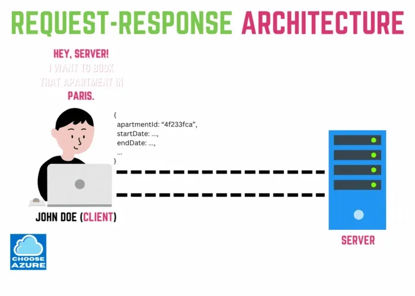
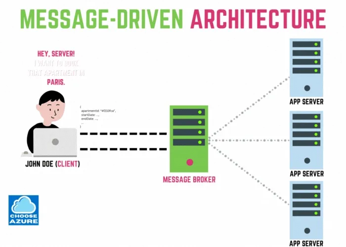
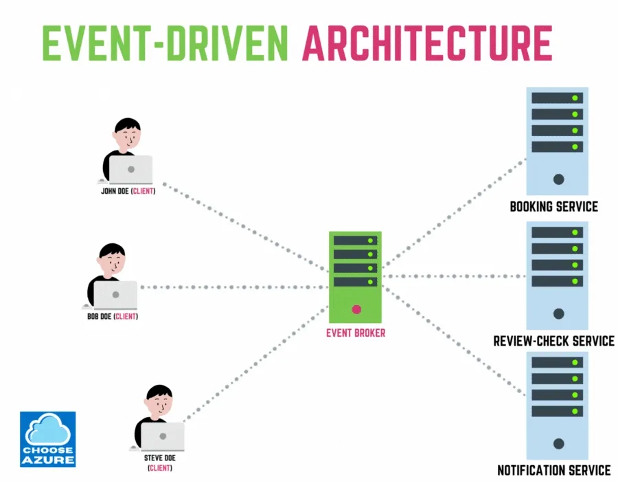
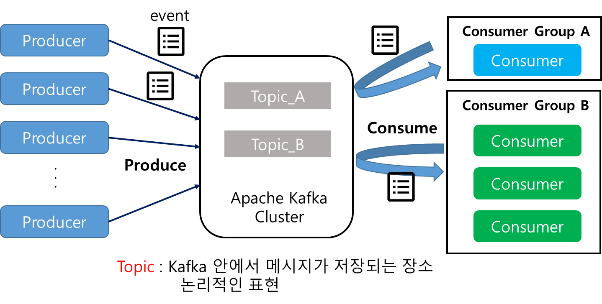
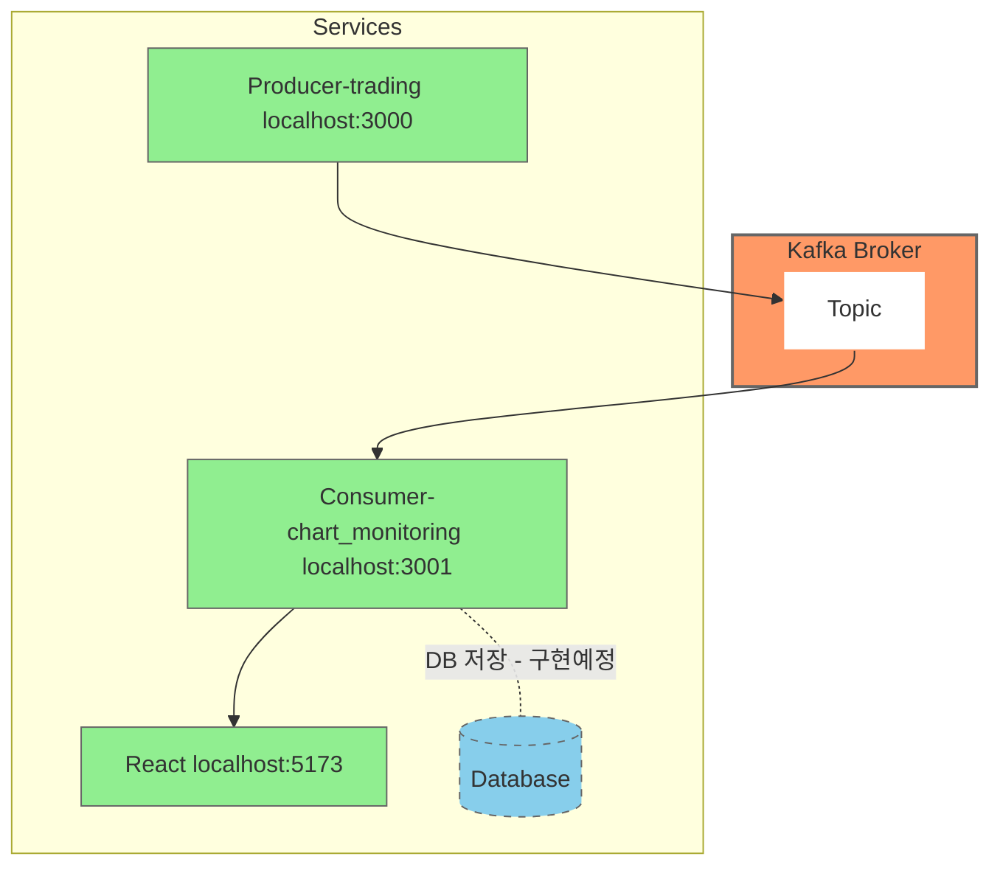
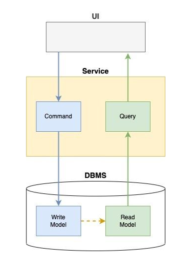
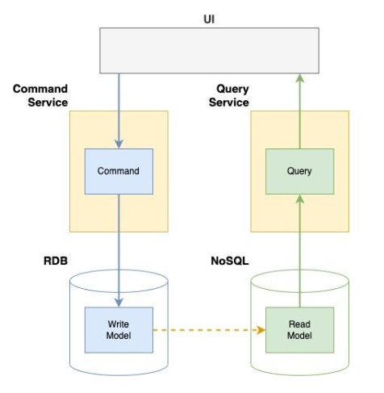
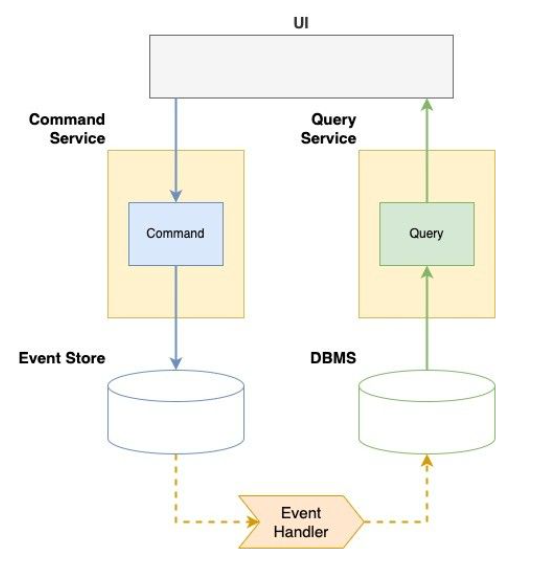
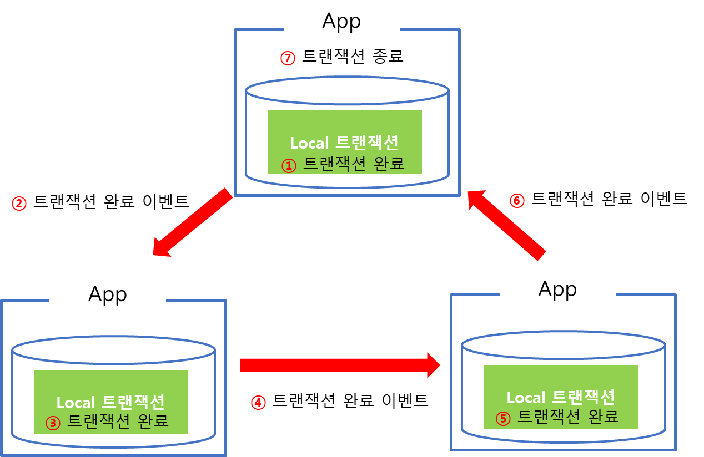
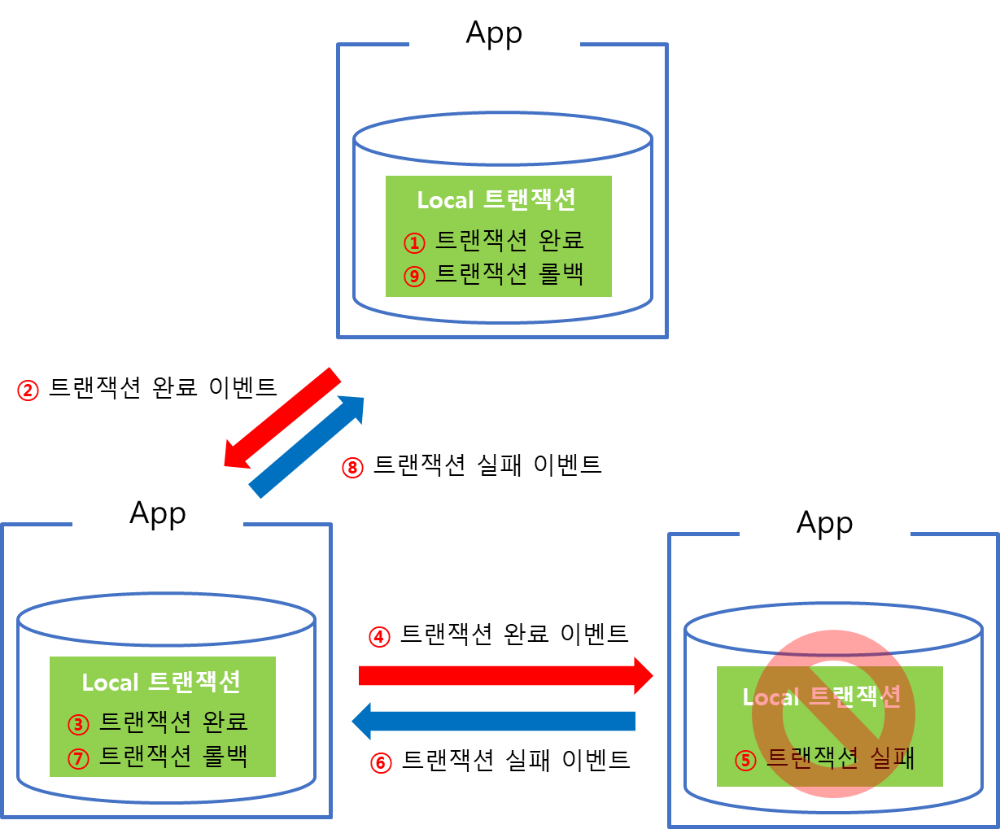

# Event Driven Architecture (EDA)

## 관련된 여러가지 구조들

`EDA`에 대해 알아보기 전 기존의 구조와 관련된 구조들의 개념을 학습할 필요가 있다. 각각의 구조를 알아보자.

### 전통적인 `Request - Response`

`HTTP`, `GraphQL`, `gRPC` 등과 같은 요청은 클라이언트가 서버에 요청을 보내고 응답이 올때까지 대기하는 형태이다.

이와 같은 경우 단순한 애플리케이션에서 단순한 아키텍처로 구현할 수 있고 오류 및 응답흐름 파악에 장점이 있다. 하지만 다음과 같은 단점을 보유하고 있다.

1. `MSA`와 같은 분산방식으로 통신하는 경우엔 병목현상이 발생할 수 있다.
2. 트래픽이 급증하는 경우 속도가 저하되어 사용자 경험에 부정적 영향을 미칠 수 있다.
3. 서비스간 결합 정도가 높아 장애가 발생한 경우 연쇄적으로 발생할 가능성이 높다.
4. 수평 확장이 어렵다.

이와 같은 단점을 보완하기 위해 `Broker`을 통해 통신하는 아키텍처가 등장했다.

### `Message - Driven`

**특정 수신자**에게 직접적인 **명령**을 전달하는 것은 전통적 방식과 동일하다. 하지만 `RabbitMQ`와 같은 메시지큐를 `Broker`로 활용하기에 다음과 같은 장점을 가지고있다.

1. 시스템 부하 완화
2. 전통적 방식보다는 느슨한 결합으로 확장 용이
3. 브로커에 메세지가 처리되어 후처리 가능

하지만 이와같은 구조도 장점만 있는 것이 아니다. 다음과 같은 단점또한 존재한다.

1. 전통적인 구조보다 복잡한 아키텍처
2. 브로커에대한 높은 의존도
3. 서비스간 의존성 여전히 존재

### `Event - Driven`

`Event - Driven`는 상태변경이나 사실(포스트 작성, 배송 시작 ..)을 이벤트로 표현하고 이에 관심있는 서비스들이 자유롭게 구독하는 방식이다.

`EDA`의 상세정보는 아래 글을 통해 확인하자.

## `Event - Driven` 의 구조

`EDA`는 쉽게말해 이벤트를 생성하고 이를 소비하는 과정으로 진행되는 구조이다. `EDA`는 크게 3가지로 구성되는데 다음과 같다.

1. `Producer` : 특정 상태변화가 있을 때 이벤트를 발생시키고, `Broker`로 전달한다.
2. `Broker` : 특정기간(혹은 무기한)으로 생성된 이벤트를 저장하고 있다. 그렇기에 신뢰도/확장성이 중요하고 분산된 환경에서 동작해야한다.
   - `Kafka`, `RabbitMQ`가 이에 해당한다.
3. `Consumer` : `Broker`로부터 이벤트를 읽고(구독) 프로세싱을 진행한다(처리).

## `Event - Driven` 구조의 장단점

### 장점

1. `Producer`, `Consumer` Decoupling
   - `Broker`을 통해 통신하기에 서로에게 의존하지 않는다. 따라서 장애 대처가 용이하다.
   - 서비스간의 완전한 분리가 가능하기에 확장에 용이하다.
2. Dependency Inversion Principle
   - `Producer`과 `Consumer` 사이의 추상화 layer `Event`에 의존하는 구조이다.
     - 결과적으로 이와같은 인터페이스가 유지되기에 `Producer`, `Consumer`의 버전 변화에도 아키텍처가 무너지지 않는다.
3. 편리한 이벤트 복기
   - 이벤트를 같은 파티션에 저장한다면 이벤트를 순서대로 확인할 수 있다.
   - `Kafka`의 경우엔 특정기간(혹은 무기한) 저장을 지원하기에 오류 발생 시 해당 기간의 이벤트 흐름을 확인할 수 있다.

### 단점

1. 예측이 어렵다.
   - 직접적으로 연결되어있지 않기에 언제 상태업데이트가 될지 완전한 예측을 하기 어렵다. (`Eventual Consistency` 궁극적 일관성 문제)
2. 중복 메세지
   - 장애가 발생한경우 `EDA`는 몇개의 메세지 전으로 돌아가 consuming 진행하는데, 이 때 중복된 메세지를 처리할 가능성이 있다.
     - 포인트 적립, 송금정보 처리등에 이러한 오류가 발생하면 치명적이기에 추가적인 구현이 필요하다는 것이 단점.
3. 아키텍처 복잡도가 높아진다.

## 사용 예시

개인적으로 `nest`와 `kafk`로 `EDA`구조를 만든적 있다. 이와 같은 코드를 예시로 어떤 방법으로 기능을 구현하면 좋을지 작성하고자한다.

나는 다음과 같은 구조를 만들어봤는데, 자세한 내용은 아래의 링크를 확인하고 이 글에선 간단하게 어떤식으로 구현을 해야하는지만 적으려한다.

[nest, kafka로 구현한 EDA Code](https://github.com/scorchedrice/kafka-websocket)

[구현 과정](https://scorchedrice.github.io/categories/kafka/)

1. `kafka`를 띄운다 - `Docker` 활용
2. `producer`, `consumer`의 입장에서 각각 `kafka`를 연결한다.
   - `producer`는 특정 이벤트 발생 시 어떤 메시지를 어떤 토픽의 `kafka`로 던질 것인지 로직 구현
   - `consumer`는 어떤 그룹에 속했는지, 어떤 토픽을 구독할지, 각 메세지 별로 어떤 처리를 할지 로직 구현

## 언제쓰냐?

1. Background Task
    - 결재 완료 후 이메일 발송
    - 주문 완료 후 포인트 적립
2. CQRS Pattern
3. Saga Pattern
   - MSA간 트랜잭션 관리
   - 보상 트랜잭션 처리

### CQRS Pattern

명령(Command)와 질의(Query)의 책임을 분리하는 패턴이다.
- 시스템 상태를 변경하는 Command, 시스템 상태를 조회하는 Query를 분리한다.
- 쓰기위한 데이터모델과 읽기위한 데이터모델을 분리한다.
- 데이터를 쓰는 빈도보다 읽는 빈도가 높은 경우에 동일한 데이터 모델을 활용한다면 정규화된 테이블에 추가적인 조인 연산이 필요하기에 성능적 저하가 발생할 수 있는데, 이와같은 저하를 막기위해 활용한다.
  - 성능개선이 있을 수 있지만 저장공간이 더 필요하다는점 등이 단점이다.

구현 예시는 다음과 같다.

여기서 `EDA`를 활용하면 다음과같이 구성할 수 있다.

### SAGA pattern

우선 `SAGA`를 이해하기 위해선 트랜잭션을 이해해야하는데, 일단 DB상태를 변화시키기 위해 수행하는 작업의 단위로 이해하자. 
상세 정보는 추후 트랜잭션을 주제로 다루기로하고 일단은 넘어가겠다.

아무튼 기존 `Monolothic`환경에서는 DBMS가 기본적으로 제공하는 트랜잭션 기능을 활용하여 DB commit, rollback을 일관성있게 관리하였으나 분산 시스템의 경우엔 단일 DBMS에서 해결할 수 없기에 등장한 패턴이다.

`SAGA`는 마이크로서비스간 이벤트를 주고받는 과정에서 특정 마이크로서비스에서의 작업이 실패한 경우 이전까지 작업이 완료된 마이크로서비스들에게 보상 이벤트를 소싱하여 원자성을 보장하는 패턴이다.

이 무슨소리냐~ 하면 다음 사진을 확인해보자.

SAGA 패턴에서 이벤트가 모두 성공한 경우는 위와 같다. 반면 실패한 경우는 아래와 같이 동작한다.

즉, SAGA 패턴의 핵심은 관리주체가 DBMS가 아닌 애플리케이션에 있다는 것이다. 

각 애플리케이션 하위에 존재하는 DB는 local 트랜잭션만 담당한다. 각각의 애플리케이션의 트랜잭션 요청의 실패로 인한 rollback 처리는 애플리케이션 내부에서 구현한다는 것이다.

## 참고자료

[EventDrivenArchitecture - 코드팩토리](https://youtu.be/qZ8F7tj4GHg?si=RGAkZrkHoJJTP8l0)

[Systemshowgun - Microsoft Azure Tutorials](https://systemshogun.com/p/intro-to-message-driven-and-event)