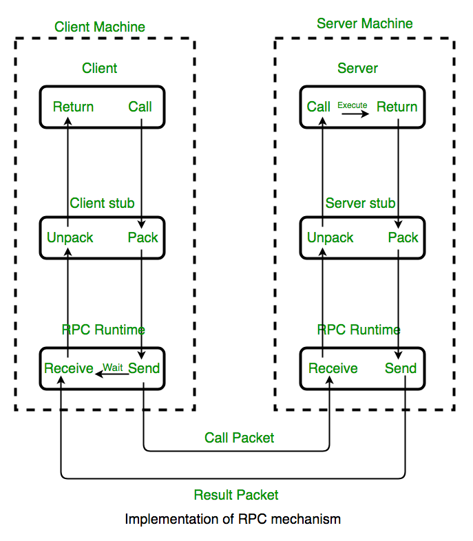
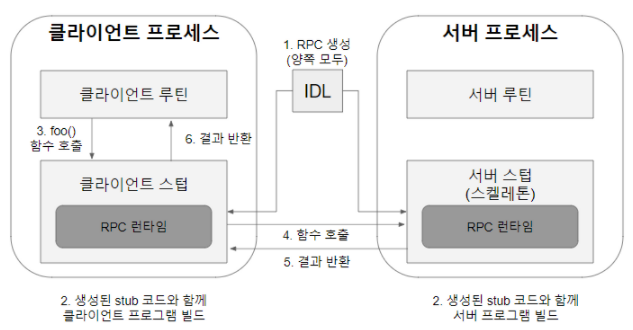
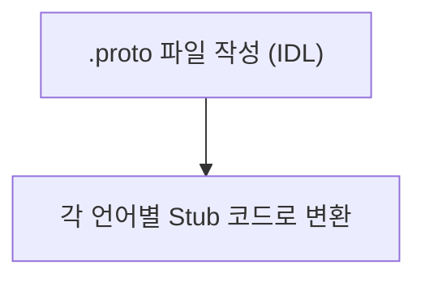

# Remote Procedure Call (RPC)

`MSA`구조의 서비스를 개발하라 때 `RPC`가 꼭 언급된다. `RPC`에 대해 알아보자.

## 개념

프로세스간 소통(Inter Process Communication)의 한 형태로 **다른 주소공간에 있는 함수나 프로시저를 호출**할 수 있는 통신방식을 의미한다.

즉, 일반적으로 **자신의 주소공간에서만 함수를 호출하여 실행 가능**한 프로세스의 단점을 보완한 셈이다. 
실행 프로그램이 존재하는 위치가 로컬이든 원격이든 상관없이 동일한 기능을 수행할 수 있다.

### 함수와 프로시저의 차이

#### 함수

Input에 따른 Output의 발생이 주 목적이다. 즉 Return값을 가져야하며 Client측에서 처리되기에 간단한 연산 등을 도출할 때 사용한다.

#### 프로시저

Output값 자체에 집중하기보단, **명령 단위가 수행하는 절차**에 집중한 개념이다. 따라서 Return이 있을수도 없을수도 있으며, Server측에서 처리되기에 함수보다 큰 단위의 실행, 프로세싱등에 활용된다. 

| 구분          | 함수(Function)                          | 프로시저(Procedure)                   |
|---------------|----------------------------------------|---------------------------------------|
| **목적**      | 입력→출력 변환                         | 특정 작업 절차 수행                   |
| **반환값**    | 필수적                                 | 선택적                                |
| **실행 위치** | 주로 클라이언트 측                     | 주로 서버 측                         |

## RPC 그래서 왜쓰나요?

우린 일반적으로 `Client to Server`구조를 활용했다. 서버를 키고, 클라이언트가 요청하면 서버는 이에 관련된 응답을 하고 ..

하지만 현재 유행하는 `MSA`구조로 서비스를 개발하다보면 다양한 언어와 프레임워크로 개발되는 경우가 잦다.
이와 같은 경우엔 프로토콜을 맞춰 통신해야하는 비용이 발생하는데, `RPC`를 활용하여 `Go`, `Java`, `JavaScript` 등 다양한 언어로 작성된 마이크로서비스들을 연결하여, 원격에 있는 프로시저를 호출하여 비즈니스 로직에 집중하는 개발을 할 수 있기 때문이다.

즉, 분산 컴퓨팅 환경인 `MSA`에서 프로세스간 상호 통신, 효율적 자원 사용에 `RPC`가 큰 장점을 가지고 있기 때문에 사용한다.

### 라이브러리와 무슨 차이가 있을까?

사실 라이브러리 또한 외부 모듈이기에 동일한 것 아닌가? 라는 생각을 할 수 있다.

하지만 라이브러리의 경우 결국 내부로 설치해서 사용한다. `python`의 `requirements.txt`, `JavaScript`, `TypeScript`의 `package.json`을 보면 알 수 있다.

즉, 결국 외부 통신이 아닌 셈이다. `RPC`는 내부에 설치하는 과정 없는 외부통신이기에 필연적으로 네트워크 통신이 사용된다.

## RPC의 메커니즘

여기서 `stub`은 통역이라고 생각하면된다. 예를 들어 `Java`로 개발된 서비스에서 `Go`로 개발된 서비스에 요청을 할 때, `stub`이 언어의 차이를 해결하고 함수를 가져온다고 생각하면 된다.

`RPC`가 진행되는 과정은 다음과 같다.

1. Client가 로컬 프로시저를 호출하듯 Client stub을 호출한다.
2. Client Stub이 파라미터를 네트워크 메시지로 만들어 서버로 보낸다. (Marshalling)
3. Server Stub이 메시지를 받아 실제 프로시저 호출 형태로 변환한다. (UnMarshalling)
4. 서버에서 프로시저를 실행하고 결과를 Server Stub에게 반환하고, 이를 네트워크 메시지로 만들어 Client Stub에 전송한다.
5. Client Stub이 결과값을 클라이언트 프로그램에 반환한다.

## RPC 동작과정

### IDL 작성

우선 개발을 진행할 때 표준을 정해야한다. 다국적 기업이 영어로 매뉴얼을 작성하는 것 처럼 `.proto`파일을 작성하여 IDL 인터페이스를 정의해야한다. 즉, 언어 중립적인 방법으로 인터페이스를 표현하는 것이다.

RPC 프레임워크로 `gRPC`, `Apache Thrift`등이 있는데, 각 프레임워크별 문법이 다르니 이에 맞게 작성한다.

작성된 IDL코드로 각 서비스에 적합한 언어의 Stub 코드로 변환하고 이를 포함하여 빌드하도록 한다.

### 호출 과정

클라이언트 측의 입장에서 생각할 때, 자신의 프로세스 주소공간의 함수를 호출하는 것 처럼 보일것이다.

하지만 실제론 클라이언트의 stub에 정의된 함수를 호출하는 것이다.

위의 사진처럼 stub에서 실행된 함수가 데이터타입을 XDR(External Data Representation) 형식으로 변환하여 RPC 호출을 진행한다.

이후 서버는 수신된 함수/프로시저 호출에 대한 처리를 서버측 Stub에서 마무리하고 결과값을 XDR로 변환하여 다시 클라이언트 측으로 넘긴다.

## 참고

[코딩하는 주노 티스토리](https://co-no.tistory.com/entry/%ED%86%B5%EC%8B%A0-RPCRemote-Procedure-Call%EC%9D%98-%EA%B0%9C%EB%85%90-%EB%B0%8F-%ED%8A%B9%EC%A7%95)