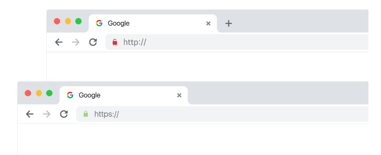
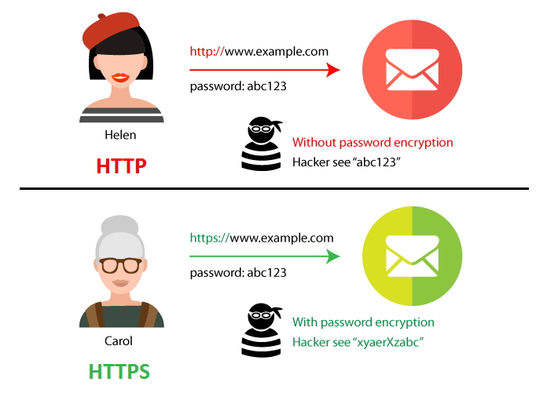
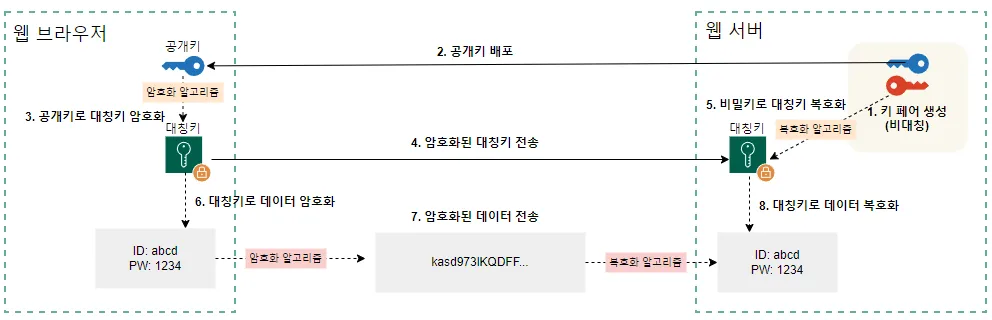
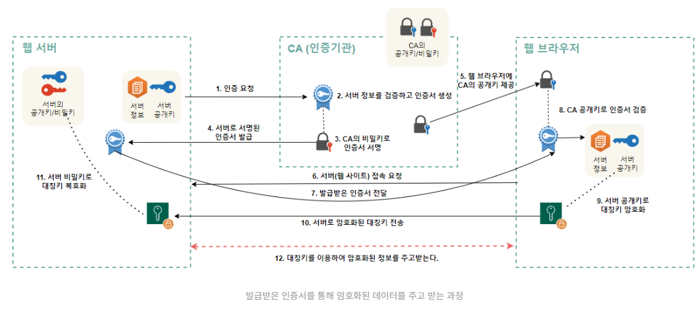

# HTTP,HTTPS

### 목차

1. 프로토콜
2. TCP/IP모델, OSI 7계층
3. HTTP, HTTPS
4. **SSL/TLS (보안 프로토콜)**
5. 면

## **1. 프로토콜(Protocol)**

### **📌 프로토콜이란?**

- **컴퓨터, 서버, 네트워크 장치 간에 데이터를 주고받는 "통신 규칙(약속)"**
- 프로토콜이 없으면 서로 다른 시스템(윈도우, 맥, 리눅스 등)이 데이터를 이해할 수 없음
- 네트워크에서 장치들이 공통된 방식으로 데이터를 주고받기 위해 필수적

✔ **쉽게 비유하면?**

> 사람이 대화할 때 같은 언어(한국어, 영어)를 사용해야 하는 것처럼,
> 
> 
> 컴퓨터끼리도 같은 "프로토콜"을 사용해야 통신이 가능함
> 

---

## **2. TCP/IP 모델과 OSI 7계층**

네트워크에서 데이터를 주고받을 때 사용되는 **TCP/IP 모델과 OSI 모델**

---

### **🔗 TCP/IP 모델**

> TCP/IP(Transmission Control Protocol / Internet Protocol)는 인터넷에서 데이터를 주고받기 위한 핵심 프로토콜 체계
> 

✅ **TCP/IP는 4계층 구조**로 되어 있음

✅ 인터넷에서 사용되는 거의 모든 프로토콜이 TCP/IP 기반

| 계층 | 역할 | 예제 프로토콜 |
| --- | --- | --- |
| **1. 네트워크 액세스 계층** | 물리적 연결 관리 (Wi-Fi, LAN 등) | Ethernet, Wi-Fi |
| **2. 인터넷 계층** | IP 주소를 이용해 데이터 전달 | IP, ICMP, ARP |
| **3. 전송 계층** | 데이터의 신뢰성 보장 (TCP), 빠른 전송(UDP) | TCP, UDP |
| **4. 응용 계층** | 사용자와 직접 연결되는 프로토콜 | HTTP, HTTPS, FTP, SMTP, DNS |

---

### **📌 OSI 7계층 모델**

> OSI(Open Systems Interconnection) 모델은 네트워크 통신을 설명하는 개념적 모델 (실제 사용보다는 이해를 위한 모델)
> 

✅ **TCP/IP보다 세분화된 7계층 구조**

✅ 각 계층에서 특정한 역할을 수행하며 데이터를 전송

| 계층 | 역할 | 예제 프로토콜 |
| --- | --- | --- |
| **7. 애플리케이션 계층** | 사용자와 직접 연결 | HTTP, HTTPS, FTP |
| **6. 표현 계층** | 데이터 암호화 및 압축 | SSL/TLS, JPEG, PNG |
| **5. 세션 계층** | 연결 유지 및 종료 | NetBIOS, RPC |
| **4. 전송 계층** | 신뢰성 있는 데이터 전송 | TCP, UDP |
| **3. 네트워크 계층** | 데이터 경로 설정 (IP 주소 사용) | IP, ICMP, ARP |
| **2. 데이터 링크 계층** | MAC 주소 기반 통신 | Ethernet, Wi-Fi |
| **1. 물리 계층** | 물리적 신호 전송 | RJ-45, 광섬유 |

✔ **HTTP/HTTPS → OSI 7계층 "애플리케이션 계층(7계층)"**

✔ **SSL/TLS → OSI 7계층 "표현 계층(6계층)"에서 동작**

---

## **3. HTTP와 HTTPS**

### **📌 HTTP (HyperText Transfer Protocol)**

> 웹 브라우저와 서버가 데이터를 주고받을 때 사용하는 프로토콜
> 

✔ 데이터를 **암호화하지 않고 평문(Plain Text)으로 전송**

✔ 해커가 데이터를 쉽게 가로챌 수 있어 **보안 취약점**이 있음

✔ 기본 포트: **80번** 사용

---

### **📌 HTTPS (HyperText Transfer Protocol Secure)**

> HTTP에 SSL/TLS 보안 계층이 추가된 프로토콜 (HTTP + 보안)
> 

✔ **데이터 암호화 (Encryption)** → **SSL/TLS 사용**

- 중간 공격자가 데이터를 읽거나 수정하는 것을 방지

✔ **데이터 무결성 보장** (데이터가 변조되지 않도록 보호)

✔ **서버 신원 확인** (웹사이트가 신뢰할 수 있는지 보장)

✔ 기본 포트: **443번** 사용

---

### **📌 HTTP vs HTTPS 차이점 정리**

| 차이점 | HTTP | HTTPS |
| --- | --- | --- |
| **보안** | 암호화 없음 (해킹 위험) | SSL/TLS 암호화 |
| **데이터 무결성** | 데이터 변경 가능성 있음 | 데이터 변조 방지 |
| **서버 신원 확인** | 없음 | 인증서를 통해 신뢰성 검증 |
| **포트 번호** | 80 | 443 |
| **검색 엔진 순위(SEO)** | 낮음 | HTTPS 사용 시 우선순위 상승 |

🚀 **HTTPS는 웹사이트 보안과 신뢰성을 위해 "필수"**

---

### **📌 암호화 방식**

- SSL 인증서의 동작 원리를 이해하기 위해선 암호화 방식을 이해해야함

1️⃣ 대칭키 방식

- 암호화와 복호호에 같은 키(대칭키)를 사용하는 방식
- 장점
    - 연산속도가 빠르다
- 단점
    - 양측의 키가 같기 떄문에 키를 안전하게 교환해야 한다는 단점이 있다.
- 키 관리 또한 어려울 수 있음

2️⃣ 비대칭키 방식

- 암호화와 복호화에 서로 다른 두 개의 키를 사용하는 방식
- 이 두 키를 공개키와 개인키라고 하며 한쌍으로 존재함
- 공개키는 누구에게나 공개가 가능 / 개인키는 한쪽에서만 사용
- 공개키로 암호화된 데이터는 해당 개인키로만 복호화할 수 있음
- 장점
    - 키 교환 문제를 해결함
        - 대표적 예 RSA
- 단점
    - 대칭키 암호화에 비해 연산 속도가 느림

3️⃣ 하이브리드 방식

- 대칭키 암호화 장점 + 비대칭키 암호화 장점
- 데이터 자체는 대칭키를 사용해서 암호화 / 그 대칭키를 비대칭키를 사용해서 암호화
- 장점
    - 대칭키 암호화의 빠른 속도
    - 비대칭키 암호화의 안전한 키 교환
- 대부분 보안 시스템과 통신 프로토콜은 하이브리드 암호화 방식을 사용

1. 서버는 공개키/개인키 키페어 생성
2. 서버는 공개키를 클라이언트에게 배포
3. 클라이언트는 랜덤한 대칭키 생성
4. 클라이언트는 공개키로 대칭키를 암호화 후 서버로 전송
5. 서버는 개인키로 암호화된 대칭키를 복호화
6. 클라이언트와 서버는 공유된 대치키를 사용해 데이터를 암호화 및 복호화

# **4. SSL/TLS (보안 프로토콜)**

### **📌 SSL(Secure Sockets Layer)/TLS(Transport Layer Security)란?**

> 인터넷 상에서 데이터를 안전하게 암호화하여 전송하는 보안 프로토콜
> 

✔ **SSL은 더 이상 사용되지 않고, TLS 1.2, TLS 1.3이 표준**

✔ TLS는 SSL의 취약성을 해결한 업그레이드 된 SSL

✔ HTTPS에서 데이터를 보호하기 위해 사용됨

✔ **SSL/TLS는 OSI 모델의 "표현 계층(6계층)"에서 작동**

#### 📜 SSL/TLS 인증서란?

> 공인된 기관CA(Certificate authority)에서 서버가 믿을 수 있는 보증하는 SSL/TLS 보증서를 발급
> 

✔SSL/TLS 인증서가 필요한 이유: 👤 **서버의 신원 확인**

- SSL/TLS 프로토콜을 사용하면 통신 내용을 암호화하기 때문에 안전한다.
- 하지만 악성 서버가 다른 서버인 척해서 개인 정보를 입력하게 만들게하면 어쩔수 없이 정보가 뺏김
    
    그렇기 때문에 SSL/TLS 인증서를 통해서 서버의 신원을 확인
    

하지만 악성 서버가 다른 서버인 척해서 개인 정보를 입력하게 만들게하면 어쩔수 없이 정보가 뺏긴다.

그렇기 때문에 SSL/TLS 인증서를 통해서 서버의 신원을 확인한다.

---

### **📌 SSL/TLS 동작 과정**

1. (서버) 공개키와 비밀키 생성
2. (서버 > CA) 서버는 인증서 발급을 위해 CA에게 정보를 제공 
    1. 서버의 공개키
    2. 서버의 각종 정보
3. (CA) 1번에서 서버로 받은 정보를 담아 SSL 인증서 발급
4. 인증서를 서명하기 위해 CA의 공개키와 비밀키 생성 후 비밀키로 인증서 서명
5. (CA> 서버) 서명된 SSL인증서를 서버에 전달
6. 웹 브라우저에 CA 공개키 제공
    - CA의 공개키를 이용해 서명을 복호화하여 이 값이 서버 공개키를 해시한 값과 비교하여 인증서가 위조되지 않았음을 검증
7. 웹 브라우저(클라이언트)가 서버로 연결을 시도
8. 서버는 Certificate 패킷을 통해 서버의 SSL인증서를 전달
9. 클라이언트는 서버의 SSL인증서를 검증
    - CA의 공개키를 이용해 서명을 복호화.
    - 복호화하여 나온 해시값과 공개키를 해시한 값이 일치한다면 검증 완료
10. 데이터를 암호화하기 위한 대칭키를 생성하고, 서버의 공개키로 대칭키를 암호화
11. 서버로 암호화된 대칭키 전달
12. 서버는 비밀키로 복호화하여 대칭키 얻음
13. **서버와 클라이언트는 대칭키를 통해 안전한 통신**

---

# 5. 면접 질문

### **HTTP와 HTTPS의 차이점은 무엇인가요?**

- HTTP(HyperText Transfer Protocol)와 HTTPS(HyperText Transfer Protocol Secure)는 인터넷 상에서 정보를 주고받는 데 사용되는 프로토콜입니다.
- HTTPS의 S는 Secure로 이 둘의 가장 큰 차이점은 보안입니다. HTTP는 암호화되지 않은 텍스트 데이터를 전송하며, 중간자 공격이나 데이터 도난, 변조 등의 보안 이슈가 발생할 수 있습니다. 반면 HTTPS는 HTTP의 보안 버전으로, SSL(Secure Socket Layer) 또는 TLS(Transport Layer Security) 프로토콜을 사용하여 데이터를 암호화하고 인증하는 과정을 거칩니다. 이를 통해 중간에 제3자가 데이터를 가로채어도 정보를 해독하기 어렵고, 데이터의 무결성을 보장할 수 있습니다.
- 따라서 HTTPS는 보안이 중요한 정보를 주고받아야 하는 경우에 사용하는 것이 좋습니다. 예를 들어, 인터넷뱅킹, 온라인 결제, 로그인 등의 경우에는 HTTPS를 사용하여 데이터를 보호하는 것이 일반적입니다. 또한, 최**근에는 구글 등 검색 엔진에서 HTTPS를 사용하는 사이트를 우선순위로 검색 결과에 노출하는 등 HTTPS 사용이 검색 엔진 최적화에도 중요한 역할**을 하고 있습니다.
    - SEO(Search Engine Optimization)
- 마지막으로 HTTP에서는 80번 포트를 사용하고 HTTPS에서 사용되는 포트 번호는 443입니다. 하지만 HTTPS는 암호화된 통신을 위해 SSL/TLS 프로토콜을 사용하기 때문에 SSL/TLS 프로토콜이 사용하는 포트 번호도 참고할 수 있습니다. SSL/TLS 프로토콜은 주로 443번 포트를 사용하지만 다른 포트도 사용할 수 있습니다.

### **HTTPS에서 사용되는 SSL/TLS는 무엇인가요?**

- SSL은 보안 소켓 계층(Secure Sockets Layer) 인증서로 불리며, 브라우저(사용자의 컴퓨터)와 서버(웹사이트) 사이에 전송되는 데이터를 암호화하여 인터넷 연결을 보호하기 위한 표준 기술로 해커가 개인 데이터나 금융 데이터 등의 전송되는 정보를 보거나 훔치는 것을 방지합니다.
- TLS (Transport Layer Security)는 HTTPS에서 사용되는 보안 프로토콜입니다. SSL은 최초로 개발되었으며, 이후 TLS로 대체되었습니다.
- 둘다 클라이언트와 서버 간 통신을 암호화하고, 인증 및 무결성 검사를 수행하여 보안성을 제공합니다. 이를 통해 중간자 공격 및 데이터 변조를 방지할 수 있습니다.
- SSL 및 TLS는 대부분의 웹 브라우저와 웹 서버에서 지원되며, SSL 3.0, TLS 1.0, TLS 1.1, TLS 1.2, TLS 1.3 등 다양한 버전이 있고 결제 페이지, 로그인 패널 및 양식, 블로그 및 정보 사이트 등 모든 유형의 정보를 보호할 수 있습니다. 웹사이트가 SSL/TLS 인증서로 보호되는 경우 HTTPS가 URL에 표시됩니다. 사용자는 브라우저 표시줄의 자물쇠 기호를 클릭해 발급 기관 및 웹사이트 소유자의 상호를 포함한 인증서의 세부 정보를 볼 수 있습니다.

### **HTTPS 동작 과정에 대해서**

1. 클라이언트(웹 브라우저)가 서버에 접속하고 SSL/TLS 연결을 시작합니다. 이를 위해 서버는 클라이언트에게 SSL 인증서를 제공합니다.
2. 클라이언트는 서버가 제공한 인증서를 검증합니다. 인증서가 신뢰할 수 있는 곳에서 발급되었는지, 인증서의 만료일자가 지나지 않았는지 등을 확인합니다.
3. 클라이언트는 SSL/TLS 연결을 위해 랜덤한 대칭키를 생성합니다. 이 대칭키는 데이터 암호화및 복호화에 사용됩니다.
4. 클라이언트는 서버에게 대칭키를 전송하기 위해 공개키 암호화 방식을 사용합니다. 이 때 서버는 자신의 개인키를 사용하여 대칭키를 복호화합니다.
5. 이후 서버와 클라이언트는 대칭키를 사용하여 데이터를 암호화하고 전송합니다.

### **HTTPS에서 사용되는 대칭키와 공개키 암호화 방식에 대해 설명해주세요.**

- HTTPS에서는 대칭키와 공개키 암호화 방식을 모두 사용합니다.
- 먼저, 대칭키 암호화 방식은 서버와 클라이언트가 암호화와 복호화에 같은 비밀키를 사용하는 방식입니다.
    - 이는 데이터 전송 속도가 빠르고 간단한 암호화 방식이지만, 비밀키가 노출될 경우 보안성이 크게 떨어지게 됩니다.
- 따라서 HTTPS에서는 대칭키 암호화 방식을 사용하여 데이터를 암호화하고, 이 대칭키를 전달하는 과정에서 공개키 암호화 방식을 사용합니다.
- 공개키 암호화 방식은 서버와 클라이언트가 각각 다른 비밀키를 가지고 있는 방식입니다. 서버는 공개키를 클라이언트에게 제공하고, 클라이언트는 이 공개키를 이용하여 대칭키를 암호화하여 서버에 전달합니다. 서버는 이 암호화된 대칭키를 자신의 개인키로 복호화하여 대칭키를 얻어내고, 이 대칭키를 사용하여 데이터를 암호화합니다.
- 이 과정에서 중간에 도청자가 끼어들더라도, 공개키로 암호화된 대칭키를 해독할 수 없기 때문에 데이터의 기밀성이 보장됩니다. 또한, 서버 측의 개인키는 서버 외부에서 알 수 없도록 보안적으로 관리되기 때문에 데이터의 무결성과 인증성이 보장됩니다.

### **HTTPS를 구현하는 방법에 대해서**

1. SSL/TLS 인증서 발급HTTPS를 구현하기 위해서는 SSL/TLS 인증서를 발급받아야 합니다. SSL/TLS 인증서는 인증 기관(Certificate Authority)에서 발급해주며, 발급 받은 인증서에는 서버의 정보와 공개키가 포함됩니다.
2. 웹 서버 구성웹 서버에서 HTTPS를 사용하도록 설정해야 합니다. 이를 위해 웹 서버에서 SSL/TLS 프로토콜을 지원하도록 설정하고, 발급받은 SSL/TLS 인증서와 서버의 개인키를 등록해야 합니다.
3. 클라이언트와의 통신클라이언트와의 통신 과정에서는 SSL/TLS 프로토콜을 사용하여 암호화된 통신을 진행합니다. 클라이언트는 서버와 연결을 시도할 때 SSL/TLS 핸드셰이크 과정을 거칩니다. 이 과정에서 서버는 발급받은 인증서를 클라이언트에게 제공하고, 클라이언트는 인증서의 정보를 확인한 후, 서버의 공개키를 사용하여 세션 키를 생성합니다.
4. 암호화 통신클라이언트와 서버는 이후 생성된 세션 키를 사용하여 암호화된 통신을 진행합니다. 이 과정에서 클라이언트와 서버는 서로의 신원을 확인하고, 데이터를 암호화하여 안전하게 전송합니다.

### **HTTPS를 사용하면서 발생할 수 있는 성능 이슈에 대해서**

1. 암호화/복호화 작업 : HTTPS는 암호화를 사용하여 통신을 보호합니다. 암호화 및 복호화 작업은 CPU를 많이 사용하므로, 작업량이 많아질수록 서버의 성능에 영향을 줄 수 있습니다.
2. 핸드쉐이크 오버헤드 : HTTPS 연결을 설정하는 과정에서 핸드쉐이크라는 절차를 거치게 됩니다. 이 과정에서 전송되는 데이터양이 많기 때문에, 핸드쉐이크 오버헤드가 발생할 수 있습니다.
3. 캐시 불가능 : HTTPS에서는 캐시가 불가능합니다. 왜냐하면, 캐시된 데이터가 변조될 가능성이 있기 때문입니다. 따라서, 매번 요청할 때마다 서버에서 새로운 데이터를 가져와야 하므로 성능에 영향을 줄 수 있습니다.
4. CDN 사용에 제약 : HTTPS 연결을 설정할 때, 도메인 이름이 반드시 일치해야 합니다. 따라서, CDN을 사용하는 경우 도메인 이름이 변경되므로 HTTPS를 사용하기 어렵습니다. 이러한 경우에는 CDN에서 HTTPS를 지원하도록 설정해야 합니다.
    
    이러한 성능 이슈를 해결하기 위해, 하드웨어 가속 기술을 사용하거나, 암호화 알고리즘을 최적화하는 등의 방법을 사용할 수 있습니다.
    

### 위의 성능 이슈를 해결하는 방법

- 앞의 두 가지는 HTTPS의 성능 이슈를 해결하고 동시에 보안성 문제를 높이지 않는 방법이고 뒤의 세 가지는 HTTPS에서 적용이 가능하나 보안성 문제와 관련된 취약점이 존재할 수 있어 충분한 보안 검사가 필요합니다.
    1. 하드웨어 가속 기술(Hardware Acceleration): HTTPS의 성능 이슈 중에서 가장 대표적인 것은 암호화/복호화 과정에서 발생하는 부하입니다. 이러한 부하를 해결하기 위해 하드웨어 가속 기술을 사용합니다. 하드웨어 가속 기술은 SSL/TLS 암호화/복호화 과정을 CPU 대신 별도의 하드웨어 장치에서 처리함으로써 처리 속도를 향상시킵니다.
    2. 암호화 알고리즘 최적화: HTTPS에서 사용되는 대표적인 암호화 알고리즘으로는 AES, RSA, SHA 등이 있습니다. 이러한 알고리즘들은 성능 향상을 위해 최적화될 수 있습니다. 예를 들어, RSA 알고리즘은 키의 크기에 따라 처리 속도가 크게 달라질 수 있기 때문에 키 크기를 최소화하는 것이 좋습니다.
    3. 캐시: HTTPS의 경우 매번 인증서를 다운로드해야 하기 때문에 초기 연결 시간이 길어질 수 있습니다. 이를 해결하기 위해서는 캐시를 이용해야 합니다. 캐시를 이용하면 인증서를 다운로드하지 않고 기존에 다운로드한 인증서를 사용함으로써 연결 시간을 단축시킬 수 있습니다.
    4. 세션 재사용: HTTPS는 기본적으로 연결마다 새로운 세션을 생성합니다. 이러한 세션 생성 과정은 처리 시간이 오래 걸립니다. 따라서 HTTPS에서는 기존에 생성된 세션을 재사용하는 방법을 이용해 성능을 개선할 수 있습니다.
    5. CDN(Content Delivery Network): HTTPS에서 가장 큰 성능 이슈 중 하나는 지리적으로 떨어진 클라이언트와 서버 간의 지연 시간입니다. 이를 해결하기 위해 CDN(Content Delivery Network)을 이용합니다. CDN은 전 세계에 분산된 캐시 서버를 이용하여 클라이언트와 가까운 서버에서 콘텐츠를 제공함으로써 지연 시간을 최소화합니다.
        
        앞의 두 가지는 HTTPS의 성능 이슈를 해결하고 동시에 보안성 문제를 높이지 않는 방법이고 뒤의 세 가지는 HTTPS에서 적용이 가능하나 보안성 문제와 관련된 취약점이 존재할 수 있어 충분한 보안 검사가 필요합니다.
        

### HTTPS를 운영하는 서버 측에서 주의해야 할 보안상의 이슈에 대해서

1. 인증서 유효성 검증: HTTPS를 사용하면 서버는 클라이언트에게 인증서를 제공하여 신뢰성을 보장합니다. 따라서 서버 측에서는 인증서의 유효성을 검증하여 위조된 인증서를 사용한 공격을 방지해야 합니다.
2. 암호화 강도: HTTPS는 암호화된 통신을 제공하여 데이터의 안정성을 보장합니다. 그러나 암호화 알고리즘의 강도에 따라 보안 수준이 달라질 수 있습니다. 서버 측에서는 보안 수준이 높은 암호화 알고리즘을 사용하여 공격에 대한 대비가 필요합니다.
3. 취약한 SSL/TLS 버전 사용: 오래된 SSL/TLS 버전은 보안 취약점이 존재하여 공격자가 중간자 공격을 수행할 수 있습니다. 따라서 서버 측에서는 최신 버전의 SSL/TLS 프로토콜을 사용하여 보안 취약점을 방지해야 합니다.
4. HTTPS 트래픽 감시: HTTPS 통신은 암호화되어 있기 때문에 보안 검사나 감시가 어렵습니다. 하지만 일부 악성코드는 HTTPS 트래픽을 통해 악성코드를 전파하거나 민감한 정보를 수집하는 등의 공격을 수행합니다. 따라서 서버 측에서는 HTTPS 트래픽을 감시하고 이상한 패턴을 탐지할 수 있는 시스템을 구축해야 합니다.

### **HTTP 프로토콜에 대해 설명해주세요**

**H**TTP(Hyper Text Transfer Protocol)이란 데이터를 주고 받기 위한 프로토콜이며, 서버/클라이언트 모델을 따릅니다.
HTTP는 상태 정보를 저장하지 않는 Stateless의 특징과 클라이언트의 요청에 맞는 응답을 보낸 후 연결을 끊는 Connectionless의 특징을 가지고 있습니다.

- 장점
    - 통신간의 연결 상태 처리나 상태 정보를 관리할 필요가 없어 서버 디자인이 간단하다.
    - 각각의 HTTP 요청에 독립적으로 응답만 보내주면 OK
- 단점
    - 이전 통신의 정보를 모르기 때문에 매번 인증을 해줘야 한다.
    - 이를 해결하기 위해 쿠키(cookie)나 세션(session)을 사용해서 데이터를 처리한다.

### **HTTP 요청 헤더에 있는 필드를 아는 대로 말씀해주세요.**

- HTTP 요청 헤더에는 제일 위쪽 URL경로, HTTP 메서드, HTTP 버전을 포함한 한 줄이 있고, 그 아래에는 key-value 형태로 host, user-agent, accept-language, accept-encoding, content-type 등이 포함됩니다.

### **HTTP 응답 헤더에 있는 필드를 아는 대로 말씀해주세요.**

- HTTP 응답 헤더에는 제일 위쪽 HTTP 버전, 상태코드, 상태메시지를 포함한 한 줄이 있고, 그 아래에는 key-value 형태로 set-cookie, last-modified, e-tag, date 등이 포함됩니다.

### **HTTP 메서드 중 GET과 POST에 대해 설명해주세요.**

- HTTP 메서드는 웹 상에서 데이터를 어떻게 전달할지에 대한 규정입니다.
- **GET은 URL 경로에 데이터를 담아 전달하기 때문에 데이터가 드러나고 캐싱될 수 있습니다. 따라서 보안에 취약하다는 단점을 가지고 있습니다.**
- **이에 반해 POST는 HTTP 바디에 데이터를 담아 전달하기 때문에, 보안성이 좋으며 로그인 정보와 같은 중요한 데이터는 POST 메서드를 이용해야 합니다.**

### **HTTP 상태 코드에서 500번은 서버와 클라이언트 중 어떤 쪽 에러인가요?**

- 500번대는 서버 측 에러입니다. 200번은 성공한 상태를, 300번은 추가적인 작업이 필요한 상태를, 400번은 클라이언트 측 에러 상태를, 500번대는 서버 측 에러 상태를 의미합니다.

### **HTTPS 동작 방식에 대해 말씀해주세요.**

- HTTPS는 우선 서버와 클라이언트 사이에 3-way handshake 과정을 거쳐 TCP 연결이 수립됩니다.
- 이후 ssl handshake 과정을 거치는데, 구체적으로 클라이언트가 서버에게 ssl 연결을 요청합니다.
- 서버는 공개키를 포함한 ssl 인증서를 클라이언트에게 전달하고, 클라이언트는 CA의 공개키로 인증서를 복호화해 서버의 공개키를 얻어냅니다.
- 클라이언트는 공개키를 이용해 생성한 대칭키를 암호화하여 서버로 전달합니다.
- 서버는 받은 데이터를 자신의 개인키로 복호화해 대칭키를 얻을 수 있습니다.
- 이로써 서버와 클라이언트는 공개키 암호화 방식으로 대칭키를 공유했으며, 이후부터는 대칭키를 이용해 데이터를 암호화 및 복호화하여 전달합니다.

### **HTTPS는 어떤 암호화 알고리즘을 사용하나요?**

- HTTPS는 대칭키를 공유하기 위해 공개키 암호화를 이용하며, 데이터를 공유하기 위해 대칭키 암호화를 이용합니다.
- SSL handshake 과정에서 제일 처음 클라이언트가 서버에게 ssl 연결을 요청할 때, 클라이언트는 자신의 컴퓨터가 사용할 수 있는 암호화 알고리즘을 리스팅하여 서버로 보냅니다.
- 서버는 리스트들 중에서 하나를 골라 공개키를 생성합니다. 따라서 특정 암호화 알고리즘을 사용하는 것이 아닌 사전에 클라이언트와 서버가 사용할 수 있는 알고리즘을 공유하고 합의합니다.