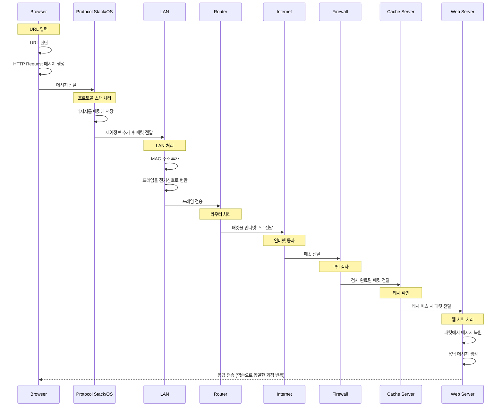
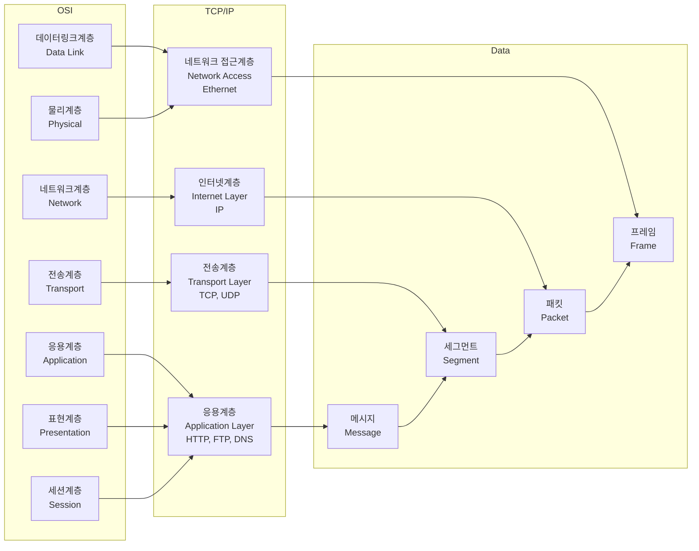

# 웹 통신 흐름

## 목차

> 1. 웹 통신 과정의 전체 과정
> 2. 수행하는 역할

## 웹 통신 과정 (전체과정)

우리가 서버에 요청을 보내고 응답을 받는 과정은 생각보다 많은 단계를 거쳐 진행된다. 우선 전체적인 그림을 먼저 보고 세부적으로 들어가보자.



생각보다 많은 부분이 관여됨을 알 수 있다. 이제 각각 어떤 역할을 수행하는지 알아보자.

## 웹 통신 과정 (세부정보)

### 브라우저

사용자는 웹서버에 브라우저를 통해 요청하게된다. 이 때 브라우저는 다음의 역할을 수행한다.

1. URL 판단
   - 프로토콜을 판단하고 (http? https?) 도메인 및 경로를 확인한다. 이 때 DNS 조회가 발생하며 도메인 IP 주소로 변환한다.
2. HTTP Request 메세지를 만들고 OS에 전달한다.
   - HTTP Request의 예시는 다음과 같다.
       ```http request
       GET /page HTTP/1.1
       Host: www.example.com
       User-Agent: Mozilla/5.0 (Windows NT 10.0; Win64; x64)
       Accept: text/html,application/xhtml+xml
       Accept-Language: ko-KR,ko;q=0.9,en-US;q=0.8
       Connection: keep-alive
       ```

### 프로토콜/OS

브라우저에서 온 메세지를 판단하는 역할을 진행한다. 세부적으론 다음의 과정을 진행한다.

1. 받은 메세지를 패킷속에 저장한다.
2. 수신처 주소 등 제어정보를 붙혀 LAN에 패킷을 전달한다.

#### 프로토콜이 뭐야?

쉽게말해 **통신규약**을 의미한다. 데이터를 주고 받을 때 따라야하는 규칙의 집합을 말한다.

웹 통신에 사용하는 HTTP, 신뢰성 있는 데이터 전송에 활용하는 TCP, 네트워크간 라우팅에 활용하는 IP, 도메인을 IP로 전환하는 DNS가 이에 해당한다.

##### 프로토콜 스택

프로토콜을 이해하기 위해선 프로토콜 스택이라는 개념을 이해할 필요가 있다.

프로토콜 스택은 네트워크 통신을 위한 계층화된 구조를 말한다. OSI 7계층과 실제 인터넷에서 사용하는 TCP/IP 4계층으로 나눌 수 있다.



| OSI 7계층 | TCP/IP 4계층 | 주요 프로토콜 | 역할 |
|---------|------------|------------|-----|
| 응용계층(7) | 응용계층 | HTTP, FTP, DNS, SMTP | 사용자와 가장 가까운 계층, 응용 프로그램들의 통신 처리 |
| 표현계층(6) | ↑ | SSL, TLS | 데이터 형식 변환, 암호화, 압축 |
| 세션계층(5) | ↑ | NetBIOS | 통신 세션 관리 |
| 전송계층(4) | 전송계층 | TCP, UDP | 신뢰성 있는 데이터 전송, 오류 검출 및 복구 |
| 네트워크계층(3) | 인터넷계층 | IP, ICMP, ARP | 패킷의 경로 설정(라우팅), 논리 주소(IP) 사용 |
| 데이터링크계층(2) | 네트워크 접근계층 | Ethernet | 물리적 주소(MAC) 사용, 프레임 단위 데이터 전송 |
| 물리계층(1) | ↑ | 케이블, 리피터, 허브 | 비트 단위 데이터 전송, 전기 신호 변환 |

| 계층 | 역할 | 주요 프로토콜 |
|-----|-----|------------|
| 응용계층 | 사용자와 가장 가까운 계층, 응용 프로그램 통신 처리 | HTTP, FTP, DNS |
| 전송계층 | 신뢰성 있는 데이터 전송, 오류 검출 및 복구 | TCP, UDP |
| 인터넷계층 | 패킷의 경로 설정(라우팅), 논리 주소(IP) 사용 | IP, ICMP, ARP |
| 네트워크 접근계층 | 물리적 주소(MAC) 사용, 프레임 단위 데이터 전송 | Ethernet |

#### 패킷이 뭐야?

패킷은 데이터를 전송하기 위한 작은 단위로 다음의 구조를 가진다.

    - Header에 제어정보(출발/도착 IP, 프로토콜 종류, 패킷 순서 번호)를 담는다.
    - Payload에 실제 전송할 데이터를 담는다.
    - Trailer에 오류 검출 코드를 담는다.

### LAN

OS로부터 받은 패킷을 가공한다. 세부 역할을 다음과 같다.

1. MAC주소를 패킷에 붙혀 프레임을 만든다.
2. 프레임을 전기신호로 변환하고 이를 송출한다.

#### 데이터 캡슐화 과정 설명

```mermaid
graph TD
    subgraph 캡슐화 과정
        A[응용 데이터] --> B[TCP 헤더 + 데이터]
        B --> C[IP 헤더 + TCP 헤더 + 데이터]
        C --> D[MAC 헤더 + IP 헤더 + TCP 헤더 + 데이터 + MAC 트레일러]
    end

    subgraph 계층별 데이터단위
        E[응용계층: 메시지]
        F[전송계층: 세그먼트]
        G[인터넷계층: 패킷]
        H[네트워크 접근계층: 프레임]
    end

    A --- E
    B --- F
    C --- G
    D --- H

    style A fill:#302,stroke:#333,stroke-width:4px
    style B fill:#000,stroke:#333,stroke-width:4px
    style C fill:#001,stroke:#333,stroke-width:4px
    style D fill:#004,stroke:#333,stroke-width:4px
```



#### MAC주소가 뭐임?

네트워크 인터페이스 카드 NIC의 고유 식별번호이다.

MAC주소는 `00:1A:2B:3C:4D:5E` 꼴로 구성되며 전세계적으로 중복되지 않는 고유번호를 가진다. 또한 변경이 불가능하도록 설계되어있다.

앞 6자는 제조사의 식별코드, 뒤의 6자는 제조사가 부여한 일련번호로 구성되어있다.

MAC주소 존재 이유는 다음과 같다.

1. IP주소는 네트워크 위치를 나타낸다. 근데, LAN내에선 더 직접적인 식별자가 필요하기에 MAC을 활용한다.
   - 스위치, 라우터가 정확한 장치로 정보를 전달하는 경우 사용
   - LAN 내부에서 장치들을 구별하기 위한 목적
2. 하드웨어 고유성 보장
   - 중복되지 않는 값으로 네트워크 장비의 신뢰성과 식별성을 보장한다.
3. IP & MAC의 보완적 관계
   - IP주소는 논리적 주소 (위치)를 의미하고 MAC주소는 물리적 주소 (장치)를 의미한다.
   - ARP(Adress Rresolution Protocol)을 통해 IP주소를 MAC 주소로 변환할 수 있다.
   - 이를 통해 효율적인 네트워크 통신이 가능하다.
4. 보안과 네트워크 관리
   - MAC 필터링으로 접근 제어가 가능하며 허가된 장치만 네트워크 접속을 허용할 수 있다.

##### 이해를 위한 예시

호텔 투숙객에게 물건을 전달하는 경우를 예시로 들 수 있다.

1. 누군가 "307호 손님에게 물건을 전달해주세요" (IP 주소로 통신 시도)
2. 호텔 직원이 "307호에는 주민번호 010101-1234567인 손님이 있네요" (ARP로 MAC 주소 확인)
3. 해당 주민번호를 가진 사람을 찾아 물건 전달 (MAC 주소로 최종 전달)

**IP는 위치를 찾는 용도이고, MAC은 최종적으로 정확한 대상을 식별하는 용도이다!**

### 라우터

LAN이 보낸 프레임은 허브를 경유하여 라우터에 도착한다. 라우터는 받은 프레임을 벗기고(MAC의 역할은 여기까지) 패킷을 프로바이더(통신사)에 전달한다. 이 과정을 통해 인터넷에 접근한다.

### 방화벽

라우터를 통해 인터넷을 통과한 패킷을 검사하는 역할을 수행한다.

### 캐시서버

방화벽으로부터 검사가 완료된 패킷을 전달받는다. 해당 정보를 바탕으로 이를 웹서버에 가야할지 판단한다.

### 웹서버

웹서버의 프로토콜 스택이 패킷으르 추출하여 메세지를 복원한다. 이 정보를 웹서버 애플리케이션에 전달한 이후 응답 메세지를 받고 클라이언트에게 전송한다.


