# MVC 패턴의 본질

1. **디자인 패턴은 `반복적으로 일어나는 문제를` 해결하기 위한 솔루션**
2. 4가지 요소를 가짐

### MVC는 어떤 반복적으로 일어나는 문제를 해결하려할까?

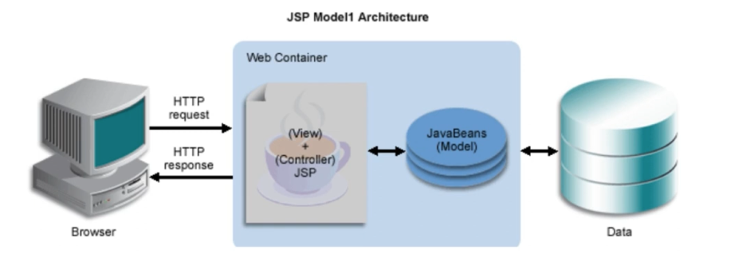

- 과거 JSP Model1시절에 View담당 코드와 Domain을 담당하는 코드가 하나의 클래스에 구현
- 그러다보니 백엔드 프론트엔드 구분이 없어 협업이 어려워지고 코드 길이가 길어지고 유지보수가 어려워짐

문제 1. 백엔드, 프론트엔드 구분이 없어 협업이 어려워짐

문제2. 코드 길이가 굉장히 길어짐

**문제3. `유지 보수`가 어려움**

### 그럼 이 문제를 어떻게 해결할까?

- 해법이 어떤 구체적인 설계나 구현을 설명하지는 않는다 - *Gof 디자인패턴책*

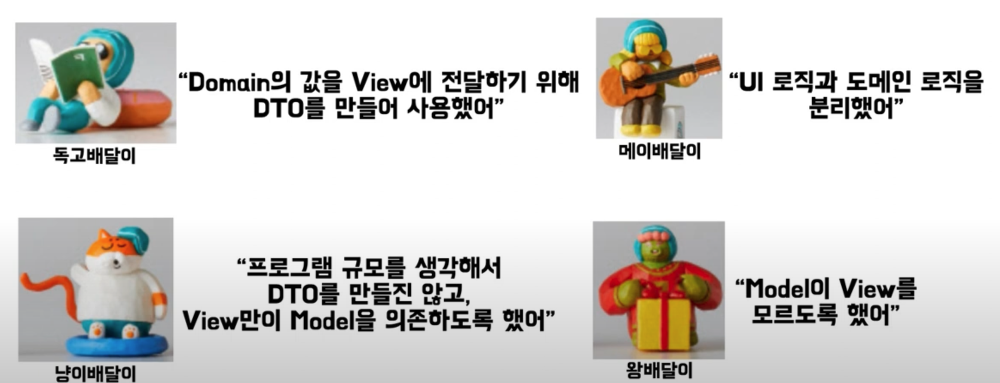

- 추상적인 개념만 나와있음 - mvc패턴을 이해하고 적용하는 방법이 각각 다름

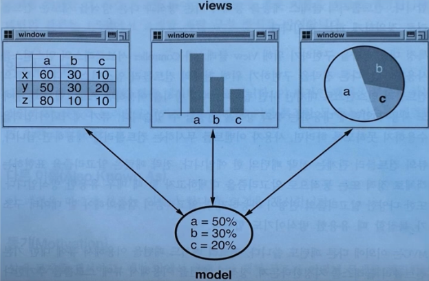

- 모델 == 핵심데이터 == Domain
- Views: 다양한 형태로 사용자에게 보여줄 수 있음(테이블, 막대, 원형)
    - 변경 가능성이 높음
- 이런 View와 Model이 하나의 파일에 존재한다면
    - 테이블이였다 요구사항 변경으로 원형이 되었다 막대기가 되었다
    - 이런 변경을 반영하기 위해 코드가 길고, 변경이 어려움

> MVC패턴은 효율적인 `유지 보수`를 위해 뷰와 도메인의 관심사를 분리하는 디자인 패턴
> 

> 정해진 규칙이나 구현 방법은 없다. 그러니, MVC 패턴에 대한 하나의 정답을 찾는것보다, 그 자체를 이해하는 것이 중요함
> 

---

## MVC 구조

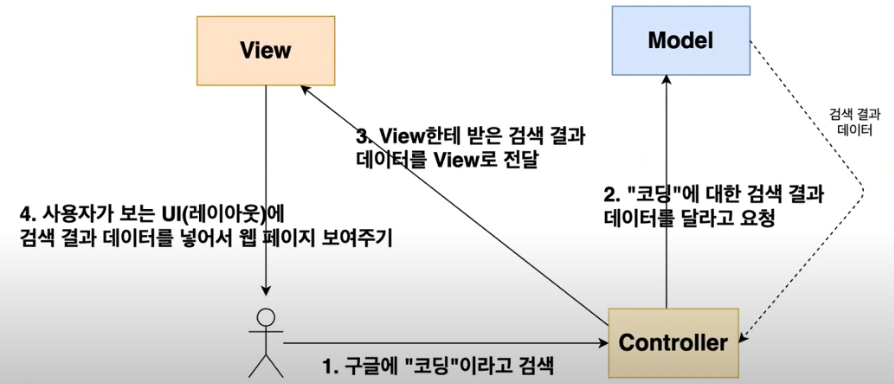

- 모델: 데이터와 관련된 일을 하는 곳
- 컨트롤러: 모델과 뷰의 중개자 역할
- 뷰: 사용자에게 보여지는 부분 담당

## MVC를 지키면서 코딩하는 방법

### 1. Model은 Controller와 View에 의존하지 않아야 함

- Model 내부에 Controller와 View에 관련된 코드가 있으면 안됨
- Model 클래스에서 Controller와 View 클래스를 import 금지

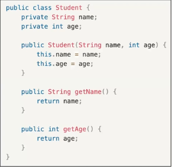

- 언제든 깔끔하고 정제된 데이터를 가져올 수 있게

### 2. View는 Model에만 의존해야하고, Controller에는 의존하면 안됨

- View 내부에 Model의 코드만 있을 수 있고 Controller의 코드가 있어선 안됨
- printProfile method에 파라미터로 student를 받음 - student:model
    
    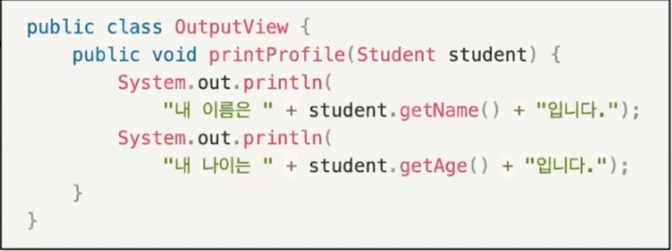
    

### 3. View가 Model로 부터 데이터를 받을 때는, 사용자마다 다르게 보여주어야 하는 데이터에 대해서만 받아야함

**예시**

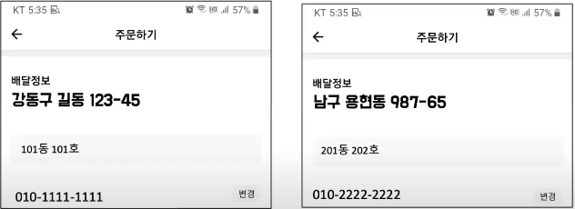

- 배달의 민족 주문하기
- 사용자에게 다르게 보여줘야하는 부분과 사용자에게 일관되게 보여줘야하는 부분이 있음
    - 배달 주소, 전화번호와 같은건 사용자 마다 다르게 보여줘야 하는 부분

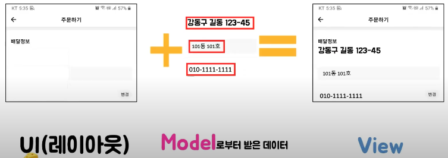

- View는 사용자에게 보이는 UI와 Model로 부터 받은 데이터가 합쳐져서 만들어진 화면
- 모든 사용자에게 다 똑같이 보여줘야 하는 화면(주문하기, 배달 정보) 이런 정보는 모델로 부터 받는 것이 아닌 뷰에 있어야 함

### 4. Controller는 Model과 View에 의존해도 된다.

- Controller내부에는 Model과 View코드가 있을 수 있다.
    
    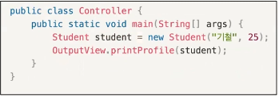
    
- 컨크롤러는 모델과 뷰 중개자 역할을 하면서 전체 로직을 구성하기 때문

### 5. View가 Model로부터 데이터를 받을 때, 반드시 Controller에서 받아야 한다.

- 위 그림을 보면,
- 모델인 Student클래스로부터 학생의 데이터를 만들어서 printProfile method한테 파라미터로 전달

---

## 실전 적용

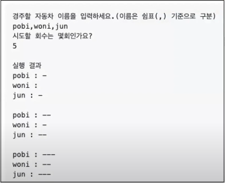

- 자동차 경주 코드를 예시로
- 자동차 이름을 작성하면 시도마다 각 자동차를 랜덤으로 이동시키는 게임
- ‘-’는 이동

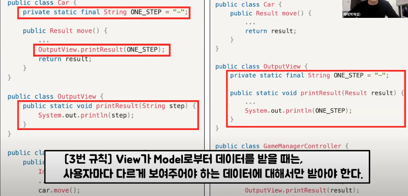

- 왼쪽은 mvc를 지키지 않은 코드, 오른쪽은 mvc를 지킨 코드
- 왼쪽의 outputview의 printResult메서드에 파라미터로 움직인 정도를 나타내는 -를 넘김
    - 자동차의 움직임의 정도를 나타내는 것은 모두가 동일함
        
        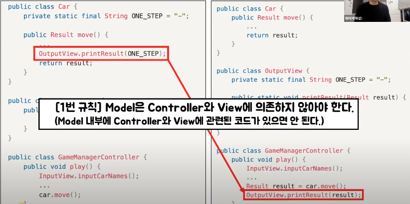
        
- 모델에 해당하는 car 클래스 내부에 뷰 관련된 코드인 outputview의 printResult가 있음

---

## MVC 패턴의 한계점

### 1️⃣ **Model과 View의 의존성 완전 분리 불가능**

- 기본적으로 MVC 패턴에서는 Model과 View가 직접 연결되지는 않지만, Controller가 데이터를 조작하고 View에 반영하는 과정에서 **암묵적인 결합**이 생길 수 있음
- 특히, 하나의 Controller가 여러 개의 Model과 View를 조작하게 되면 Controller의 코드가 복잡해지면서 Model과 View 사이의 간접적인 의존성이 증가
- 이는 유지보수성과 테스트 용이성을 저하

### 2️⃣ **Massive View Controller (MVC의 비대화 문제)**

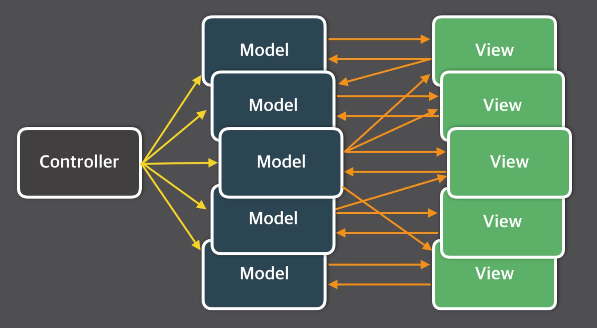

- 규모가 커지면 하나의 Controller가 너무 많은 Model과 View를 관리하게 되며, 이는 곧 **Fat Controller (비대형 컨트롤러) 문제**로 이어짐
- Fat Controller는 코드가 복잡해지고 재사용성이 떨어지며, 확장성이 저하됨
- 새로운 기능을 추가할 때 Controller의 수정이 많아지면 사이드 이펙트가 발생할 확률이 높아짐

### 3️⃣ **비즈니스 로직의 위치 불명확**

- MVC 패턴을 적용하다 보면 비즈니스 로직을 어디에 두어야 할지 애매해지는 경우가 많음
- Model에 비즈니스 로직을 넣으면 Model이 지나치게 커질 수 있고, 반대로 Controller에 넣으면 Controller가 너무 복잡해지는 문제가 발생함
- 이로 인해 MVC 패턴이 단순 CRUD 애플리케이션에서는 유용하지만, 복잡한 도메인 로직이 있는 프로젝트에서는 적절하지 않을 수 있음

---

## MVC 패턴을 보완하는 대안들

이러한 MVC 패턴의 한계를 극복하기 위해 등장한 대표적인 패턴들이 **MVVM, MVP, Flux, Redux**입니다.

### **1. MVVM (Model-View-ViewModel) 패턴**

- **핵심 아이디어**: ViewModel을 활용하여 View와 Model을 완전히 분리하고, 데이터 바인딩(Data Binding)을 활용하여 변경 사항을 자동으로 동기화합니다.
- **장점**:
    - **View와 Model의 의존성 제거** → 유지보수성 향상
    - **자동화된 UI 업데이트** (Data Binding)
    - **테스트 용이성 증가** (ViewModel을 단위 테스트 가능)
- **단점**:
    - **ViewModel의 설계가 복잡** → 유지보수 비용이 증가할 가능성
    - **데이터 바인딩이 많아지면 디버깅이 어려움**
- **사용 사례**:
    - Android 개발 (Jetpack의 ViewModel)
    - WPF, Xamarin 등의 UI 애플리케이션

### **2. MVP (Model-View-Presenter) 패턴**

- **핵심 아이디어**: Controller 대신 Presenter가 Model과 View를 완전히 분리하고, View는 Presenter를 통해서만 데이터를 요청/전달합니다.
- **장점**:
    - MVC보다 **더 철저한 View와 Model 분리**
    - UI 로직이 Presenter에 집중되어 있어 **테스트가 용이**
- **단점**:
    - **View와 Presenter의 강한 결합** → Presenter가 비대해질 수 있음
- **사용 사례**:
    - Android의 Activity, Fragment와 함께 활용
    - 레거시 프로젝트에서 MVC에서 전환할 때 유용

### 3. **Flux / Redux (단방향 데이터 흐름)**

- **핵심 아이디어**: 데이터의 흐름을 단방향(One-Way)으로 제한하여 복잡도를 줄이고, 상태를 명확하게 관리
- **장점**:
    - 애플리케이션 상태를 **중앙 집중식으로 관리**
    - 데이터 흐름이 단순하여 **디버깅과 유지보수가 쉬움**
- **단점**:
    - 초기 설계가 복잡하며, **학습 곡선이 있음**
    - 프로젝트 규모가 작으면 오히려 불필요한 복잡성 초래
- **사용 사례**:
    - React.js (Redux, Recoil, Zustand)
    - 대규모 프론트엔드 애플리케이션

---

# 면접 기출

### 1. **MVC 패턴이 무엇인가요?**

MVC 는 Model, View, Controller의 약자 입니다. 하나의 애플리케이션, 프로젝트를 구성할 때 그 구성요소를 세가지의 역할로 구분한 패턴입니다.

사용자가 Controller를 조작하면 Controller는 Model을 통해 데이터를 가져오고 그 데이터를 바탕으로 View를 통해 시각적 표현을 제어하여 사용자에게 전달하게 됩니다.

### 2. **디자인 패턴이란 무엇인가요?**

소프트웨어의 개발 방법을 공식화 한 것이다. 소수의 뛰어난 엔지니어가 해결한 문제를 다수의 엔지니어들이 처리 할 수 있도록 한 규칙이면서, **구현자들 간의 커뮤니케이션의 효율성을 높이는 기법**이다.

### 3. **MVC 패턴의 등장 이유에 대해 설명해주세요.**

문제 1. 백엔드, 프론트엔드 구분이 없어 협업이 어려워짐

문제2. 코드 길이가 굉장히 길어짐

**문제3. `유지 보수`가 어려움**

### 4. **MVC 패턴을 사용할 때 지켜야 할 점이 무엇인가요?**

1. **Model은 Controller와 View에 의존해서는 안된다.**

**2. View는 model에만 의존한다.**

**3. View는 Model로부터 사용자마다 다르게 변경되는 데이터만 받아야 한다.**

**4. Controller는 Model과 View에 의존해야 한다.**

**5. View가 Model로부터 데이터를 받을 때는 Controller에서 받아야 한다,**

### 5. **MVC 패턴을 사용하면 어떤 장점이 있나요?**

- **비즈니스 로직과 UI로직을 분리하여 유지보수를 독립적으로 수행가능**
- **Model과 View가 다른 컴포넌트들에 종속되지 않아 애플리케이션의 확장성, 유연성에 유리함**
- **중복 코딩의 문제점 제거**

### 6. **MVC 패턴을 사용하면 단점은 무엇인가요?**

- 비대한 컨트롤러서비스가 커질수록 컨트롤러의 코드가 증가할 수 밖에없음
- 컨트롤러의 중복 로직
- DB 접근성DB에서 MVC중 어느 객체로 접근을 해야하는지 모호함

### 7. **MVC 패턴의 한계는 무엇인가요?**

Model과 View는 서로의 정보를 갖고 있지 않는 독립적인 상태라고 하지만 Model과 View사이에는 Controller를 통해 소통을 이루기에 의존성이 완전히 분리될 수 없습니다. 그래서 복잡한 대규모 프로그램의 경우 다수의 View와 Model이 Controller를 통해 연결되기 때문에 컨트롤러가 불필요하게 커지는 현상이 발생하기도 합니다. 이러한 현상을 **Massive-View-Controller**현상이라고 하며 이를 보완하기 위해 MVP, MVVM, Flux, Redux등의 다양한 패턴들이 생겨났습니다.

### 8. **MVC 패턴의 대안이 있다면 알려주세요.**

MVP, MVVM, Flux, Redux