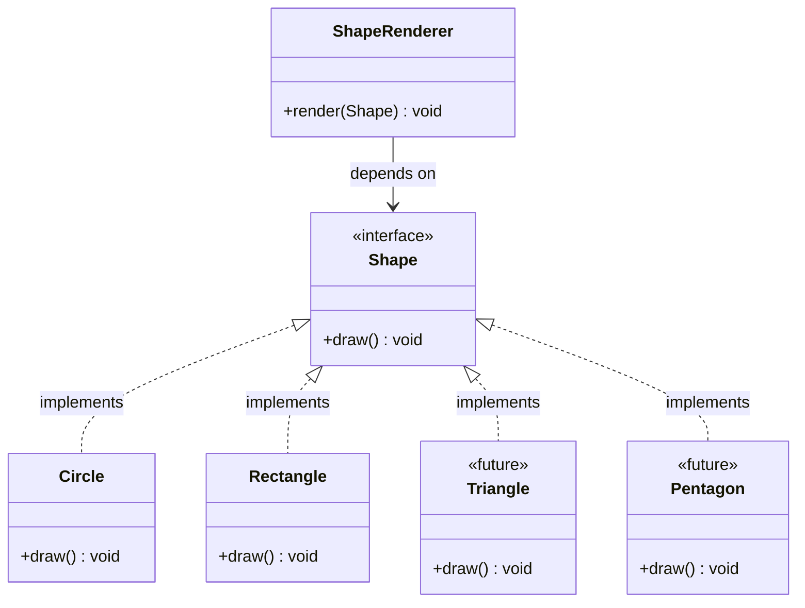
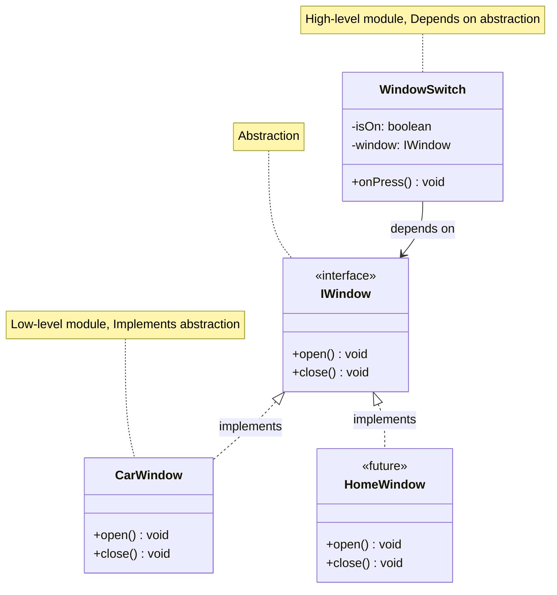
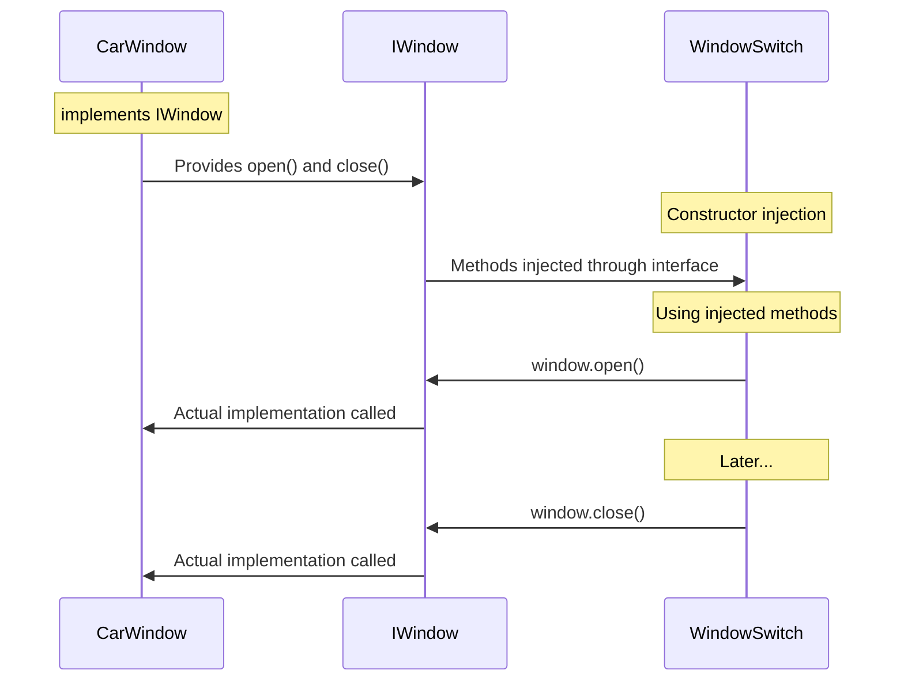
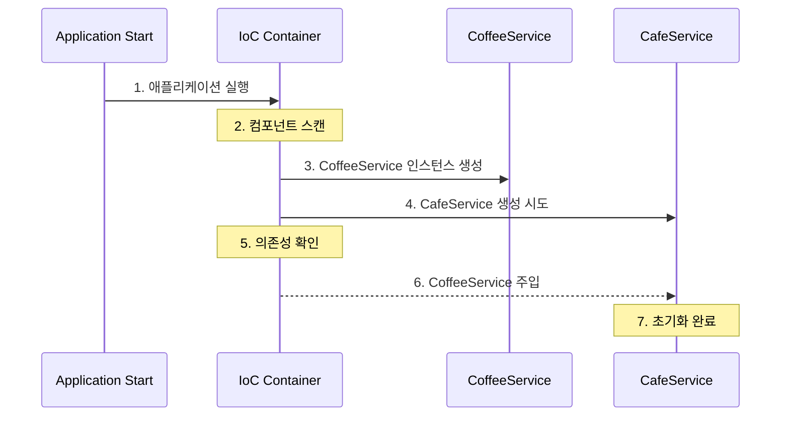

# 목차

> 1. 의존성을 가진다는 것의 의미
> 
> 2. 의존성 주입
> 
> 3. SOLID 원칙
> 
> 4. 프레임워크에서의 의존성 주입

# 📌 의존성을 가진다는 것의 의미

의존성은 구성요소들이 서로 의존하는 성질을 말한다. 타입스크립트 코드를 작성하며 한번 알아보자.

```ts
class Coffee {
    startProgramming() {
        console.log('I need Caffeine ☕️')
    }
}

class Programmer {
    private coffee: Coffee;

    constructor() {
        this.coffee = new Coffee();
    }

    programming() {
        this.coffee.startProgramming();
    }
}

const programmer: Programmer = new Programmer();
programmer.programming(); // I need Caffeine ☕️
```

Programmer가 Coffee 클래스에 의존성을 띄고 있다.

근데, 여기서 Coffee 가 StarbucksCoffee 로 바꾸고 싶다면? 어떤식으로 구현해야할까?

다음 두가지 방법으로 이를 구현할 수 있을 것이다.

1. Coffee 를 수정하고, Programmer 를 수정한다.
2. Coffee 을 상속받은 StarbucksCoffee 클래스를 만들고, Programmer 를 수정한다.

위 두가지 방법 모두 결국 Programmer 내부 코드를 수정해야한다는 문제가 있다. 즉, 의존성은 하나를 변경하면 의존하는 모든 것들을 변경해야한다는 단점이 존재한다.

또 만약에 CoffeeBean, TwoSomePlace 등 이런 의존성을 가진 클래스가 추가되어한다면? 이와 같은 작업은 정말 불필요한 작업이 될 것이다.

이를 해결하기 위한 것이 의존성 주입이다.

# 📌 의존성 주입

그렇다면 의존성주입이란 무엇일까? 직접 의존성을 넣어 내부로직을 수정하지 않도록 하는 것이다. 다음의 코드를 보며 확인해보자.

```ts
class Coffee {
    startProgramming() {
        console.log('I need Caffeine ☕️')
    }
}

class Starbucks extends Coffee {
    startProgramming() {
        console.log('I like Starbucks! ☕️')
    }
}

class Programmer {
    private coffee: Coffee;
    
    // 생성자를 받고 주입한다. 
    constructor(coffee: Coffee) {
        this.coffee = coffee;
    }

    programming() {
        this.coffee.startProgramming();
    }
}

const programmer: Programmer = new Programmer(new Starbucks());
programmer.programming(); // I like Starbucks! ☕️
```

이처럼 새로 추가될 때 마다 그에 해당하는 class를 생성하고, 생성자로 전달하여 의존성이 변동되어도 내부 로직을 수정할 필요없는 코드를 작성할 수 있다.

# 📌 SOLID 원칙

의존성 주입을 제대로 이해하기 위해선 SOLID 원칙을 이해하는 것이 도움이된다. 

[NestJS](https://docs.nestjs.com/providers#custom-providers)에서도 `SOLID`원칙을 권장하고 `IoC Container`로 의존성을 관리한다.
[Spring](https://docs.spring.io/spring-framework/reference/core/beans/introduction.html)또한 마찬가지이므로 관련된 내용을 학습할 필요가 있다.

[SOLID](https://en.wikipedia.org/wiki/SOLID)는 객체지향 디자인 원칙 5가지의 앞글자를 따서 이름지은 원칙이다.

1. **S**ingle Responsibility Principle (단일 책임 원칙)
2. **O**pen-Closed Principle (개방 - 폐쇄 원칙)
3. **L**iskov Substitution Principle
4. **I**nterface Segregation Principle
5. **D**ependency Inversion Principle

## Single Responsibility
- 클래스를 수정할 때, 수정하는 이유가 단 한가지여야한다. 즉, 각 클래스는 하나의 책임을 가져야한다.
  - 하나의, 잘 정제된 책임을 각 클래스가 지닌다면 코드를 이해하고 수정하기 용이하다.
  - 테스트를 진행할 때 Single focus로 진행하기 쉬워진다.
  - 연관 없는 시스템에 영향을 끼치지 않는다.
  - <u>재사용성과 유지보수성 향상 목적</u>
   
### Single Responsibility 예시

다음과 같은 코드가 있다고 하자.

```ts
class CoffeeMachine {
    constructor() {}
    
    heatMilk() {
        // 우유를 데우는 기능
    }
    
    dripCoffee() {
        // 커피를 내리는 기능
    }
}
```

이와같은 객체는 위의 SRP를 위반한 것이다. `CoffeeMachine`이 두가지 기능을 하기 때문

이를 해결한 예시는 다음과 같다고 볼 수 있다.

```ts
class CoffeeMachine {
    constructor() {}
    
    dripCoffee() {
        // 커피를 내리는 기능
    }
}

class MilkHeater {
    constructor() {}
    
    heatMilk() {
        // 우유를 데우는 기능
    }
}
```

## Open-closed
- 소프트웨어 엔티티(클래스, 모듈, 함수 등)은 확장에는 열려 있어야 하고, 변경에는 닫혀 있어야 한다.
  - 새로운 기능을 개발할 때 기존의 코드를 수정하지 않고 확장할 수 있다.
  - 변화가 발생할 때의 리스크를 최소화 할 수 있다.
  - <u>유연성과 확장성 향상 목적</u>

### Open-closed 예시

OCP의 핵심은 새로운 기능을 추가해도 기존 코드를 바꿀 필요가 없는 것이다. 아래의 예시를 통해 알아보자.

```ts
interface Shape {
    draw(): void;
}

class Circle implements Shape {
    draw(): void {
        // 원을 그리는 로직
    }
}

class Rectangle implements Shape {
    draw(): void {
        // 직사각형을 그리는 로직
    }
}

class ShapeRenderer {
    render(shape: Shape): void {
        shape.draw();
    }
}
```

여기서 `interface`의 힘을 알 수 있는데, 이와 같은 관계를 가져 삼각형 등의 기능이 추가되더라도 기존의 코드를 수정할 필요가 없다.



여담으로 자바 강의를 진행하는 **김영한** 개발자님께서 OCP를 자바 프로그래밍 SOLID 원칙의 꽃이라고 언급한적이 있다고 한다. 물론 Nest도 중요하지만 Spring을 공부하는 분들은 이 내용을 더더욱 머리속에 넣자!

## Liskov substitution
- 자료형 `S`가 자료형 자료형 `T`의 하위형이라면 필요한 프로그램의 속성 변경없이 자료형 `T`의 객체를 자료형 `S`의 객체로 치환할 수 있어야한다.
  - 서브타입은 언제나 기반타입으로 교체가능해야한다.
  - 즉, 부모클래스와 자식클래스 사이의 행위에는 `일관성`이 있어야한다.
    - 부모 클래스의 인스턴스 대신 자식클래스의 인스턴스를 사용해도 문제가 없어야한다.
  - 자바의 다형성 원리가 그 예시
    - 다형성 기능을 활용하기 위해서 클래스를 상속시켜 타입을 통합할 수 있게 설정해야함.
    - 업캐스팅을 해도 메소드 동작에 문제없게 잘 설계하여야 한다

### Liskov substitution 예시

```ts
class Bird {
    fly(distance: number): string {
        return `This bird flies ${distance} meters`;
    }
}

class Sparrow extends Bird {
    fly(distance: number): string {
        return `This sparrow flies ${distance} meters quickly`;
    }
}

class Eagle extends Bird {
    fly(distance: number): string {
        return `This eagle soars ${distance} meters at high altitude`;
    }
}

// Sparrow, Eagle 둘다 Bird가 사용되는 모든곳에서 사용 가능하다.
// Bird의 fly의 매개변수가 number인 것, 반환값이 string인 것, string의 내용이 유사한 것을 고려하면 LSP를 준수했다고 볼 수 있다.

class BirdWatcher {
    watchBirdFly(bird: Bird, distance: number) {
        console.log(bird.fly(distance));
    }
}

const bird = new Bird();
const sparrow = new Sparrow();
const eagle = new Eagle();

const birdWatcher = new BirdWatcher();
birdWatcher.watchBirdFly(bird, 100);     // This bird flies 100 meters
birdWatcher.watchBirdFly(sparrow, 100);  // This sparrow flies 100 meters quickly
birdWatcher.watchBirdFly(eagle, 100);    // This eagle soars 100 meters at high altitude
```

## Interface segregation

- 클래스는 자신이 사용하는 인터페이스만을 구현해야한다. 
  - 하나의 일반적 인터페이스보단, 여러개의 구체적 인터페이스가 더 좋다는 말.
  - 자신이 사용하지 않는 인터페이스(기능)에는 영향받지 않아야한다.

### Interface segregation

다음의 코드를 봐보자.

```ts
interface Printer {
  copy(): void
  print(doc: string): void
  cooking(doc: string, result: string): void
}

class SimplePrinter implements Printer {
  copy(): void {
    console.log('copy...')
  }

  print(doc: string): void {
     console.log(`print ${doc}`)
  }

  cooking(doc: string, result: string): void {
     console.log(`watch ${doc} and cooking ${result}`)
  }
}
```

`Printer`가 너무나 많은 기능을 가지고있다. 더불어 `cooking`은 더더욱 문제가 된다.

이를 `ISP`를 준수하여 리팩토링하면 다음과 같이 코드를 작성해볼 수 있다.

```ts
interface Copyable {
  copy(): void;
}

interface Printable {
  print(doc: string): void;
}

interface Cookable {
  cook(recipe: string, dish: string): void;
}

// 단순 프린터는 출력과 복사만 가능
class SimplePrinter implements Copyable, Printable {
  copy(): void {
    console.log('copy...');
  }

  print(doc: string): void {
    console.log(`print ${doc}`);
  }
}

// 스마트 주방기기는 요리 기능만 있음
class SmartKitchen implements Cookable {
  cook(recipe: string, dish: string): void {
    console.log(`follow ${recipe} and cook ${dish}`);
  }
}

// 복합기는 모든 기능을 구현
class MultiFunction implements Copyable, Printable, Cookable {
  copy(): void {
    console.log('copy...');
  }

  print(doc: string): void {
    console.log(`print ${doc}`);
  }

  cook(recipe: string, dish: string): void {
    console.log(`follow ${recipe} and cook ${dish}`);
  }
}
```

## Dependency inversion

의존성 역전 원칙이라고도 부르며, 의존 관계를 맺을 때, **변화하기 어려운 것**에 의존해야 한다는 원칙이다.

객체지향적 관점에서 변화하기 쉬운것은 구체화된 `class`이고, 변화하기 어려운것은 추상 `class`나 `interface`를 의미한다.

이런 구조는 인터페이스를 통해 필요한 메서드만 사용하는 느슨한 결합을 형성하고, 테스트/확장성에서 큰 장점을 지닌다.

### Dependency inversion 예시

```ts
interface IWindow {
  open(): void;
  close(): void;
}

class CarWindow implements IWindow {
  open(): void {
    console.log('window is open...')
  }

  close(): void {
    console.log('window is close...')
  }
}

class WindowSwitch {
  private isOn = false;

  constructor(
    private window: IWindow
  ) {
    this.isOn = false
  }

  onPress(): void {
    if (this.isOn) {
      this.window.close()
      this.isOn = false
    } else {
      this.window.open()
      this.isOn = true
    }
  }
}
```

이 코드의 경우 `WindowSwitch`가 `IWindow` 인터페이스로 정의된 인스턴스를 인자로 받고있다. 즉, 해당 인터페이스를 바탕으로 정의된 모든 클래스에 대해 유연한 대처가 가능하다.

이를 그림으로 표현하면 다음과 같다.



또 이를 주입의 관점에서 보면 다음과 같이 그릴 수 있다.



# 📌 프레임워크에서의 의존성 주입

Spring과 Nest 모두 `IoC 컨테이너`를 활용하여 의존성을 관리한다. 예시 코드를 통해 알아보자.

<details>
<summary>Spring</summary>

```java
// 1. 컴포넌트 선언
// @Service, @Repository, @Controller 등
@Component  
public class CoffeeService {
    void brew() { ... }
}

// 2. 의존성 주입
@Service
public class CafeService {
    private final CoffeeService coffeeService;

    // 생성자 주입
    @Autowired
    public CafeService(CoffeeService coffeeService) {
        this.coffeeService = coffeeService;
    }
}
```
</details>

<details>
<summary>Nest</summary>

```ts
// 1. 프로바이더 선언
@Injectable()
export class CoffeeService {
    brew(): void { ... }
}

// 2. 의존성 주입
@Injectable()
export class CafeService {
    constructor(
        private readonly coffeeService: CoffeeService
    ) {}
}

// 3. 모듈에 등록
@Module({
    providers: [CoffeeService, CafeService]
})
export class CafeModule {}
```
</details>

물론 둘은 차이점이 많다. 언어, 사용하는 패턴 등에서 차이가 존재한다. 하지만 전반적인 흐름은 다음과 같다.



즉, `IoC Container`가 위에서 다뤘던 의존성 관련 로직을 수행한다는 것을 이해하자. 구글에 `IoC Container`을 검색하면 관련 자료가 많이 나오니 관심있는 프레임워크에 맞는 학습을 추가적으로 진행해보자.

아무튼 이를 통해 개발자는 자연스럽게

1. SOLID 준수
2. 비즈니스 로직에 집중
3. 테스트 코드, 확장이 용이한 코드 작성

에 집중할 수 있다.

결과적으로 의존성 주입을 자동화하고 관리해주는 프레임워크가 개발자의 코드작성을 돕는 것이다.

다함께 외쳐요 ***고마워 스프링~ 네스트~***

# 💡결론

- 의존성의 개념, 의존성 주입의 개념을 학습했다.
- SOLID 원칙을 학습했다.
- 프레임워크에서 의존성과 관련된 로직을 수행하는 IoC Container에 대한 개념을 학습했다.

# 📚 Ref.

[SOLID 준수해서 코딩하기 (feat. TypeScript) - Velog](https://velog.io/@junsugi/SOLID-%EC%A4%80%EC%88%98%ED%95%B4%EC%84%9C-%EC%BD%94%EB%94%A9%ED%95%B4%EB%B3%B4%EA%B8%B0-feat.-Typescript)

[Typescript로 보는 SOLID - 직방 기술블로그(Medium)](https://medium.com/zigbang/typescript%EB%A1%9C-%EB%B3%B4%EB%8A%94-solid-e9384b208f6d)

[Typescript와 OOP SOLID 원칙 - MOON WORK 기술블로그](https://moon-works.tistory.com/34)
