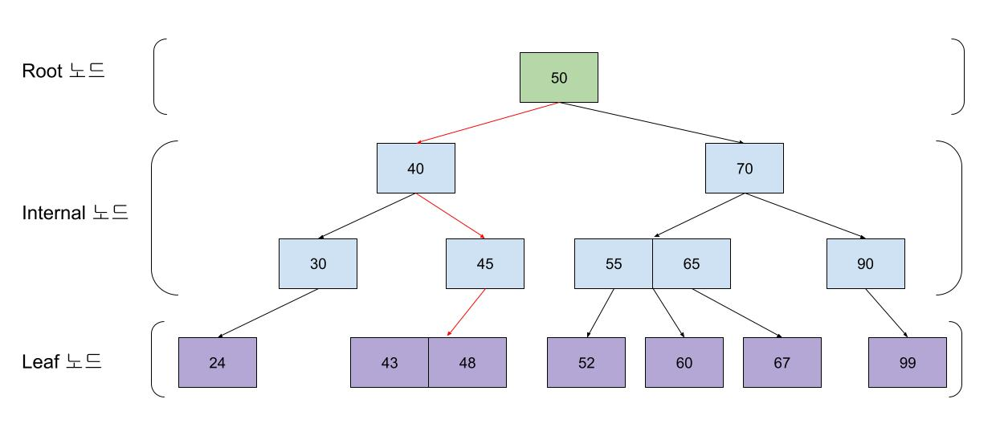
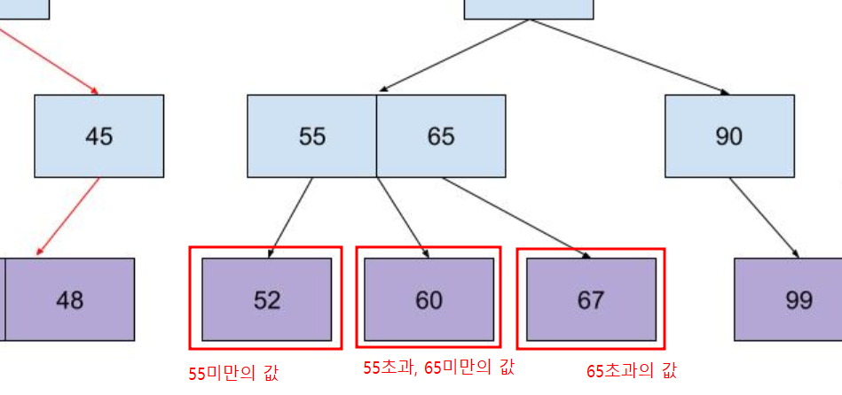
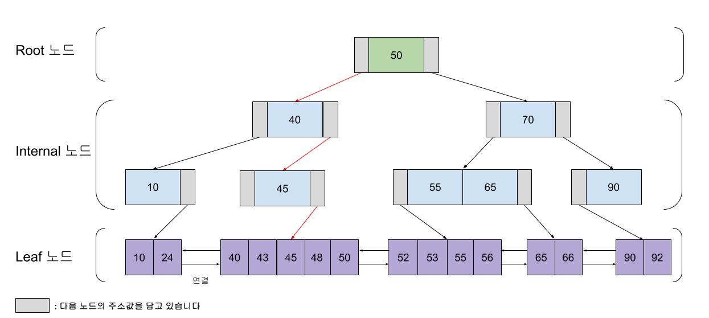
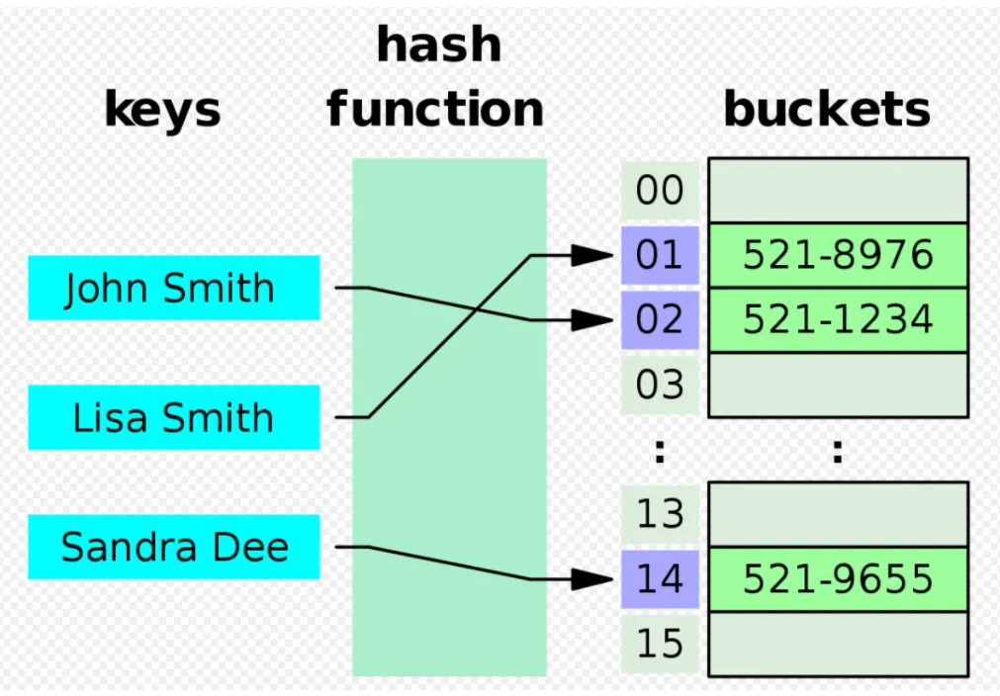
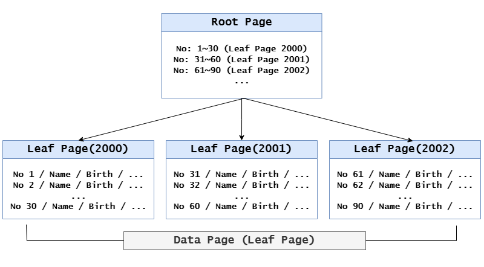
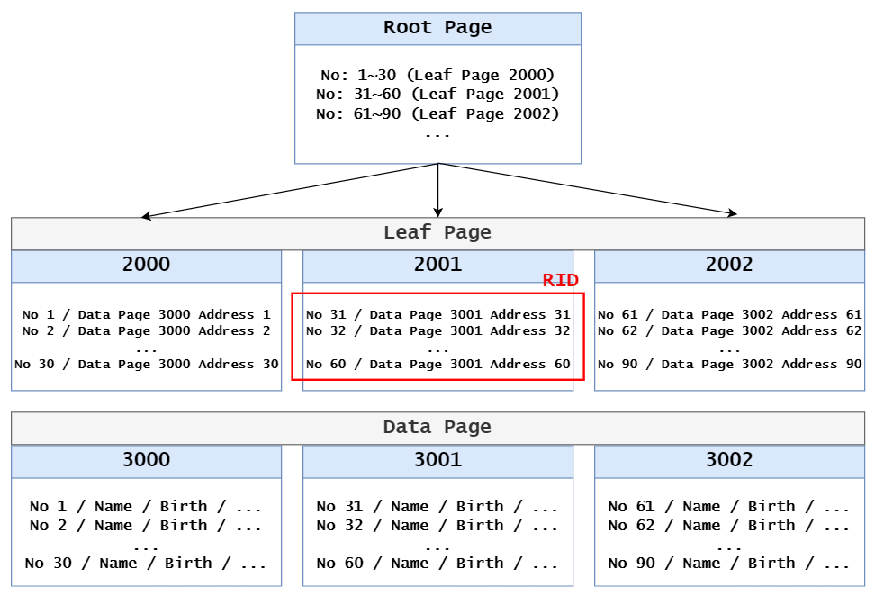

# 오늘의 주제: 인덱스
| 작성자: 신희진 | 작성일: 240211

- 인덱스란 무엇일까..

## ✅ **1. 인덱스(Index)란?**

- **데이터베이스에서 검색 속도를 높이는 기술**
- 책의 **목차**(Table of Contents)나 **찾아보기(Index Page)**처럼 필요한 정보를 빠르게 찾게 도와줌
- 인덱스가 없으면 모든 데이터를 처음부터 끝까지 훑어야 하는 **Full Scan** 발생 → 속도 저하
- 인덱스를 사용하면 필요한 데이터만 빠르게 찾을 수 있음

**📌 ex)**

- **책에서 원하는 내용을 찾기**
    - **목차(인덱스 O)** → 원하는 주제를 찾아 바로 해당 페이지로 이동
    - **목차 없음(인덱스 X)** → 처음부터 끝까지 모든 페이지를 뒤져야 함
- **데이터베이스에서 고객 정보를 찾기**
    - **인덱스 O** → 고객 ID로 빠르게 검색
    - **인덱스 X** → 모든 데이터를 훑어야 함

---

## ✅ **2. 인덱스의 원리**

### 인덱스를 생성하면 데이터베이스 내부에 추가적인 파일이 생성되는데, 이를 통해 검색 속도가 빨라지는 원리를 이해해보자.

### 인덱스 설정한 경우의 데이터 베이스 변화

- MySQL의 경우, **하나의 테이블을 만들면 다음과 같은 3개의 파일이 생성됩니다.**

| 파일명 | 역할 |
| --- | --- |
| **FRM 파일** | 테이블의 구조(스키마) 저장 |
| **MYD 파일** | 테이블의 실제 데이터 저장 |
| **MYI 파일** | 테이블의 인덱스 정보 저장 |

📌 **INDEX가 없을 때**

- `MYI` 파일이 비어 있음 (즉, 인덱스가 없음)
- 데이터를 조회하면 **MYD 파일을 처음부터 끝까지(Full Scan) 검색해야 함**

📌 **INDEX를 생성하면?**

- `MYI` 파일이 채워짐 (인덱스 정보 저장)
- 데이터를 조회할 때, **MYI 파일에서 먼저 검색 → 필요한 부분만 MYD 파일에서 읽어옴**
- **검색 속도가 훨씬 빨라짐!**

### 1. 인덱스 없이 데이터를 검색하는 과정

> 책에 ‘색인(찾아보기)’이 없다고 가정하자.
> 
> 
> 특정 키워드를 찾으려면 처음부터 끝까지 모든 페이지를 읽어야 함.
> 

📌 **예제**

아래와 같은 테이블이 있다고 가정하자.

```sql
CREATE TABLE users (
    id INT PRIMARY KEY,
    name VARCHAR(50),
    email VARCHAR(100)
);
```

그리고 `users` 테이블에 100만 개의 데이터가 들어있다고 하자.

만약 **인덱스 없이** 다음과 같은 쿼리를 실행하면?

```sql
SELECT * FROM users WHERE name = 'Kim';
```

- 데이터베이스는 `name` 컬럼에 **인덱스가 없기 때문에**
- `MYD` 파일(데이터 저장소)을 **처음부터 끝까지 검색(Full Scan)** 해야 함
- **100만 개의 데이터를 하나씩 확인하므로 속도가 매우 느림!**

이것이 **Full Table Scan**이라고 불리는 비효율적인 검색 방식이다.

*python*

```python
# 100만 개의 데이터가 들어 있는 리스트
users = [
    {"id": 1, "name": "Lee"},
    {"id": 2, "name": "Kim"},
    {"id": 3, "name": "Park"},
    # ... (100만 개의 데이터)
]
# 특정 이름 찾기 (Full Scan)
for user in users:
    if user["name"] == "Kim":
        print(user)
        break  # 찾으면 종료
```

### 2. 인덱스를 생성한 후 검색 방식

> 책의 ‘찾아보기’(색인)를 활용하면 원하는 내용을 바로 찾을 수 있음!
> 

📌 **인덱스를 생성해보자.**

```sql
CREATE INDEX idx_name ON users(name);
```

이제 `name` 컬럼에 대한 인덱스가 `MYI` 파일에 저장된다.

📌 **인덱스가 있는 경우 검색 과정**

```sql
SELECT * FROM users WHERE name = 'Kim';
```

1️⃣ `MYI` 파일(인덱스 저장소)에서 **‘Kim’이 어디에 있는지 찾음**

2️⃣ 해당 위치를 기반으로 `MYD` 파일에서 **해당 데이터만 검색**

3️⃣ Full Scan 없이 **빠르게 결과 반환!** 🚀

💡 **즉, 인덱스가 있으면 "필요한 데이터가 어디 있는지"를 알고 있어서 빠르게 접근 가능!**

*python*

```python
# 딕셔너리 사용
users_dict = {
    "Lee": {"id": 1, "name": "Lee"},
    "Kim": {"id": 2, "name": "Kim"},
    "Park": {"id": 3, "name": "Park"},
    # ... (100만 개의 데이터)
}

# 특정 이름 찾기 (O(1) 해시 탐색)
print(users_dict.get("Kim"))  # {'id': 2, 'name': 'Kim'}
```

### 3. 데이터 추가/수정/삭제 시 성능 비교

**MySQL에서 데이터 삽입 시 (인덱스가 있는 경우)**

```sql
INSERT INTO users (id, name) VALUES (4, 'Choi');
```

- **인덱스도 업데이트해야 하므로 속도가 느려질 수 있음**
- B-Tree 인덱스는 데이터를 정렬된 상태로 유지해야 해서 **추가적인 연산 필요**
- 해시 인덱스는 해시 값을 재계산해야 함

### **🔹 Python에서 리스트 vs. 딕셔너리 삽입 비교**

```python
# 리스트에 데이터 추가 (O(1), 하지만 검색은 O(N))
users.append({"id": 4, "name": "Choi"})

# 딕셔너리에 데이터 추가 (O(1))
users_dict["Choi"] = {"id": 4, "name": "Choi"}
```

📌 **결과:**

- 리스트는 추가 속도가 빠르지만 검색이 느림 (O(N))
- 딕셔너리는 추가 속도가 빠르고 검색도 빠름 (O(1))
- 하지만 **딕셔너리가 일정 크기를 넘으면 리해싱(Rehashing) 작업이 필요할 수도 있음** (성능 저하 가능)

💡 **즉, 데이터베이스에서 인덱스가 있는 경우, 데이터를 추가할 때 정렬된 상태를 유지해야 해서 속도가 느려지는 것과 비슷한 원리!**

### 4. 요약

- 인덱스가 없는 검색 == Python에서 리스트로 for문 돌며 검색하는 것
- 인덱스가 있는 검색 == python에서 딕셔너리를 사용하는 것(O(1) or O(log N))
- 인덱스는 검색을 빠르게 하지만, 데이터를 추가/수정/삭제할 때 성능 저하가 발생할 수 있음

### 추가. python 리스트의 인덱스랑 무엇이 다를까?

|  | **Python 리스트 인덱스** | **데이터베이스 인덱스** |
| --- | --- | --- |
| **정의** | 리스트가 생성될 때 자동으로 붙는 순차적인 번호 | 특정 컬럼에 대해 별도로 생성하는 자료구조 |
| **작동 방식** | 배열의 위치(메모리 주소)를 기반으로 접근 (`O(1)`) | B-Tree 또는 Hash Table을 사용하여 값의 위치를 빠르게 찾음 (`O(log N)` 또는 `O(1)`) |
| **검색 속도** | `O(1)`, 단 인덱스가 아닌 값으로 검색하면 `O(N)` | `O(log N)` 또는 `O(1)` (인덱스 사용) |
| **삽입/삭제 성능** | 특정 위치에 삽입하면 **O(N)** (리스트를 다시 정렬해야 함) | 데이터 삽입/삭제 시 인덱스도 갱신해야 해서 속도가 느려질 수 있음 |
| **용도** | 배열의 요소를 빠르게 접근하기 위한 번호 | 데이터 조회 속도를 높이기 위한 최적화 기술 |

**Python 리스트의 인덱스는 단순한 "위치 정보"지만, 데이터베이스의 인덱스는 검색을 최적화하기 위한 "색인 자료구조"**

---

## ✅ **3. 인덱스의 종류**

### **1. B-트리 인덱스 (Binary Tree 기반 검색)**

📌 **설명:**

- **B-Tree 인덱스는 가장 많이 사용되는 인덱스**
- 데이터를 **정렬된 상태로 유지**하며, 빠르게 검색 가능 (`O(log N)`)
- **범위 검색이 가능함** (`<`, `>`, `BETWEEN` 등)
- **파일 탐색기에서 폴더를 찾는 방식과 유사**



- 이진 탐색 트리는 2개의 자식 노드만 가질 수 있었던 것과 달리 B-Tree는 2개 이상의 자녀 노드를 가질 수 있다.



📌 **MySQL 예제:**

```sql
CREATE INDEX idx_last_name ON employees(last_name);
```

- `employees` 테이블의 `last_name` 컬럼에 B-Tree 인덱스를 생성
- **"김씨 성을 가진 모든 사람 찾기"** 같은 범위 검색에 유리

📌 **Python 비교 (이진 탐색 트리 - Sorted List 사용)**

```python
import bisect

# 정렬된 리스트 (B-트리 구조와 유사)
last_names = ["Choi", "Kim", "Lee", "Park", "Yang"]

# 이진 탐색으로 "Kim" 찾기
index = bisect.bisect_left(last_names, "Kim")
if index < len(last_names) and last_names[index] == "Kim":
    print(f"'Kim'은 {index}번째에 있습니다.")
```

📌 **결과:**

- `O(log N)` 시간 복잡도로 빠르게 찾음
- **Python의 `bisect` 모듈은 B-트리 인덱스와 비슷한 방식으로 작동**

### **1-1. B+트리 인덱스 (B-Tree의 업그레이드 버전)**



- 대표적으로 InnoDB엔진에서 Index를 관리할 때 B+Tree를 사용
- B-Tree보다 검색 연산이 빠르고, 범위 검색에 유용
- B-Tree에서 Leaf 노드 간에 '연결성'이 추가된 자료구조
- 즉, 하나의 A 또는 B중 하나만 선형 검색을 해서 위치를 알게 되면, Leaf 노드간의 연결성을 통해서 나머지 값을 탐색할 수 있는 것

### B-Tree VS B+Tree

1. 메모리 효율 : B-Tree에서는 각 노드에 데이터의 주소값뿐만 아니라, 실제 데이터로 오름차순으로 정렬이 되어 있고, B+Tree에서는 Leaf노드에만 실제 데이터들이 저장되어 있다. 그래서 B-Tree보다 B+Tree가 메모리 효율 측면에서는 좀 더 좋다고 할 수 있다.
2. 생성 및 삭제의 효율 : B+Tree는 Leaf노드 간에 '연결'을 나타내는 데이터도 추가적으로 관리되어야한다. 그래서 데이터의 생성, 수정, 삭제가 일어날 때는 B-Tree가 B+Tree보다 좀 더 좋은 성능을 일반적으로 보인다.

---

### **2. 해시 인덱스 (Hash Table 기반 검색)**

- 해시 테이블은 키-값 쌍을 저장하지만 키는 해싱 함수를 통해 생성
- 따라서 키 값 자체가 데이터를 저장하는 **배열의 인덱스**가 되기 때문에 데이터 요소의 검색 및 삽입 기능이 훨씬 빨라짐
- 조회하는 동안 키가 해시되고 결과 해시는 해당 값이 저장된 위치를 나타낸다.



📌 **설명:**

- **등호(=) 비교 검색이 빠름 (`O(1)`)**
- **정렬된 데이터 검색(X), 범위 검색(X)**
- **Python의 딕셔너리와 같은 방식으로 동작**

📌 **MySQL 예제 (해시 인덱스 생성)**

```sql
CREATE INDEX idx_id ON employees(id) USING HASH;
```

- `id` 컬럼에 대해 해시 인덱스 생성
- **ID가 '100'인 직원 찾기** 같은 정확한 검색에 유리

📌 **Python 비교 (딕셔너리 - Hash Table 사용)**

```python
# 해시 인덱스를 적용한 데이터 구조 (딕셔너리)
employees = {
    101: {"name": "Kim", "age": 30},
    102: {"name": "Lee", "age": 28},
    103: {"name": "Choi", "age": 35}
}

# ID로 빠르게 검색 (O(1))
print(employees.get(102))  # {'name': 'Lee', 'age': 28}
```

📌 **결과:**

- `id`를 키(key)로 활용하여 **해시 테이블 검색 (O(1))**
- **딕셔너리는 Hash Index와 같은 방식으로 동작**

💡 **BUT! 해시 인덱스는 범위 검색(`>`, `<`, `BETWEEN`)이 불가능** → 딕셔너리에서 `id > 102` 같은 검색을 할 수 없는 것과 동일

---

### **3. 클러스터드 인덱스 (정렬된 데이터 저장)**

📌 **설명:**

- **데이터 자체가 정렬된 상태로 저장됨**
- **검색 시 물리적으로 가까운 데이터 접근 가능 → 빠름**
- **테이블당 하나만 생성 가능**
- **Python에서 정렬된 리스트(Binary Search)와 유사**

📌 **MySQL 예제 (클러스터드 인덱스 생성)**

```sql
CREATE CLUSTERED INDEX idx_id ON employees(No);
```



- 테이블을 `No` 순서대로 정렬하여 저장
- `No BETWEEN 100 AND 200` 같은 **범위 검색이 빠름**

📌 **Python 비교 (정렬된 리스트 + 이진 탐색)**

```python
import bisect

# 정렬된 리스트 (클러스터드 인덱스와 유사)
employees = [
    (101, "Kim", 30),
    (102, "Lee", 28),
    (103, "Choi", 35)
]

# 이진 탐색으로 특정 번호 찾기 (O(log N))
index = bisect.bisect_left(employees, (102,))
if index < len(employees) and employees[index][0] == 102:
    print(f"102의 직원: {employees[index]}")

```

📌 **결과:**

- 데이터가 **정렬된 상태로 저장됨** (클러스터드 인덱스와 동일)
- **범위 검색(`BETWEEN`, `<`, `>`)이 빠름**

💡 **BUT! 데이터 삽입 시 정렬을 유지해야 해서 삽입/삭제 속도가 느려질 수 있음**

---

### **4. 비클러스터드 인덱스 (데이터 정렬 X, 별도 저장)**

📌 **설명:**

- **데이터 자체는 정렬되지 않음**
- **인덱스 테이블에 데이터 위치만 저장 → 원본 테이블을 조회해야 함**
- **하나의 테이블에 여러 개의 비클러스터드 인덱스 생성 가능**
- **Python에서 리스트 인덱스와 유사**

📌 **MySQL 예제 (비클러스터드 인덱스 생성)**

```sql
CREATE NONCLUSTERED INDEX idx_last_name ON employees(No);
```



- `No` 를 기준으로 인덱스를 만들지만 **데이터 자체는 정렬되지 않음**
- 원본 테이블과 매핑된 인덱스 객체를 별도로 생성하여 관리한다. (인덱스 컬럼이 정렬된 상태로 유지된다.)
- Root Page / Leaf Page / Data Page 라는 세 가지 영역이 존재하며, **Leaf Page 에는 실제 데이터가 아닌 데이터의 키 값을 저장한다. (RID)**
- Root 페이지에서 검색을 원하는 Leaf 페이지에 접근해서 원하는 주소값의 RID 값으로 데이터 페이지에서 데이터를 찾는다

📌 **Python 비교 (리스트 인덱스 활용)**

```python
# 원본 데이터
employees = [
    {"id": 101, "name": "Kim", "age": 30},
    {"id": 102, "name": "Lee", "age": 28},
    {"id": 103, "name": "Choi", "age": 35}
]

# 별도의 인덱스 (비클러스터드 인덱스)
name_index = {
    "Kim": 0,
    "Lee": 1,
    "Choi": 2
}

# 이름으로 검색 후 원본 데이터 조회 (비클러스터드 인덱스 방식)
index = name_index.get("Lee")
if index is not None:
    print(employees[index])  # {'id': 102, 'name': 'Lee', 'age': 28}

```

📌 **결과:**

- **이름으로 먼저 찾고, 해당 위치의 데이터를 조회**
- **인덱스를 따로 저장하기 때문에 원본 데이터에 직접 접근하지 않음 (비클러스터드 인덱스와 동일한 원리)**

💡 **BUT! 데이터를 검색한 후 원본 테이블을 다시 조회해야 해서, 성능이 클러스터드 인덱스보다 약간 느릴 수 있음**

---

### **5. 정리 – MySQL과 Python의 인덱스 비교**

| **인덱스 종류** | **MySQL (DB)** | **Python에서의 동작 방식** | **검색 속도** |
| --- | --- | --- | --- |
| **B-트리 인덱스** | 정렬된 데이터 구조 (`O(log N)`) | `bisect` 모듈을 이용한 이진 탐색 | `O(log N)` |
| **해시 인덱스** | Hash Table 기반 (`O(1)`) | Python `dict` (`O(1)`) | `O(1)` |
| **클러스터드 인덱스** | 데이터 자체가 정렬됨 | 정렬된 리스트에서 이진 탐색 | `O(log N)` |
| **비클러스터드 인덱스** | 데이터 정렬 없이 별도 인덱스 저장 | 리스트 + 별도 인덱스 (`dict`) | `O(log N) + O(1)` |

---

### **결론 – Python을 활용한 MySQL 인덱스 개념 이해**

✔ **B-트리 인덱스 = `bisect` 모듈을 사용한 이진 탐색**

✔ **해시 인덱스 = Python의 딕셔너리 (해시 테이블)**

✔ **클러스터드 인덱스 = 정렬된 리스트 (`sorted` 유지 + 이진 탐색)**

✔ **비클러스터드 인덱스 = 리스트 + 별도 딕셔너리 인덱스**

---

## ✅ **4. 인덱스의 장점과 단점**

### **🔹 장점**

✔️ **검색 속도 향상**

- 원하는 데이터를 빠르게 찾을 수 있음

✔️ **정렬된 데이터 유지**

- `ORDER BY` 없이도 데이터를 정렬된 상태로 검색 가능

✔️ **중복 데이터 방지**

- `PRIMARY KEY`나 `UNIQUE` 제약 조건을 걸어 중복 데이터를 방지

### **🔹 단점**

❌ **INSERT, UPDATE, DELETE 성능 저하**

- 데이터 변경 시 인덱스도 갱신해야 해서 속도가 느려짐

❌ **추가적인 저장 공간 필요**

- 인덱스를 저장하기 위한 추가적인 디스크 공간이 필요함

❌ **잘못 사용하면 성능 저하**

- 너무 많은 인덱스를 만들면 오히려 성능이 나빠질 수 있음

---

## ✅ **5. 인덱스 사용 시 주의할 점**

### **📌 1) 인덱스를 사용하면 좋은 경우**

- WHERE 조건에서 자주 사용하는 컬럼
- **JOIN에 자주 사용되는 컬럼**
- **ORDER BY, GROUP BY에 자주 사용되는 컬럼**
- **데이터의 중복도가 낮은 컬럼 (ex: 사용자 ID, 이메일 등)**

### **📌 2) 인덱스를 피해야 하는 경우**

- **자주 변경(INSERT, UPDATE, DELETE)되는 컬럼 - 인덱스 갱신 부담이 커짐**
    - 데이터를 삽입하면 → **인덱스도 함께 업데이트해야 함** (추가된 데이터가 정렬된 상태로 유지되어야 하기 때문)
    - 데이터를 수정하면 → **기존 인덱스를 지우고 다시 정렬해야 함**
    - 데이터를 삭제하면 → **인덱스에서도 해당 데이터를 제거해야 함**
- **중복도가 높은 컬럼 (ex: 성별, 국적 등)**
- **전체 데이터를 검색하는 경우 (ex: SELECT * FROM 테이블)**

---

## ✅ **6. 인덱스가 적용되지 않는 경우**

- **인덱스 컬럼을 가공하는 경우**
    
    ```sql
    WHERE SUBSTR(name, 1, 3) = 'Kim'  -- 인덱스 적용 X
    ```
    
    → `WHERE name LIKE 'Kim%'`로 변경해야 인덱스 적용
    
- **LIKE 앞에 %가 오는 경우**
    
    ```sql
    WHERE name LIKE '%Kim'  -- 인덱스 적용 X
    ```
    
- **부등호 연산을 사용하는 경우**
    
    ```sql
    WHERE age != 30  -- 인덱스 적용 X
    ```
    
- **OR 연산을 사용할 경우**
    
    ```sql
    WHERE name = 'Kim' OR name = 'Lee'  -- 인덱스 적용 X
    ```
    
    → `WHERE name IN ('Kim', 'Lee')`로 변경하면 인덱스 적용
    

---

## ✅ **7. 인덱스 설계 핵심 정리**

✔️ **WHERE 조건에 자주 사용되는 컬럼에 인덱스를 적용**

✔️ **중복도가 낮은 컬럼에 인덱스를 설정해야 효율적**

✔️ **JOIN 시 사용되는 컬럼에 인덱스를 추가하면 속도 개선 가능**

✔️ **ORDER BY 절에 사용되는 컬럼은 클러스터형 인덱스가 유리**

✔️ **테이블당 3~4개의 인덱스가 적절 (너무 많으면 성능 저하)**

---

## ✅ **8. 인덱스를 잘 활용하는 SQL 작성법**

### **✔️ 올바른 WHERE 조건 사용**

```sql
SELECT * FROM users WHERE name LIKE 'Kim%';  -- ✅ 인덱스 적용
SELECT * FROM users WHERE SUBSTR(name, 1, 3) = 'Kim';  -- ❌ 인덱스 적용 안됨
```

### **✔️ LIKE 연산 최적화**

```sql
SELECT * FROM users WHERE email LIKE 'abc%';  -- ✅ 인덱스 적용
SELECT * FROM users WHERE email LIKE '%abc';  -- ❌ 인덱스 적용 안됨
```

### **✔️ OR 대신 IN 사용**

```sql
SELECT * FROM users WHERE country = 'Korea' OR country = 'Japan';  -- ❌ 비효율적
SELECT * FROM users WHERE country IN ('Korea', 'Japan');  -- ✅ 인덱스 적용
```

---

## ✅ **결론: 인덱스를 언제, 어떻게 사용할 것인가?**

- 인덱스는 **읽기 속도를 높이지만, 데이터 변경 성능을 희생하는 구조**
- 무조건 사용하면 좋은 것이 아니라, **검색이 많고 변경이 적은 경우**에 적합
- **잘못된 인덱스 사용은 오히려 성능 저하를 초래할 수 있음**

✔️ **검색 속도를 높이고 싶다면 인덱스를 적절히 활용**

✔️ **INSERT, UPDATE, DELETE가 많은 테이블에는 신중하게 사용**

✔️ **인덱스가 적용되지 않는 경우를 이해하고 SQL을 최적화**


# 면접 질문
## https://land-turtler.tistory.com/120

1. 인덱스를 사용하는 이유가 무엇일까요?
2. 인덱스의 장단점은 무엇이 있을까요?   
3. 인덱스를 만드는 과정을 설명해보시겠어요?           
4. 클러스터형 인덱스와 넌클러스터형 인덱스를 설명해주세요.
5. SCAN 종류에 대해 설명해보세요 
6. 인덱스가 있음에도 인덱스를 타지 않는 경우는 어떤 것이 있을지? 
7. 결합 인덱스에 대해 설명해주세요            
