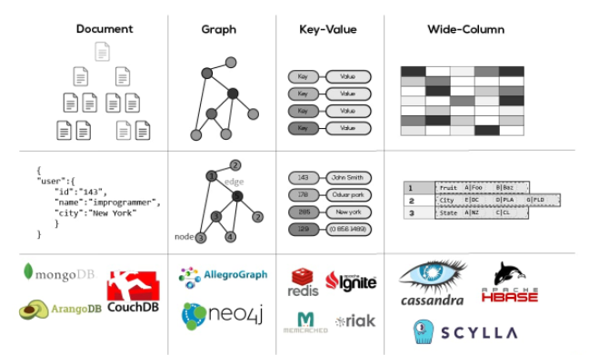

# NoSQL

## 목차

> 1. NoSQL DB의 특징
> 
> 2. SQL vs NoSQL
> 
> 3. 결론

## NoSQL DB의 특징

[구글 클라우드](https://cloud.google.com/discover/what-is-nosql?hl=ko)의 자료를 보면 NoSQL을 다음과 같이 정의하고 있다.

> <u>***not only SQL***</u>의 줄임말로 관계형 데이터베이스처럼 규칙 기반의 관계형 테이블이 아닌 형식으로 데이터를 저장하는 비관계형 데이터베이스를 의미합니다.
>
> NoSQL 데이터베이스는 document, key-value, wide-column, 그래프와 같은 다양한 구조화되지 않는 데이터를 지원하는 유연한 스키마모델을 사용합니다.
> 
> 조직에서는 유연성, 고성능, 수평적 확장성, 개발 용이성 때문에 NoSQL 데이터베이스를 선택합니다.

또한 [AWS](https://aws.amazon.com/ko/nosql/)는 다음과 같이 정의하고 있다.

> 목적별 데이터베이스라고도 하며, 특정 데이터 모델에 맞춰 설계되어있다.
> 
> 현대적 애플리케이션에 맞춰 쉽게 확장할 수 있는 유연한 스키마에 데이터를 저장한다.
> 
> 비관계형 데이터 모델에 대해 특정 용도로 구축되는 데이터베이스로서 현대적 애플리케이션 구축을 위한 유연한 스키마를 가지고있다.

위 기업들의 소개글을 보면 `NoSQL`의 핵심은 `유연성`, `확장성`, `고성능`이며 본인의 제품이 이와 같은 기능에 장점이 있다고 말하고 있다.

## SQL DB vs NoSQL DB


### SQL DB (관계형 데이터베이스 - RDBMS)

우선 `NoSQL`에 대해 이해하기 위해선 `관계형 데이터베이스(RDBMS)`와 `SQL`에 대한 이해가 필요하다.

우선 `SQL`은 Structured Query Language의 약자로 관계형 데이터베이스와 상호작용하는데 사용하는 쿼리언어를 의미한다. 이를 사용하여 `RDBMS`에서 데이터를 수정, 삭제, 검색할 수 있다.

`RDBMS`란 고정된 행(row)과 열(column)으로 구성된 테이블에 key, value 관계로 저장하는 데이터베이스를 말한다.

`RDBMS`의 특징은 다음과 같다.

1. 스키마, 즉 정해진 틀이 명확하다.
2. 데이터간의 관계를 외래키 등으로 정의한다.
3. 데이터의 무결성을 보장한다.
4. ACID(원자성, 일관성, 고립성, 지속성) 트랜잭션을 지원한다.

#### 데이터의 무결성

데이터 무결성은 데이터의 정확성, 일관성, 유효성이 유지되는 것을 의미한다. 즉, 데이터가 추가/수정/삭제/조회될 때 그 유효성이 보장되어야 함을 의미한다.

만약 무결성을 보장하지 못한다면, 잘못된 정보에 기반한 의사결정을 내릴 가능성이 높아지기에, 높은 신뢰도의 서비스를 위해선 이를 고려하여 DB를 관리해야한다.

데이터의 무결성에는 크게 다음 3가지가 존재한다.

1. `Entity` 무결성
   - 모든 테이블은 고유한 키(`PK`)를 가지고 있어야하며, 이 키를 통해 각 `row`를 구별할 수 있어야 한다는 원칙이다.
2. `Referential` 무결성
   - 외래키가 참조하는 테이블의 기본키와 일치해야한다는 원칙으로, 데이터간의 일관된 연결성을 보장한다.
3. `Domain`무결성
   - 필드의 유효값 범위를 제한하는 원칙

#### ACID 트랜잭션이란

DB를 수정하고, 조작하는 등의 동작의 단위를 트랜잭션이라고 한다. 이러한 동작을 수행할 때, 트랜잭션이 `Atomicity`(원자성), `Consistency`일관성, `Isolation`격리, `Durability`영속성을 지니는 경우를 `ACID 트랜잭션`이라고 한다.

1. `Atomicity`
   - 트랜잭션에 속한 각각의 문(읽기, 쓰기, 업데이트, 삭제)을 하나의 단위로 취급한다. 즉, 문 전체를 실행하거나 그 어떤 것도 실행하지 않거나 둘 중 하나이다.
   - 에러가 발생한 경우 데이터 손실과 손상이 방지된다.
2. `Consistency`
   - 트랜잭션이 테이블에 변경사항을 적용할 때, 미리 정의된, 예측할 수 있는 방식만 취한다.
   - 일관성을 확보한다면 데이터 손상이나 오류 때문에 테이블 무결성에 의도치않은 결과가 생기지 않는다.
3. `Isolation`
   - 같은 테이블에 동시에 여러개의 명령어가 온다면? 각 트랜잭션을 격리하면 트랜잭션간 방해/영향이 없다.
   - 동시에 발생하더라도 하나씩 발생하는 것 처럼 할 수 있다.
4. `Durability`
   - 트랜잭션 실행으로 데이터에 적용된 변경 사항이 저장되도록 보장한다.

`Oracle`, `MySQL`, `Postgresql`등이 이에 해당한다.

### NoSQL DB

반면 `NoSQL`은 `RDBMS`와 달리 유연한 스키마를 가지고 있다. 특징은 다음과 같다.

1. 스키마가 없어 유연한 구조를 가지고 있다.
    - 빠르게 개발, 반복이 가능하다.
2. 데이터간의 관계를 정의하지 않는다.
3. 수평적 확장에 용이하다.
    - 데이터 증가에 따라 서버를 쉽게 추가할 수 있다.
4. 대량의 분산된 데이터를 저장하는 데 적합하다.
    - 여러 서버에 분산 저장하여 장애에 대한 저항력이 높다.

`MongoDB`, `Redis` 등이 대표적인 `NoSQL` 데이터베이스이다.

#### NoSQL DB 종류



`NoSQL` DB는 크게 4가지 유형으로 구분할 수 있다.

1. `Key-Value` : 간단한 `key-value` 쌍으로 값을 저장
2. `Document` : `json`과 유사한 형식으로 데이터를 저장
3. `Wide-Column` : `column`을 기반으로 데이터 저장
4. `Graph` : 노드와의 관계를 활용하여 데이터 저장

`MongoDB`의 경우엔 `json`과 유사한 `bson` 형식으로 데이터를 저장하고
```bson
{
  "_id": ObjectId("60f7a9b9e4b0f1f1f1f1f1f1"),
  "name": "John Doe",
  "age": 30,
  "email": "johndoe@example.com",
  "address": {
    "street": "123 Main St",
    "city": "New York",
    "country": "USA"
  }
}
```

`Redis`의 경우엔 `key-value`형식으로 데이터를 저장한다.
```redis
SET user:1 "John Doe"
GET user:1
```

## 결론

|  기준   |  SQL DB  |             NoSQL DB             |
|:-----:|:--------:|:--------------------------------:|
| 데이터모델 | 정규화된 테이블 | 다양한 구조 (document, key-value ,,,) |
|  스키마  |    고정    |         동적 스키마 혹은 스키마 없음         |
|쿼리언어|   SQL    | DB 마다 다른 쿼리언어|
|확장성| 수직적 확장 | 수평적 확장 |

`NoSQL`은 위와같은 특징으로 다음의 분야에 주로 사용된다.

1. 대규모 분산 데이터 처리
2. 실시간 처리가 필요한 서비스
3. 빅데이터 분석
4. 빠르게 변화하는 비즈니스 요구사항에 유연한 대처가 필요한 서비스