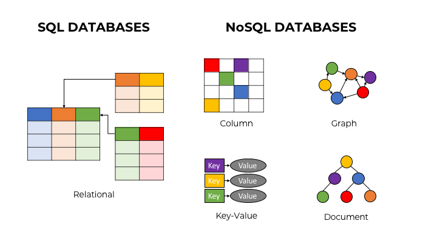

# NoSQL

## 목차

> NoSQL DB의 특징
> 
> 
> 
> 

## NoSQL DB의 특징

[구글 클라우드](https://cloud.google.com/discover/what-is-nosql?hl=ko)의 자료를 보면 NoSQL을 다음과 같이 정의하고 있다.

> <u>***not only SQL***</u>의 줄임말로 관계형 데이터베이스처럼 규칙 기반의 관계형 테이블이 아닌 형식으로 데이터를 저장하는 비관계형 데이터베이스를 의미합니다.
>
> NoSQL 데이터베이스는 document, key-value, wide-column, 그래프와 같은 다양한 구조화되지 않는 데이터를 지원하는 유연한 스키마모델을 사용합니다.
> 
> 조직에서는 유연성, 고성능, 수평적 확장성, 개발 용이성 때문에 NoSQL 데이터베이스를 선택합니다.

또한 [AWS](https://aws.amazon.com/ko/nosql/)는 다음과 같이 정의하고 있다.

> 목적별 데이터베이스라고도 하며, 특정 데이터 모델에 맞춰 설계되어있다.
> 
> 현대적 애플리케이션에 맞춰 쉽게 확장할 수 있는 유연한 스키마에 데이터를 저장한다.
> 
> 비관계형 데이터 모델에 대해 특정 용도로 구축되는 데이터베이스로서 현대적 애플리케이션 구축을 위한 유연한 스키마를 가지고있다.

위 기업들의 소개글을 보면 `NoSQL`의 핵심은 `유연성`, `확장성`, `고성능`이며 본인의 제품이 이와 같은 기능에 장점이 있다고 말하고 있다.

## SQL DB와 NoSQL DB의 특징 비교

### SQL DB (관계형 데이터베이스 - RDBMS)

우선 `NoSQL`에 대해 이해하기 위해선 `관계형 데이터베이스(RDBMS)`와 `SQL`에 대한 이해가 필요하다.

우선 `SQL`은 Structured Query Language의 약자로 관계형 데이터베이스와 상호작용하는데 사용하는 쿼리언어를 의미한다. 이를 사용하여 `RDBMS`에서 데이터를 수정, 삭제, 검색할 수 있다.

`RDBMS`란 고정된 행(row)과 열(column)으로 구성된 테이블에 key, value 관계로 저장하는 데이터베이스를 말한다.

`RDBMS`의 특징은 다음과 같다.

1. 스키마, 즉 정해진 틀이 명확하다.
2. 데이터간의 관계를 외래키 등으로 정의한다.
3. 데이터의 무결성을 보장한다.
4. ACID(원자성, 일관성, 고립성, 지속성) 트랜잭션을 지원한다.

`Oracle`, `MySQL`, `Postgresql`등이 이에 해당한다.

### NoSQL

반면 `NoSQL`은 `RDBMS`와 달리 유연한 스키마를 가지고 있다. 특징은 다음과 같다.

1. 스키마가 없어 유연한 구조를 가지고 있다.
2. 데이터간의 관계를 정의하지 않는다.
3. 수평적 확장에 용이하다.
4. 대량의 분산된 데이터를 저장하는 데 적합하다.

`MongoDB`, `Redis` 등이 대표적인 `NoSQL` 데이터베이스이다.

