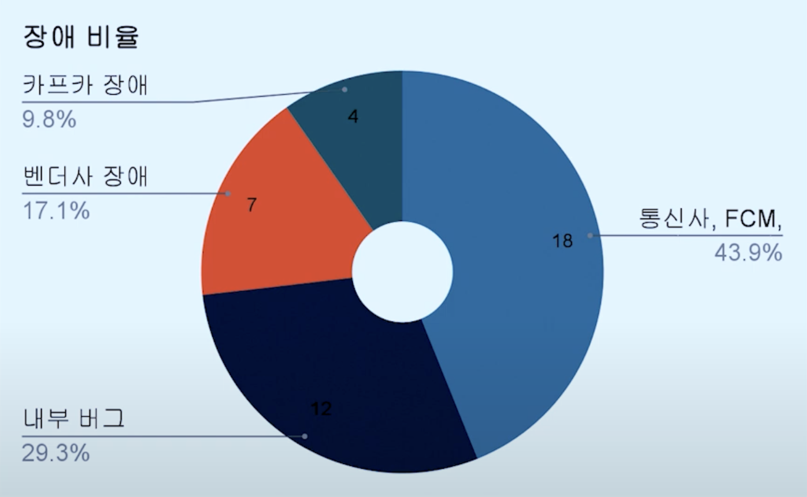
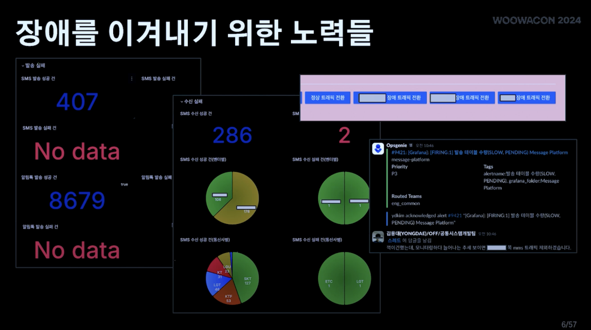
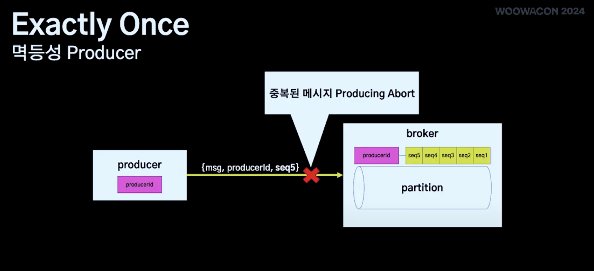
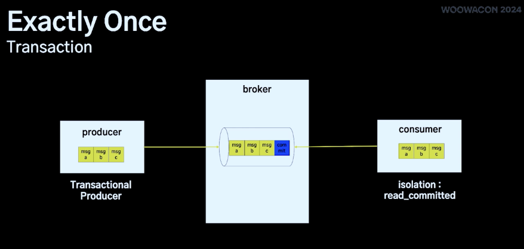
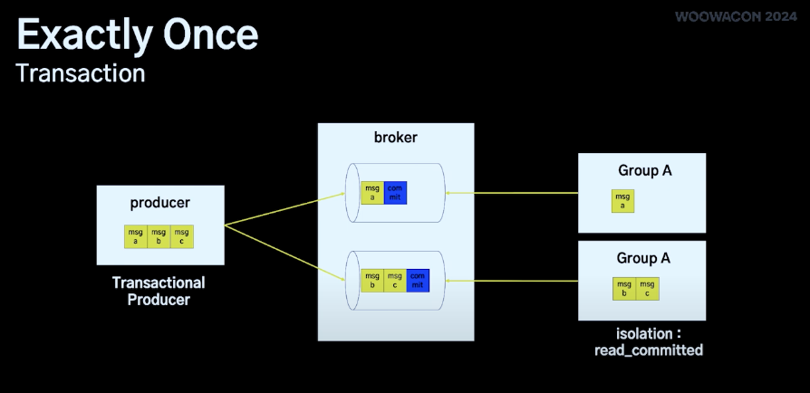
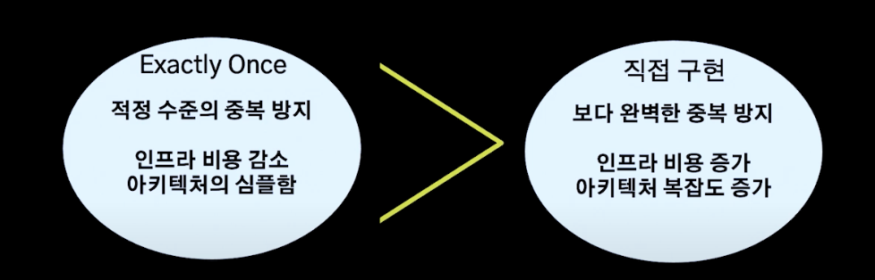
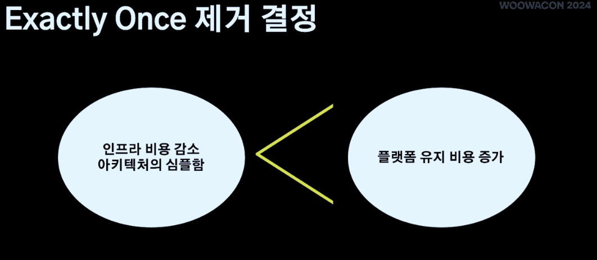
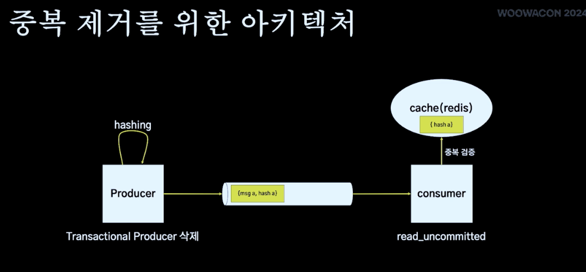
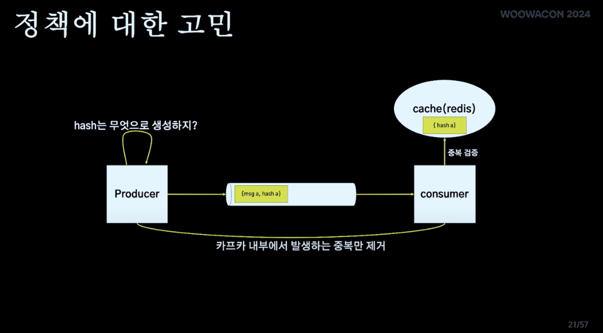

# **1. 메시지 플랫폼이란?**

배달의 민족에서는 고객(주문자), 사장님(가게), 라이더(배달원) 등에게 **문자, 푸시 알림, 알림톡** 같은 메시지를 보냄

이 메시지를 한 곳에서 관리하는 것이 **메시지 플랫폼**

✅ **왜 하나의 플랫폼에서 관리할까?**

- 메시지 발송 **리스크 관리** (한 곳에서 장애 감지 가능)
- **비용 절감** (비싼 발송 비용 최적화)
- **생산성 증가** (새로운 기능을 한 번에 전사 적용 가능)

하지만 **문제가 많았음.**

한 해 동안 **41건**의 장애가 발생했고, 한 달에 약 2건의 장애가 꾸준히 생김

---

# 2. 장애 원인은?

### 1️⃣ **외부 서비스 장애**

- 통신사(SKT, KT, LGU+), FCM(구글 푸시 서비스), 외부 메시지 서비스 장애
- 외부 문제라 우리가 해결할 수 없음 😢

### 2️⃣ **내부 버그**

- 메시지 플랫폼이 **여러 발송 채널(SMS, 알림톡, 푸시 등)을 동시에 관리** → 복잡도가 증가
- 각각의 발송 채널들이 기능적, 비기능적으로 서로 다른 요구사항이 있어서 장애가 발생

### 3️⃣ **벤더사 장애**

- 특정 메시지 발송 채널은 벤더사에 의존하고 있음
- 우리가 메시지를 요청하면 벤더사가 메시지를 발송해주는 구조
- 보통의 경우 장애 방지를 위해 메시지를 전송해주는 업체(벤더사)를 이중화해서 사용
- 배민의 경우: 비용 절감을 위해 삼중화했더니 장애 지점이 늘어남

### 4️⃣ **카프카(Kafka) 장애**

- API요청부터 실제 발송까지 이루어지는 파이프라인을 카프카로 관리
- **Kafka 장애 발생 시 메시지 발송 불가 → 서비스 직접 영향**
- 보통의 경우 Kafka를 **HA(High Availability, 고가용성) 구성을 제공하고 있음**
    
    > 
    > ✅ **Kafka HA란?**
    > 
    > - 메시지를 저장하는 **브로커(Broker)**를 여러 개 운영하고, 데이터를 **여러 브로커에 복제(Replication)**
    > - 장애가 나도 ISR(In-Sync Replicas)을 통해 자동 복구
    > - **Zookeeper**가 브로커 상태를 감시하고, 장애 발생 시 **자동으로 리더(Leader) 브로커 변경**
    > 
    > ✅ **Kafka 장애 대응 방법**
    > 
    > - **Replication Factor(복제 개수)**를 증가 → 한 브로커가 죽어도 메시지 손실 방지
    > - **Kafka 모니터링 강화** → 브로커 장애 감지 후 빠르게 대처
    > 
    > 하지만, Kafka HA 구조를 사용해도 **Kafka 전체가 장애 나면 메시지 발송이 중단**될 수 있음
    > 
- 배달의 민족: 카프카에 대한 가용성을 높이기 위해 **카프카 자체 클러스터도 이중화**하여 서비스 제공
    
    > 
    > 
    > 
    > ✅ **Kafka 클러스터 이중화 방식**
    > 
    > - **Active-Active 방식:** 두 개의 Kafka 클러스터가 동시에 메시지를 처리
    > - **Active-Standby 방식:** 하나의 Kafka를 주로 사용하고, 장애 발생 시 Standby Kafka로 자동 전환
    > 
    > **배달의 민족 메시지 플랫폼에서는 Active-Standby 방식을 적용**
    > 
    > - 장애 발생 시 Standby Kafka가 **자동으로 활성화**되며, 메시지 유실 없이 서비스 유지
    > - **데이터 일관성 유지가 용이**, 운영 부담 감소
    > 
    > **결과:**
    > 
    > - Kafka HA 구조 + 클러스터 이중화 덕분에 **Kafka 장애 발생 시에도 메시지 발송 유지 가능**!
    > - Kafka **내부 장애 & 전체 클러스터 장애 모두 대응**할 수 있는 구조 완성

---

# **3. 장애를 줄이기 위한 노력**

## 1️⃣ 장애 감지를 위한 모니터링 시스템

### **1) API 에러 & 애플리케이션 에러로그 모니터링**

- **애플리케이션 레벨에서 발생하는 오류**(예: HTTP 500, 503, 데이터베이스 오류 등)를 실시간 감지
- 특정 API에서 **오류 발생 빈도가 급격히 증가하면 장애로 판단**

### **2) 발송 히스토리 테이블 관리**

- **메시지 발송 이력을 테이블에 저장**하여, 메시지의 상태(성공/실패)를 추적
- 장애 발생 시 **어느 단계에서 실패했는지 즉시 확인 가능**

### **3) 벤더사 & 통신사별 성공/실패율 모니터링**

- 메시지 발송은 **벤더사(알림톡, SMS 업체)와 통신사(KT, SKT, LGU+ 등)를 거쳐서 고객에게 전달**됨
- 특정 벤더사나 통신사 조기 감지 가능

**예시:**

- 평소 99% 성공률이던 A 벤더사의 성공률이 70% 이하로 떨어짐 → **장애 발생 가능성 높음**
- 특정 통신사(SK, KT)에서만 실패율 급증 → **통신사 장애 감지**

### **4) 벤더사 트래픽 전환 기능 (리모트 컨픽)**

- 특정 벤더사(A사)가 장애가 발생하면, **자동으로 다른 벤더사(B사)로 트래픽을 전환**
- **리모트 컨픽(Remote Config)** 시스템을 이용하여 **즉시 전환 가능**
- 장애 발생 시 **운영팀이 직접 개입하지 않아도 자동 복구**

### **5) OpsGenie 연동 (장애 알림 시스템)**

- 중요한 메트릭(예: 메시지 발송 실패율, Kafka 처리 속도 등)에 대해 **OpsGenie와 연동**하여 **실시간 알림**을 받음
- 기존 장애도 **OpsGenie를 통해 빠르게 감지하고 대응**하여 큰 장애로 번지지 않음

## 2️⃣ **아키텍처 개선을 결정하게 된 가장 큰 장애**

- 이렇게 철저하게 모니터링을 해도 **완전히 장애를 방지할 수는 없음** 특히 **2023년 10~11월에 발생한 장애**는 메시지 플랫폼에서 가장 **큰 규모의 장애**

✅ **장애 주요 지표**

- **발송 실패율:** 56%
- **장애 대응 시간:** 8시간
- **개발팀 5명 총 30시간 투입**
- **서비스 가용성 목표 달성 실패**

**→ 이 장애는 메시지 플랫폼 운영 역사상 가장 큰 장애였음** → **아키텍처 개선을 결심하는 계기**

## 3️⃣ 장애 원인 분석

### 1) 장애의 주요 현상

- **Kafka 프로듀서(Producer)에서 `Invalid Producer Epoch` 오류 발생**
- **Kafka 컨슈머(Consumer)에서 특정 파티션이 계속 `Consuming 중단` 상태**
- 특정 파티션에서 **처리 속도(Processing Latency)가 급격히 증가**
- **모니터링 시스템에서 이상 감지 → 장애 발생 인지**

### 2) 장애 원인 분석 과정

- 장애의 원인을 찾기 위한 다양한 방법을 시도

✅ **Kafka 프로듀서 로그 분석**

- **에러 메시지: `Invalid Producer Epoch`**
- 이 오류는 **"Exactly Once" 기능을 사용할 때 발생하는 대표적인 문제**
- Kafka 프로듀서의 **트랜잭션이 꼬이면서 메시지 발송 장애 발생**

✅ **Kafka 컨슈머 모니터링**

- 특정 파티션에서 **처리 속도가 느려지면서 메시지 처리량 급감**
- Kafka 컨슈머가 특정 파티션을 **읽지 못하고 대기 상태로 머무름**
- 결과적으로 **해당 파티션을 사용하는 메시지 발송이 중단**됨

✅ **Kafka Broker 성능 테스트 진행**

- **부하 테스트(Load Test) 실행** → 특정 시점에서 Kafka가 트랜잭션을 제대로 처리하지 못함
- Kafka의 **"Exactly Once" 기능이 비효율적인 동작을 하면서 트랜잭션 충돌 발생**

---

# **4. Kafka "Exactly Once"**

- Kafka에는 메시지를 중복 없이 한 번만 보내는 **"Exactly Once" 기능**
- 메시지 중복 방지를 위해 **"Exactly Once"** 기능을 사용
    
    > Exactly Once
    > 
    > 
    > 
    > 
    > ### **(1) Idempotent Producer(멱등성 프로듀서)**
    > 
    > - **프로듀서가 메시지를 보낼 때, "Producer ID"와 "Sequence Number"를 함께 보냄**
    > - **브로커가 이 값을 비교해서 중복 메시지를 필터링**
    > 
    > **예제)**
    > 
    > - **프로듀서가 메시지 A를 전송 → "Producer ID = 123, Sequence Number = 1"**
    > - **브로커가 메시지를 저장**하고, "Producer ID 123의 Sequence Number = 1"을 기억함
    > - 브로커쪽에서 프로듀서 아이디당 시퀀스 넘버를 5개까지 가지고 있다가 중복되는 시퀀스 넘버 or 더 작은 시퀀스 넘버 or 더 큰 시퀀스 넘버가 넘어오는 경우에 적절한 에러를 리턴하여 중복을 해결
    > 
    > **결과)**
    > 
    > - **프로듀서가 장애 발생 후 재시도해도 중복 메시지 방지 가능**
    > - **At Least Once에서 발생하는 중복 문제 해결**
    > 
    > ---
    > 
    > ### **(2) Kafka Transactions (트랜잭션)**
    > 
    > 
    > 
    > - 프로듀서가 메세지 A,B,C를 Transactional Producer를 발송
    > - 브로커에선 A,B,C, commit message가 들어감
    > - 컨슈머쪽에 isolation이 read_committed로 설정이 되어있다면 메세지 A,B,C를 한 트렌젝션에 처리해야하는 것으로 인식후 처리
    > 
    > ### 트렌젝션 사용시 주의
    > 
    > 
    > 
    > 1. 프로듀서가 메세지 A,B,C를 발송하였을 때 복수개의 토픽이 있을 경우 메세지들이 각각의 파티션에 나눠서 들어갈 수 있음
    >     
    >     그러면 컨슈머에서 같은 그룹에 대한 컨슈머라해도 해당 메세지는 다른 쓰레드에서 처리될 수 있음
    >     
    > 2. 아래 컨슈머의 경우 메세지 B,C를 처리
    >     - 이때 c에서 오류가 난 경우 B는 중복처리가 될 수 있음
    >     - 비즈니스 로직으로 보장해야함
    > 
    > ### 과정
    > 
    > - 프로듀서가 **여러 개의 메시지를 하나의 트랜잭션으로 묶어서 전송**
    > - 컨슈머가 **트랜잭션이 완료된 메시지만 읽도록 보장**
    > 
    > **예제)**
    > 
    > - **프로듀서가 메시지 A, B, C를 전송 → "트랜잭션 시작"**
    > - **Kafka 브로커가 메시지를 저장하지만, 아직 컨슈머에게 제공하지 않음**
    > - **프로듀서가 "트랜잭션 완료" 신호를 보내면, 컨슈머가 메시지 A, B, C를 읽을 수 있음**
    > 
    > **결과)**
    > 
    > - **메시지 일부만 도착하는 문제 방지** (예: A는 도착했는데, B, C가 사라지는 문제 해결)
    > - **트랜잭션 단위로 메시지를 처리 가능**
    
- 하지만 이 기능이 **"행잉 트랜잭션(Hanging Transaction)"** 문제를 유발해 장애 유발
    
    > ***Hanging Transaction이란?**
    > 
    > - Kafka 트랜잭션이 **정상적으로 종료되지 못하고 계속 대기 상태**가 되는 현상
    > - 트랜잭션이 계속 쌓이면서 **Kafka의 성능 저하 & 메시지 발송 실패**
    

## 메시지 플랫폼에선 **Exactly Once를** 왜 사용하게 되었을까?

## ✅ **Kafka "Exactly Once" 기능 제거**

## 중복 제거에 대한 고민

- 프로듀서에서 해시를 생성 > 메세지랑 함께 전달
- 컨슈머쪽에서 캐시에 해시를 저장
- 만약 발송할 때 해당 해시가 캐시에 있다면 발송을 하지 않음

- 해시는 무엇으로 생성해야할까?
1. 프로듀서쪽에서 수신자 + 메시지 내용으로 해시 생성
- 그러면 수신자에게 동일한 내용을 중복해서 발송하지 않도록 막을 수 있음
- 하지만 만약 클라이언트가 API요청으로 동일한 사용자에게 동일한 내용으로 두번 발송한 경우 중복의 대상일까? 허용의 대상일까?
- 플랫폼쪽에서는 판단하기 어려움
- API에서 **중복을 허용할지 말지 선택할 수 있는 옵션**을 제공하면 어떨까?
- 예를 들어,
    - **광고 메시지**는 중복을 막아야 하지만,
    - **배달 알림**은 중복이 허용될 수도 있음.
- 클라이언트(API를 사용하는 측)에서 **중복을 허용할지 선택하도록 하자!**

**하지만 이 방법도 문제가 있었음**

- API 옵션이 점점 많아지면서 **사용하기 복잡해짐**
- 클라이언트가 설정을 잘못하면 **예상치 못한 메시지 차단/중복 문제가 생김**

**그래서 결론: Kafka 내부 중복만 방지하고, 클라이언트 설정은 최소화하자**

- 결국 **Kafka 내에서 발생하는 중복 메시지만 막는 방식으로 결정**
- **API 요청이 올 때마다 고유한 해시 값을 생성해서 Redis에 저장하는 방식으로 변경**

---

### 결정

- Kafka의 트랜잭션을 없애고, 메시지 중복 처리는 **Redis 캐시를 활용**
- **API 요청 해시값을 생성 & Redis에 저장하여 중복 메시지 필터링**
- **Kafka 성능 최적화 & 메시지 발송 속도 향상**
1. **API 요청이 오면 메시지의 해시(Hash) 값을 생성**
2. **해시 값을 Redis 캐시에 저장**(TTL 설정)
3. **컨슈머가 메시지를 발송하기 전에 Redis에서 중복 여부 확인**
4. **중복 메시지는 발송하지 않음**

> **예제)**
> 
> 1. API 요청: "고객 A에게 주문 완료 푸시 메시지 전송"
> 2. 해시 값 생성: "주문완료:A"
> 3. Redis에 해시 값 저장
> 4. 컨슈머가 메시지를 읽기 전에 Redis에서 중복 체크
> 5. **이미 저장된 해시 값이면 메시지를 중복 발송하지 않음**

---

## 캐시 시스템 최적화 과정

- 처음 Redis 캐시를 도입했을 때, **메모리 사용량이 예상보다 2.5배 높아지는 문제**가 발생

### 문제 원인: **Redis 메모리 사용량 예측 실패**

- Redis에서 **1개의 키(해시 값)당 120바이트 예상했으나, 실제로는 272바이트 사용**
- 이유: **Redis의 내부 오버헤드** (해시 테이블, 클러스터 정보, 레플리카 데이터 등 추가 저장)
- 결과적으로 **메모리 부족으로 인해 장애 발생**

### **해결 방법**

- **TTL(Time To Live) 설정 최적화** (불필요한 데이터 자동 삭제)
- **Redis 메모리 할당량 조정**
- **LRU(Least Recently Used) 캐시 정책 적용 → 오래된 데이터 자동 제거**

**결과:**

- Redis 캐시를 최적화한 후 **메모리 사용량을 50% 감소**
- Kafka 트랜잭션 없이도 **중복 메시지 문제 해결**

---

# **5. 트래픽 3배 확장을 위한 성능 개선**

## 1️⃣ **FCM 응답 지연 문제 해결**

- Google FCM에서 **특정 시간마다 15분 이상 응답 지연** 발생
- 응답 지연으로 인한 Kafka rebalancing 문제 발생
- **애플리케이션 레벨에서 강제 타임아웃 적용**으로 해결

## 2️⃣ **쓰레드풀 최적화**

1. **메타 정보 조회**와 **실제 발송** 쓰레드풀 분리
2. 트래픽 성격에 따른 쓰레드풀 분리:
    - **실시간성** (주문 관련 푸시)
    - **일반**
    - **배치성** (광고성 메시지)

### 3️⃣ **비동기 방식으로 전환**

- 기존: 한 번에 하나의 메시지만 처리하는 동기 방식
- 변경: 여러 메시지를 동시에 처리하는 비동기 방식

✅ 여러 개의 메시지를 **동시에 발송**하고, 결과만 모니터링

✅ 실패한 메시지는 **Dead Letter Queue**에 넣고 재시도

- 실패한 메시지는 별도 큐에 저장
- 실패 메시지 재처리 시스템 구축
- 메시지별 유효시간 설정으로 무한 재시도 방지

## 4️⃣ **라우터 모듈 제거**

- SMS/알림톡: 벤더사 삼중화로 라우터 필요
- 푸시: Google FCM으로 고정되어 있어 라우터 불필요
- 푸시 발송 파이프라인에서 라우터 제거로 성능 향상

## 5️⃣ **Kafka 요청 최적화**

- **배치 리스너** 적용:
    - 기존: 메시지 1개당 1번 커밋
    - 변경: 여러 메시지 처리 후 1번 커밋
- Kafka 요청 횟수 대폭 감소

---

# **6. 최종 결과**

✅ **파티션 수 720개 → 100개로 감소하면서도 성능 유지**

✅ **실시간 푸시 메시지 10초 이내 발송**

✅ **현재 2배 트래픽까지 처리 중** (목표 3배)

- 발송 시스템 제약으로 아직 3배 트래픽 미도달
- 일반 메시지: 1분 이내 발송
- 실시간성 메시지: 10초 이내 발송