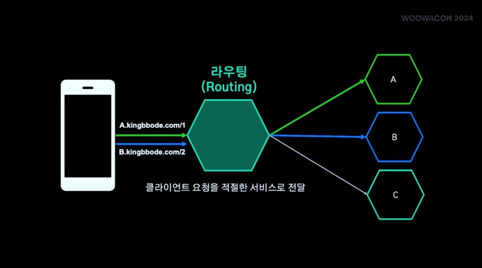
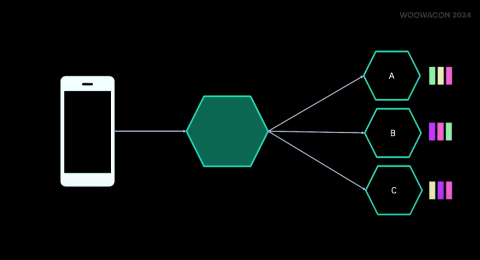
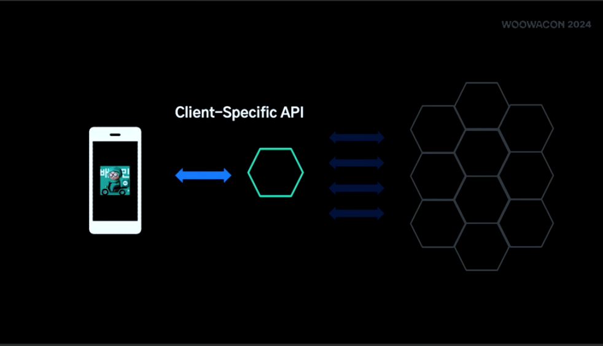
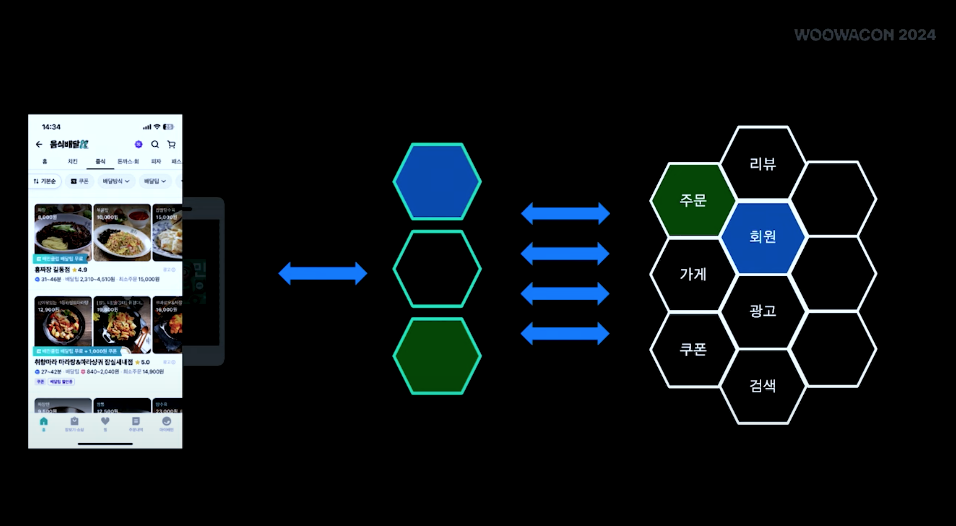
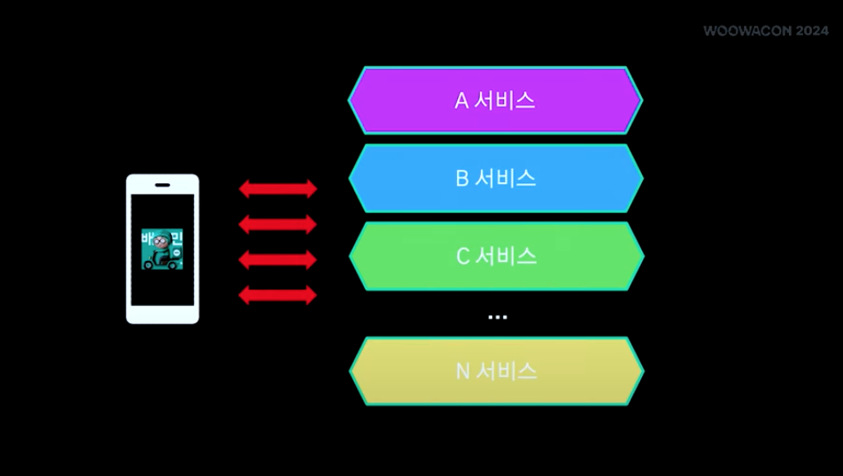
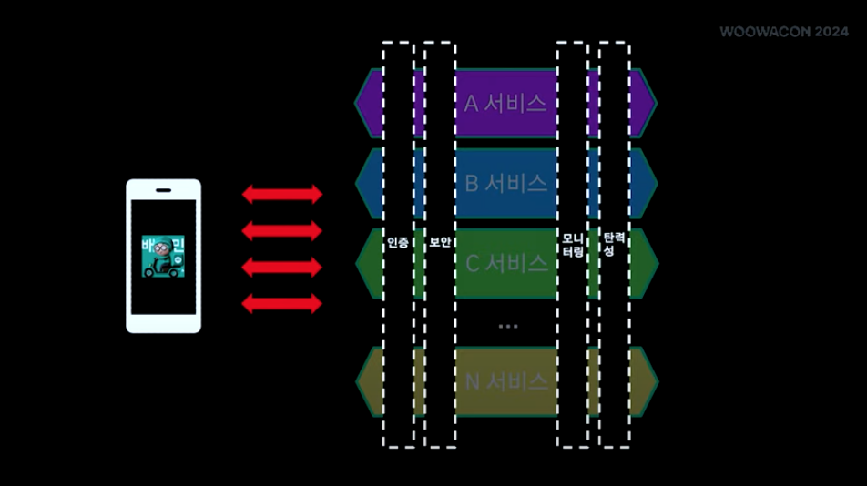

# API Gateway

> 참고 영상 : [배달의 민족 API Gateway](https://www.youtube.com/watch?v=Ci_DsTkzcRY&list=PLgXGHBqgT2Tu7H-ita_W0IHospr64ON_a&index=4)

## API Gateway란?

### API

application programming interface, 컴퓨터나 컴퓨터 프로그램 사이를 연결하여 상호작용을 가능하게 하는 인터페이스

서로 다른 소프트웨어가 데이터를 주고 받을 수 있도록 규칙을 정의한 것으로, **REST, GraphQL,gRPC** 와 같은 표준 프토콜을 사용

### Gateway

컴퓨터 네트워크에서 서로 다른 통신망, 프로토콜을 사용하는 네트워크 간의 통신을 가능하게 하는 컴퓨터나 소프트웨어

다른 네트워크로 들어가는 입구 역할을 하는 **네트워크 포인트**, 한 시스템에서 다른 시스템으로 요청을 전달하는 중간 관문 역할 (통신 중개, 보안 기능, 트래픽 관리)

### API + Gateway = API Gateway

API 프런트 엔드 역할을 하는 서버로, API 요청을 수신하고, 제한 및 보안 정책을 시행하고, 백엔드 서비스에 욕청을 전달한 다음 응답을 요청자에게 다시 전달한다.

대표적인 API Gateway 솔루션

- NGINX
- Kong
- AWS API Gateway
- Spring Cloud Gateway

### 1. 라우팅(Routing)

클라이언트 요청을 적절한 서비스로 전달

### 2. 횡단관심사(Cross-Cutting Concerns)

인증,인가,모니터링, 탄력성과 같은 중앙에서 연결적으로 처리

## MSA에서 API Gateway가 왜 필요한가?

MSA 구조로 인한 문제점 분석

1. 클라이언트 의존성 증가로 인한 확장성 저하
   - MSA에서 지향하는 부분 : 느슨한 연결성
2. 불필요한 정보가 클라이언트에 노출
   - 고객의 email 주소를 알고 싶다 => 개인 정보 api 요청 : json (email + 주소 + 성별...)
3. 클라이언트에 비지니스 정책 노출
   - A와 C 서비스가 합쳐진 B의 서비스구조를 알아버릴 수도 있다. (치명적은 부분)

### API Gateway Pattern의 클라이언트 서버

클라이언트의 요구사항을 전담하는 서버의 특정 API 를 통한 데이터 가공 후 클라이언트 정송

1. 도메인시스템과 클라이언트 간 의존 제거
2. 필요한 정보만 전달
3. 비지니스 정책 반영된 결과 전달

#### MSA에서 도메인들이 분할되면서 발생하는 문제를 프론트 서버가 일정 부분 해소할 수 있다.

#### 해당 문제를 해결하기 위해 API Gateway가 필요한 건 아니다.

### API Gateway와 프론트엔드 서버

> 조직의 커뮤니케이션 => 마이크로서비스 구조
> 조직의 비즈니스 영역 => 마이크로 서비스로 구성

각각의 도메인별 프론트엔드 서버가 생긴다.

하지만 이때 각각의 서비스에서 동시에 처리해야 하는 문제가 발생한다면 ?

 

MSA 규모 증가 => 프론트엔드 서버 증가 => 횡단관심사를 공유하는 시스템 수 증가 => **유지 보수 비용 증가**

즉, MSA에서 서비스가 성장할 수록 횡단관심사 문제가 커진다.

따라서 프론트엔드 서버와 클라이언트 사이에 **횡단관심사 문제를 해결하기 위한 중개 역할로 API Gateway가 필요**하다.
