# 📌 Kafka 기반 대규모 데이터 동시성 최적화

> 배달의 민족이 대규모 데이터를 다룰 때 발생할 수 있는 동시성이슈, 순서보장을 Kafka를 통해 해결하는 과정과 Request-Reply 패턴으로 처리 결과를 수신하는 방법에 관련된 내용

# 도입배경

주문이 급증하는 상황에서 주문수 대비 라이더가 부족하고 기상악화 및 시스템의 문제로 정상적인 배달이 어려운경우 배달의 민족에서는 **배달 반경 축소**를 통해 이를 해결한다.

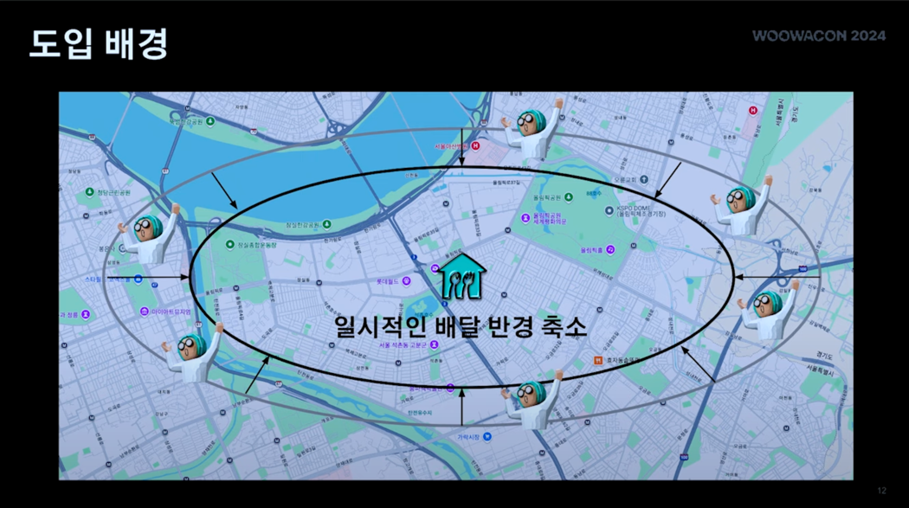

## 문제 1. 동시성 이슈

그렇다면 배달 반경이 축소되어야하는 N개의 트리거들이 동시에 같은 컬럼을 변경한다면? 또, 하나의 가게가 아닌 여러개의 가게에 이와 같은 로직이 반영되어야한다면?

👉 Deadlock, Lock wait timeout과 같은 에러 발생

그래서 이를 해결하기위해 `Redis`, `DB Lock`등 `Lock`으로 이를 해결하려 시도했었다.

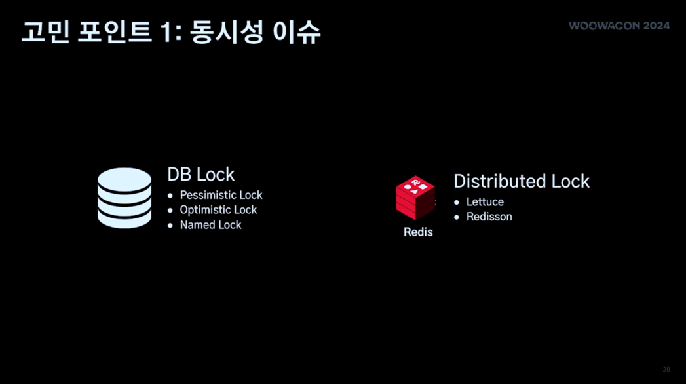

## 문제 2. 순서 보장

배달 반경 축소는 트리거의 종류에 따라 축소 반경이 다르다.

배민팀은 라이더 수의 부족 => 시스템 오류가 연달아 동작할 때 범위가 아래의 사진처럼 변화할 것이라 기대했다.

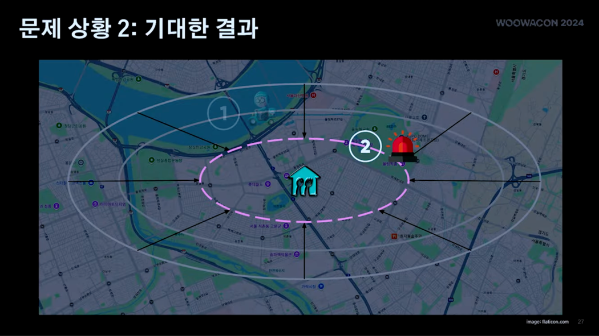

하지만 실제로 아래처럼 동작하는 경우가 발생했다.

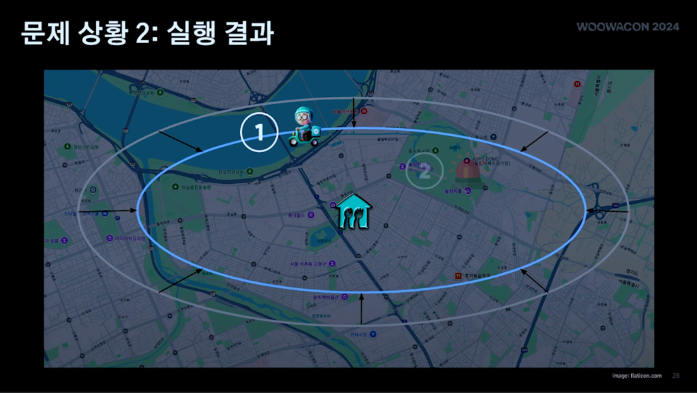

근데, 문제 1에서 시도한, 단순히 Lock으로 이와 같은 것들이 해결 가능할까?

Redis 와 같은 분산 락의 경우, 동시성이 증가할수록 락 획득의 경합이 심화된다. 즉, 요청의 순서보장의 복잡도가 계속 증가한다.

## 문제 3. 처리 결과

주문 유입량 조절 처리가 성공했는지, 실패했는지 알아야했다. 처리결과가 실패인경우 추가 조치할 수 있어야 했기 떄문이다.

## 카프카를 선택한이유

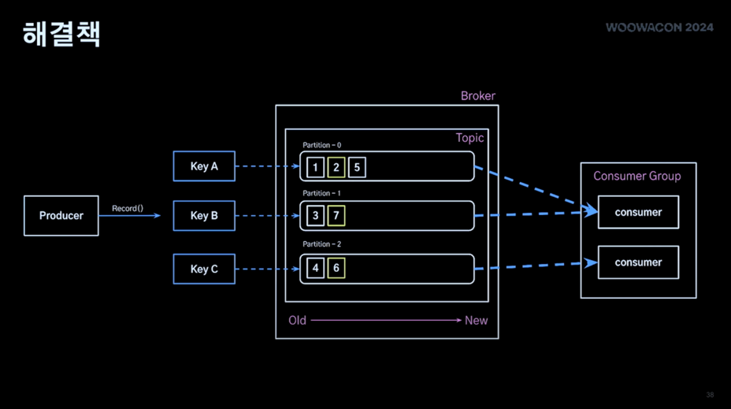

위의 3가지 중 2가지의 이슈를 카프카로 해결했다. 카프카는 내부적으로 큐를 사용하기에 순서를 보장할 수 있고, 파티션을 여러개 사용하며 동시성 이슈를 해결할 수 있다고 생각했다.

## Request-Reply 패턴

단순하게 카프카만 사용하면 처리결과를 해결할 수 없었다. 따라서 Enterprice Integration Patterns의 Request-Reply Pattern을 도입했다.

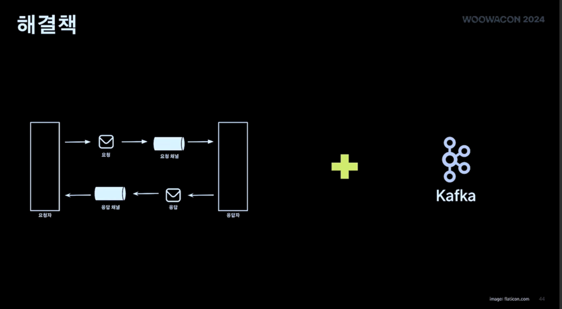

또 Spring 자체적으로 ReplyingKafkaTemplate를 제공하기에 이를 활용하여 PoC를 진행했고, 문제를 해결했다.

### 분산락 시스템과 Request-Reply의 차이는 무엇인가

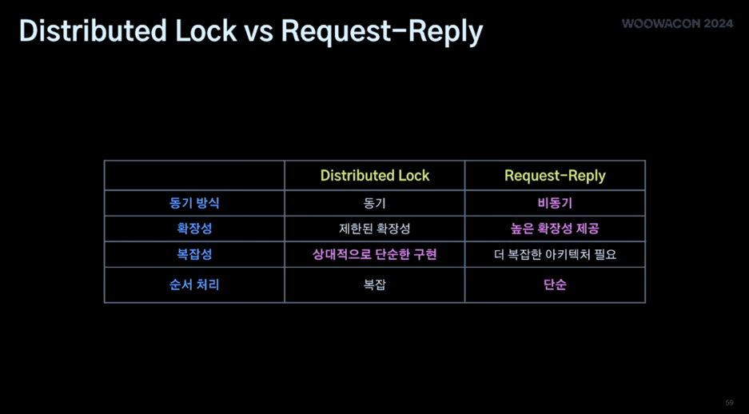

#### 1. 동기 방식

우선 분산 락 시스템의 경우엔 동기적으로 진행한다.

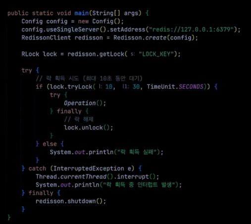

위 코드의 try - catch 문을 보면 Lock을 시도하고 해제하는 과정이 동기적으로 진행됨을 알 수 있다.

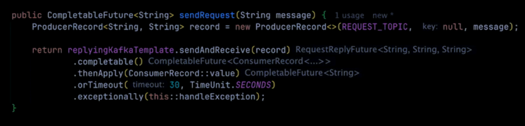

반면 Request-Reply 패턴 코드를 보면 CompletableFuture을 활용하여 Kafka로 메시지를 전송하고 응답을 비동기로 처리하는 방식임을 알 수 있다.

응답을 대기하는 기간동안 블로킹되지않아 다른 작업을 할 수 있다.

#### 2. 확장성

분산락은 동시접근이 증가할수록 락 경합이 증가하고, 대기시간이 증가한다. 그리고 레디스 서버 자체의 병목현상이 발생할 수 있다.

반면 Request-Reply 와 kafka를 활용한다면 파티션 수를 늘려 수평적 확장이 가능하고, consumer 그룹으로 병렬 처리가 가능하다.

#### 3. 복잡성

`Redis`와 같은 분산 락 구조는 크게 복잡하지 않은 구조를 가지고있다.

반면 Request-Reply의 경우 메시지 브로커, 프로듀서 등 컴포넌트에 대한 이해가 필요하고 요청 및 응답 관련된 코드또한 작성해야한다. 메시지 기반 프로그래밍에 대한 이해도 필요하다.

# 실전 적용

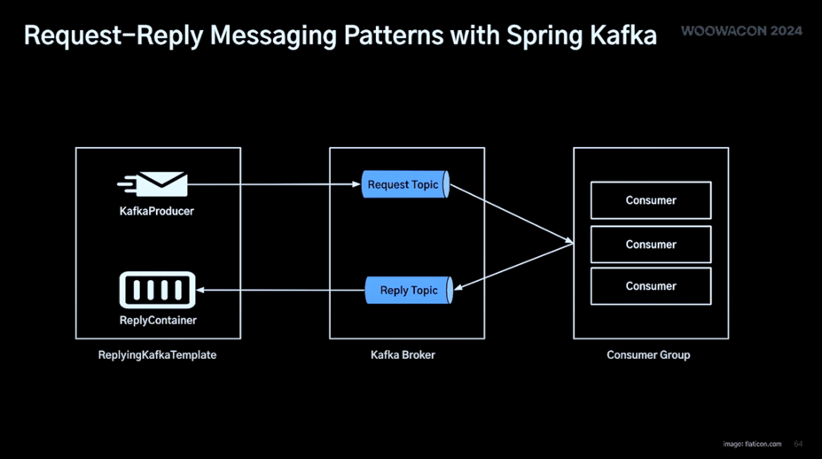

## 요청 메시지 구조

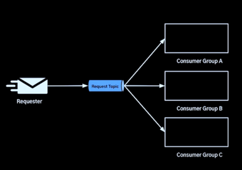

```java
public interface Request<T> {
    String getId(); // 요청 식별자
    String getTarget();
    String getKey(); // 요청이 할당될 토픽의 파티션 지정 , 도메인별 단일 토픽 사용
    String getType(); // 컨슈머가 담당할 도메인 로직
    T getData();
    LocalDateTime getRequestedAt();
}
```

## 응답 메시지 구조

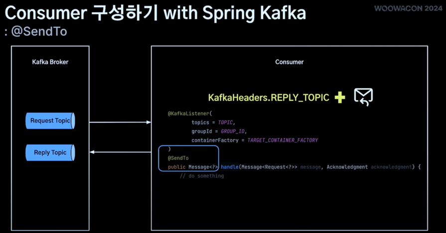

Spring Kafka의 @SendTo 활용
- 요청 메시지를 수신한 카프카 리스너에 @SendTo 추가
- 카프카 헤더에 직접 Reply Topic 지정 / @SendTo value 지정
- ListenerContainer 구성 시 응답할 메세지의 ReplyTemplate 정의

## 요청 메시지, 응답 메시지 매핑 (비동기 처리)

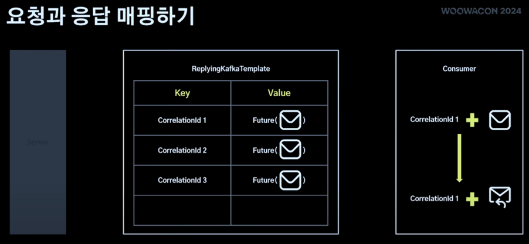

1. 요청을 보낼 때 Correlation + Future(Req. Message) 형태로 보낸다.
2. Consumer는 Correlation과 메시지를 같이 구독한다.

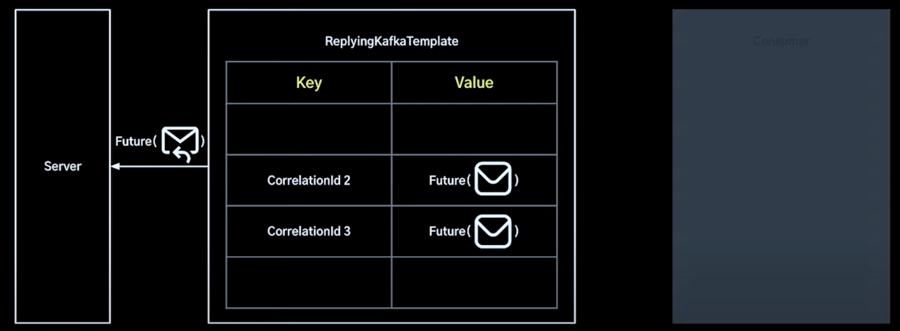

3. 이후 ReplyingKafka가 CorrelationId를 사용하여 어떤 것과 매핑되는지 확인하고 서버에 돌려준다.

### 매핑 정리

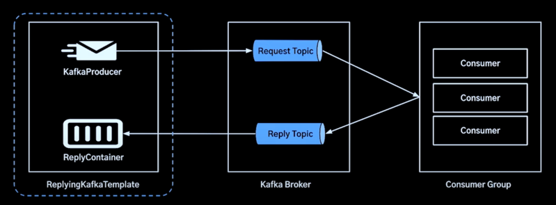

- CorrelationId를 사용해 매핑관계를 찾는다.
  - 요청 메시지 별로 Correlation - Future 형식으로 보관
  - 응답 메시지에 포함된 CorrelationId로 매핑되는 요청 찾기
  - 이 과정은 ReplyingKafkaTemplate에서 발생!

## 여러개의 Requester가 있을 때, 응답 메시지를 처리하는 방법

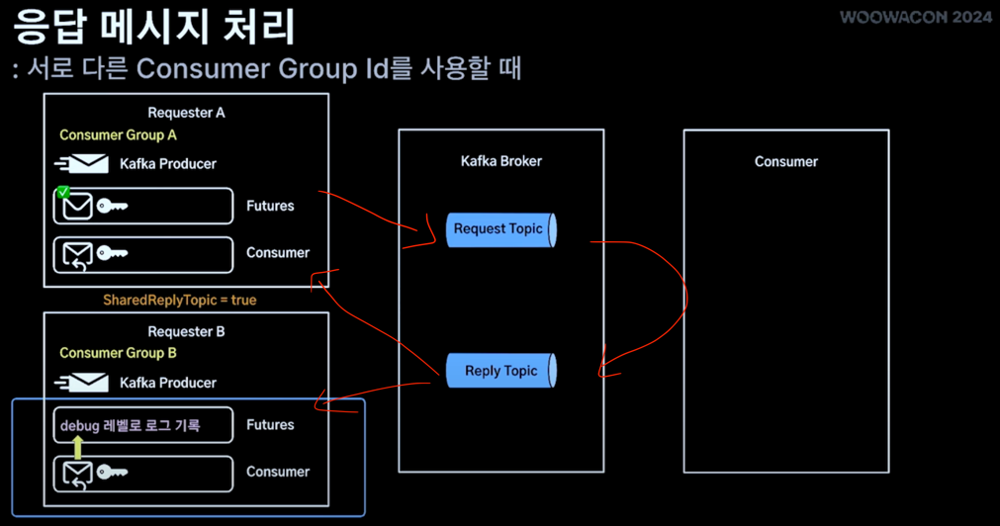

- uuid를 활용하여 consumer id를 설정하여 중복 방지 - 이는 단일 Reply Topic 구성이기에 가능
- 관심없는 응답메시지는 debug 레벨 로깅으로 처리 (SharedReplyTopic 설정)
- 27분 30초부터 보기
 
# 💡결론

- Client A가 서버에 A,B,C,D를 바꿔달라고 하는 요청, Client B가 서버에 B,D를 바꿔달라고 하는 요청이 동시에 왔을 때 동시성 이슈가 발생한다.
  - 원하지 않는 결과를 가져올 수 있다.
  - A요청과 B요청이 순서대로 올 때, A가 락을 가지고 있다면 B의 요청이 실패할 수 있다.
    - 이와 같은 문제를 해결하기위해 서버와 DB 사이에 Kafka를 도입했다. (35분)
    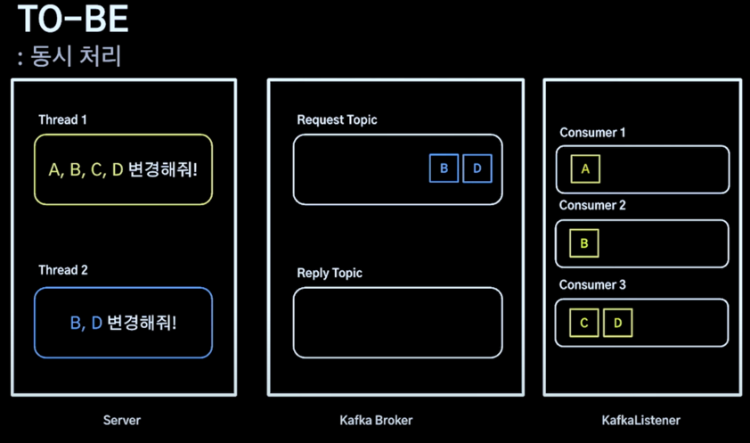
        - 수십만건의 대규모 데이터가 N개의 트리거로 동시 처리 가능 (동시성 이슈, 순서보장)
        - Request-Reply 패턴으로 처리결과를 수신할 수 있었음.
  
# 📚 Ref

- [Kafka 기반 대규모 데이터 동시 최적화 : Request-Reply 패턴 활용 사례](https://www.youtube.com/watch?v=Rcow99TIMmc&list=PLgXGHBqgT2Tu7H-ita_W0IHospr64ON_a&index=6)