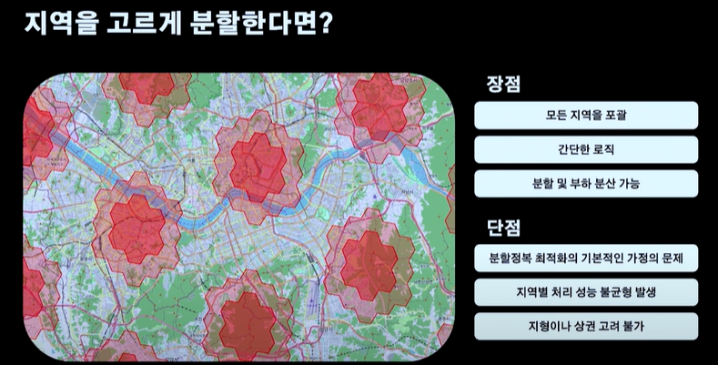

# 분할정복과 ML을 활용한 데이터 최적화

## 1. 발표 소개
**발표자:** 윤대영, 박영수  
**주제:** 머신 러닝을 활용한 배달 서비스 최적화

## 2. 배경
### 배차 시스템 개요

- 배달 주문량: 하루 약 100만 건
- 10분당 최대 5만 건의 배달 생성
- 5만 명의 라이더가 운행 중일 경우, 최대 25억 건의 배차 연산 필요
- 비효율적인 배차를 제거하고 최적화 알고리즘을 활용해 배달과 라이더 매칭 수행

### 배차 최적화 과정
1. 배차 지역 선정
2. 배달과 라이더의 모든 조합 생성

3. 비효율적인 배차 후보 제거 (거리, 무게 등 고려)

4. 비용 계산 및 효율성 점수 부여

5. 최적의 배달-라이더 조합 추천 및 매칭

## 3. 기존 지역 분할 방식과 문제점
### 기존 방식: 균등한 크기로 지역 분할
- 장점: 단순한 로직으로 부하 분산 가능
- 단점:
  1. 지역별 주문량 차이 고려 부족 → 강남 vs 강원도의 차이
  2. 한강, 대형 도로 등 지형적 요소 미반영 → 라이더 경로 최적화 어려움
  3. 배달 요청 동시성 문제 발생 → 배차 지연 및 중복 배차 가능성 증가
  4. 무리한 배차 유발 (Wild Goose Chase 문제) → 불필요한 거리 이동 증가
  

### 그렇다면 지역을 어떻게 잘 나누어야 할까 ?

### 지역을 나누는 것이 가능한가 ?

## 4. 새로운 지역 클러스터링 접근법
### H3 라이브러리 활용
- **H3:** Uber에서 개발한 위치 데이터 그룹화 라이브러리

- **특징:**
  - 세계를 육각형 셀로 분할 (레벨 0~15)
  - 계층적 부모-자식 관계 유지
  - 균일한 공간 분할 및 인접성 고려 가능

### 문제 해결 접근법
1. 기존 행정동 기반 지역 경계를 참고하여 최적의 지역 단위 설정
2. 배달 밀집도 및 라이더 이동 패턴 분석 후 유동적 지역 설정
3. 머신 러닝을 활용한 데이터 최적화로 지형적 요소 반영

## 5. 결론
- 머신 러닝을 활용한 지역 클러스터링을 통해 배달 최적화 가능
- 배달 밀집도와 라이더 이동 경로를 고려한 지역 설정이 중요
- 지속적인 데이터 분석을 통해 최적화 모델 개선 필요

## 추가 자료 (H3)

### 1-1 ) H3 란 ?
---
#### H3는 Geo-Hash와 유사한 전세계 지도를 육각형 셀로 분할하는 지리 공간 인덱싱 시스템이다.

H3는 Uber에의해 만들어졌으며, 현재는 Apache 2 라이센스하에 오픈소스로 되어있다.

H3는 아래와 같이 다양한 기능을 제공한다.

- 위경도를 H3셀로 변환할 수 있다.
- H3셀의 중심 위경도를 찾을 수 있다.
- H3셀의 경계(Boundary) 좌표를 구할 수 있다.
- H3셀의 이웃을 찾을 수 있다.

### 1-2 ) H3는 Grid 시스템이며, Grid 시스템은 인덱싱이 핵심이다
---

위경도는 실제 정확한 위치를 측정하는 것이 목표여서 무한하게 표현되기때문에 특정 영역 (Area)에 대한 처리를 하기엔 부적합하다.

그리고 공간에 대한 처리를 더 효율적으로 하기위해 만들어진 것이 바로 Grid 시스템이다.

Grid 시스템의 핵심은 바로 인덱싱이다. 즉, 지구의 특정 지역을 일정한 크기대로 인덱싱하여 공간 처리에 대한 효율을 높이는 것이다.

### 💁‍♂️ Geo-Hash로 알아보는 그리드 시스템의 인덱싱

Grid 시스템의 가장 초기 시스템격인 `Geo-Hash`는 말그대로 hash 함수를 이용한다.

> hash 함수의 핵심은 특정 데이터를 찾을 때 하나하나 비교하며 찾는 것보다 해시 키를 계산하여 그 키에 해당하는 장소를 바로 찾는 것이다. O(1)의 시간복잡도

`위경도 -> Hash -> Geo-Hash`로 변환되는 과정

특정 Hash 함수를 이용하여 위경도를 특정 공간을 나타내는 공간으로 인덱싱한다.

쉽게 말해, Geo-Hash는 특정 해시 함수를 이용하여 공간 상의 위경도 좌표값을 일정한 값으로 치환하는 것을 의미한다.

그리고 이를 통해 전 지구를 특정 크기의 정사각형으로 인덱싱함으로써 공간 처리에 대한 효율을 높인다.

### 💁‍♂️ H3도 Geo-Hash와 동일하게 인덱싱한다.
H3도 위에서 말한 Geo-Hash와 별반 다르지않다. 동일하게 위경도를 H3의 해시 함수를 통해 H3 셀로 변환하여 인덱싱한다.

`위경도 -> H3 컨버터 -> H3`로 변환되는 과정

위경도를 H3로 변환하여 특정 공간을 나타내는 공간으로 인덱싱한다.

쉽게 말해, H3도 Geo-Hash와 동일하게 특정 함수를 이용하여 공간 상의 위경도 좌표값을 일정한 값으로 치환한다.

그리고 이를 통해 전 지구를 육각형으로 인덱싱함으로써 공간 처리에 대한 효율을 높인다.

지구를 H3셀로 인덱싱한 결과

### 1-3 ) 왜 육각형인가?
---

H3와 Geo-Hash 모두 그리드 시스템이며, 지구를 특정 규격의 일정한 크기로 클러스터링하여 공간 처리를 효율화시켰다고보면된다.

하지만 H3는 정사각형인 Geo-Hash와 다르게 육각형으로 공간을 클러스터링한다.

#### 🤔 왜 육각형일까?

### 1️⃣ Neighbors Traversal - 육각형끼리의 거리가 동일하다.

위 그림에서 볼 수 있듯이, 삼각형과 사각형은 인근 셀과의 좌우상하과 대각선의 거리가 모두 다르다.

반면에 H3는 좌우상하와 대각선의 거리가 모두 동일하다.

즉, 인접하고있는 셀로 이동할 때 어떠한 방향과 각도로 이동하든 각 셀의 중심점까지의 거리가 동일하다.

### 2️⃣ 평균적으로 사각형보다 육각형이 더 작은 오차 범위로 Polygon (다각형)공간을 셀로 채울 수 있다.

육각형은 특정 Polygon을 채우는데 가장 최적의 도형이라고한다.

그리고 H3의 공식문서에서 평균적으로 사각형보다 육각형이 더 작은 오차 범위로 Polygon (다각형)공간을 셀로 채울 수 있다고 말한다.

### 3️⃣ 육각형은 Distortion(왜곡)없이 지구를 Projection (투영)할 수 있다.

지구는 Sphere (구체)이므로 평평하지않다. 그러나 Grid System은 평평하게 공간을 분석한다.

그러므로 지구를 Grid System으로 Projection (투영)해야 사용 및 분석할 수 있다.

구체를 평평하게 Projection하면 어쩔 수 없이 왜곡이 발생하게된다. H3는 이러한 왜곡을 최소화하는 Polygon이 육각형이라고 판단되어 채택했다고한다.

실제로 가장 중요한 이유였다고하며, 다양한 Projection 방법중에 H3는 DYMAXION 방법을 채택했다고한다.

#### ❗️ 물론 단점으로 H3는 세분화 및 재조합(subdivision)이 완벽하지않다는 것이다. - 중요

위 그림을 보면 알 수 있듯이, 모든 H3셀은 7개의 자식을 가지게되지만, Geo-Hash의 정사각형에 비해 육각형은 계층간의 완벽히 분리 및 재조합되진않는다.

하지만 부모와 자식간의 변환이 일정하므로 H3 인덱스의 고정 오차 범위 내에서 정밀도를 만족할 수 있다고한다.

### 1-5 ) H3 특징

---

#### 💁‍♂️ H3의 단위는 점 (Point)가 아닌 셀 (cell)이다.

셀이란 특정 범위의 공간(Area)을 의미한다.

그리고 아래와 같이 옥수역 부근의 위경도를 H3 셀로 변환하면 모두 동일한 H3셀 값이 나오게된다.

위 그림과 같이 옥수역 부근의 H3 셀 안의 존재하는 위경도를 H3로 변환하면 모두 동일하게 `8830e1d8b7fffff`가 나오는 것을 볼 수 있다.

즉, H3의 단위는 점이 아닌 지구를 인덱싱한 공간 (Area)이다.

그러기에 정확한 위치를 특정할 순 없지만, 공간을 찾거나 처리하는데 있어서 훨씬 비용이 적고 효율적이다.

#### 💁‍♂️ H3의 목적은 계층적 구조를 통해 연산량을 줄이는 것이라고 볼 수 있다.

위경도는 실제 정확한 위치를 측정할 수 있다는 장점이 있다. 하지만 무한하게 표현되기때문에 특정 공간에 대한 처리를 하는데는 부적합하다.

반면에, H3는 실제 완전 정확한 위치를 측정할 수는 없지만, 유한하게 표현되며 인덱스 비슷하게 동작하기에 공간에 대한 처리를하는데 적합하다고 볼 수 있다.

이를 풀어말하면, H3도 Geo-Hash와 동일하게 결국 모자이크 처리라고 볼 수 있다.

이미지로 비유해보면 가장 선명한 이미지가 위경도(GPS)이고, H3의 Resolution (해상도)가 낮아질수록 이미지를 알아보기 힘들어진다.

이를 공간 좌표로 대입해본다면 위경도는 정확한 위치를 특정할 수 있지만, 무한하게 표현되기에 특정 공간을 찾는데 비용이크다.

반면에, H3는 정확한 위치를 특정하기 어렵지만, 유한하게 표현되기에 굉장히 적은 연산량으로 특정 공간을 찾거나 처리할 수 있다.

>쉽게 생각해봐도, 픽셀이 촘촘히 많아 무한한 범위안에서 특정 조건에 맞는 점이나 공간을 찾는 것은 모든 범위를 탐색해야하는 문제가 있다.  
>위경도는 심지어 소수점까지있기에 거의 무한하다고볼 수 있다.  
>반면에, 모자이크와 같이 픽셀을 낮출수록, 픽셀량이 적어지기에 탐색해야하는 범위가 점점 줄어들게된다.  
>이를 통해 연산량을 크게 줄일 수 있다. 이 부분이 바로 H3와 기타 Grid 시스템의 핵심이라고 볼 수 있다.

#### 💁‍♂️ H3는 공간을 탐색하는데 용이한 반면 오차 범위가 존재한다.

H3의 레벨별 셀의 실제 크기는 아래와 같다.

당연히 H3도 기타 Grid 시스템과 동일하게 특정 점을 나타내지않고, 공간 (Area)를 표기하기때문에 조금의 오차가 존재한다.

Resolution (해상도)가 높아질수록 육각형이 더 작아지고 표기하고자하는 점에 대한 오차는 점점 줄어들게된다.

단, Resolution이 높아질수록 처리해야할 H3 셀이 많아지기때문에 연산에 대한 성능이 떨어지게된다.

#### 💁‍♂️ 이웃 셀을 쉽게 찾을 수 있다.

기존의 벡터에 위경도를 투영하는 방식은 특정 Polygon의 이웃 Polygon을 찾기 쉽지않다.

H3는 알고리즘 특성상 쉽고 빠르게 이웃 셀을 판별하고 찾을 수 있다.

