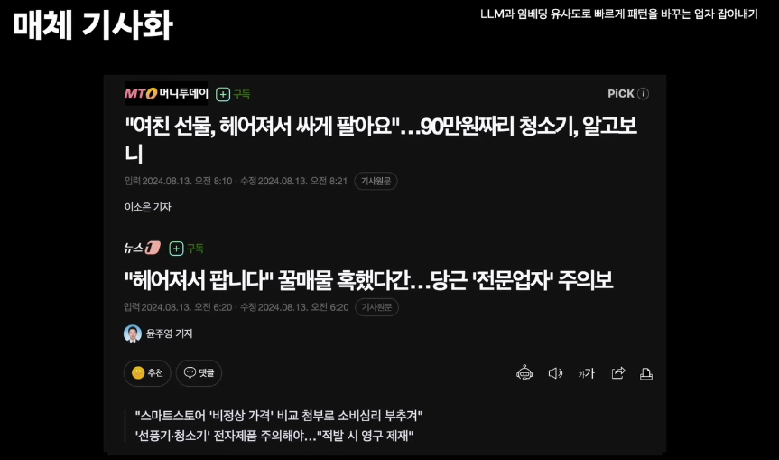

# **ㅎㅖ어져서 팝니ㄷr ☆**

당근 중고거래 서비스는

- 사용하지 않지만 누군가에게는 쓸모있는 물품들을 동네 이웃과 저렴하게 판매하고 나누는 것.

**전문판매업자**

- 사업체를 보유하고 물품을 반복 판매
- 계정을 대량으로 생성, 게시글과 채팅을 도배하며 반복 판매
- 비정상적인 환경에서 보안을 우회하여 반복 판매
- 매너온도, 조회수, 관심수, 채팅수 등을 인위적으로 조작

## 기존 해결 방안

### 1. 사용자 행위 발생 전: 보안/네트워크 정책 강화

- 앱단에서의 보안 정책 강화
- 비정상 네트워크 차단
- 요청 위변조 탐지
- 비정상 동네 인증 / 기기 제한 > 부산에서 동네 인증 1분 후 서울 동네 인증

### 2. 사용자 행위 발생 후: Supervised Learning

- 컨텐츠를 학습한 모델로 탐지
    - 게시글, 채팅과 경우에 컨텐츠 패턴을 학습한 슈퍼바이스 러닝
- Supervised Learning에선 라벨링된 데이터가 가장 중요함
    
    
    

### 학습 데이터 라벨링

- 당근 사용자와 운영개발팀 로직이 신고를 만들면 당근 서비스로 들어가서 cs센터에서 수락하거나 거부하는 것으로 라벨링 됨
- 이 모델이 학습을 해서 다시 신고를 하면 당근 서비스로 넘어가는 운영 파이프라인

### 한계점

1. **발견되기 전까지 학습데이터에 반영할 수 없음**
    - 발견되어서 신고되어야 학습데이터에 들어감
        
        
        
        - 신고 처리 시간동안엔 모델엔 반영이 안되고, 모델은 신고를 못하고, 사용자의 신고에 의존하게 됨.
2. **다량의 데이터가 필요해 빠르게 바뀌는 패턴을 학습하기 어려움**
    - ***Transfer Learning(전이학습)을 통해서 한다고 해도 대량의 데이터가 필요함**
    
    *특정 태스크를 학습한 모델을 다른 태스크 수행에 재사용 하는 기법(사람이 새로운 지식을 배울 때 그가 평생 쌓아왔던 지식을 요긴하게 다시 써먹는 것과 같다)
    
    
    
    - 패턴이 너무 빠르게 바뀜
    - 게시글들의 수락된 데이터를 다량으로 확보하기가 어려워지는 상황
3. **전문판매업자 집단별 매우 다른 패턴을 가지고 있지만 “전문판매업자”로 합쳐서 신고 처리**
    - 여러개의 집단을 하나의 전문판매업자라는 하나의 라벨로
        
        
        
        - 이를 하나의 라벨로 두니 성능이 하락함

---

# 새로운 해결방안

## 1. 유사 컨텐츠 탐지

- Embedding 유사도 활용하여 유사한 것들끼리 클러스터를 만들어서 탐지하는 로직

### 파이프라인

- 컨텐츠가 생성이 되었을 때, 이것을 임베딩으로 생성을 해서 Pinecone이라는 벡터 디비에 저장을 받다가 알림을 받는 방식

**1. 컨텐츠 생성 & 수정 감지**

- 예를 들어, **중고 거래 글**이나 **동네생활 글**이 올라오거나 수정되면, 이를 자동으로 감지
- 이를 위해 **카프카(Kafka)**를 이용해 이벤트를 발행하고, 서버에서 이를 구독

**2.임베딩(Embedding) 생성**

- 컨텐츠에서 **필요한 정보(예: 제목, 내용 등)**만 뽑아서 정리
- 정리된 데이터를 **임베더(Embedder) 서버**에 보내면, 여기서 **AI 모델을 이용해 '임베딩'을 생성**
- **임베딩이란?**→ 글을 숫자로 변환해서 AI가 더 쉽게 분석할 수 있도록 만드는 과정

3. **벡터 데이터베이스(Pinecone)에 저장**

- 만들어진 임베딩을 파인콘(Pinecone)이라는 상용 벡터 데이터베이스에 저장
- 컨텐츠 종류에 따라서 다른 네임스페이스 설정 가능
    - 중고 거래 글 → **A 네임스페이스**
    - 동네생활 글 → **B 네임스페이스**

1. **비슷한 컨텐츠가 많아지면 알림 발송**
- 파인콘 내부 로직에 따라서 적재한 임베딩에 대한 클러스터를 생성
- 이렇게 만들어진 클러스터가 설정한 기준 이상의 크기를 가지게 된다면 모니터링
    - "비슷한 컨텐츠가 2개 이상 생기면 알림을 받겠다"라고 설정하면
    - 우리 서버가 감지(파인콘에 클러스터가 생김)하고, **슬랙(Slack)으로 모니터링 메시지를 보냄**
1. **어드민(Admin) 시스템 활용**
- 검사하고 싶은 특정 컨텐츠를 기준(앵커)으로 유사한 글을 검사하고,
- 다량 신고가 들어온 컨텐츠를 관리할 수 있는 **어드민 시스템도 있음**

왼쪽: 슬랙에서 받고 있는 모니터링 알림 / 오른쪽: 어드민

**슬랙(Slack)에서 모니터링 알림이 옴**

- **예시 1**: 무선 청소기를 판매하는 업자가 **비슷한 사진을 65개** 올림
- **예시 2**: 유사한 제목으로 **게시글이 12개** 올라옴

이런 알림을 받아서 어드민으로 들어가게 되면 각각의 게시글 컨텐츠 이미지나 텍스트등 컨텐츠를 앵커로 삼아서 검색을 할 수 있음

**어드민(Admin)에서 확인 가능**

- ex) Top-K 50개를 불러와라
    
    
    
- 관리자(Admin)가 직접 **유사한 콘텐츠를 조회 & 분석**
- AI 시스템이 **비슷한 게시글들을 그룹화해서 보여줌**

**AI가 유사한 이미지를 찾아냄**

- **업자들은 탐지를 피하려고** 일부러 **색깔을 바꾸거나 이미지를 변형**
- 하지만 **AI 임베딩 시스템이 이를 추상화해서 분석**
- 색깔을 바꿔도, 화질을 낮춰도 여전히 **높은 유사도를 감지**

**관리자가 직접 신고 & 처리 가능**

- **어뷰징(부정 행위)이라고 판단하면 전체 선택 → 신고 접수**
- 시스템이 자동으로 **유사 게시글들을 묶어서 처리**

### Supervised Learning 한계점 개선

1. 새로운 패턴 선제적 탐지: 기준 이상 클러스터가 생기면 바로 알 수 있음
    - 비슷한 컨텐츠의 게시글들이 올라오면 선제적으로 모니터링 받을 수 있음
2. 학습 데이터 불필요: 데이터가 생길 때까지 기다리지 않아도 됨
    - 학습을 하는 것이 아니기에 학습 데이터가 필요하지 않음

### 한계점

- 일반적인 이미지여서 일반인도 많이 사용하기에 자동 신고가 되진 못하는 중

## 2. LLM Zero-Shot Classification with Auto-Generated Prompt

1. **제로샷(Zero-Shot) 분류**
- 예제(Example) 없이 **질문만 던지고 AI가 판단**하도록 하는 방식
- 예: "**이 게시글이 전문 판매업자가 올린 글인가?**" → AI가 YES or NO 판단
1. **퓨샷(Few-Shot) 분류**
- AI에게 몇 개의 **예제(Example)를 먼저 보여주고 판단**하게 하는 방식
- 예: "이런 유형의 글들은 전문 판매업자 글이야"라고 몇 개 알려준 뒤,새로운 글을 보고 "이것도 그런 유형인가?" 물어보는 방식

### AI를 활용한 게시글 분류 실험

### **1차 시도: 퓨샷(Few Shot Classification)**

✔️ **방법**

- 몇 개의 전문 판매업자 게시글을 **예제**로 AI에 입력
- 이후 새로운 글이 올라오면 AI가 **전문 판매업자 글인지 아닌지 판별**

✔️ **한계점**

- 전문 판매업자도 다양한 패턴이 있어서 **예제(샘플) 선정이 어려움**
- **예제에 없는 유형의 글을 잘 분류하지 못함**
- **데이터 분석이 많이 필요**하고, **추론 능력이 제한적**

→ 결론: **퓨샷 방식만으로는 한계가 있음**

---

### **2차 시도: 제로샷(Zero Shot Classification)**

✔️ **방법**

- AI에게 "**이 글이 전문 판매업자의 글인지 판별해봐!**"라고 직접 물어봄
- AI가 자체적으로 판단하도록 유도

✔️ **한계점**

- 문제를 정확히 이해하려면 **좋은 설명(프롬프트)이 필요**
- 전문 판매업자마다 **공통적인 특징을 추상적으로 설명해야 함**
- **프롬프트 엔지니어링(질문 작성)이 너무 많아짐**
- 결국 사람이 계속 수정해야 해서 **자동화가 어려움**

→ 결론: **프롬프트 엔지니어링을 자동화하면 좋겠다**

---

### **3차 시도: 자동 생성 프롬프트 기반 제로샷 분류**

✔️ **목표**

- **AI가 스스로 전문 판매업자의 특징을 추출**하고
- **이 특징을 바탕으로 실시간 탐지**하도록 자동화

✔️ **방법 (Two-Stage 방식 적용)**

### **스테이지 1**: AI가 **전문 판매업자 글의 공통 특징**을 직접 추출

**결과**

- AI가 자동으로 "**전문 판매업자 글의 특징**"을 추출함
    
    전문
    
    
    
    - 이모지를 많이 사용한다
    - 특수 문자를 많이 쓴다
    - "급해요!" 같은 긴급한 문구를 자주 사용한다
    - 상품 설명이 모호하다
    - 대량 판매 & 대량 세일을 강조한다
    
    일반
    
    
    

### **스테이지 2**: 스테이지 1에서 추출한 특징을 사용해 **새로운 글을 자동 분류**

- **새로운 글이 올라오면 AI가 즉시 분류 & 신고 자동화**
    - 예제:
        - 제목: **"추석 선물로 받은 무선 청소기 나눔합니다"**
        - AI 판단: **"이 게시글은 너무 모호한 표현이라 의심됨!"** → 신고 처리

---

### **자동화 시스템 구축**

✔️ **관리자가 직접 설정 가능**

- AI가 감지할 대상(예: 전문 판매업자)을 선택
- 스테이지 1 & 2 프롬프트 설정 가능
- AI 탐지 주기를 조절 (예: 30분마다 실행)

✔️ **실시간 신고 & 처리**

- Kafka 이벤트 발생 시 AI가 자동으로 감지
- AI가 "**이 글은 의심스럽다!**" 판단하면 **신고 & 제재 자동화**

✔️ **기존 머신러닝 한계점 보완**

- 특징을 추상적으로 추출하기 때문에 **새로운 패턴에도 유연하게 대응 가능**      
- **소량의 데이터(약 100건)만으로도 적용 가능** 