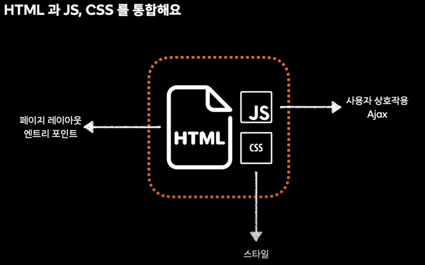

# 📌 프론트엔드에게 배포플랫폼이란

> - [배포란 무엇인가](#배포란-무엇인가)
> - [static web](#static-website)
> - [dynamic web](#dynamic-website)
> - [single page application](#single-page-application)

## 배포란 무엇인가

우리는 웹 페이지를 어떤 과정으로 보게될까?

로컬이라면 html파일의 위치 경로를 브라우저에 입력하는 것으로 충분하지만, 외부 컴퓨터에 이 파일이 존재한다면?

이 때 `remote URL`, 외부경로를 알아야 접근 가능하다. 이 때 사용하는 것이 `https`프로토콜이다.

아무튼, 이와 같은 과정을 통해 배포를 정의해보자.

웹페이지에 접근하기 위해선 아래 3가지 동작이 이상없이 동작해야한다.

1. HTML 위치 탐색
2. HTML 요청
3. HTML 스펙 동작

그렇기에 배포는 **위의 3가지 동작을 보장하는 행위**라고 볼 수 있다.

## static website

누가 들어가도 동일한 페이지가 나오는 경우, static website라고한다.

이와 같은 경우엔 `HTTP GET` 요청으로 웹 페이지를 가져와야한다.

그렇다면 서버는 http 요청을 어떻게 이해하고 처리할까?

이 때 등장하게 된 개념이 웹서버이다. `NGINX`, `APACHE`와 같은 것들이 이에 해당한다.

## dynamic website

개인화된 페이지가 필요하다면? static website로 이를 표현하는 것은 한계가 있다.

이러한 요구사항을 충족하기위해 dynamic website가 등장했다.

dynamic website는 동적으로 페이지를 구성하기 위해 `HTML` 외에도 추가적인 요청을 웹서버에 요청한다. 즉, 웹서버의 역할이 늘어난 셈.

그래서 등장한 것이 `웹 애플리케이션 서버`이다. http요청을 받아서 동적인 작업을 처리한다. `TOMCAT`등이 이에 해당한다.


동적 웹 같은 경우는 웹서버와 웹 애플리케이션 서버를 함께 구성해야 배포 플랫폼을 구성할 수 있다.

## single page application

기존 웹 페이지를 받아오는 과정은 단점이 많았다. 

1. 계속 html을 받아와야 했기에 UI/UX 측면에서 단점이 있었다.
2. 화면 표시 및 데이터 처리와 강결합이 구성되어있었다.
   - 화면을 수정하고 싶은데, 데이터의 수정 가능성이 있었다. 그 반대도 마찬가지.
   - DX 측면에서 매우 단점.

이를 해결하기 위해 등장한 것이 `AJAX`이다. 이를 사용하면 새로고침없이 화면을 수정할 수 있게 되었다.




기존 html에 script, link 태그가 추가되었다.

이러한 기능들을 쉽게 빌드하기 위해서 다음과 같은도구를 함께 사용한다.


그렇다면 http 요청을 보내면 한번에 다시 응답해주면 될까?

그렇지 않다. 웹 서버에 반복적 요청을 통해 순차적으로 값을 받아온다.


이와 같은 반복적 요청에 의해 waterfall이 발생한다.

### sub-path 문제


위에서 다루었던 내용은 `html`의 스펙동작을 보장하지 않는다. 

`spa`는 `sub-path`를 다루는 것에 어려움을 겪는다. 이유는 동적인 부분을 `js`가 담당한다. 즉, 라우팅까지 내부에서 `js`가 처리하게 되었기 때문이다.

과거엔 `sub-path`에 해당하는 `html`을 웹서버가 처리했지만, `spa` 배포플랫폼은 이를 인지하지 못한다.

이는 `react-router` 등과 같은 것을 사용하여 다루게 된다.

아무튼, 404 not found가 나왔을 때 `index.html`을 내려주도록 설정하는 것 까지 하여야 진정한 `spa` 배포 플랫폼이 될 수 있다.


## more spa

사용자가 첫 화면을 보기까지 과정이 쉽지 않다. 위에서 waterfall에 대해 다루었다. 하나하나 순차적으로 받아와야하기에 무겁다.

그렇다면 이를 최적화하는 방법은 무엇이 있을까?

### http 프로토콜 헤더

배포 플랫폼은 응답 헤더를 설정할 수 있다.


위의 태그들은 웹서버가 성능 최적화에 기여할 수 있는 헤더들이다.

강의에서는 `Cache-Control`에 대해 다루었는데, 이에 대해 설명하자면 다음과 같다.

#### Cache-Control

캐싱정책을 사용한다는 것을 의미한다. 받아온 것들을 재활용하는 것이다.

서버 헤더의 내용은 다음과같다.

```
Cache-Control: max-age=60, must-revalidate
```

- 60초 동안 캐싱하고, 만료되면 서버로 검증하세요.

자바스크립트파일, HTML파일 모두 이를 적용할 수 있다.

근데, 그렇다면 새로 배포하면 캐싱 만료가 될 때 까지 기다려야할까?

맞다. 그래서 HTML은 no-store 정책을 기본으로 진행한다.

근데, 자바스크립트의 경우엔 이를 적용할 수 있다.

그렇다면 어떻게 적용할 수 있을까? 자바스크립트도 배포하면 캐시가 만료될 때 까지 기다려야할까?


아니다. `vite`와 같은 빌드도구로 빌드를 진행할 때 위처럼 해시가 추가되는 것을 알 수 있다.

즉, 파일명을 바꿔 (경로를 바꿔) 캐싱으로부터 자유롭게 할 수 있다.

이와 같은 이슈로 버전 관리가 중요해졌다.
- 캐싱 정책에 따른 버전 정책
- JS를 버저닝해서 쌓아둘것인지
- 404 NOT FOUND 일 때 HTTP 응답을 어떻게 할 것인지


### HTML 성능 개선

위에선 JS의 성능 개선에 대해 말했다.

그렇다면 HTML의 성능 개선은 어떤 방법으로 이뤄질까?

이 때 등장한 것이 CDN이다. Local이 아니더라도 Local에 가깝게 동작 시키자!


이 때 CDN은 위에서 다뤘던 헤더의 영향을 동일하게 받는다. 따라서 다음과 같은 방식으로 성능을 개선할 수 있다.


근데 그렇다면 CDN은 똑같이 캐시 만료까지 기다야할까?

그렇지 않다. 이 때 사용하는 것이 purge이다.

purge를 요청하면 CDN의 캐싱을 만료할 수 있다.

CDN은 SPA 성능개선에도 사용되지만 static web의 성능 개선에서도 활용될 수 있다.

## 좋은 SPA 서버란


## 지금까지 이야기한 것들은 사실..


http 프로토콜부터 인프라까지 이야기를 했다. 즉, 웹시스템 전반적인 내용을 다루었다.


http 1.1을 썻는데, 2로 전환하는 방법은 뭐지? 

왜 fetch API를 사용하는지, XML 통신과 차이는 뭔지

모듈시스템이나 번들러는 어떤것이 있는지 등 관심을 가져보자.

# 💡결론

- 프론트엔드에게 있어 배포플랫폼은 랜더링 이후 아무것도 아니라고 생각될 수 있으나.
  - 웹 시스템의 전부라고 봐도 무방하다.

# 📚 Ref

- [당근테크 - 프론트엔드에게 배포플랫폼이란](https://www.youtube.com/watch?v=e4iWEeJ5MvQ)