# 클러스터 운영부터 서비스 라이프사이클 관리까지, 데브옵스 업무 효율화

## 여기서, 데브옵스란 ?

데브옵스는 Development + Operation

개발담당자와 운영담당자가 연계하여 협력하는 개발 방법론이다.

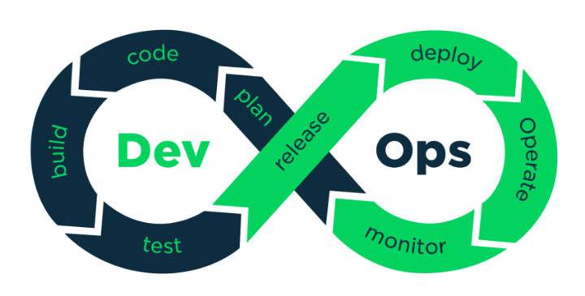

데브옵스는 개발과 운영을 결합해 탄생한 개발 방법론이다. 시스템 개발자와 운영을 담당하는 정보기술 전문가 사이의 소통, 협업, 통합 및 자동화를 강조하는 소프트웨어 개발 방법론이다.

쉽게 말하면 개발부서와 운영부서 간의 원활한 소통을 기반으로 한다는 것이다. 개발 부서에서 웹사이트 개발, 앱 개발, 그리고 알고리즘 개발을 한다면 운영 부서에서는 개발된 아이템이 고객에게 잘 전달되도록 하는 부서이다. 운영팀에서 고객의 수요에 맞춰 서버와 데이터베이스를 관리하는 일을 통해 서비스가 제대로 돌아갈 수 있는 환경을 개발팀에게 제공할 수 있는 것이다.

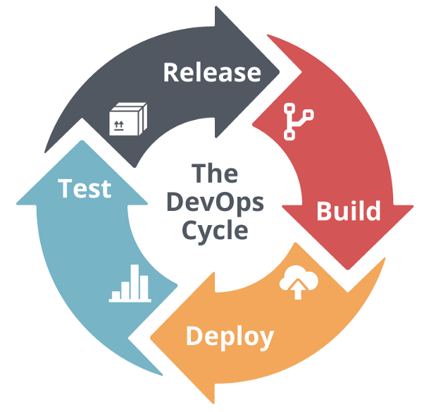

데브옵스의 이점에는
1. 속도 : 작업 속도가 빨라지면서 시장 변화에 더 잘 적응하고 효율적으로 비즈니스 성과를 창출할 수 있음
2. 신속한 제공 : 새로운 기능의 릴리스와 버그 수정 속도가 빨라질수록 경쟁 우위를 차지할 수 있음
3. 안정성 : 애플리케이션 업데이트와 인프라 변경의 품질 보장, 지속적 통합 및 지속적 전달과 같은 방식을 통해 변경 사항이 제대로 안전하게 작동하는지 테스트 가능
4. 확장 가능 : 규모에 따라 인프라와 개발 프로세스 운영, 관리 가능
5. 협업 강화 : 개발자와 운영 부서 간의 협력을 통해 효과적인 팀 구축 가능
6. 보안 : 자동화된 규정 준수 정책, 세분화된 제어 및 구성 관리 기술 사용 가능

흔히 알고 있는 DevOps Tool에는 Docker, GitHub, AWS, Jira, Slack 등등이 있다.

## Toss에서 DevOps업무를 어떻게 효율화 했을까 ?

토스의 모든 서비스는 온프레미스 환경에서 운영하고 있다. 

✔️ 온프레미스 환경이란 ?

> 기업의 서버를 클라우드 같은 원격 환경에서 운영하는 방식이 아닌, 자체적으로 보유한 전산실 서버에 직접 설치해 운영하는 방식.

장점에는 기업의 비즈니스 정보를 보안성 높게 관리할 수 있다.

단점에는 시스템을 구축하는데 있어서 많은 시간과 비용이 걸린다.

---

그리고 여러 클러스터 프로비저닝 방식 중에 큐브스프레이를 사용해 클러스터 버전을 업그레이드하고 서비스 워커 노드를 조인하고 있었다. 쿠버네티스에서 큐브 스프레이는 클러스터를 온프레미스 온디맨드 환경에서 설치하고 구성할 수 있게 지원을 해주고 있다. 그리고 클러스터에 포함되는 노드들이 서로 다른 운영체제와 환경을 가지고 있더라도 안정적으로 운영할 수 있도록 지원해주고 있다.

✔️ 온디맨드 환경이란 ?

AWS에서 온디맨드(On-demand) 서비스는 사용자가 필요할 때 즉시 자원을 요청하고, 그만큼만 비용을 지불하는 방식의 클라우드 컴퓨팅 모델이이다.

기존의 IT 인프라에서는 서버를 구매하고 설치하는데 시간이 많이 소요되지만, AWS에서는 필요할 때 바로 자원을 사용할 수 있어 유연하고 효율적인 자원 관리가 가능하다.

---

그런데 큐브스프레이는 수많은 장점들이 있었지만 다양한 환경을 지원하기 위해 시스템 설정들을 확인하는 작업들이 많았다. 

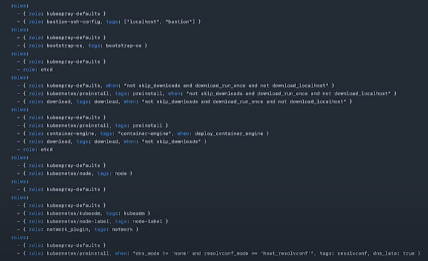

해당 yml파일은 클러스터의 워크노드를 조인하기 위해 수행해야하는 필수적인 작업들이다.

예시를 들어보면, 

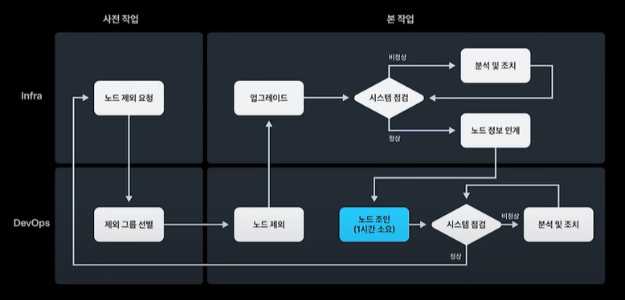

클러스터 환경에서 운영중인 노드나 노드에 문제가 발생했거나 운영체제나 커널 버전을 업그레이드해야 할 경우 많은 시간과 비용이 발생한다.

단순 노드 교체작업은 간단하지만 OS 커널 버전 업그레이드의 경우에는 피크 시간대에 트래픽을 고려해야하고 다른 데이터 센터의 장애를 대비해 역할별 최소 가용성을 유지해야한다. 

사진에 도식화 한 것처럼 이러한 과정은 노드 제외 시스템 재설치, 시스템 점검, 노드 정보 인계 시스템 점검으로 수십에서 수백대의 서버가 완료될 때까지 반복해야 한다.

✔️ 클러스터 환경이란 ?

클러스터(cluster)의 사전적 의미는 무리, 군체라는 뜻이다.

고성능 컴퓨팅을 위해 여러 단말의 컴퓨터로 구성된 컴퓨터 집합이다. 단순하게 생각해서 슈퍼컴퓨터 대신 일반적인 컴퓨터를 여러 대 연결해서 계산을 수행하는 것이다. 클러스터 컴퓨터가 계산을 수행하는 방식은

1. 크고 복잡한 계산을 적당한 크기로 나누고 각 노드에 배분한다.
2. 각 노드들은 계산을 수행한다.
3. 그 결과를 한 컴퓨터에 수합하고 결과를 사용자에게 반환한다.

이것의 반복이다.
물론 실제 계산은 이렇게 단순하지는 않지만 이해를 위해 설명해봤따.

---

다른 예시를 보면,

클러스터 버전 업그레이드 작업이 있다.

오픈소스 생태계에서 많은 컨트리뷰터를 가지고 있는 쿠버네티스는 정기적으로 릴리즈 되는 버전이 많기때문에 매 시점 업그레이드를 준비하기 어렵다. 그래서 운영중인 버전을 최대한 유지했다가 분기 또는 연단위로 업그레이드를 하게 된다.

현재 운영중인 버전과 업그레이드를 해야되는 버전에 큰 차이가 나지 않으면 공수가 많이 들지 않지만, 큰 차이가 나면 클러스터에서 운영되고 있는 노드들에 많은 공수가 들고 큐브 스프레이에 의존할 수 밖에 없게된다.

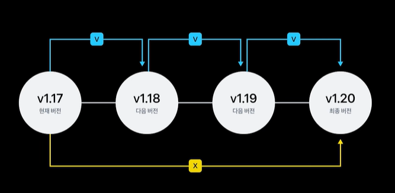

그런데 큐브스프레이는 한개의 버전씩 업그레이드를 해야한다는 단점이 있다.

큐브스프레이를 사용해서 이 작업을 수행한다고 하면 

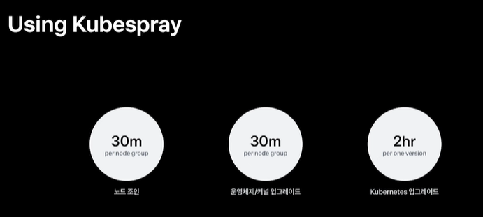

위와 같은 시간이 든다.

짧게는 30분, 길게는 6시간에서 12시간 정도 소요되는 작업을 어떻게 줄일 수 있을까 ?

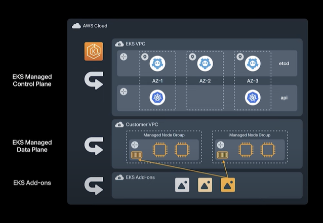

온프레미스 환경보다 온디맨드 환경의 클러스터의 버전 업그레이드가 빠른 이유는 무엇일까 ?

그 이유는 변경하고자 하는 상위 노드 그룹을 신규로 프로비저닝해 클러스터의 롤링으로 업데이트하기 때문이다. 

이 아이디어를 기반으로 토스에서는 빈번이 발생하는 클러스터 노드 투입 작업의 운영 비용을 줄이기 위해 온디맨드 환경에서 동작하는 쿠버네티스 클러스터처럼 인스턴스가 프로비저닝 되는 시점에 노드가 조인되어 진행되게 했다.

이 때 고려사항이 있다.

  - **노드 자동 조인**: 데브옵스 엔지니어 개입 없이 노드가 자동으로 클러스터에 조인되어야 함
  - **디버깅 용이성**: 노드 조인 시스템에 문제가 생겼을 때 쉽게 디버깅할 수 있어야 함
  - **변경 추적 가능**: 시스템 변경이 전 운영에 영향을 미치므로 변경 추적이 가능해야 함

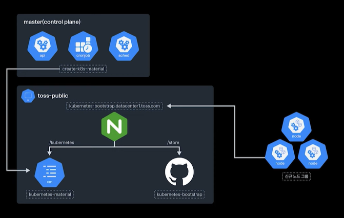

### 구현 방법
- **자동화 스크립트 작성**: 
  - `쉘 스크립트`를 작성하여 클러스터 디스커버리, 구성 파일 다운로드, 워커 노드 조인 단계 자동화
  - 스크립트는 프로비저닝 시점에 자동 실행되도록 설정
- **Git Sync Sidecar**: Git Sync Sidecar로 주기적으로 동기화하여 로컬 캐시 적용

[깃 싱크 사이드카 부연설명](https://coffeewhale.com/kubernetes/git-sync/2020/02/22/git-sync/)

- **조인 작업의 세 단계**:
  1. **클러스터 디스커버리**: 신규 프로비저닝된 노드가 어느 클러스터에 조인될지 확인
  2. **구성 파일 다운로드**: 클러스터 버전에 맞는 구성 파일 다운로드
  3. **워커 노드 조인**: 워커 노드가 쿠버네티스 클러스터에 조인되고, 실패 시 알림 전송

  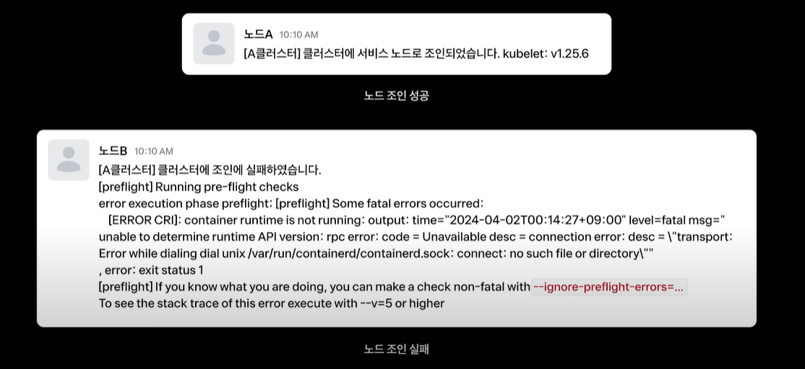

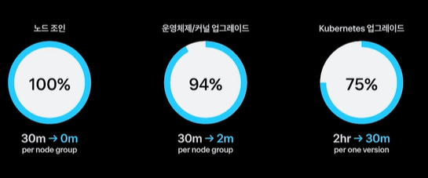

# 토스 서비스 단위 개선 사례

토스의 비즈니스 성장에 따라 신규 서비스의 추가 및 기존 서비스의 삭제가 빈번하게 이루어졌다. 이로 인해 다양한 CICD 파이프라인 생성, 변경, 삭제 요청이 발생하며 이를 효율화할 필요가 있었다.

## 문제점
- 신규 서비스 추가 시, 다양한 CICD 파이프라인을 수동으로 생성해야 했고, 각 서비스의 특성에 맞는 파이프라인 설정이 필요하여 서비스 개발자와의 소통 비용이 증가했다.
- 파이프라인 생성에 10분의 DevOps 공수가 필요하며, 서비스 개발자들이 예상과 다르게 파이프라인을 설정하는 경우가 있었다.

## 해결 방안: UI 기반 파이프라인 관리
- **서비스 개발자 스스로 파이프라인 생성 및 관리**: UI를 통해 파이프라인 설정을 입력하면, 자동으로 YAML 파일이 생성되고 GitHub PR로 제출된다. DevOps 엔지니어가 검토 후 머지하여 배포된다.

- **배치 이미지 버전 관리**: 동일한 버전을 사용하는 배치 이미지들의 버전 관리를 위해 "레이티스트 태그" 기능을 제공하며, 이를 통해 배치 이미지 업그레이드를 쉽게 처리할 수 있다.

## 배포 방식
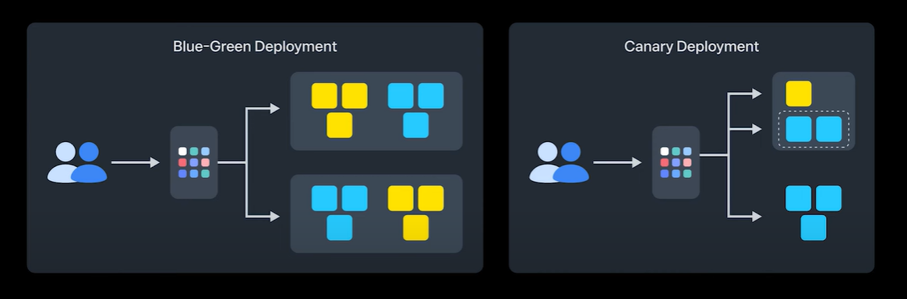
- **블루그린 배포**: 새로운 서비스 버전이 배포되면 트래픽을 자동으로 새로운 파드로 전환하고 기존 파드는 제거한다.
- **카나리 배포**: 신규 버전에 서비스를 띄운 후에 개발자분들이 모니터링하면서 트래픽을 점진적으로 올리는 방식.

근데 카나리 배포 이후 장기간 방치되는 서비스들이 생겼다. 방치되는 서비스들이 많아지게되면 클러스터의 리소스의 비효율이 발생하게 된다. 그 이유는 이전 버전을 유지하기 위해 CPU메모리를 불필요하게 유지하게되어 다른 서비스에 배포가 필요할 때 스케케줄링에 문제를 줄 수 있다.

## 서비스 삭제 및 리소스 관리
- **서비스 삭제 UI**: 서비스 삭제 전, 연관된 배치 및 트래픽 정보를 확인하고 문제가 없다면 삭제할 수 있도록 구성되었다.
- **미사용 서비스 알람**: 사용되지 않는 서비스를 놓치지 않기 위해 미사용 서비스에 대한 알람을 자동화하여 리소스 낭비를 방지한다.
- **서비스 매쉬와 메트릭 활용**: Istio 사이드카 메트릭을 활용하여 서비스 간 통신을 추적하고, 통신이 없는 서비스에 대해 자동으로 알람을 보낸다.

## 리소스 최적화
- **리소스 절감**: 불필요한 서비스를 제거함으로써 CPU 1280 코어, 메모리 128GB를 절감할 수 있었다.

## 결론
- **효율화 지점 파악**: 반복적이고 정기적인 업무는 효율화가 가능하며, 적극적으로 시도하는 것이 전략적으로 유리하다.
- **핵심 포인트**: 
  - 노드 조인 자동화
  - 서비스 라이프 사이클 관리
  - 미사용 리소스 효율화

---

### 📝 핵심 정리

1. 데브옵스의 역할과 중요성

- 데브옵스 엔지니어는 개발자의 편의성을 높이고 클러스터 운영을 담당합니다.
- 업무 영역이 넓어 효율화가 쉽지 않지만, 이는 필수적입니다.
- 토스에서는 4명의 엔지니어가 16개의 클러스터를 운영하고 있습니다.

2. 클러스터 운영의 효율화

- 온프레미스 환경에서 클러스터를 운영하며 큐브 스프레이를 사용합니다.
- 클러스터 업그레이드와 노드 교체 작업은 시간이 많이 소요됩니다.
- 노드 교체와 업그레이드 작업을 자동화하여 시간을 단축할 수 있습니다.

3. 버전 업그레이드의 도전

- 쿠버네티스는 정기적으로 버전이 업데이트되며, 업그레이드 시 많은 공수가 필요합니다.
- 큐브 스프레이를 사용하면 버전 업그레이드가 복잡해질 수 있습니다.
- 효율적인 업그레이드를 위해 자동화된 프로세스가 필요합니다.

4. 온디맨드 환경의 장점

- 온디맨드 환경에서는 클러스터 노드의 프로비저닝이 더 빠릅니다.
- 자동화된 시스템을 통해 노드 조인 작업을 간소화할 수 있습니다.
- 디버깅이 용이하고 변경 추적이 가능해야 합니다.

5. 서비스 파이프라인의 효율화

- 신규 서비스 추가 시 다양한 CI/CD 파이프라인을 생성해야 합니다.
- 개발자들이 스스로 파이프라인을 생성하고 관리할 수 있는 UI를 개발했습니다.
- 이로 인해 반복 작업과 실수를 줄일 수 있었습니다.

6. 서비스 배포 방식

- 토스는 블루그린 배포와 카나리 배포방식을 사용합니다.
- 서비스 안정성을 위해 배포 후 모니터링이 필요합니다.
- 서비스가 방치되지 않도록 알림 시스템을 구축했습니다.

7. 미사용 서비스 관리

- 서비스 종료 시 관련 배치와 트래픽을 확인해야 합니다.
- 서비스와 관련된 의존성을 파악하여 안전하게 삭제할 수 있도록 했습니다.
- 미사용 서비스에 대한 알림 시스템을 통해 관리합니다.

8. 리소스 절감 효과

- 불필요한 서비스를 제거하여 리소스를 절감할 수 있었습니다.
- 서비스별로 평균적으로 CPU와 메모리를 절감했습니다.
- 효율화는 비즈니스 운영에 긍정적인 영향을 미칩니다.

9. 정기적인 업무의 중요성

- 정기적으로 수행해야 하는 업무는 효율화가 필요합니다.
- 효율화 가능한 지점을 찾아 적극적으로 시도해야 합니다.
- 업무의 효율성을 높이는 것은 조직의 성공에 기여합니다.