# 📌 N개의 탭, 단 하나의 웹소켓 : SharedWorker

> - 문제인식
> - Web Worker API
>   - Dedicated Worker
>   - Shared Worker
> - 난관
>   - 번들러
>   - 메모리 누수

## 문제인식

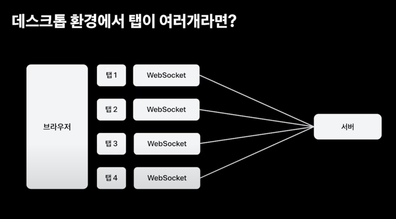

기존 앱으로만 접속 가능하던 토스증권 앱이 데스크탑 버전이 출시되며 다음과 같은 문제점이 존재했다.

탭은 각각 다른 스레드에서 동작하기에 변수를 공유할 수 없다. 그렇기에 탭의 개수만큼 소켓연결이 증가한다.

즉, 소켓연결이 기하급수적으로 증가할 수 있다. 연결 개수가 증가하면서 서버에 많은 리소스가 필요해지기에 FE 측면에서 어느정도 처리해줘야했다.

그래서 다음과 같은 방법을 고민했다.

1. Focus 되어있는 탭만 연결한다.
   - 탭이 화면에는 띄워져 있지만, Focus 상태가 아닌 경우 멈춘 것 처럼 보여 사용자 경험이 떨어짐
2. Visibility Change 기준으로 연결한다.
   - 그래도 여전히 화면에 있는 여러개의 탭을 연결해야한다.

그렇다면 탭 외부에 웹소켓 객체를 둘 수 없을까?

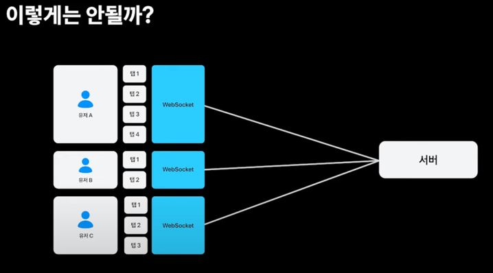

이럴 때 worker, Web Worker API를 사용하면 된다.

## Web Worker API

### Dedicated Worker

특정 탭에서 추가적으로 사용할 수 있는 스레드를 제공한다. 연산적인 것을 여러 스레드에 분산하여 프론트엔드 성능을 높이는 목적으로 활용한다.

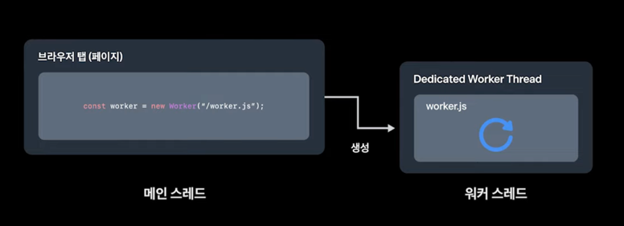

메인 스레드와 워커 스레드간 변수를 공유할 수 없기에 다음과 같은 방법으로 메시지를 주고 받을 수 있다.

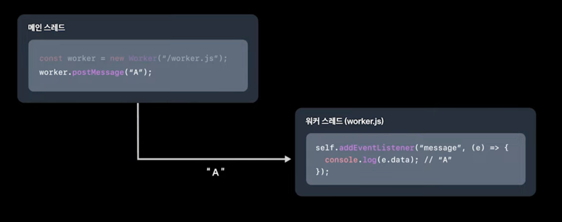

그 반대의 경우에도 마찬가지이다. postMessage 함수로 메시지를 보내고, messageEvent 등록으로 메시지를 수신할 수 있다.

단, Dedicated Worker는 워커를 생성한 탭에서만 접근 가능하다.

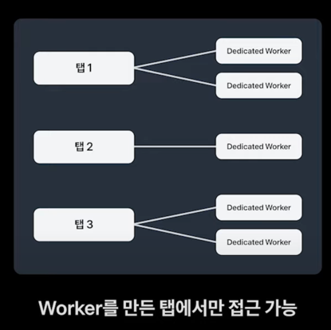

### ***Shared Worker***

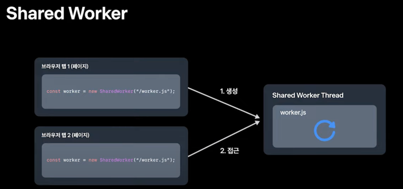

`Dedicated Worker`와 달리 모든 탭에서 접근 가능하다. Sharedworker로 생성 가능하다.

Shared Worker 스레드의 공유 기준은 다음과 같다.

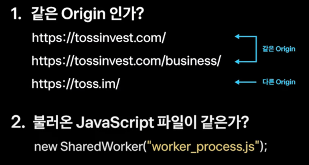

Shared Worker의 경우 통신하는 방법이 다소 다르다. MessageChannel을 사용한다.

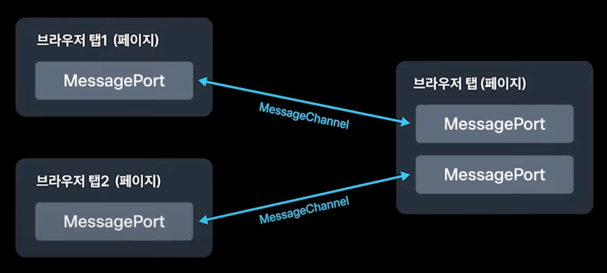

MessagePort 객체가 각각 연결된 MessageChannel을 통해 통신한다.

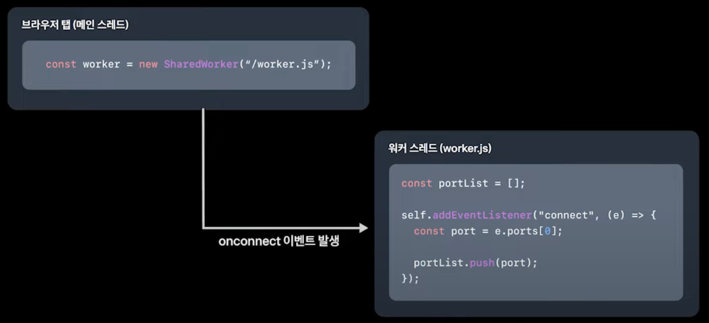

SharedWorker 을 생성하면 port라는 필드가 전달되고, port에는 MessagePort 객체가 존재한다.
워커 스레드에서 메인 스레드로 메시지를 보내기 위해선 이 값이 필요하니 배열에 저장한다.

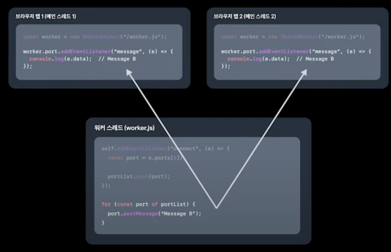

그 이후 메시지를 주고받는 과정은 Dedicated Worker 에서 postMessage, messageEvent 추가 하는 동일한 과정으로 진행한다.

Web Worker API 에서 제공하는 기능을 모두 사용할 순 없다. `fetch`, `setTimeout`, `WebSocket`은 사용 가능하지만 `DOM API`, `largeStorage`, `window` 등은 사용이 제한된다.

즉, SharedWorker 위에 WebSocket을 올린다면 이를 해결할 수 있다는 것이다.

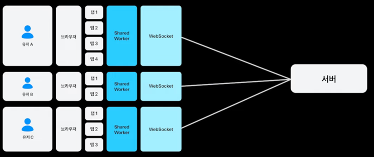

~~짜잔~~

그렇지만, 모든 브라우저에서 이를 지원하진 않는다. 최근까지 싸파리도 지원하지 않았었다.

그럼에도 불구하고 이를 적용한 이유는 다수가 사용하는 브라우저에서 지원하기에 적용할 가치가 있다고 생각했다.

그렇다면 지원하지 않는 브라우저 사용자의 경우엔 접속을 막거나 새로운 로직을 구현해야할까? 
다행인 것은 Dedicate Worker 위에서 동작하는 WebSocket이 Shared Worker와 비슷한 환경에서 동작한다. 물론, SharedWorker로 인한 접속 수 제한 기능은 없어지겠지만, 새로운 기능을 개발할 필요성은 줄어든다.

## 난관

### 번들링

worker를 생성하기 위해선 자바스크립트 파일의 경로를 넣어줘야한다.

즉, 실제로 서버에 올라가면 해당 주소에 맞는 경로를 제공해야한다.

하지만 최근 번들러의 경우엔 코드를 합치고, 최적화하고, 주소를 해시화하는 등의 이슈가 있었다.

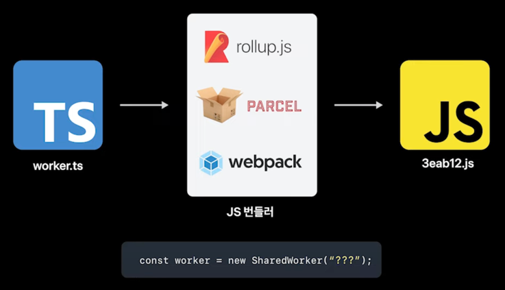

그렇다면 어떻게 해야할까?

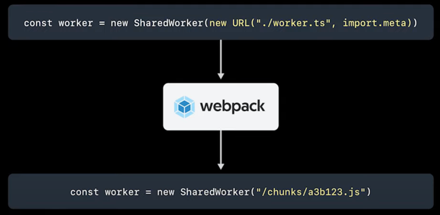

디헹이도 최근 번들러들은 Web Worker API 를 지원하는 방법들을 제공한다.

### 메모리 누수

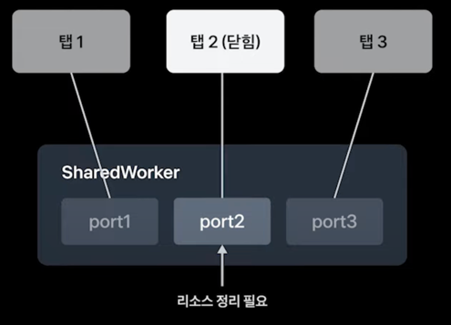

리소스를 사용하고 더이상 사용하지 않으면 반납해야 메모리 누수가 발생하지 않는다.

하지만 현재 Web Worker API는 탭이 닫힌 경우 이벤트가 발생하는 기능을 제공하지 않는다.

물론 브라우저의 경우, BeforeUnload Event라는 탭이 닫히는 경우 발생하는 이벤트 기능을 제공하지만, 탭 최소화 상태에서 닫으면 호출되지 않는다는 문제가 있었다.
즉, 신뢰성이 다소 부족하다는 것이다.

이 때 MessagePort의 가비지컬렉션 특징을 활용할 수 있다.

MessagePort의 경우 연결된 두개 중 하나가 사용 불가 / 사용하지 않는 상태가 되면 반대편의 것도 사용하지 않는 것 취급 된다는 특징이 있다.

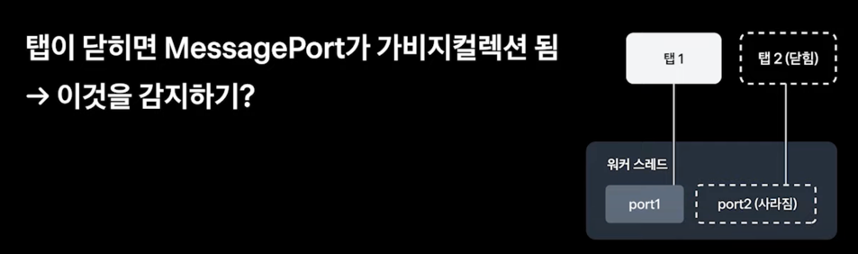

근데 현재 구조에서는 이와같은 가비지 컬렉션이 발생하지 않는다.

MessagePort 객체들을 배열에 가지고 있기 때문이다.

이와 같은 경우 WeakRef로 가비지 컬렉션이 일어나도록 할 수 있다.

WeakRef로 특정 객체를 감싸주면, WeakRef를 사용하고 있더라도 WeakRef 내부의 객체는 사용하지 않는 것 취급되어 가비지 컬렉션이 발생할 수 있다.

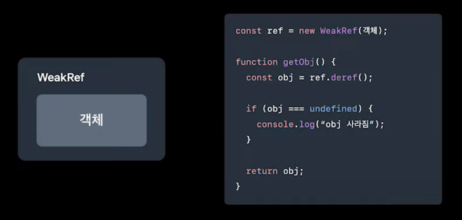

그렇다면 이를 활용할 수 있지 않을까? WeakRef는 배열로 가지고 있더라도, 연결이 종료되면 WeakRef 내부 객체가 자연스럽게 가비지 컬렉션이 발생할 수 있도록 할 수 있다.

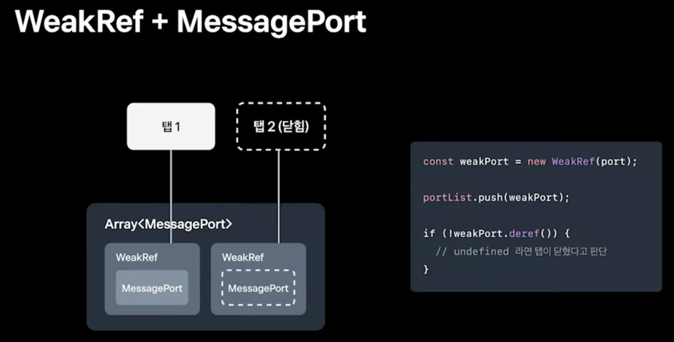

이와 같은 방식으로 어떤 탭이 닫혔는지 인식하고 리소스를 정리하면 메모리 누수를 방지할 수 있다.

# 💡결론

- WebSocket 연결 개수문제를 SharedWorker에 올려 최적화 기능을 구현했다.

# 📚 Ref

- [N개의 탭, 단 하나의 웹소켓: SharedWorker](https://youtu.be/SVt1-Opp3Wo?si=yByrFM3Wx1VkyRaZ)