# 검색과 피드의 만남: LLM으로 완성하는 초개인화 서비스

생성일: 2025년 3월 12일 오후 2:48

[https://tv.naver.com/v/67444402](https://tv.naver.com/v/67444402)

# 홈피드, 개인화 추천

## **1. 홈피드, 개인화 추천 피드**

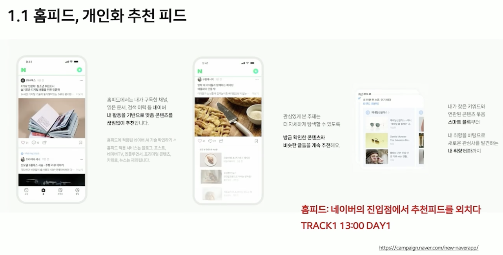

- 네이버 홈피드는 사용자의 관심사에 맞춘 개인화 콘텐츠 추천 피드.

### **기존 유저 컨텍스트의 한계**

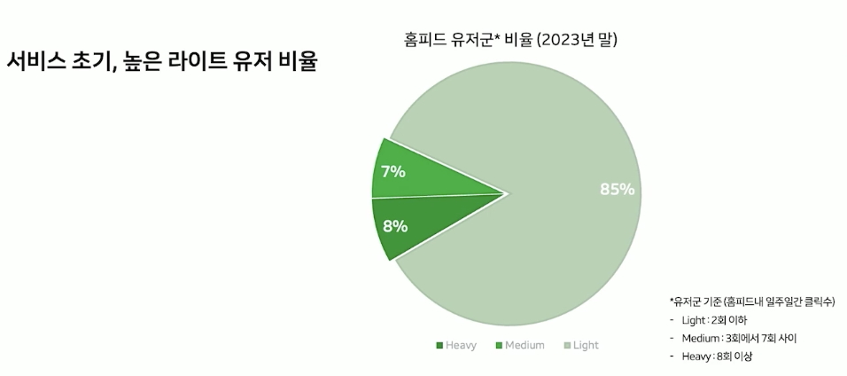

**1-1.홈피드 소개와 문제점 분석**

- 홈피드는 네이버 홈피드 서비스를 개인화 추천 피드로 개발함
- 사용자의 활동 정보를 기반으로 맞춤 콘텐츠를 추천하는 서비스임
- 검색, 메인 주제판 등에서의 유저 활동 정보를 활용함
- 홈피드 서비스 초기, 유저 컨텍스트 부족 문제가 있었음

## **크로스 도메인 유저 컨텍스트 확장**

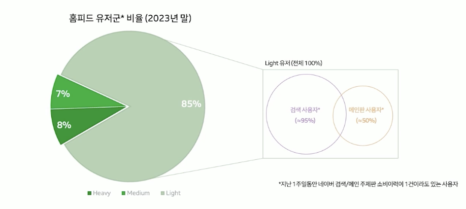

- 네이버의 검색, 메인 주제판 등의 데이터를 활용하여 사용자 관심사를 확장하는 "크로스 도메인 유저 컨텍스트" 방식을 도입

**1-2.유저 컨텍스트 확장 방법론**

- 다른 서비스의 유저 활동 정보를 활용하여 부족한 유저 컨텍스트를 확장함
- 검색, 메인 주제판 등에서의 유저 활동 정보를 활용하여 컨텍스트를 확장함
- 이를 바탕으로 개인화 추천을 제공할 수 있었음
- 모델 이름: 에어스카우트

# **2. 에어스카우트 (AIRS-Scout) 시스템**

- AiRScout는 3가지 LLM(large language model) 모듈과 이를 통해 생성되는 5가지의 사용자 컨텍스트로 구성된 LLM 기반의 사용자 컨텍스트 확장 모델

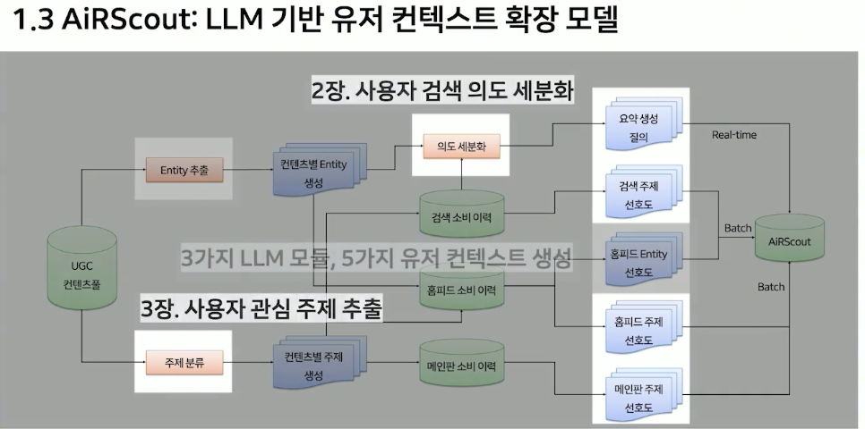

- 사용자 관심사와 검색 의도를 세밀하게 분석하는 LLM 기반의 추천 모델.
- 주요 기능:
    1. **사용자 관심 주제 추출**
        
        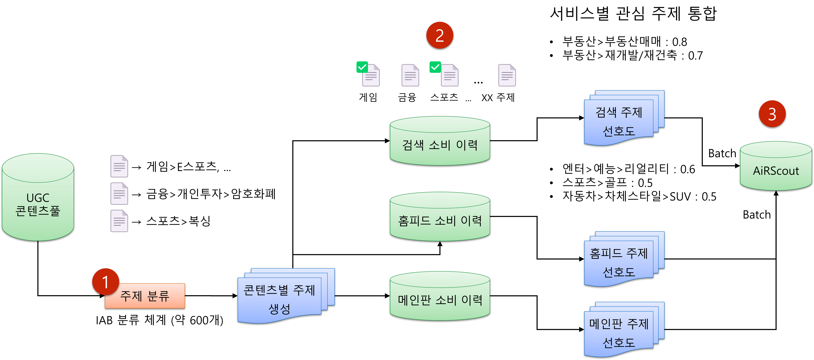
        
        1️⃣ 주제 분류 단계
        
        - 다양한 형태의 UGC 문서에 대해 통합된 하나의 주제 분류기를 사용하여 컨텐츠의 주제를 생성
        - ex) 게임중 E스포츠
        
        2️⃣ 소비 이력 분석 단계
        
        - 서비스별 소비자의 소비 이략을 함께 활용
        - 사용자가 어떤 주제의 콘텐츠를 주로 확인했는지 분석하고 모델링하여 관심 주제를 추출
        - 관심 주제의 선호도 점수는 0~1/ 선호도가 높을수록 1에 가까움
        - ex) 검색: 부동산, 홈피드: 예능
        
        3️⃣ 통합 및 저장 단계
        
        - 검색, 홈피드, 메인 주제판의 관심 주제를 하나로 통합하여 AiRScout에 저장
        - 짧은 배치 주기로 연동되어 있으며, AiRScout을 통해 홈피드나 서치피드등 여러 피드로 유통
        
    2. **검색 의도 세분화**
        
        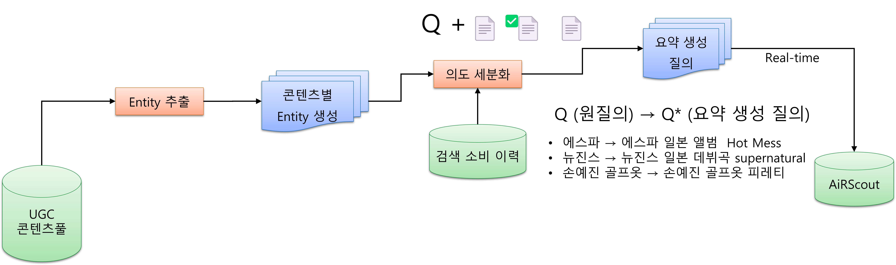
        
        - 기본적으로 검색 소비 이력을 활용함
        - 사용자가 검색한 질의에 대해 어떤 문서를 확인했는지를 바탕으로 원질의를 더 구체화된 형태로 생성하는 과정
        - 예) "에스파" → "에스파 일본 앨범 핫매스"
        - 실시간으로 동작하도록 시스템 구성 > 검색 후 바로 AiRScout에 들어가고, 홈피드에 바로 추천

### 서비스 적용 사례

1. **AfterSearch: 실시간 검색 이력 기반 추천 적용 사례**
    - AiRScout기술을 활용한 실시간 검색 이력 기반 추천을 AfterSearch라고 부름
        
        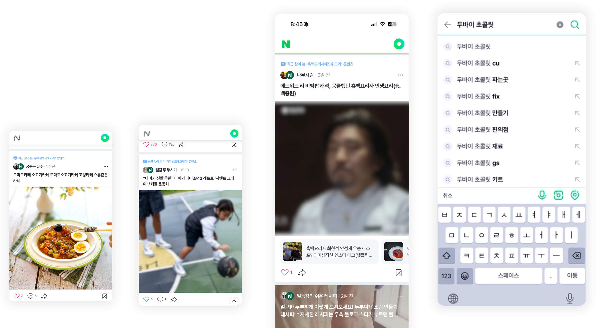
        
    - ex) 사용자가 두바이 초콜렛 검색 후 피드 탐색 > 홈피드 결과 새로고침 > ‘최근 찾아본 두바이 초콜릿 콘텐츠’라는 추천 사유와 함께 콘텐츠 추천
2. **서치피드: 숏텐츠 및 재검색 질의 적용 사례**
    - AiRScout 기술은 서치피드 내 숏텐츠와 재검색 질의에도 활용
    
    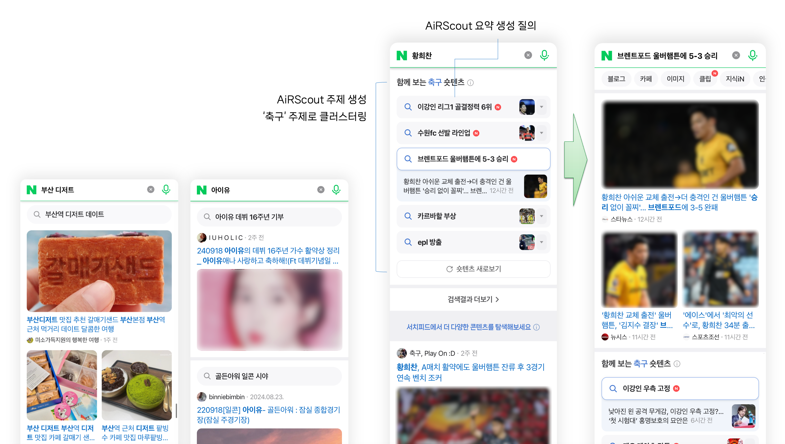
    
    - 숏텐츠: 생산과 소비가 활발한 최신 인기 문서를 분석해 핵심 주제를 추출
        - 예를 들어, 이강인과 황희찬 관련 핵심 주제가 추출되고, 이를 바탕으로 관련 콘텐츠를 제공
        - 이 과정에서 AiRScout의 요약 생성 질의와 주제 분류 결과를 활용하여 '축구'와 같은 주제로 클러스터링
    - 재검색 질의: '아이유'를 검색하면 '아이유 데뷔 16주년 기부'와 같은 더 구체적인 재검색 질의를 추천할 때도 AiRScout의 요약 생성 질의를 활용

# **3. 사용자 검색 의도 세분화 모델**

- 홈피드의 AfterSearch와 숏텐츠에서 질의만으로 서비스를 제공할 경우 정교한 추천과 구체적인 트렌드 제공에 한계
    - ex) 사용자가 '에스파'를 검색해 위플래시 관련 문서를 확인한 경우에도 '에스파'라는 키워드만으로 추천이 이루어지면 '에스파 패션'과 같은, 맥락과 동떨어진 콘텐츠가 추천되는 한계
    - 숏텐츠에서 트렌드 질의만 표시할 경우에도 사용자가 실제 문서를 읽어보기 전까지는 구체적인 내용을 직관적으로 파악하기 어려움
        
        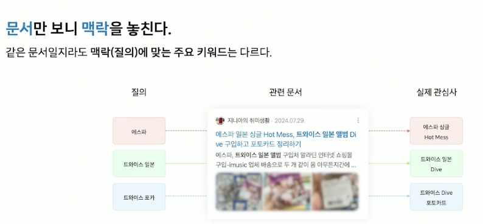
        
    - 반면 질의를 고려하지 않고 문서만 분석하면 해당 문서가 검색된 맥락을 놓치게 되는 문제가 발생
    - 네이버의 방대한 UGC(user-generated content)는 하나의 글에 여러 주제를 포함한다는 특징이 있음
    - 따라서 동일한 글이라도 어떤 사용자는 '에스파'를, 또 다른 사용자는 '트와이스 포토카드'를 검색해 접근할 수 있음
    - 이렇게 문서만을 기반으로 요약 질의를 추출하면 해당 문서가 검색된 맥락, 즉 원래 질의와 무관한 키워드가 추출될 위험
- 정교함 + 맥락 확보를 위한 해결 방법:
    ./image/image
    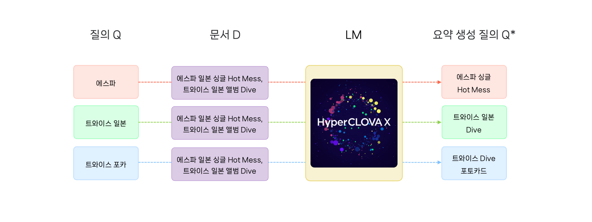
    
    - 질의(Q) + 문서(D)를 함께 고려하여 새로운 검색 의도(Q*)를 생성
    - 생성형 모델(네이버의 하이퍼클로바X)을 활용하여 더 자연스럽고 의미 있는 검색어로 변환(사내 LLM(large language model)인 HyperCLOVA X)
    - HyperCLOVA X는 다양한 네이버 내 UGC를 학습해 인플루언서명, 브랜드명, 프로그램명 등 한국어에 특화된 NLU(natural language understanding) 성능을 보유하고 있어 실제 콘텐츠를 이해하는 데 유리

### 질의 Q* 모델- **검색 로그를 활용한 지도 학습 미세 조정**

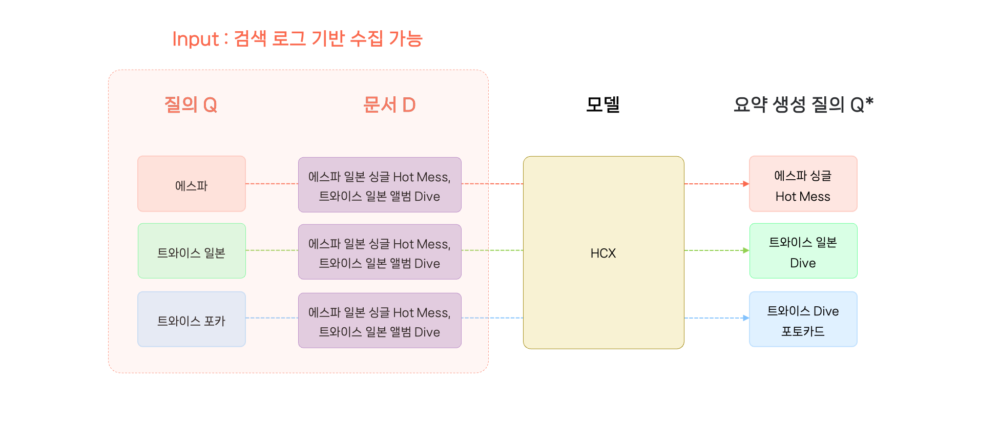

- 입력값: 질의 Q와 연관 문서 D가 사용
- 출력값: 문서를 기반으로 구체화된 요약 생성 질의 Q*
- 이때 입력값은 통합 검색 로그로 쉽게 수집할 수 있었으나, 출력값인 Q*는 정답 자체가 존재하지 않았음
- 이에 사용자들이 해당 문서를 찾는 구체적인 이유를 검색 로그로 찾아낼 수 있을 것이라 판단해 *Q**를 찾아내는 작업을 진행

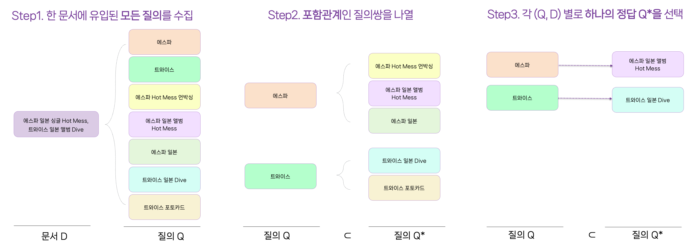

1. 하나의 문서에 유입된 모든 질의를 수집합니다. 
    
    앞선 예시 문서에는 '에스파', '트와이스', '에스파 일본 앨범' 등 다양한 질의로 진입할 수 있음
    
2. 수집된 Q 목록에서 서로 포함 관계인 질의 쌍을 나열
    
    *여기서 포함 관계란 각 질의를 토큰화했을 때 하나의 질의가 다른 질의 토큰의 일부를 포함하고 있는 관계를 의미
    
    ex) '에스파'라는 질의는 '에스파 일본', '에스파 앨범 언박싱' 등과 포함 관계 
    
    동일한 방법으로 '트와이스' 질의의 포함 관계 질의도 수집
    
3. 이렇게 수집된 질의들은 원질의 Q를 포함하고 있으면서 정보를 더 많이 가지고 있음
    1. 즉, '에스파'를 검색하고 예시 문서 D를 소비했을 때 요약 생성 질의 Q*가 될 수 있는 후보군
    2. 이 중에서 모델의 정답으로 활용할 Q*는 하나만 필요하므로, 정보를 가장 많이 담고 있는 질의를 최종 정답으로 선택
    3. 토큰 수가 가장 많은 질의가 가장 많은 정보를 담고 있다고 가정하고, 해당 질의를 Q*로 선택

### 질의 Q* 모델- 모델 학습 구성

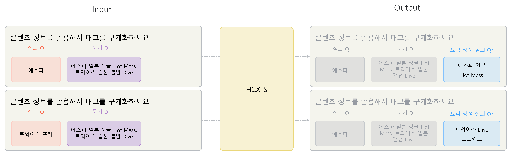

### **1. 검색 데이터를 활용한 LLM 학습**

- 네이버는 **검색 로그(검색어 + 클릭한 문서)** 데이터를 기반으로, **더 정확한 추천이 가능한 모델**을 만들고자 함
- 검색한 단어(Q)와 클릭한 문서(D)를 활용해 **사용자의 의도를 더 정확하게 추론하는 모델**을 학습
- 이를 위해 **지도 학습 미세 조정(SFT, Supervised Fine-Tuning)** 기법을 사용

### **2. HCX-S 모델을 활용한 효율적 학습**

- 네이버의 검색 데이터는 **수억 건 단위**라서 **빠른 추론이 중요**
- 큰 모델(HCX-L, HyperCLOVA X-Large)은 성능이 좋지만 **속도가 느려** 실제 서비스 적용이 어려움
- **HCX-S (HyperCLOVA X-Small)** 모델을 사용해 **HCX-L 대비 5% 크기**로 줄이면서도 효과적인 성능을 유지

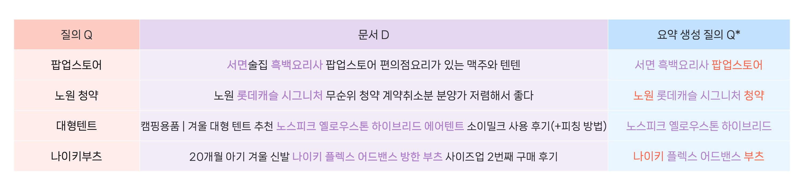

### **3. 검색 패턴의 편향 문제와 해결책**

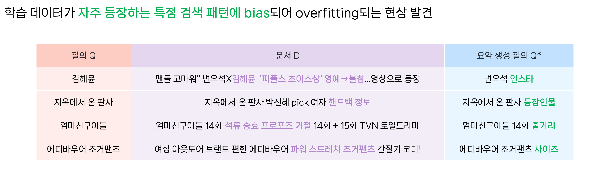

- 데이터를 분석해보니 **사용자들이 특정 패턴(예: '연예인 + 인스타', '드라마 + 줄거리')을 자주 검색**함
- 모델도 이런 **패턴을 따라가면서 핵심 내용을 반영하지 못하는 문제** 발생
- 이를 해결하기 위해 **HCX-L 모델을 활용한 데이터 증강(few-shot augmentation)을 시도**했지만,

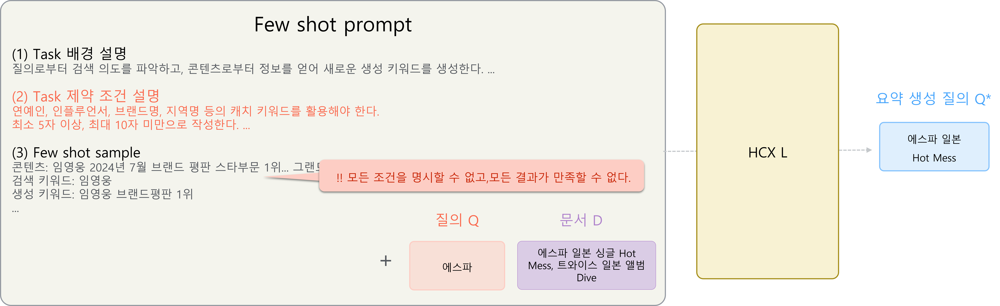

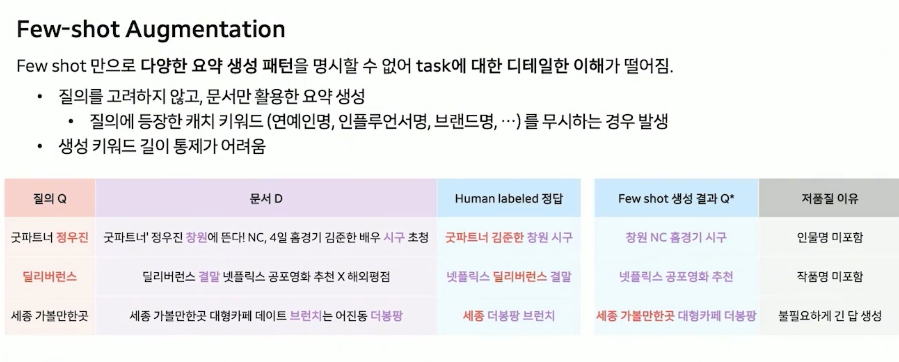

- **모든 패턴을 정제하는 것은 어렵고**,
- **HCX-L의 결과도 품질 편차가 있음**을 확인

→ 검색 로그를 활용한 지도 학습 미세 조정 시 수집된 데이터가 특정 패턴에 편향되기 쉬움

→ HCX-L 기반 적은 예시 데이터 증강 적용 시 HCX-L의 논리적 사고 능력(reasoning)이 뛰어나도 다양한 패턴을 명시하고 강제할 수 없어 품질 관리가 어려움

**이러한 상황에서, 편향되지 않은 고품질 데이터세트가 소규모로라도 있다면 문제를 효과적으로 해결할 수 있을 것으로 판단**

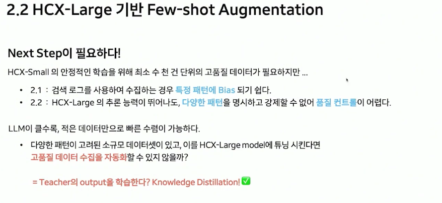

> 일반적으로 파라미터 크기가 큰 LLM일수록 명령어 따르기뿐만 아니라 논리적 사고 능력도 우수하므로, 미세 조정 시 적은 데이터만으로도 모델을 신속하게 수렴시킬 수 있다.
> 

> 즉, 소규모 데이터로도 HCX-L을 한 번 조정(tuning)하여 데이터에 대한 이해도를 높인다면, 이 모델로 데이터를 증강하여 작은 모델을 조정할 데이터세트를 확보할 수 있음.
> 

> 이러한 접근은 HCX-L 모델의 지식을 작은 학생 모델(HCX-S)에게 전수하는 지식 증류(knowledge distillation) 문제로 귀결
> 

### **4. 지식 증류(knowledge distillation) 적용**

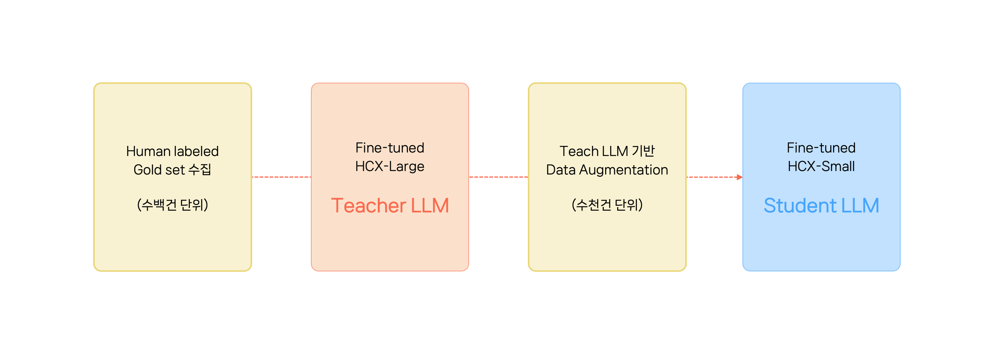

- **HCX-L(큰 모델)을 학습하여 고품질 데이터를 생성**하고,
- **이 데이터를 활용해 HCX-S(작은 모델)를 학습시키는 방법**을 사용
- 과정:
    
    
    
1. **사람이 직접 레이블링한 우수한 데이터**를(최대한 다양한 패턴을 반영하도록 단순 추출 요약부터 패러프레이징, 자연스러운 어순 등을 고려하여 작성)
2. HCX-L을 학습(Teacher LLM 생성- 교사 모델을 구축할 때는 처리 속도보다 품질이 중요하므로, 프롬프트는 앞서 진행한 적은 예시 데이터 증강과 같이 상세하게 작성하여 빠르게 수렴할 수 있도록)
3. HCX-L을 사용해 **수천 건의 학습 데이터를 자동 생성**
4. **이 데이터를 사용해 HCX-S를 학습**(Student LLM 생성)
- 결과

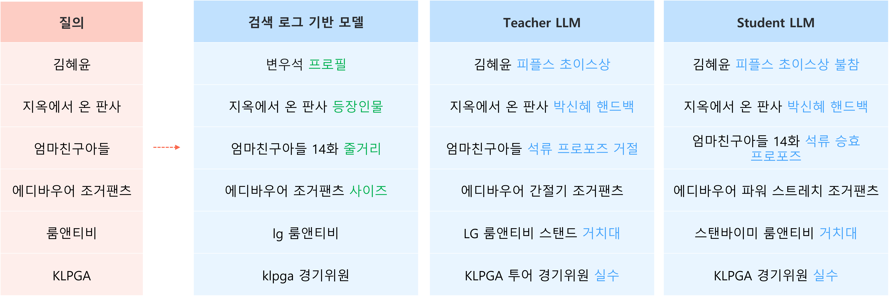

### **5. 오프라인 성능 평가 결과**

- **기존 검색 로그 기반 모델:** BERT 스코어 F1 0.77 (편향 문제로 성능 낮음)
- **HCX-L을 그대로 사용:** 성능이 오히려 더 낮음
- **고품질 데이터로 학습한 Teacher LLM:** 성능 F1 0.91 (목표 수준 도달)
- **Student LLM(HCX-S):** Teacher LLM을 제외한 모든 모델보다 높은 성능 기록,
    - **기존 검색 로그 모델 대비 성능 7% 향상**

### **6. 온라인 서빙 최적화**

- 오프라인에서 모델을 검증한 후 온라인 서비스에 적용하기 위해 서빙 전용 프레임워크인 vLLM을 도입
    - 허깅 페이스(Hugging Face)로는 온라인 추론(online inference)을 신속하게 처리하기 어려웠기 때문
- 오프라인 성능을 검증한 후, **빠른 실시간 추론을 위해 최적화** 필요.
- **vLLM 프레임워크 도입**하여 **기존 대비 QPS(초당 요청 처리량) 400% 개선**.
    - 모델 병렬 처리(model parallel)를 적용해 multi GPU로 병렬 연산 가능
    - 페이지드 어텐션(paged attention)과 연속적 배치 처리(continuous batching)로 처리량 향상
    - 기존의 허깅 페이스 배치 파이프라인 대비 QPS 최대 400% 개선
- **오토 스케일링+제로 스케일링 적용**: 검색량이 많아질 때만 리소스를 늘려 **GPU 사용 최적화**.

### 7. **검색 로그 추론 파이프라인**

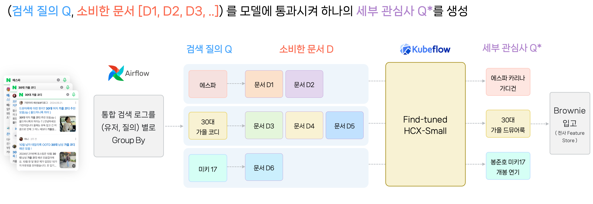

1. 검색 로그가 에어플로(Airflow) 배치를 통해 사용자별, 질의별로 그룹화되어 유입
2. 검색어별로 여러 문서를 클릭하면 하나로 연결(concat)하여 추론(inference)합니다.
3. 생성된 데이터는 개인화 피처 스토어인 Brownie에 저장되어 개인화 알림 발송에도 활용됩니다.

### 8. 온라인 평가

- 홈피드의 AfterSearch와 숏텐츠 서비스가 다음과 같이 개선된 것을 확인
- 예를 들어, 사용자가 '에스파'를 검색하고 'whiplash' 문서를 확인한 경우, 에스파의 위플래시 관련 문서를 보다 정확하게 추천
- 정확한 수치로 보면, 기존의 질의 기반 추천 대비 요약 질의 추천의 클릭률(CTR, click-through rate)이 7.74% 상승
- 숏텐츠에서는 사용자들이 문서를 직접 읽지 않고도 현재 발생하고 있는 트렌드를 한눈에 파악

### 9. 앞으로의 개선 포인트

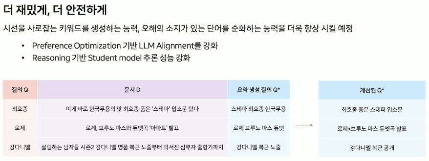

---

# 3. 사용자 관심 주제 추출

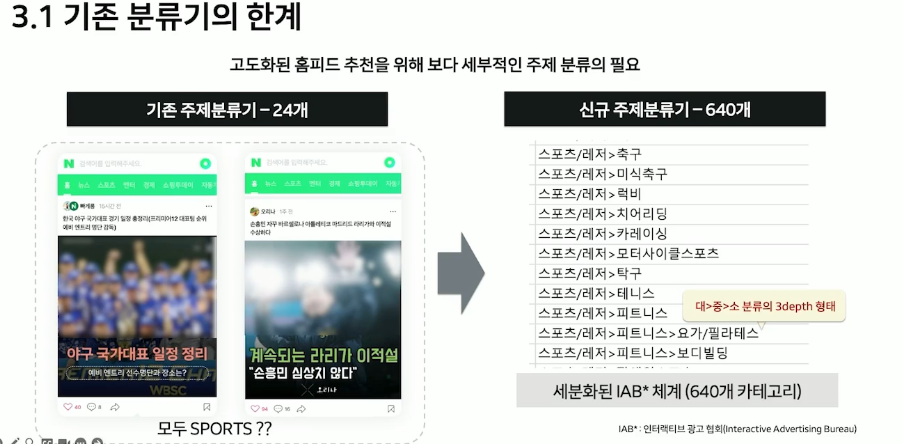

### 1. 홈피드 추천을 고도화하려면 보다 세부적으로 주제를 분류

- 기존의 주제 분류기에는 몇 가지 주요한 한계점이 있음
    - 예를 들어, 축구와 야구가 모두 '스포츠'라는 동일한 카테고리로 분류되어 축구에만 관심 있는 사용자에게 야구 콘텐츠가 추천되는 문제가 발생
- 이러한 문제를 해결하기 위해 신규 주제 분류기에서는 인터랙티브 광고 협회(IAB)의 분류 체계를 도입해 640개의 세부적인 카테고리로 분류하고자 함
- IAB 분류 체계는 '스포츠/레저>피트니스>요가/필라테스'와 같이 대/중/소 형태의 3단 분류로 구분
- 

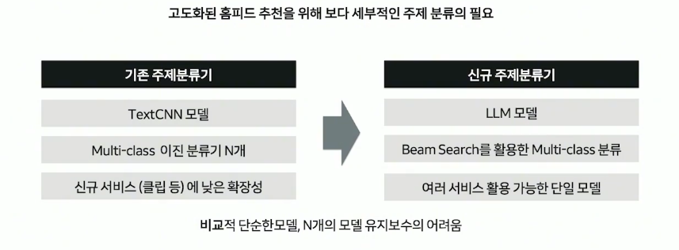

### 2. 비교적 단순한 TextCNN 모델을 사용

- 이로 인해 다중 클래스 분류(multi-class classification)를 적용하려면 N개의 이진 분류기(binary classifier) 모델이 필요했고, 여러 개의 모델을 유지 보수하는 데 어려움이 있음
- 이를 해결하기 위해 신규 주제 분류기에서는 콘텐츠와 상관없이 **통합된 단일 LLM(large language model)**을 도입하고 **빔 서치(beam search)**를 활용해 **다중 클래스 분류를 구현**
    - 예를 들어, '나이키 여성 러닝화' 문서는 '패션>신발', '스포츠/레저>걷기/러닝'으로 분류하고,
    - '세부 스쿠버다이빙' 문서는 '스포츠/레저>워터스포츠>스쿠버다이빙', '여행>해외여행>아시아'와 같이 자세한 세부 주제를 다중 레이블(multi-label)로 분류하는 것을 목표

## 3.2모델 평가와 학습

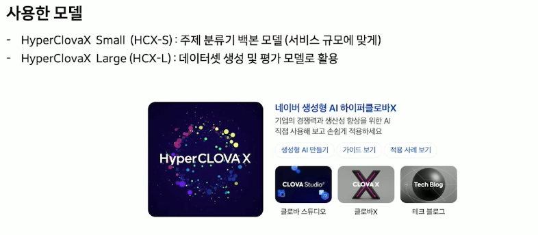

- HCX-S는 서비스 규모에 적용 가능한 가장 작은 LLM 모델 → 주제 분류기의 백본 모델로 선택
- HCX-L 모델은 데이터를 생성 및 평가에 사용
- 예를 들어, '강원도 강아지 동반 캠핑'과 같은 문서는 캠핑, 강아지, 국내 여행 등 여러 주제로 분류할 수 있으므로 멀티 레이블 평가 데이터세트 구축에 어려움
    
    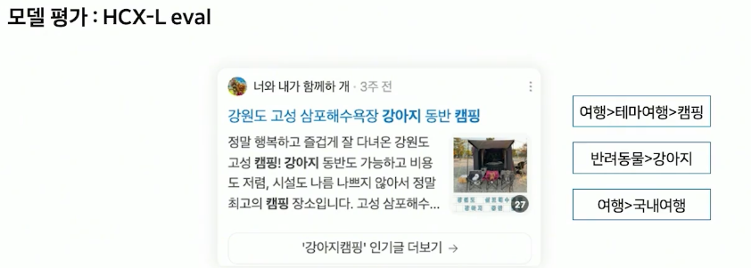
    
- 이러한 이유로 HCX-L 모델을 이용한 평가 방식을 채택

### LLM 평가의 신뢰성을 검증하기 위한 두가지 논문

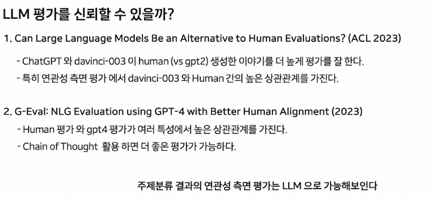

→ 두 논문에서 LLM이 사람의 평가를 완벽히 대체할 수는 없지만 상대적으로 신뢰할 만하며 시간과 비용 측면에서 장점이 있다는 것을 확인

- 특히 주제 분류 결과의 연관성 측면을 평가하는 데는 LLM을 충분히 활용할 수 있다고 판단
- G-Eval 논문을 바탕으로 HCX-L 평가 프롬프트를 작성
    - 먼저, 주제가 분류된 후보의 평가를 요청하는 작업 명령어(task instruction)와 연관성, 구체성에 대한 자세한 평가 지침을 추가
    - 이후 사고 사슬 형식으로 제목과 본문을 먼저 읽고, 연관성과 구체성을 판단하여 0∼100점으로 4단계 평가를 요청
    - 평가 프롬프트를 구성할 때 구체적인 평가 지침을 제공하면 더 나은 평가가 이루어진다는 점을 고려해 연관성과 구체성에 대한 상세한 설명을 포함
- 평가는 G-Eval과 같이 빈칸에 점수를 직접 예측하는 서식 작성(form filling) 방식을 사용
    - G-Eval의 1∼5점 평가에서는 동점이 많이 발생해 텍스트 간의 미묘한 차이를 포착하지 못하는 단점
    
    HCX 평가에서는 같은 문제가 발생하지 않도록 0∼100점을 기준으로 했습니다.
    
- 최종 평가 결과는 다음과 같은 기준으로 점수를 부여했습니다.
    - '여행>해외여행>미국/캐나다'처럼 연관성이 높고 자세한 경우: 100점
    - '여행>국내여행'처럼 연관성이 틀린 경우: 0점
    - '여행'처럼 간단히 예측한 경우: 30점

- 모델 학습 단계에서는 HCX-S 모델을 백본 모델로 사용했으며, 명령어와 제목, 본문으로 주제를 예측하는 학습 프롬프트를 구성
- 학습은 지도 학습 미세 조정(supervised fine-tuning)을 사용했고, 손실 함수로는 모델 출력과 레이블 간의 교차 엔트로피 손실(cross-entropy loss)을 사용해 진행
- 모델 추론 시에는 **빔 서치(beam search)**를 활용해 **다중 레이블(multi-label)** 분류를 수행
- 빔 서치는 '빔 크기'만큼 상위 후보 경로만 유지하며 탐색하는 알고리즘
    - 'num_beams=3' 옵션을 이용해 가장 높은 확률의 주제 3가지로 분류

# 학습 데이터

다음과 같은 단계로 다양한 주제군의 데이터를 학습하고 평가했습니다.

### Step 1: 사람이 레이블링한 데이터 학습 및 평가

먼저 사람이 레이블링한 3천 건의 데이터로 학습을 진행한 후 평가

- 기준치(baseline)와 비교했을 때 '여행'과 같은 대분류의 주제 분류에서는 더 좋은 성능
- 하지만 '여행>해외여행>미국/캐나다'와 같이 3단계까지의 주제 분류 평가에서는 점수가 낮음
- 이는 사람이 레이블링한 데이터세트의 한계로 인해 IAB 전체 주제군의 50% 주제군에 대해서만 데이터가 존재했기 때문

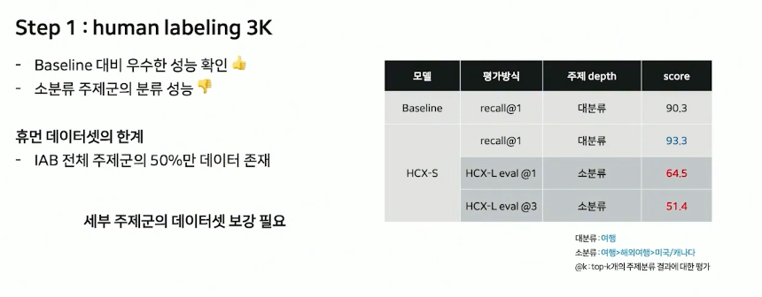

### Step 2: 데이터 증강

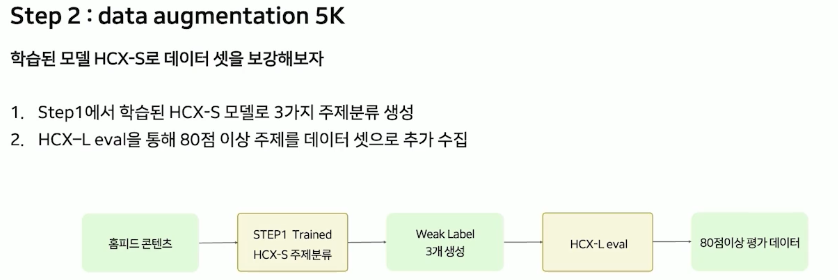

추가 데이터세트를 확보하기 위해 홈피드 콘텐츠 풀과 학습된 HCX-S 모델로 데이터 증강(data augmentation)을 진행했습니다. 제목과 본문이 있는 홈피드 콘텐츠 데이터에서 학습된 HCX-S 모델로 주제를 분류하여 약한 레이블(weak label)을 3가지 생성하고, 이 결과를 다시 HCX-L 모델로 평가하여 80점 이상인 데이터 5천 건을 확보했습니다.

데이터세트 커버리지를 늘려 학습한 결과, 두 번째 학습에서 점수가 기존 대비 11% 향상됐습니다. 하지만 홈피드 추천 데이터에서 데이터 증강을 진행하다 보니 주로 인기 있는 주제군 레이블 데이터가 확보되어 데이터세트가 불균형해지면서 다양성이 감소하는 문제가 발생했습니다.

### Step 3: HCX-L 지식 증류

세 번째 단계에서는 데이터 수가 부족한 주제(예: 패션>신발)를 보완하기 위해 HCX-L로 합성 데이터를 생성하고(synthetic data generation) 이 데이터를 학습해서 HCX-S로 지식 증류(knowledge distillation)했습니다. 먼저 HCX-L에게 특정 주제에 관한 제목을 작성하라고 요청하여 제목을 생성했습니다. 이후 주제와 생성된 제목을 연결해(concat) 본문을 작성하라고 요청하여 본문을 생성했습니다. 최종적으로 (제목, 본문, 주제)에 대해 주제별로 2개씩, 천 개의 데이터를 보완할 수 있었습니다.

다양한 주제군의 데이터를 학습한 결과, 평가 점수가 첫 번째 학습 대비 20% 상승했고 전체적인 다양성 또한 향상됐습니다.

# 가이드 텍스트 생성

모델 학습 후에도 한 가지 중요한 문제가 있었습니다. 주제 분류 결과를 서비스에서 사용하려면 항상 일관된 응답을 제공해야 하는데, 다음과 같은 상황이 발생했습니다.

- '허리 디스크'에 불필요한 철자가 추가되는 경우
- '백피킹'처럼 기존 주제군이 아닌 새로운 주제가 생성되는 경우
- '요리/레시피'처럼 기존 depth와 다른 주제가 생성되는 경우

이렇게 예측할 수 없는 응답을 해결하기 위해 가이드 텍스트 생성(guided text generation)을 도입했습니다. 가이드 텍스트 생성은 LLM 생성 시 특정한 지침이나 제약 조건에 따라 텍스트를 생성하는 방식을 의미합니다.

주제군에 있는 후보만 생성할 수 있도록 가이드 텍스트 생성 방식 중 하나인 후보 빔 서치(candidate beam search) 방법을 구현했습니다. 이 방식은 다음 토큰 예측(next token prediction) 단계에서 모든 단어 집합(vocab)에 대하여 확률을 구할 때, 가능한 단어 집합을 제외하고 마스킹 처리하는 방식입니다.

이를 위해 가능한 단어 집합이 무엇인지 참조할 수 있는 주제군 토큰 테이블을 사전에 추가했습니다. 예를 들어, '스포츠/레저' 토큰의 다음 토큰을 예측할 때, 확률상으로는 '워터', '동계', '피트' 순으로 선택됩니다. 하지만 원하는 주제군에서만 생성하도록 인코딩된 테이블을 참조하여, 두 번째 시퀀스에 가능한 토큰은 {워터, 피트, }임을 확인하고 불가능한 '동계' 토큰은 마스킹 처리하는 형태로 구현했습니다.

실제 구현 단계에서는 다음과 같은 절차를 따랐습니다.

1. 640개의 주제군 후보들을 인코딩하여 테이블 생성(추론 전 사전 인코딩을 한 번만 수행하여 지속적으로 활용 가능)
2. LLM 생성 시 인코딩 테이블을 옵션으로 주어, 각 토큰 생성 시 해당 테이블을 참조할 수 있도록 구현

이를 통해 LLM으로 주제 분류를 예측할 때 항상 원하는 주제군에 대해서만 응답이 가능하도록 제어할 수 있었습니다.

# 사용자 주제 선호도 및 온라인 평가

주제 분류기가 완성되면 사용자 로그로 사용자 주제 선호도를 구축할 수 있습니다. 예를 들어, 홈피드에서 사용자가 후쿠오카 관련 문서를 클릭하면, 콘텐츠 피처 스토어(content feature store)를 조회해 사용자가 '아시아'와 관련된 주제를 읽은 것을 파악합니다. 이러한 클릭, 노출 로그를 함께 분석해 배치마다 단계별 주제 선호도를 계산합니다.

주제 선호도 스코어링 시에는 주제별 클릭과 노출 수, 기간, 시간 경과에 따른 시간 감쇠(time decay), 주제별 평균 노출 수를 고려한 안정화 방식(smoothing)을 고려합니다.

이렇게 구축한 홈피드 주제 선호도를 사용자 피처에 추가하고, 아이템별 주제 임베딩을 아이템 피처에 추가해 온라인 AB 테스트를 진행했습니다. 테스트 결과, 대분류 주제만 사용했을 때보다 대분류부터 소분류까지의 상세한 주제 선호도를 파악할수록 클릭률(CTR, click-through rate)이 더 높아지는 것을 확인할 수 있었습니다.

또한 LLM 분류기는 블로그, 카페 등 다양한 콘텐츠 문서를 분류할 수 있으므로 홈피드뿐만 아니라 검색, 네이버 메인의 사용자 로그도 활용할 수 있었습니다. 이를 이용하여 통합 주제 선호도를 생성했습니다.

통합 주제 선호도 생성 시에는 다음과 같은 전략을 사용했습니다.

- 홈피드 사용성이 낮은 사용자: 검색과 메인판의 지면 선호도를 더 많이 활용
- 홈피드 사용성이 높은 사용자: 홈피드 선호도를 주로 활용

교차 도메인(cross-domain) 효과를 검증하기 위해 첫 번째 실험과 동일한 설정에서 사용자 피처의 사용자 주제 선호도 변화에 따른 AB 테스트를 진행했습니다. 그 결과 홈피드만 사용할 때보다 홈피드, 검색, 네이버 메인의 선호도를 모두 활용할 때 클릭률이 약 2% 상승한 것을 확인할 수 있었습니다.

최종적으로 문서를 잘 분류하고 여러 지면의 사용자 선호도를 세부적으로 파악할수록 사용자의 클릭 수가 증가하는 것을 확인할 수 있었습니다.

# 정리

지금까지 3개의 블로그 글로 홈피드에서 LLM을 활용해 초개인화를 실현한 경험과 관련 기술을 공유했습니다.

서비스에 LLM을 적용하면서 얻은 주요 교훈은 다음과 같습니다.

- **고품질 데이터세트 구축**: 노이즈가 제거된 고품질 데이터세트는 LLM 시대에도 여전히 중요한 요소입니다.
- **지식 증류**: 서비스 적용을 위해 작은 모델을 사용해야 할 때는, 먼저 큰 모델을 교사 모델로 학습하고 학생 모델에 지식 증류를 사용하는 방식이 효율적이었습니다.
- **가이드 텍스트 생성**: 가이드 텍스트 생성을 이용해 서비스에 더 안정적으로 LLM 응답을 사용할 수 있었습니다.

네이버와 AiRScout는 사용자의 선호 콘텐츠를 가장 빠르게 맞춤으로 제공하는 초개인화 서비스를 더욱 발전시킬 수 있도록 앞으로도 계속 노력하겠습니다.