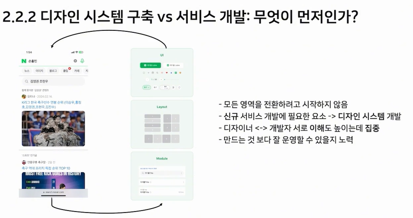
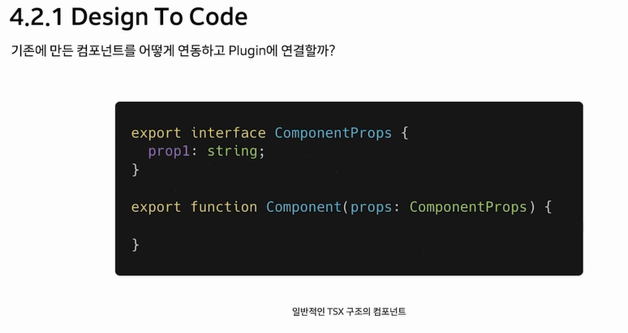

# 데이터 기반으로 지속적 성장이 가능한 네이버 검색 FE 시스템 구축하기

## CONTENTS

### ✔️ 겪었던 문제점과 해결 방향

1. 검색에 각 영역들이 MSA로 돼있다. 그러다보니까 영역마다 검색하는게 비슷한데 코드가 SHARE되고 있지는 않았다. -> (server driven UI로 해결)

2. 작업자들마다 컴포넌트를 중복돼서 개발하는 부분도 있었다. -> (Design System으로 해결)

3. 가장 큰 문제는 데이터가 부족했다. 어떤 부분을 계산하고 어디를 개선해야 좋은지 파악을 하기가 어려웠고 개편하기가 어려웠다. -> 어떤 부분을 측정하고 어떤 부분을 개선해야할지 어떻게 임팩트를 측정해야하는 부분, 피드백을 어떻게 빠르게 받을까를 고민하게 됐다.
 
### ✔️ Flexible Rendering Engine

#### 1. Server Driven UI

21년도에는 비슷한 컨셉에 고민을 했다. 당시에는 템플릿 기반으로 적당한 템플릿에 데이터를 넣으면 되는 구조였다.

문제점은 서비스를 쓸수록 개선과정이 늘어날수록 템플릿 수가 늘어나면서 관리가 힘들다는 문제점이 있었다.

그래서 컴포넌트 기반으로 바꾸려고 했다. 잘게 나누어서 조립하는 형식의 컴포넌트 방식을 하려고 했는데 생산성이 너무 줄어들었다.

그래서 Sweet Spot을 찾으려고 노력했다.

모듈 단위로 개발을 시작했다. 모듈은 템플릿보다는 작은 단위고 컴포넌트보다는 조금 더 큰 단위이다. (속된 말로 거시기같다고 하심)

초반에 디테일한 명확한 규칙을 잡기보다는 사후에 데이터를 수집해서 사용자의 패턴을 분석해서 그 패턴을 기반으로 개발을 하고 고도화 하는 방식으로 작업을 했다.

적당한 템플릿 ID가 있고 적당한 모듈 ID가 있고 그 안에 데이터로 이루어진 구조이다. 이 구조의 특징은 모듈은 자유롭게 구조를 바꿀 수 있지만 그 이상에는 제약을 건다는 특징이 있다.

대표적인 사례에는 똑같은 UI처럼 보이지만 다른 UI들을 배치해놓은 페이지들이 있다.

모듈이라는 방식내에서 수정하고 바꾸고 그 안에서 제어하는 방식으로 바꿨다.

#### 2. 레거시 시스템에 디자인 시스템을 도입하기 위한 전략

디자인 시스템이 왜 product에 통합이 잘 안될까 ? 만드는건 문제가 아니지만 적용하는데에 실패했다. 디자인 시스템을 만드는 사람들과 사용하는 사람들과의 한계점들을 주목해서 서비스에 적용하면서 디자인 시스템을 만들었다. 새로 바뀌는 영역에 디자인 시스템이 필요한 영역들을 뽑고, 그것을 시스템에 반영하는 점진적인 시스템으로 바꿨다.

그리고 개발자와 디자이너, 디자인 시스템을 만드는 사람과 사용하는 사람들을 구분하지말고 처음에 같이 협업을 하는 방식으로 바꿨다.

디자인 시스템 구축 vs 서비스 개발 무엇이 먼저일까 ?

디자인 시스템 만들기 vs 디자인 시스템 사용하기

빠르게 개발하는데 용이했지만 서비스의 퀄리티를 높이기에는 힘들었다.

처음부터 디자인 시스템 만드는 팀과 사용하는 팀을 분류했다면 실패했겠지만 서로 이해도가 높은 상태에서 분류를 해서 성공했던 것 같다.

이렇게 팀을 나누면 협업의 비용이 어디서든 발생한다. 이걸 어떻게 낮출까 ?

### ✔️ Developer experience

디자인과 컴포넌트는 나날이 증가할 것이다. 새로운 팀원도 기억하기 어려울 것이다. 그렇다면 우리가 만든 디자인, 컴포넌트는 어떻게 만들고 어떻게 사용하고 잘 사용하고 있을까 ?

디자인 시스템을 만드는 자와 사용하는 자에게 경험을 얻어 데이터로 변환하고 그 데이터가 처음 접하는자, 모두에게 제공하면 그것이 순환이 될 것이다.

프로젝트에 담긴 코드와 파일들은 네이버에서 만든 META Analyzer를 통해 META를 만들 수 있다. 어떻게 만들까?

제공하는 함수에 의해서 다음과 같은 사항을 파악할 수 있다.

그럼 이 META를 어떻게 활용할까 ?

디자이너는 디자인을하고 개발자는 그 디자인 요소들을 개발로 옮겨야한다. 어떤 디자인이 어떤 컴포넌트로 연결되었는지 어떻게 만들고 있는지 알고있는가 ?
새로 들어온 입사자들은 알기 쉽지 않을 것이다.

이러한 디자인과 개발 요소들은 결국 연결되어 있으며 어떤 디자인이 어떤 컴포넌트와 동기화 되어있는지 파악을 해야한다.

우리는 디자인을 모두 이해할 수 있을까 ?

그래서 디자인을 코드를 바꿔주는 도구가 필요하다. 그런데 에디터로 개발을 하면 목적 타겟 범용성 기능도 매우 적고, 개발 비용, 유지보수비용도 매우 클 것으로 예상했다.

#### Design To Code 

범용성은 적더라도 목적, 타겟성이 확실하고 한정된 기능으로 유지 보수도 탁월하다고 생각했다. (Figma Variable, Code Connect가 있기 전이라고 한다.)

피그마 플러그인은 크게 API, UI 레이어로 나뉘게 된다. API 레이어에서는 플러그인 API를 사용할 수 있으며 디자인 정보를 확인할 수 있다. UI레이어에서는 UI를 확인할 수 있지만 디자인 정보를 확인할 수 없기 때문에 API 레이어에서 디자인 정보를 가져오고 데이터를 UI로ㅓ 전송해야 한다. 하지만 불필요한 정보도 많고 메서드를 통해서만 얻을 수 있는 정보도 있기 때문에 그대로 전달할 수 없고 이름 사이즈 포지션 스타일 키등 필요한 정보만 가져와서 특정 포맷에 정제된 데이터로 변환한다. 이 정제된 데이터를 JSX, JSON Code로 변환해서 우리에게 보여준다.

이전에는 디자인을 수동으로 markup으로 옮기고 이제는 플러그인으로 markup을 만들고 디테일만 손 보는 방식으로 바뀌었다.

그런데 기존에 만든 컴포넌트가 있으면 어떻게 될까 ? 

플러그인에서 디자인 정보를 토대로 기존에 컴포넌트와 매칭시켜줄 수 있고, 그렇지 않다면 이전과 같은 방식으로 새로 개발하면 된다.

다음 사진은 REACT Ts로 개발할 때 사용하는 코드이다. 함수를 정의하고 함수의 첫번째 인자에는 props가 있고 ComponentProps와 같은 Interface 타입이 있다.

JSDoc을 사용하는 이유는 개발과 다른 도구들에 영향을 끼치지 않기 때문에 사용했다.

이렇게 디자인과 컴포넌트를 매칭할 수 있다.

컴포넌트의 매칭과 유사하게 피그마의 구조나 variant 값에 따라서 prop의 JSDoc으로 입력하여 컴포넌트와 매칭할 수 있다.

이러한 정보는 플러그인 API를 통해 얻을 수 있어서 일반적으로 얻기 어렵고 플러그인에서 개발하는 경우라면 매칭에 필요한 정보를 JSDoc에 담아서 제공해준다. 

이러한 JSDoc 정보는 Interface에 담겨있고 Interface는 META에 저장돼있다.

META가 저장된 위치의 URL을 플러그인에 추가해서 사용할 수 있다. 

디자인 정보가 담긴 첫 데이터는 아무것도 매칭되지 않은 raw한 데이터이다. 메타에 담긴 컴포넌트 정보와 디자인 정보가 일치하게 된다면 raw한 데이터는 매칭된 컴포넌트 데이터로 바뀌게 된다. 매칭된 데이터는 매칭되기전 인터페이스와 같기 때문에 이전과 동일하게 JSX, JSON, html등 다양한 포맷으로 출력할 수 있다.

META에는 props 정보, 컴포넌트 정보, 연계된 style 정보들이 있다. 매칭되는 경우 기존 컴포넌트로 대체가 되며 스타일 또한 생략이 된다. props 연결, 문서 연결등 개발자에게 다양하게 도움을 줄 수 있다.

이것들을 다 ! 요약해보면 .

이전에는 디자인을 통해 이 디자인이 어떤 컴포넌트와 연결되어있는지 직접 확인해야했고 연결되어있지 않다면 직접 컴포넌트 개발까지 해야했다면,

이제는 매칭된다.

#### Design Diff

개발자는 디자인에 따라 컴포넌트를 개발한다. 플러그인을 통해서 컴포넌트는 잘 매칭되고 있을까? 매칭이 안되거나 디자인이 바뀌었다면 개발자가 알 수 있을까? 디자이너가 말하지 않는다면 알 수 없다. 

위와 같이 WebHook을 통해 알람을 받으려고 했지만 매 1분마다 알람이 와서 불편했다.

트리거는 개발 코드가 merge 된다거나 활동시간 중 4번정도 정기적으로 검사를 실행한다.

이전에는 다음 회의에 변경사항을 공유했찌만 이제는 알람으로 받아서 빠르게 반영할 수 있게 됐다.

#### Analytics

우리가 사용한 컴포넌트, 템플릿이 사용된 곳이 어디일까? 

#### Docs

#### META

메타를 이용해가지고 편의성을 위한 다양한 도구와 페이지들을 만들었다. 디자인 시스템을 만드는 자, 사용하는 자 등등 모두를 연결했다. 이해도를 올려주고 개발비용을 낮춰주는 역할도 한다. 앞으로도 개발자를 위한, 처음을 위한 아니면 디자이너에게도 도움을 줄 수 있는 경험을 공유하고 나아갈 예정이다.

### ✔️ 검색 FE 시스템 아키텍쳐

- 디자이너는 디자인 시스템을 피그마에서 설계하게 된다. 
- 이렇게 설계된 디자인 시스템은 Search Design System 플러그인을 통해서 개발할 수 있는 코드의 스캐폴딩 같은 리액트 코드로 전환이 된다
- 이 코드를 가지고 디자인 시스템 개발자들은 디자인 시스템에 맞게 컴포넌트를 개발하게 된다.

- Search Design System을 통해서 기존에 있는 컴포넌트는 매칭되며 만약에 매칭되지 않는 컴포넌트는 컴포넌트로 만들 수 있는 코드로 전환이 된다.
- 디자인 시스템 컴포넌트와 새로운 컴포넌트를 기반으로 Fender에서 서비스 가능한 코드로 전환을 해준다

- 사용자의 피드백, META에서 나온 정보를 바탕으로 개선해야되는 포인트를 비롯하여 반복되는 작업들을 주기적으로 판단한다.
- 실제 사용자가 노출됐던 정보, 사용했던 모듈 정보와 로컬에서 스태틱하게 얻는 정보를 조합하여 어떤 컴포넌트가 사용되고 있고 사용되고 있지 않은지 이런 정보들을 다시 디자인 시스템에 적용되게 한다.