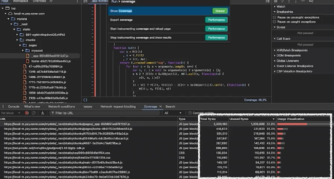

> [여러분의 웹서비스에는 꼭 필요한 것만 있나요? 번들사이즈 최소화를 통한 웹 성능 개선](https://tv.naver.com/v/67445777)

> 네이버페이 프론트엔드 개발 팀

## 성능 개선 필요성

### 서비스 구조 변화

1. 기존 단일 저장소 단일 서비스의 구조 : 서비스 규모 증가에 따른 복잡도 증가

   - React

2. 마이크로서비스로 분리 시작

   - Next.js : SSR 도입 시작

3. 비즈니스 로직을 처리하기 위한 고민 : 프라이빗과 퍼블릭 npm 레지스토리 적극 활용

4. 서비스의 속도 감소 문제 발견 : 비즈니스 로직을 구현하는 과정에서 성능 최적화를 신경쓰지 못함

### 속도 성능 저하에 대한 분석

크롬 개발자 모드의 Coveage 메뉴에서 확인되는 렌더링을 위해 사용되는지 여부 확인 가능

크게 50%까지 사용되지 않는 코드로 분류 : 불필요한 코드가 있음을 인지

## 웹 서비스의 자바스크립트 크기만 줄여도 성능 향상에 도움이 되지 않을까?

어떠한 상황에서도 사용되지 않는 자바스크립트 리소스 식별하여 가능한 많은 코드를 삭제하여 꼭 필요한 코드만 포함되도록 설정한다.

 

## 1. 불필요한 리소스 구별 및 삭제

실제 동작에 영향을 주지 않으면서 코드를 최소화할 수 있는 방법

> 1. 미사용 리소스 제거
> 2. 꼭 필요한 기능만 남기기
> 3. 가볍고 빠른 대체제 찾기

 

---

당시 네이버페이는 i8까지 지원해야 하는 부담이 있었음.

> **코어 js 파싱: 블필요한 리소스 인식**

최신 브라우저를 사용하고 있는 유저라면 괜찮지만, i8의 성능 문제 관련하여 자바스크립트 파싱 과정에서 부담이 든다.

위의 문제를 해결하기 이ㅜ해서는 먼저 마이크로 서비스들을 한 가지의 서비스 지원 범위를 갖도록 통일해야 한다.

`@naverpay/browerlist-config` : 브라우저 리스트에서 해당 서비스 범위를 지정하고, 다양한 라이브러리들을 해당 리스트 아래에 빌드되도록 한다

 

---

> **lottie 내부 이미지 압축** : `sharp` 패키지를 통한 내부 이미지 압축 필요

인터랙션과 애니메이션을 제공하기 위한 lottie 사용 : 큰 용량 차지(276kb)

sharp 패키지를 활용하여 베이스 65 이미지 압축 (164kb)

 

---

> **svg 컴포넌트** : 기존 구조는 리액트에서 컴포넌트 구조로 만든 다음에 svg 태그를 만들어 사용

피그마에서 전달받은 해당 파일들은 용량이 매우 크다.

메모이제이션을 통한 압축 자동화 시도 : 약 200여개 이상의 이미지들을 모두 메모이제이션하는 것이 사실상 불가능

`naverpay/optimize-svg-components` : 오픈 소스를 만들어 svgg로 압축하여 eslint 라이프사이클에 맞춰 픽스해주는 eslint 플러그인 개발

- SVG 크기의 약 10% 압축
- 메모이제이션 효과적 처리

 

---

> **잘못 사용된 리소스 제외 기법** : useEffect문 내부에서 렌더링을 막을 수는 있지만 리소스 다운로드 까지 막지 않음

ueEffect까지 와야 실제 로딩 여부가 결정되기 때문에 환경에 관계 없이 리소스가 포함되어 있어야 한다.

결과적으로 불필요한 리소스 다운로드가 발생된다.

- 사용자가 알 수 없는 서버에서 리소스를 필터링하여 제거 : 클라이언트의 부담이 감소되는 긍정적인 효과

 

---

> **Axios 버전 업그레이드에 따른 breaking change 이슈 발생** : 서비스에 다라 axios 버전이 파편화되어 해당 부분을 일괄적으로 대응하기 어렵다.

- native fetch로 대체 : 기본적으로 필요한 기능을 모두 제공해주기 때문에 과도한 오픈소스 의존도를 줄일 수 있다.

  

## 2. NPM 라이브러리의 효율적인 관리

모든 답은 ESModule과 package.json에 있다.

1. **CommonJS는 트리쉐이킹이 어렵다** : 사용되지 않는 코드를 제거하여 번들 크기를 줄이는 최적화 기법인 트리쉐이킹을 ESModule은 지원한다. (import / export 방식)

CommonJS는 "require()"를 사용하기 때문에 정적인 코드 분석이 어렵다.

- 트리쉐이킹과 모듈 분리의 필요성이 적은 서버 : CommonJS
- 트리쉐이킹과 전체 번들 사이즈가 중요한 클라이언트 : ESModule

 

2. **package.json을 최적의 구조로 유지해야한다.** : `@naverpay/publint` 패키지를 개발하여 배포하기 전에 검증 도구를 적극 활용하여 문제를 사전에 방지한다.

 

3. **오래된 npm 패키지에 대한 조치가 필요하다** : patch를 적용하여 유지보수 여부와 관계없이 수정을 가능하도록 하고, 해결할 수 없다면 최신 패키지로 교체하여 문제를 빠르게 해결한다.
