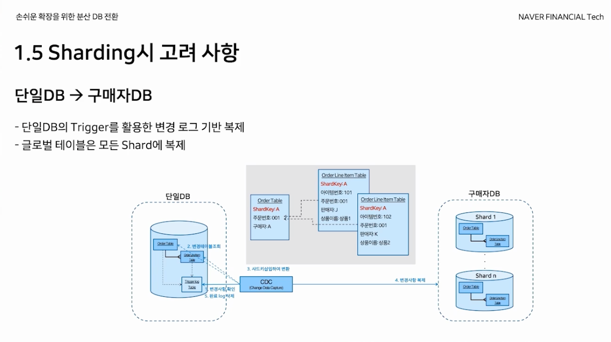

# 📌 네이버페이 결제 시스템 성장과 변화

> - 역사
> - 분산 DB의 필요성
> - 다중 DB로 전환하는 과정
> - Event Driven Architecture 적용

## 역사

- 2009, 체크아웃 오픈
- 2012, 시스템 리뉴얼 (MSA, RPC기반 통신)
- 2015, 네이버페이 오픈
- 2018, 플라즈마 프로젝트 진행 - 분산DB 전환 프로젝트

## 분산 DB의 필요성

DB는 그 목적에 맞게 설계해야한다. 만약 Read 트래픽이 Write 트래픽보다 많은 경우엔 
Replica를 증설하여 READONLY 분산 처리로 성능을 개선할 수 있다.

하지만, Write의 경우는 다소 다르다. 네이버 페이의 경우엔 구매 등 Write가 자주 발생하기에 샤딩을 적용할 수 밖에 없었다.

또, 네이버페이의 경우엔 거래가 발생한다. 거래정보는 구매자에게도, 판매자에게도 유의미한 데이터이다.

DB가 크기에 샤딩이 필수적이였는데, 이 때 유저키로 샤딩을 한다면 판매자 측에서 샤드를 타겟팅하여 접근 불가하다는 이슈가 존재했다.

또 샤딩의 가치는 타겟팅하여 값을 가져올 수 있다는 것인데, query all과 같은 방법을 사용하는 것은, 분산 DB 사용 이유가 없어진다.

따라서 다음과 같은 구조로 샤딩을 진행하기로 결정했다.

## 다중 DB로 전환을 진행하는 과정

네이버페이와 같은 경우엔 24시간 서비스가 동작해야한다. 

또한, DB전환 과정에선 자연스럽게 애플리케이션 재구축이 필요하다.

그렇기에 한번에 서비스를 개선하는 작업을 진행하는 것은 불가능하므로 점진적 전환 방식으로 시스템 개선을 진행했다.

레거시를 모듈로 나누고, 이를 하나씩 전환했다.

### 단일 DB => 구매자 DB

단, 전환하는 과정에서 롤백이 가능하도록 했다. 
만약 배송시스템에서 특정 상황을 처리하지 못하는 상황이 발생하면?
세금 관련된 시스템에 이슈가 발생하면? 
언제든 롤백하여 단일 DB에서 구현해야하는 상황이 발생할 수 있다.

그렇기에 점진적으로 전환을 진행하기에 다중 DB와 단일 DB 모두 양방향 복제 관계를 가지도록 했다.

또 사용하고 있는 DB의 경우 로그 기능을 활용할 수 없었다. mysql의 bin log, mongo의 op log 처럼 이슈를 캐치할 수단이 없었다.

따라서 단일 DB의 Trigger을 적용하여 이를 확인할 수 있도록 하였다.

만약 물품을 구매하는 경우 주문에 해당하는 Order에 order Item들이 속할 수 있는데, 여기에 샤드 ID를 같이 넣어 타겟 샤드에 저장하도록 구현했다.

### 구매자 DB => 단일 DB

이 경우엔 bin log 기반의 CDC를 사용하여 기능을 구현했다.

또, 판매자 DB에 맞게 샤드를 변경하여 복제하도록 진행했다.

### 단일 DB <-> 구매자 DB

언제든 롤백 되어야하기에, 서로 양방향 복제 로직이 수행되어야한다.

근데, 양방향 복제 로직 구현시 변경 순환 이슈가 발생할 수 있다. 

이와 같은 경우엔 sync라는 column을 추가하여 애플리케이션은 이를 바라보지 못하도록하고, 오직 CDC만 이를 바라보도록 하여 복제여부를 확인하여 순환이 지속되지 않도록 이슈를 해결했다.

### Dual Write

단일 DB에서 구매자 DB로 값이 복제될 때, 속도의 차이가 있다면 어떻게 처리해야할까?

이를 Dual Write Driver 개발을 통해 해결했다.

애플리케이션에서 단일 DB Connection으로 요청이 들어오면 단일 DB를 업데이트하고 업데이트한 값을 다시 가져온다.

또 이어서 구매자 DB에 값을 업데이트한다.

이 과정을 진행한다면 구매자 DB에 복제가 늦게 일어나더라도 데이터를 가져올 수 있지만, 단일 DB가 여전히 필요한 방식이기에 좋은 방식은 아니다.

하지만, 샤딩을 한 경우에도 모든 샤드를 뒤져야하는 요청이 들어온다면, 단일 DB가 효과적인 것은 사실이다.

## EDA의 적용 (Event Driven Architecture)

EDA는 다음과 같은 장단점을 가진다.

|| 특징                                                         |
|:--:|:-----------------------------------------------------------|
| 장점 | 예측 불가능한 상황, 트래픽 폭주 대응                                      |
|| Queue를 활용한 Throughput 관리 (병목 되어있는 부분의 Consumer 증설 등 대처 가능) |
|| MSA와 함께 낮은 의존성의 고성능 애플리케이션 구현                              |
|| kafka를 활용한 네이버페이 배송/주문 로직 구현                               |
| 단점 | Eventual Consistency에 대한 이해                                |           
|| 동기식으로 결과를 클라이언트에 전달 불가                                     |
|| 일관된 짧은 지연 시간 보장 불가                                         |
|| 메시지 유실, 중복                                                 |
|| 메시지 추적이 필요함                                                |

# 💡결론

# 📚 Ref

- 