# 대한항공 클라우드 월던 이후 앱 현대화 성공 비결

## 간략 요약
2023년 서밋에서 대한항공은 앱 현대화 추진 전략에 대해서 설명한 바가 있습니다. 그래서 오늘은 그 결과와 과정에 대해서 이야기하는 시간입니다.

## ✔️ 앱 현대화의 의미
앱 현대화라고 하면 흔히 IT 관점에서 MSA, DevOps, 컨테이너 등을 떠올릴 수 있습니다. 하지만 대한항공의 앱 현대화는 단순한 기술적 전환을 넘어 직원 경험 개선에 최우선을 두었습니다. 조직원들이 회사의 비전을 이해하고 주체적으로 변화에 참여할 때 진정한 혁신이 가능하다고 믿었습니다. 따라서 이번 앱 현대화의 비전은 **"Happy Employee, Happy Customer"**로 설정하였습니다.

## ✔️ 앱 현대화 사례

### ✔️ 탑재 관리 시스템 적용 사례

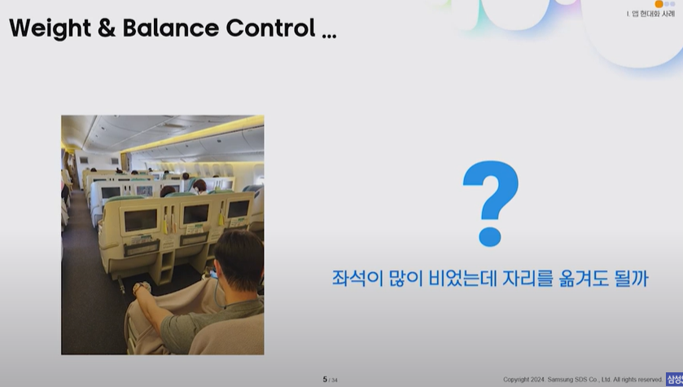

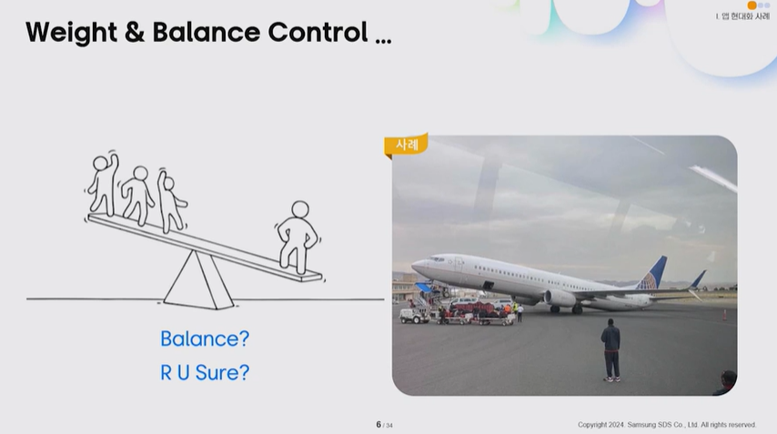

어렸을 때 그네를 다들 타봤듯이 한 쪽에 사람이 쏠려있으면 무게중심이 한 쪽으로 쏠리게 되어있습니다. 그래서 탑재 관리라는 개념이 항공에서는 쓰이게 됩니다.

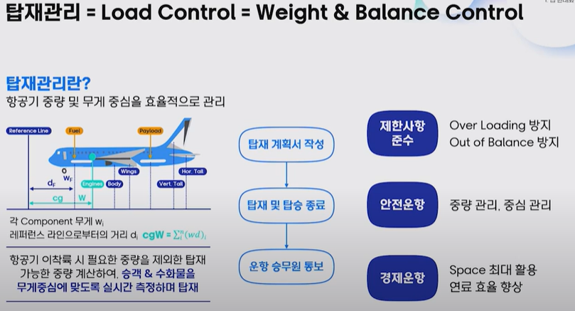

### ✔️ 탑재 관리의 개념
비행기 탑승 시, 빈 좌석이 있음에도 특정 좌석이 배정되는 경험이 있을 것입니다. 이는 항공기의 무게 중심을 맞춰 안전 운항을 보장하기 위함입니다. 이를 관리하는 업무를 **로드 컨트롤(Load Control) 혹은 탑재 관리 업무**라고 합니다. 대한항공은 2008년부터 "윈로즈(WinLOADs)"라는 단말기 기반 시스템을 운영해 왔으며, 17년 동안 안정적으로 운항을 지원해왔습니다.

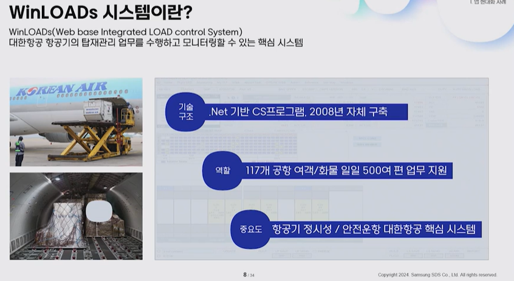

그런데 왜 윈로즈를 대체하게 되었을까요?
고객의 안전과 직결되기 때문에 바꾸게 됐습니다.

### ✔️ 앱 현대화 대상 선정 배경
안정적인 시스템을 현대화하는 것은 쉬운 결정이 아니었습니다. 그러나 직원들의 디지털 경험을 개선하고자 본사 근무자, 탑재 담당자, 공항 현장 근무자의 의견을 수렴하였습니다.
- **본사 근무자**: 불필요한 반복 작업과 현장과의 커뮤니케이션 불편함
- **탑재 담당자**: 수시로 변경되는 탑재 사항을 즉시 확인할 수 없는 문제
- **공항 근무자**: 실시간 정보 반영 및 시스템 속도 개선 필요

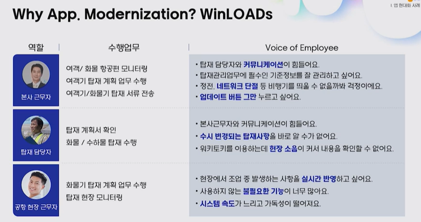

이러한 현장 의견을 바탕으로 **사용자 중심 혁신, 디지털 전환, 운영 효율화**의 세 가지 현대화 전략을 수립하였습니다.

## ✔️ 세 가지 현대화 전략

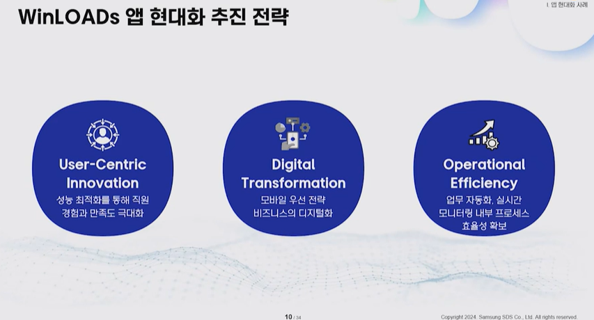

### 1. 사용자 중심 혁신

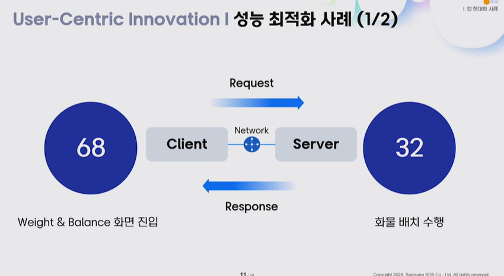

과거 시스템에서는 메인 화면 진입 시 68개의 API 호출, 화물 배치 수행 시 32개의 API 호출이 필요했습니다. 해외 공항에서는 메인 화면 로딩에 1분 30초, 화물 배치 업무 수행에 30초가 걸려 사용성이 저하되었습니다.

항공기 무게중심을 계산하기 위해서는 수많은 데이터를 조합하는 과정이 필요해서 사용성이 저하되었습니다. 한국과 거리가 먼 해외에서는 성능이 너무 떨어졌다(대략 30초).

#### ✔️ 해결책

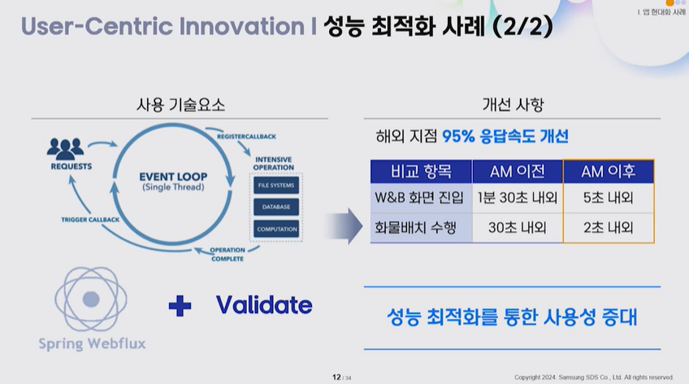

- 기존 동기식 처리를 **Spring WebFlux 기반 비동기식 논블로킹 방식**으로 전환
- API 호출 수를 68개에서 10개로 줄여 응답 속도를 5배 향상
- 서버에서 수행하던 검증 로직을 프론트엔드로 이전하여 API 호출을 32개에서 2개로 감소
- 해외 공항 기준 응답 속도를 95% 개선

### 2. 디지털 전환 (모빌리티 적용)

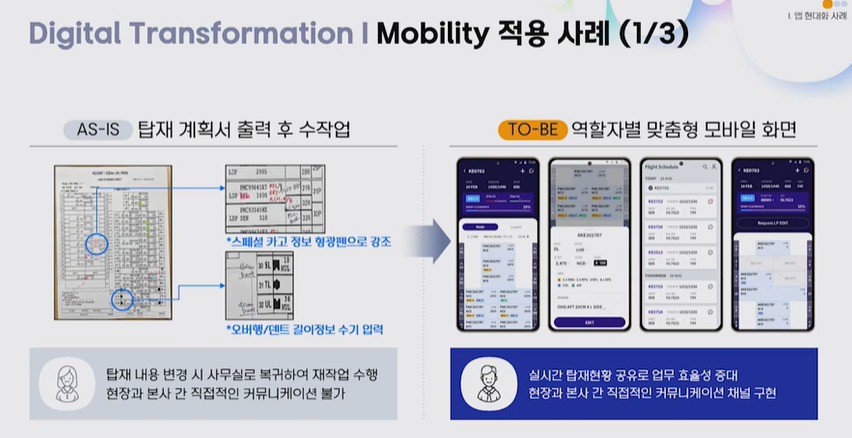

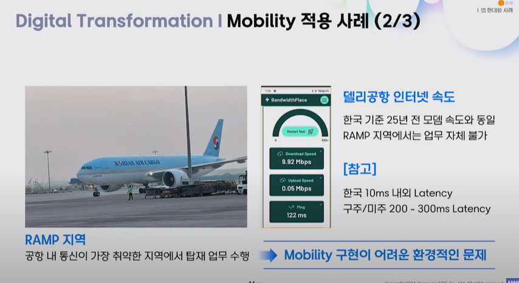

공항 시스템은 전 세계 공항에서 사용되며, 통신이 취약한 지역(램프지역)에서도 원활한 작동이 필요합니다. 예를 들어 델리 공항의 인터넷 속도는 25년 전 모뎀 수준과 비슷합니다.

#### ✔️ 해결책

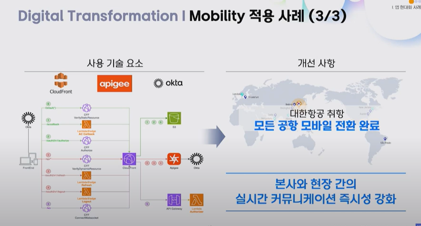

- 경량화된 **모바일 API 적용** 및 AWS **CloudFront CDN 구성**
- 보안 강화를 위해 **API Gateway, Google Firebase SSO, OKTA 적용**
- 모바일 환경에서도 업무 수행 가능하도록 최적화하여 현장 간 실시간 커뮤니케이션 강화

### 3. 운영 효율화 (업무 자동화)

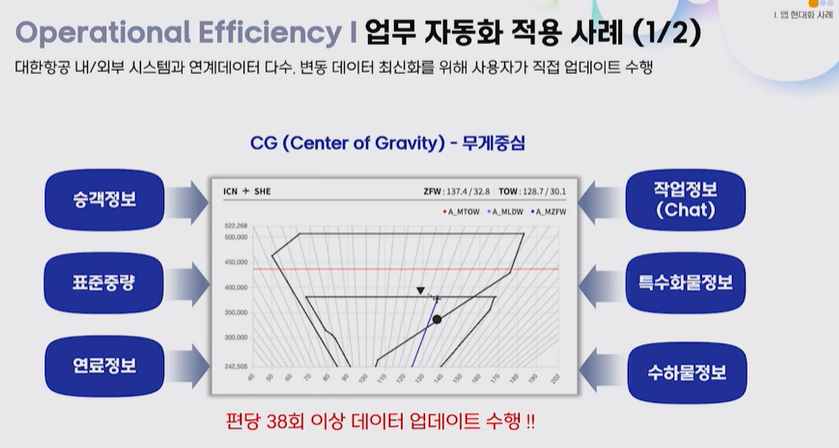

기존 시스템에서는 승객 정보, 연료 정보, 수화물 정보를 업데이트할 때마다 38회의 클릭이 필요했습니다. 이는 업무 생산성을 저해하는 요인이었습니다.

#### ✔️ 해결책

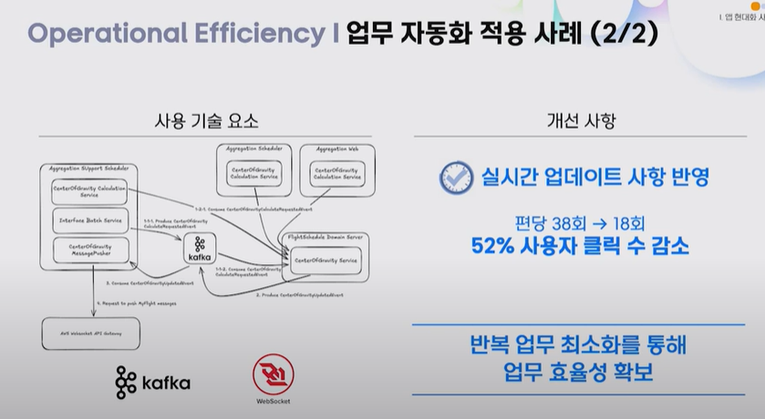

- **이벤트 프로세싱 환경인 Kafka 도입**으로 도메인별 데이터 독립적 처리
- AWS **API Gateway와 WebSocket API 적용**으로 실시간 데이터 연계 구축
- 클릭 수 38회에서 52% 감소하여 업무 편의성 증대

## 현대화 성과

앱 현대화 후 약 한 달간의 자체 평가 결과, 직원들의 다양한 니즈가 시스템에 잘 반영되었음을 확인하였습니다.

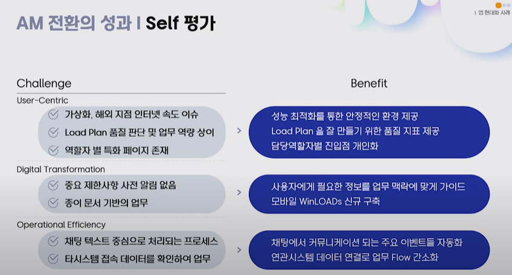

- **사용자 중심 측면**: 안정적인 업무 환경 제공, 역할별 개인화된 화면 구성
- **디지털 전환 측면**: 업무에 맞는 정보 및 모바일 애플리케이션 신규 구축
- **운영 효율성 측면**: 이벤트 자동화 및 실시간 데이터 연계로 업무 간소화

직원들은 현대화된 시스템이 실질적인 가치를 제공한다고 평가하였으며, 앞으로도 지속적인 개선을 통해 더 나은 디지털 경험을 제공하고자 합니다.

==============================================================

## 앱 현대화 과정

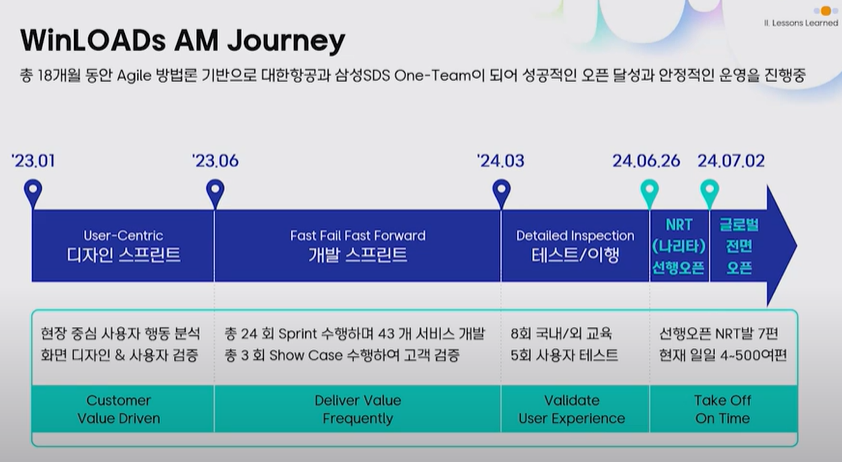

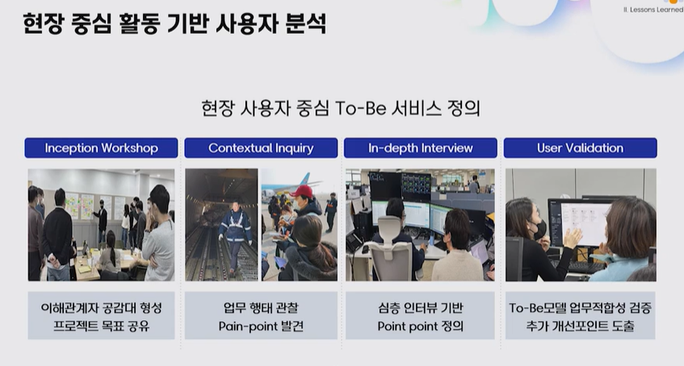

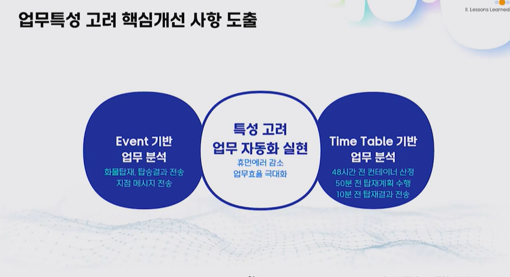

## 사용자 중심의 접근 방식
- 클라우드 기반의 앱 현대화 추진 시 단순 기술 최적화가 아닌, **현장 중심의 업무 분석**에 중점
- **인셉션 워크숍**, **현장 조사**, **사용자 인터뷰** 등을 통해 업무 수행 패턴을 분석
- 행동 분석을 통해 문제점을 식별하고, **투비(To-Be) 모델**을 정의하여 반복적 검증 진행
- **이벤트 기반 업무 vs. 타임테이블 기반 업무** 구분하여 업무 자동화 대상 식별 및 실현

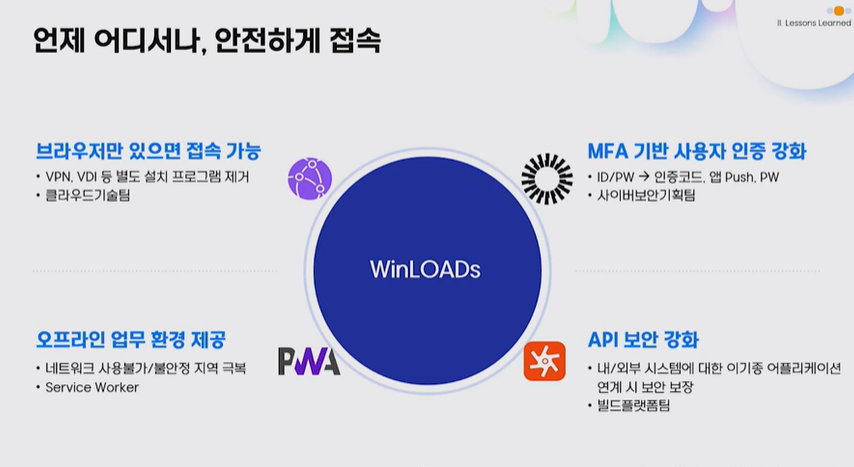

## 주요 개선 사항
### 1. **CS 환경 개선**
- 기존 가상화 솔루션을 **AWS 클라우드 프론트**로 전환하여, 브라우저만 있으면 시스템 접속 가능
- **OAuth 인증 솔루션** 도입으로 ID/패스워드 방식의 보안 취약점 해소
- **API 안전 호출 및 모니터링** 강화하여 대한항공 내·외부 시스템 연계 지원
- **오프라인 업무 처리 지원**: PWA 적용 → 서비스 워커를 활용한 데이터 캐싱으로 네트워크 단절 시에도 업무 지속 가능

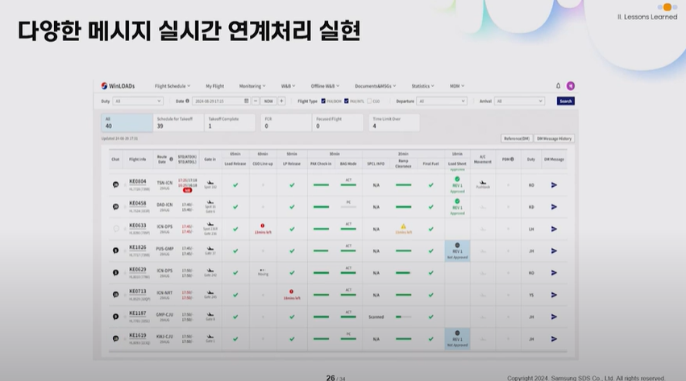

### 2. **실시간 데이터 처리**
- **메시지 브로커(카프카) + 웹소켓 + AWS API 게이트웨이** 조합으로 실시간 데이터 반영
- 스케줄 담당자가 **실시간으로 탑재 관리 현황을 모니터링** 가능
- 특정 AWS 서비스 의존성을 피하기 위해 **컨플루언트 카프카**로 전환 (정책 변경 대응)

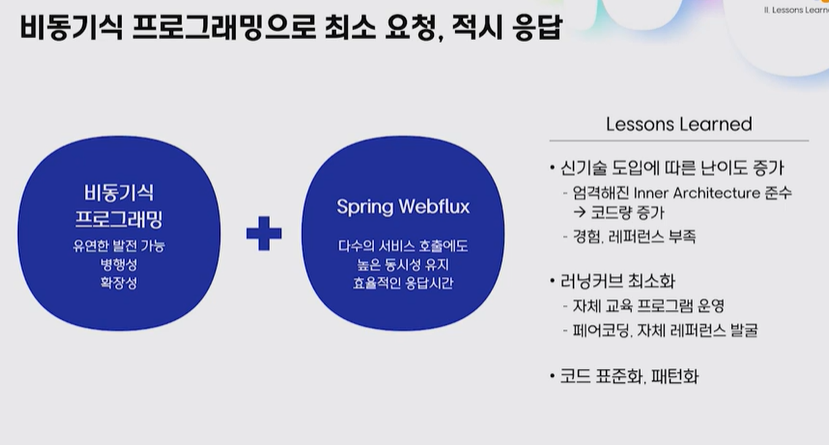

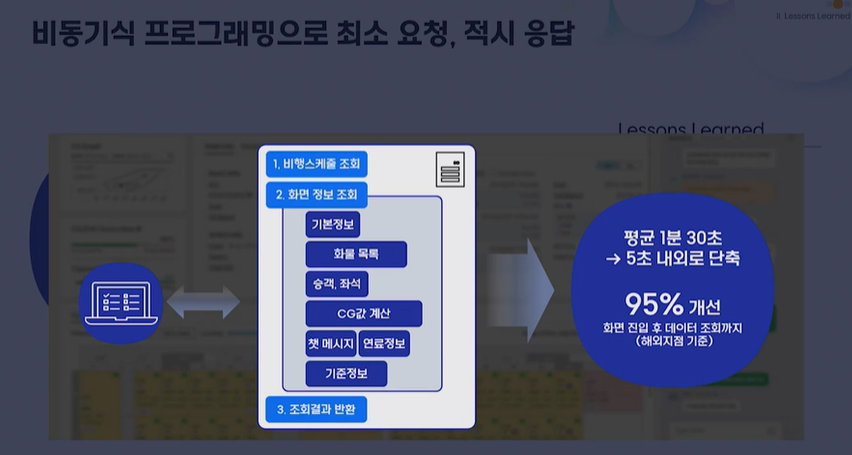

### 3. **비동기식 프로그래밍 도입**
- **스프링 웹플럭스 기반 비동기 프로그래밍** 적용하여 높은 동시성 유지 및 응답 시간 최적화
- 기존 MVC 방식 대비 높은 코딩 난이도를 극복하기 위해 **자체 교육 및 페어 코딩 활용**
- **웨이트 앤 밸런스 화면 성능 개선**
  - 기존: 68회 요청 발생, 평균 응답 시간 1분 30초
  - 개선 후: 요청 횟수 10회 이하, 평균 응답 시간 5초 이내 (95% 성능 개선)

## 향후 발전 방향
### 1. **업무 자동화**
- **데이터 학습 기반 업무 자동화** 추진
- 현재 화물 배치는 사용자가 선택하는 방식 → 향후 데이터 분석을 통해 **자동 추천 및 의사결정 지원**
- 화물 배치 이후 절차인 **탑재 계획서 발송 시점도 자동화**하여 업무 속도 향상

### 2. **데이터 분석 및 예측**
- 실시간 화물 배치 및 연료 정보 등을 **지표화 및 예측 분석**
- 향후 축적된 데이터를 활용하여 **탑재 관리 의사 결정 지원 시스템 구축** 계획

