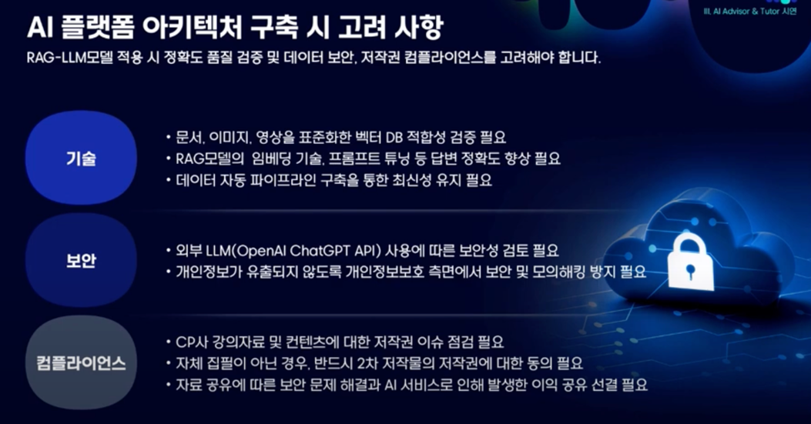

# 📌 AI 러닝 플랫폼 혁신

> - 생성형 AI를 활용하여 구현한 기능
> 
> - 아키텍처

## 생성형 AI를 활용하여 구현한 기능

기업들은 자사 AI역량을 향상하고, 업무 및 고객서비스에 AI를 활용하여 발전하기 위해 끊임없이 노력함.

멀티캠퍼스는 기업들에게 교육 서비스를 제공하는 기업으로 이에 대한 솔루션을 제공하는 전략 수립이 필요함. 풀스택 AI 교육과정, AI 솔루션을 활용한 컨텐츠 제작 등을 제공하고, 
AI를 활용한 튜터 / 학습 어시스턴트 기능을 제공한다.

교육과정 관련 내용은 멀티캠퍼스의 교육과정에 대한 설명이기에 본 문서에서는 다루지 않을 예정이다.

### AI 솔루션을 활용한 컨텐츠 제작

멀티캠퍼스는 딥페이크 기술을 활용하여 다국어 컨텐츠를 제공하고, AI 기반의 자동 자막생성으로 언어적 제약을 해소한 컨텐츠 제작 기술을 발전시키고 있다.

실제 서울대학교 교수가 한국어로 설명하는 영상에서 자동으로 자막이 다양한 언어로 생성되고, 입모양까지 맞추는 장면이 예시로 주어졌다.

### AI 어드바이저, 튜터

AI 어드바이저는 학습자 수준/니즈에 맞게 과정을 큐레이션하고 고객센터 역할을 수행한다.

AI 튜터는 강의 기반 질의응답, 요약본 / 퀴즈 제공 등 보조강사의 역할을 수행한다.

#### AI 어드바이저 / 튜터 아키텍처

플랫폼 내에 AI 아키텍처를 구현했음. 사용자가 입력한 값을 의미기반 데이터를 제공하고, 이를 Open AI로 전송하여 답변을 생성하고 이를 사용자에게 제공한다.

외부 AI를 활용하기에 보안적인 부분에서 고려해야했다. 또, 강의자료이기에 저작권 이슈를 해결해야했다.

# 💡결론

멀티캠퍼스는 이와같은 방향으로 발전하겠다 로드맵을 발표했다.

# 📚 Ref

- https://www.youtube.com/watch?v=itSZApew--s&list=PL5CBKg4LPW2cHLrtLraFvGc03A7O-QQCh&index=14